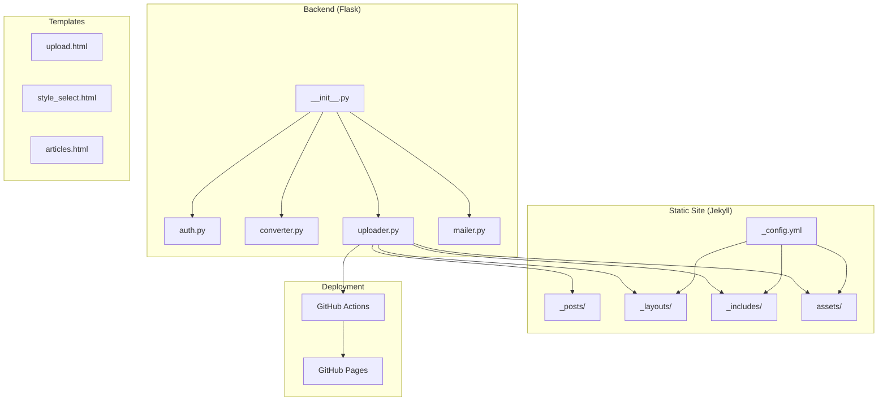
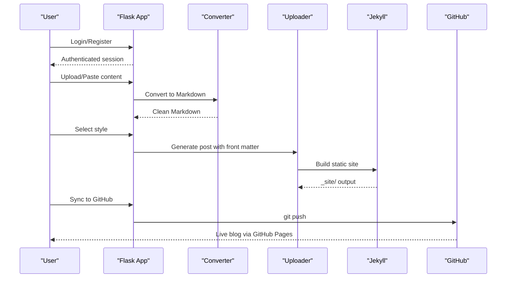
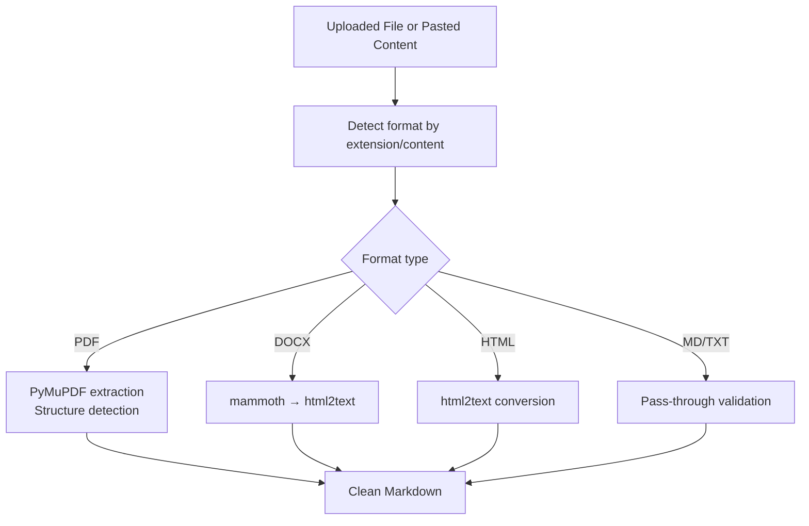
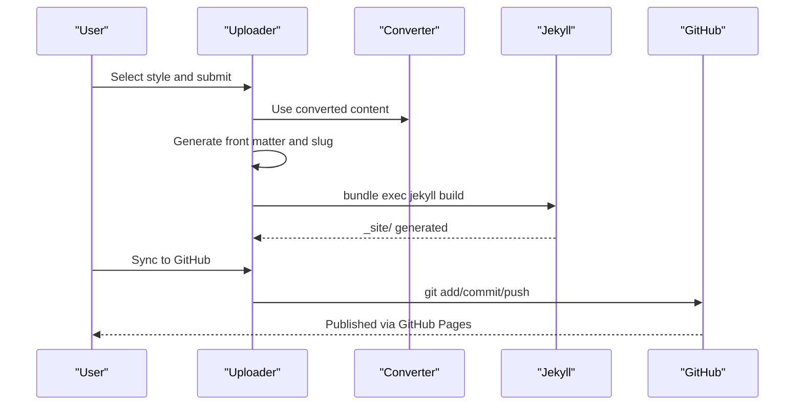
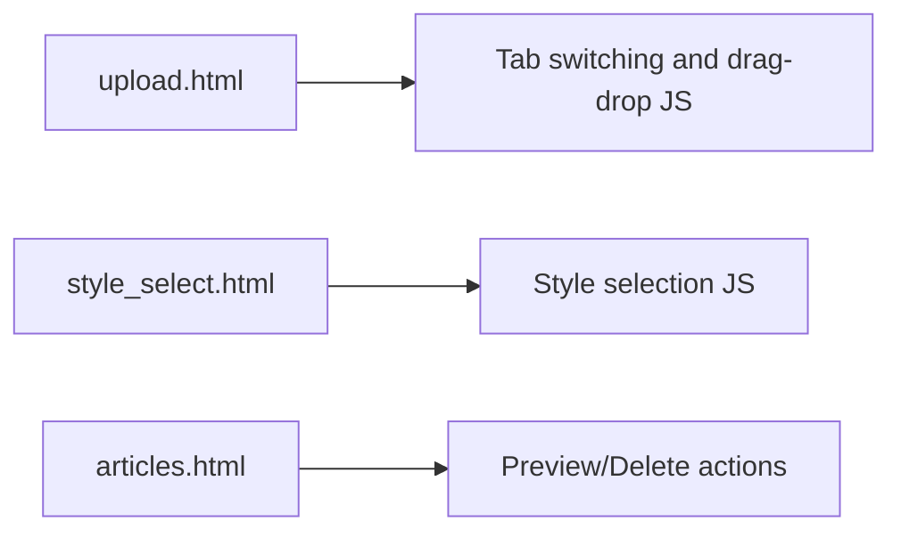
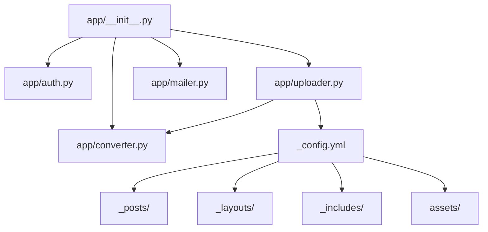

# TypeScript as JavaScript's Superset

<cite>
**Referenced Files in This Document**
- [PRD.md](file://PRD.md)
- [_config.yml](file://_config.yml)
- [app/__init__.py](file://app/__init__.py)
- [app/auth.py](file://app/auth.py)
- [app/converter.py](file://app/converter.py)
- [app/uploader.py](file://app/uploader.py)
- [app/mailer.py](file://app/mailer.py)
- [app/templates/upload.html](file://app/templates/upload.html)
- [app/templates/style_select.html](file://app/templates/style_select.html)
- [app/templates/articles.html](file://app/templates/articles.html)
</cite>

## Table of Contents
1. [Introduction](#introduction)
2. [Project Structure](#project-structure)
3. [Core Components](#core-components)
4. [Architecture Overview](#architecture-overview)
5. [Detailed Component Analysis](#detailed-component-analysis)
6. [Dependency Analysis](#dependency-analysis)
7. [Performance Considerations](#performance-considerations)
8. [Troubleshooting Guide](#troubleshooting-guide)
9. [Conclusion](#conclusion)

## Introduction
This document explains how TypeScript serves as JavaScript's superset within the context of this project. While the repository primarily uses Python for the backend and Jekyll for static site generation, TypeScript is implicitly understood as the superset that enhances JavaScript development workflows. The project demonstrates a practical approach to building a lightweight personal blog wiki with multi-format article input, styled HTML generation, and GitHub Pages publishing—highlighting the benefits of strong typing and modern tooling that TypeScript provides.

## Project Structure
The project follows a clear separation of concerns:
- Backend management server built with Flask (Python) handles authentication, file uploads, conversions, and article management.
- Jekyll static site generator produces styled blog posts from Markdown with five distinct layouts.
- GitHub Actions automates deployment to GitHub Pages.
- Templates and assets support a responsive, multi-style blogging experience.

**Diagram sources**
- [app/__init__.py:43-76](file://app/__init__.py#L43-L76)
- [app/auth.py:13-168](file://app/auth.py#L13-L168)
- [app/converter.py:1-108](file://app/converter.py#L1-L108)
- [app/uploader.py:23-518](file://app/uploader.py#L23-L518)
- [_config.yml:1-50](file://_config.yml#L1-L50)

**Section sources**
- [PRD.md:181-239](file://PRD.md#L181-L239)
- [app/__init__.py:43-76](file://app/__init__.py#L43-L76)
- [_config.yml:1-50](file://_config.yml#L1-L50)

## Core Components
- Flask application factory initializes routes, database connections, and asset serving.
- Authentication module manages user registration, verification, login, and password changes.
- Converter module transforms PDF, DOCX, HTML, and Markdown into clean Markdown.
- Uploader module orchestrates file upload, style selection, HTML generation, and GitHub synchronization.
- Mailer module sends verification codes via QQ Email SMTP.
- Jekyll configuration defines build settings, pagination, plugins, and defaults.

**Section sources**
- [app/__init__.py:9-76](file://app/__init__.py#L9-L76)
- [app/auth.py:26-168](file://app/auth.py#L26-L168)
- [app/converter.py:78-108](file://app/converter.py#L78-L108)
- [app/uploader.py:299-437](file://app/uploader.py#L299-L437)
- [app/mailer.py:8-53](file://app/mailer.py#L8-L53)
- [_config.yml:25-32](file://_config.yml#L25-L32)

## Architecture Overview
The system integrates Flask-managed workflows with Jekyll-generated static sites and GitHub Pages deployment. TypeScript, while not explicitly present in the repository, underpins modern JavaScript tooling that would enhance development ergonomics, type safety, and maintainability if adopted in future frontend enhancements.

**Diagram sources**
- [app/auth.py:26-168](file://app/auth.py#L26-L168)
- [app/converter.py:78-108](file://app/converter.py#L78-L108)
- [app/uploader.py:299-437](file://app/uploader.py#L299-L437)
- [_config.yml:25-32](file://_config.yml#L25-L32)

## Detailed Component Analysis

### Authentication System
The authentication system provides a lightweight, single-user-oriented solution:
- Registration with QQ email verification via SMTP.
- Password hashing using Werkzeug utilities.
- Session-based login with decorators for route protection.

**Diagram sources**
- [app/auth.py:26-48](file://app/auth.py#L26-L48)
- [app/auth.py:51-96](file://app/auth.py#L51-L96)
- [app/auth.py:99-133](file://app/auth.py#L99-L133)

**Section sources**
- [app/auth.py:26-168](file://app/auth.py#L26-L168)
- [app/mailer.py:8-53](file://app/mailer.py#L8-L53)

### File Conversion Pipeline
The converter supports multiple input formats and extracts clean Markdown:
- PDF: Text extraction with basic structure detection.
- DOCX: HTML conversion followed by Markdown transformation.
- HTML: Direct conversion to Markdown.
- Markdown: Pass-through with validation.

**Diagram sources**
- [app/converter.py:78-108](file://app/converter.py#L78-L108)
- [app/converter.py:7-40](file://app/converter.py#L7-L40)
- [app/converter.py:42-59](file://app/converter.py#L42-L59)
- [app/converter.py:61-76](file://app/converter.py#L61-L76)

**Section sources**
- [app/converter.py:1-108](file://app/converter.py#L1-L108)

### Article Management and Generation
The uploader module coordinates the end-to-end workflow:
- Draft storage avoids session size limits.
- Style selection with live preview.
- Front matter generation and Jekyll post creation.
- Optional LLM-based rewriting for specific styles.
- Automatic GitHub synchronization.

**Diagram sources**
- [app/uploader.py:378-437](file://app/uploader.py#L378-L437)
- [app/uploader.py:498-518](file://app/uploader.py#L498-L518)
- [_config.yml:25-32](file://_config.yml#L25-L32)

**Section sources**
- [app/uploader.py:299-437](file://app/uploader.py#L299-L437)
- [app/uploader.py:498-518](file://app/uploader.py#L498-L518)

### Template-Based UI Components
The templates provide a minimal, server-rendered interface:
- Upload page with drag-and-drop and tab switching.
- Style selection with interactive cards.
- Articles list with actions and previews.

**Diagram sources**
- [app/templates/upload.html:62-82](file://app/templates/upload.html#L62-L82)
- [app/templates/style_select.html:32-41](file://app/templates/style_select.html#L32-L41)
- [app/templates/articles.html:16-63](file://app/templates/articles.html#L16-L63)

**Section sources**
- [app/templates/upload.html:1-82](file://app/templates/upload.html#L1-L82)
- [app/templates/style_select.html:1-41](file://app/templates/style_select.html#L1-L41)
- [app/templates/articles.html:1-64](file://app/templates/articles.html#L1-L64)

## Dependency Analysis
The system exhibits low coupling and clear responsibilities:
- Flask app factory centralizes initialization and routing.
- Blueprints encapsulate authentication and upload logic.
- Converter and uploader modules depend on third-party libraries for file processing.
- Jekyll configuration governs static site generation and styling.

**Diagram sources**
- [app/__init__.py:43-76](file://app/__init__.py#L43-L76)
- [app/auth.py:13-168](file://app/auth.py#L13-L168)
- [app/converter.py:1-108](file://app/converter.py#L1-L108)
- [app/uploader.py:23-518](file://app/uploader.py#L23-L518)
- [_config.yml:1-50](file://_config.yml#L1-L50)

**Section sources**
- [app/__init__.py:43-76](file://app/__init__.py#L43-L76)
- [app/uploader.py:23-518](file://app/uploader.py#L23-L518)
- [_config.yml:1-50](file://_config.yml#L1-L50)

## Performance Considerations
- Incremental Jekyll builds minimize rebuild times for large sites.
- Draft storage avoids session size limitations during conversion.
- Image extraction and slug generation optimize content delivery.
- GitHub Actions handle deployment asynchronously, reducing local build overhead.

[No sources needed since this section provides general guidance]

## Troubleshooting Guide
Common issues and resolutions:
- Authentication failures: Verify credentials and email verification status.
- Conversion errors: Ensure required libraries are installed for PDF/DOCX/HTML processing.
- Jekyll build failures: Check front matter formatting and plugin compatibility.
- GitHub sync errors: Confirm Git configuration, remote setup, and authentication.

**Section sources**
- [app/auth.py:410-418](file://app/auth.py#L410-L418)
- [app/converter.py:105-108](file://app/converter.py#L105-L108)
- [app/uploader.py:611-618](file://app/uploader.py#L611-L618)
- [app/uploader.py:666-674](file://app/uploader.py#L666-L674)

## Conclusion
This project exemplifies a streamlined approach to content creation and publishing, leveraging Flask for management and Jekyll for presentation. While TypeScript is not currently part of the stack, adopting it would align the frontend tooling with modern JavaScript development practices, enhancing type safety and developer productivity. The clear separation of concerns and modular architecture positions the system well for future enhancements, including potential TypeScript integration for improved maintainability and scalability.