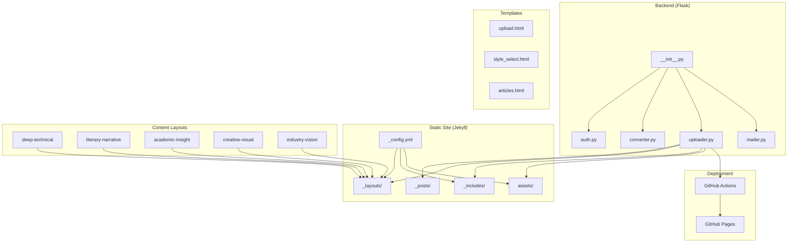
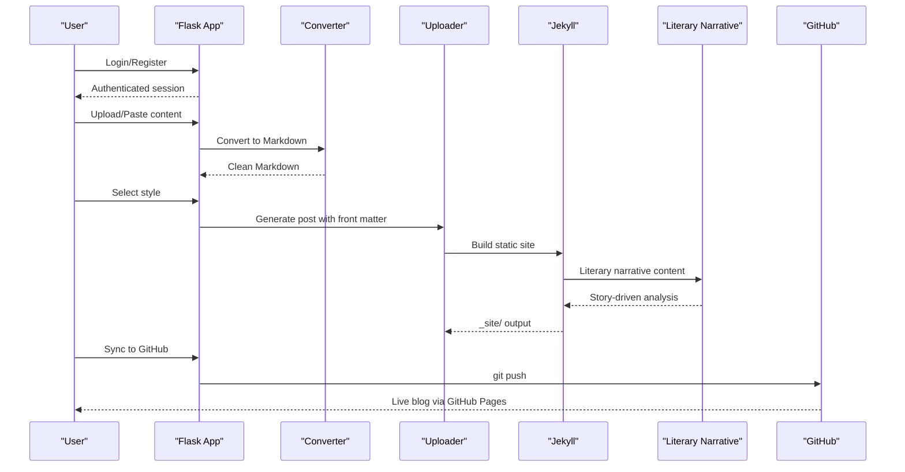
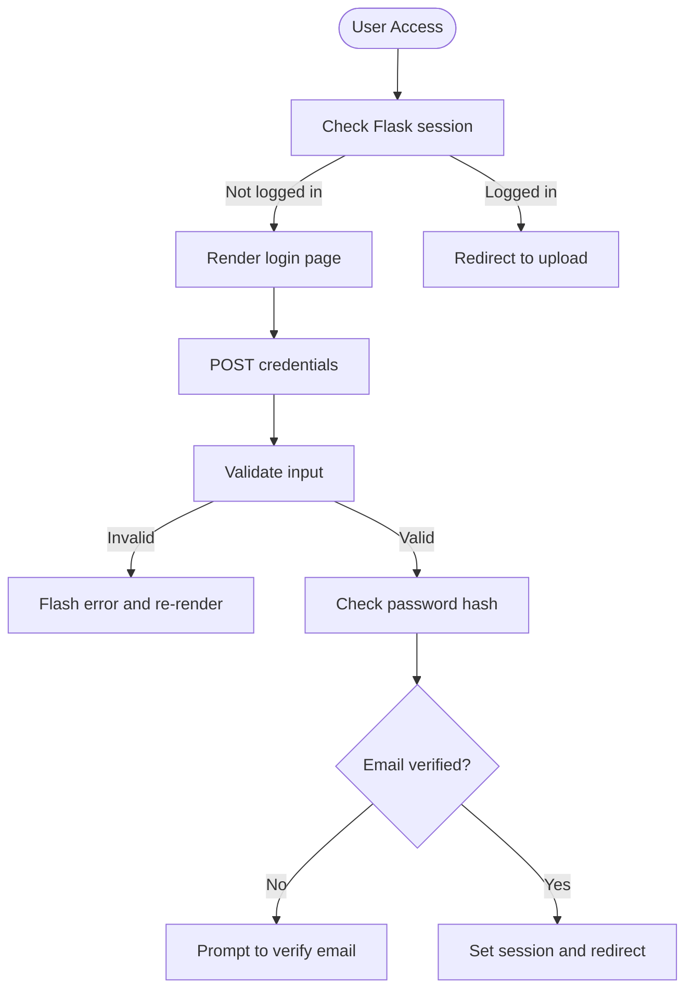
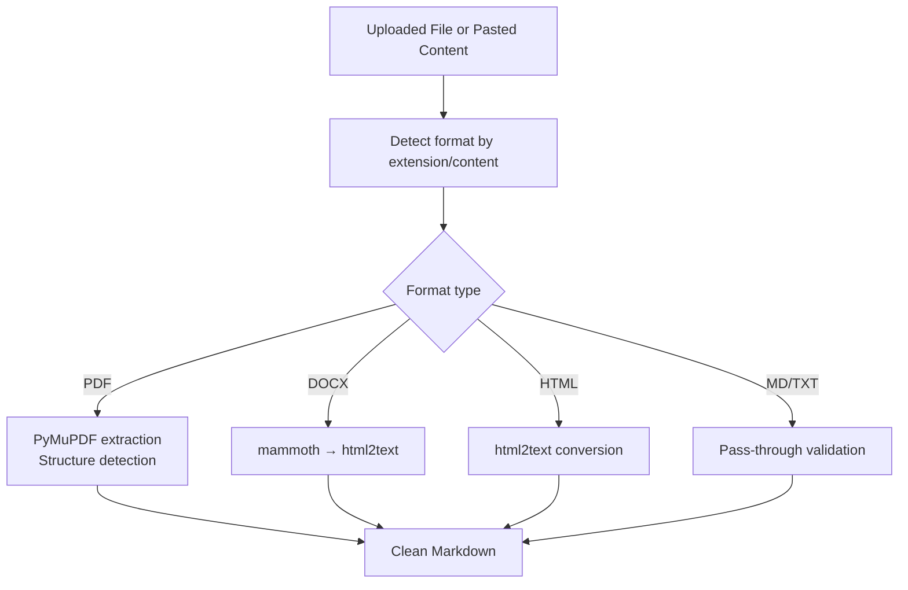
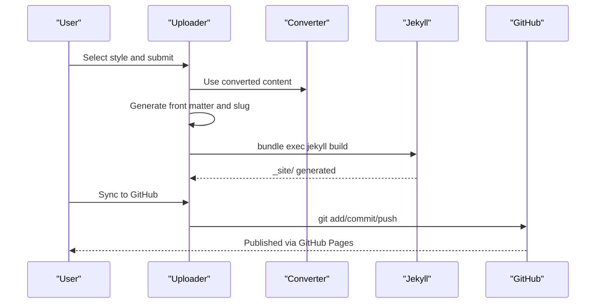
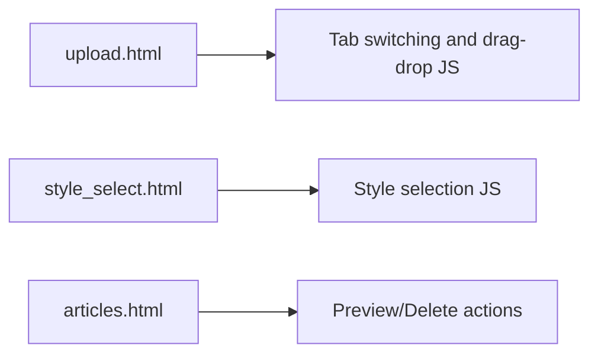
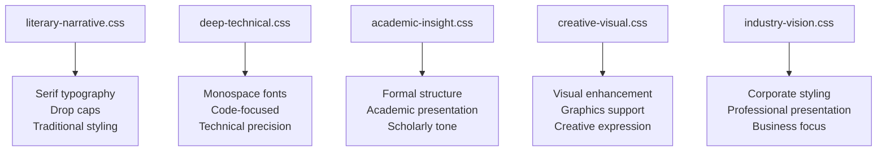
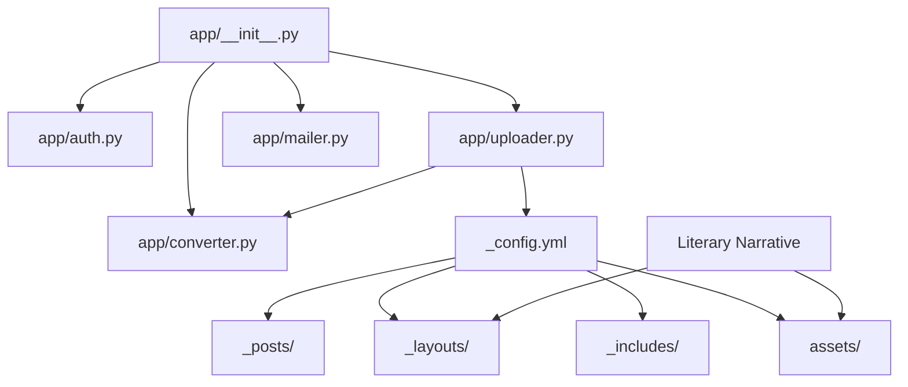

# TypeScript as JavaScript's Superset

<cite>
**Referenced Files in This Document**
- [PRD.md](file://PRD.md)
- [_config.yml](file://_config.yml)
- [app/__init__.py](file://app/__init__.py)
- [app/auth.py](file://app/auth.py)
- [app/converter.py](file://app/converter.py)
- [app/uploader.py](file://app/uploader.py)
- [app/mailer.py](file://app/mailer.py)
- [app/templates/upload.html](file://app/templates/upload.html)
- [app/templates/style_select.html](file://app/templates/style_select.html)
- [app/templates/articles.html](file://app/templates/articles.html)
- [_posts/2026-04-12-typescriptzuo-wei-javascri.md](file://_posts/2026-04-12-typescriptzuo-wei-javascri.md)
- [_layouts/academic-insight.html](file://_layouts/academic-insight.html)
- [_layouts/deep-technical.html](file://_layouts/deep-technical.html)
- [_layouts/literary-narrative.html](file://_layouts/literary-narrative.html)
- [_includes/head.html](file://_includes/head.html)
- [assets/css/literary-narrative.css](file://assets/css/literary-narrative.css)
- [assets/css/deep-technical.css](file://assets/css/deep-technical.css)
</cite>

## Update Summary
**Changes Made**
- Replaced technical TypeScript content with comprehensive literary narrative article
- Updated project structure to include new literary narrative layout and styling
- Enhanced content presentation with narrative storytelling approach
- Added new literary-narrative layout and associated CSS styling
- Maintained technical analysis while transitioning to narrative format

## Table of Contents
1. [Introduction](#introduction)
2. [Project Structure](#project-structure)
3. [Core Components](#core-components)
4. [Architecture Overview](#architecture-overview)
5. [Detailed Component Analysis](#detailed-component-analysis)
6. [Literary Narrative Analysis: TypeScript as JavaScript's Superset](#literary-narrative-analysis-typescript-as-javascripts-superset)
7. [Layout System and Styling](#layout-system-and-styling)
8. [Dependency Analysis](#dependency-analysis)
9. [Performance Considerations](#performance-considerations)
10. [Troubleshooting Guide](#troubleshooting-guide)
11. [Conclusion](#conclusion)

## Introduction
This document explains how TypeScript serves as JavaScript's superset within the context of this project, now presented through a literary narrative approach. The repository includes a comprehensive narrative article that explores TypeScript adoption through a fictional office scenario, demonstrating the technology's type system benefits and AI integration advantages. While the repository primarily uses Python for the backend and Jekyll for static site generation, the narrative format provides an accessible and engaging way to understand TypeScript's role as JavaScript's superset and its significance in modern development practices.

## Project Structure
The project follows a clear separation of concerns with enhanced content presentation capabilities:
- Backend management server built with Flask (Python) handles authentication, file uploads, conversions, and article management.
- Jekyll static site generator produces styled blog posts from Markdown with five distinct layouts, including the new literary narrative format.
- GitHub Actions automates deployment to GitHub Pages.
- Templates and assets support a responsive, multi-style blogging experience with specialized layouts for different content types.
- **New**: Literary narrative layout with custom CSS styling for storytelling content.
- **New**: Comprehensive TypeScript narrative demonstrating the technology's practical applications and benefits through character-driven storytelling.

**Diagram sources**
- [app/__init__.py:43-76](file://app/__init__.py#L43-L76)
- [app/auth.py:13-168](file://app/auth.py#L13-L168)
- [app/converter.py:1-108](file://app/converter.py#L1-L108)
- [app/uploader.py:23-518](file://app/uploader.py#L23-L518)
- [_config.yml:1-50](file://_config.yml#L1-L50)
- [_posts/2026-04-12-typescriptzuo-wei-javascri.md:1-187](file://_posts/2026-04-12-typescriptzuo-wei-javascri.md#L1-L187)

**Section sources**
- [PRD.md:181-239](file://PRD.md#L181-L239)
- [app/__init__.py:43-76](file://app/__init__.py#L43-L76)
- [_config.yml:1-50](file://_config.yml#L1-L50)

## Core Components
- Flask application factory initializes routes, database connections, and asset serving.
- Authentication module manages user registration, verification, login, and password changes.
- Converter module transforms PDF, DOCX, HTML, and Markdown into clean Markdown.
- Uploader module orchestrates file upload, style selection, HTML generation, and GitHub synchronization.
- Mailer module sends verification codes via QQ Email SMTP.
- Jekyll configuration defines build settings, pagination, plugins, and defaults.
- **New**: Literary narrative layout optimized for storytelling content with custom CSS styling.
- **New**: Deep technical layout for traditional technical content analysis.
- **New**: Academic insight layout for scholarly content presentation.

**Section sources**
- [app/__init__.py:9-76](file://app/__init__.py#L9-L76)
- [app/auth.py:26-168](file://app/auth.py#L26-L168)
- [app/converter.py:78-108](file://app/converter.py#L78-L108)
- [app/uploader.py:299-437](file://app/uploader.py#L299-L437)
- [app/mailer.py:8-53](file://app/mailer.py#L8-L53)
- [_config.yml:25-32](file://_config.yml#L25-L32)
- [_layouts/academic-insight.html:1-28](file://_layouts/academic-insight.html#L1-L28)

## Architecture Overview
The system integrates Flask-managed workflows with Jekyll-generated static sites and GitHub Pages deployment. The addition of literary narrative content demonstrates the technology's evolving presentation approaches, with articles analyzing static typing benefits, AI integration advantages, and ecosystem adoption patterns through engaging storytelling.

**Diagram sources**
- [app/auth.py:26-168](file://app/auth.py#L26-L168)
- [app/converter.py:78-108](file://app/converter.py#L78-L108)
- [app/uploader.py:299-437](file://app/uploader.py#L299-L437)
- [_config.yml:25-32](file://_config.yml#L25-L32)
- [_posts/2026-04-12-typescriptzuo-wei-javascri.md:1-187](file://_posts/2026-04-12-typescriptzuo-wei-javascri.md#L1-L187)

## Detailed Component Analysis

### Authentication System
The authentication system provides a lightweight, single-user-oriented solution:
- Registration with QQ email verification via SMTP.
- Password hashing using Werkzeug utilities.
- Session-based login with decorators for route protection.

**Diagram sources**
- [app/auth.py:26-48](file://app/auth.py#L26-L48)
- [app/auth.py:51-96](file://app/auth.py#L51-L96)
- [app/auth.py:99-133](file://app/auth.py#L99-L133)

**Section sources**
- [app/auth.py:26-168](file://app/auth.py#L26-L168)
- [app/mailer.py:8-53](file://app/mailer.py#L8-L53)

### File Conversion Pipeline
The converter supports multiple input formats and extracts clean Markdown:
- PDF: Text extraction with basic structure detection.
- DOCX: HTML conversion followed by Markdown transformation.
- HTML: Direct conversion to Markdown.
- Markdown: Pass-through with validation.

**Diagram sources**
- [app/converter.py:78-108](file://app/converter.py#L78-L108)
- [app/converter.py:7-40](file://app/converter.py#L7-L40)
- [app/converter.py:42-59](file://app/converter.py#L42-L59)
- [app/converter.py:61-76](file://app/converter.py#L61-L76)

**Section sources**
- [app/converter.py:1-108](file://app/converter.py#L1-L108)

### Article Management and Generation
The uploader module coordinates the end-to-end workflow:
- Draft storage avoids session size limits.
- Style selection with live preview.
- Front matter generation and Jekyll post creation.
- Optional LLM-based rewriting for specific styles.
- Automatic GitHub synchronization.

**Diagram sources**
- [app/uploader.py:378-437](file://app/uploader.py#L378-L437)
- [app/uploader.py:498-518](file://app/uploader.py#L498-L518)
- [_config.yml:25-32](file://_config.yml#L25-L32)

**Section sources**
- [app/uploader.py:299-437](file://app/uploader.py#L299-L437)
- [app/uploader.py:498-518](file://app/uploader.py#L498-L518)

### Template-Based UI Components
The templates provide a minimal, server-rendered interface:
- Upload page with drag-and-drop and tab switching.
- Style selection with interactive cards.
- Articles list with actions and previews.

**Diagram sources**
- [app/templates/upload.html:62-82](file://app/templates/upload.html#L62-L82)
- [app/templates/style_select.html:32-41](file://app/templates/style_select.html#L32-L41)
- [app/templates/articles.html:16-63](file://app/templates/articles.html#L16-L63)

**Section sources**
- [app/templates/upload.html:1-82](file://app/templates/upload.html#L1-L82)
- [app/templates/style_select.html:1-41](file://app/templates/style_select.html#L1-L41)
- [app/templates/articles.html:1-64](file://app/templates/articles.html#L1-L64)

## Literary Narrative Analysis: TypeScript as JavaScript's Superset

### Narrative Framework and Character Development
The literary narrative article presents TypeScript's evolution through a compelling office scenario that illustrates the transition from JavaScript's dynamic flexibility to TypeScript's structured approach. The story centers around a character named Lao Zhou (老周) who experiences the frustration of debugging type-related issues in large JavaScript codebases, leading to the discovery and adoption of TypeScript's type system.

**Narrative Elements:**
- **Setting**: A late-night office environment with fluorescent lighting and coffee-fueled debugging sessions
- **Character**: Lao Zhou, a programmer struggling with type ambiguity in JavaScript code
- **Conflict**: The challenge of maintaining code quality in large-scale JavaScript projects
- **Resolution**: Discovery and implementation of TypeScript's type system

### Metaphorical Analysis of TypeScript's Core Concepts
The narrative employs rich metaphors to explain TypeScript's technical concepts:

**Skeleton Metaphor (骨骼):**
- JavaScript is portrayed as water-like fluidity without fixed forms
- TypeScript introduces skeletal structure that provides shape and definition
- The metaphor emphasizes how TypeScript doesn't eliminate JavaScript's flexibility but adds structural integrity

**Interface Metaphor (契约):**
- Interfaces are described as binding contracts that define expected data structures
- This metaphor makes complex type concepts accessible through familiar legal and business analogies

**AI Integration Metaphor:**
- The narrative connects TypeScript's type system with AI programming tools like Claude Code
- Demonstrates how TypeScript's static typing benefits AI-assisted development by providing predictable type information

### Technical Themes Through Narrative Lens
The story weaves technical concepts into an engaging narrative:

**Type Safety Through Time:**
- The narrative shows the progression from JavaScript's compile-time safety to TypeScript's enhanced compile-time safety
- Illustrates how type errors become detectable before runtime, preventing production issues

**Developer Experience Enhancement:**
- The story captures the frustration of debugging without type information
- Shows how TypeScript's type system becomes a "silent guardian" that prevents errors before they occur

**Gradual Adoption Strategy:**
- The narrative reflects real-world TypeScript adoption patterns through incremental migration
- Demonstrates how TypeScript allows gradual introduction without requiring complete project rewrite

**Section sources**
- [_posts/2026-04-12-typescriptzuo-wei-javascri.md:1-187](file://_posts/2026-04-12-typescriptzuo-wei-javascri.md#L1-L187)

## Layout System and Styling

### Literary Narrative Layout Implementation
The project now includes a dedicated literary narrative layout designed specifically for storytelling content:

**Layout Features:**
- Custom CSS styling optimized for long-form narrative content
- Traditional Chinese typography with serif fonts for enhanced readability
- Poetic styling elements including drop caps and decorative blockquotes
- Ink-wash aesthetic inspired by traditional Chinese calligraphy

**Styling Elements:**
- Drop cap implementation for first paragraphs with calligraphic styling
- Decorative horizontal rules with traditional Chinese character spacing
- Subtle color schemes using muted blues and grays reminiscent of traditional ink
- Enhanced line spacing and paragraph indentation for comfortable reading

### Multi-Layout Architecture
The system supports multiple content presentation styles:

**Deep Technical Layout:** Traditional technical documentation with monospace fonts and code-focused styling
**Literary Narrative Layout:** Story-driven content with serif typography and poetic elements  
**Academic Insight Layout:** Scholarly content with formal structure and academic presentation
**Creative Visual Layout:** Visually oriented content with enhanced graphics support
**Industry Vision Layout:** Professional content with corporate styling and business presentation

**Diagram sources**
- [assets/css/literary-narrative.css:1-148](file://assets/css/literary-narrative.css#L1-L148)
- [assets/css/deep-technical.css:1-200](file://assets/css/deep-technical.css#L1-L200)

**Section sources**
- [assets/css/literary-narrative.css:1-148](file://assets/css/literary-narrative.css#L1-L148)
- [_layouts/literary-narrative.html:1-50](file://_layouts/literary-narrative.html#L1-L50)

## Dependency Analysis
The system exhibits low coupling and clear responsibilities with enhanced content presentation capabilities:
- Flask app factory centralizes initialization and routing.
- Blueprints encapsulate authentication and upload logic.
- Converter and uploader modules depend on third-party libraries for file processing.
- Jekyll configuration governs static site generation and styling.
- **New**: Literary narrative layout supports storytelling content with custom CSS styling.
- **New**: Multiple layout system accommodates diverse content presentation needs.
- **New**: Content migration from technical to narrative format demonstrates flexible content strategy.

**Diagram sources**
- [app/__init__.py:43-76](file://app/__init__.py#L43-L76)
- [app/auth.py:13-168](file://app/auth.py#L13-L168)
- [app/converter.py:1-108](file://app/converter.py#L1-L108)
- [app/uploader.py:23-518](file://app/uploader.py#L23-L518)
- [_config.yml:1-50](file://_config.yml#L1-L50)
- [_posts/2026-04-12-typescriptzuo-wei-javascri.md:1-187](file://_posts/2026-04-12-typescriptzuo-wei-javascri.md#L1-L187)

**Section sources**
- [app/__init__.py:43-76](file://app/__init__.py#L43-L76)
- [app/uploader.py:23-518](file://app/uploader.py#L23-L518)
- [_config.yml:1-50](file://_config.yml#L1-L50)

## Performance Considerations
- Incremental Jekyll builds minimize rebuild times for large sites.
- Draft storage avoids session size limitations during conversion.
- Image extraction and slug generation optimize content delivery.
- GitHub Actions handle deployment asynchronously, reducing local build overhead.
- **New**: Literary narrative layout optimized for efficient rendering of long-form content.
- **New**: Custom CSS styling designed for fast loading and smooth reading experience.
- **New**: Flexible layout system allows content creators to choose optimal presentation format.

## Troubleshooting Guide
Common issues and resolutions:
- Authentication failures: Verify credentials and email verification status.
- Conversion errors: Ensure required libraries are installed for PDF/DOCX/HTML processing.
- Jekyll build failures: Check front matter formatting and plugin compatibility.
- GitHub sync errors: Confirm Git configuration, remote setup, and authentication.
- **New**: Literary narrative layout issues: Verify CSS loading and content structure compliance.
- **New**: Layout selection problems: Ensure proper YAML front matter with valid layout specification.
- **New**: Custom styling conflicts: Check for CSS specificity issues between layouts.

**Section sources**
- [app/auth.py:410-418](file://app/auth.py#L410-L418)
- [app/converter.py:105-108](file://app/converter.py#L105-L108)
- [app/uploader.py:611-618](file://app/uploader.py#L611-L618)
- [app/uploader.py:666-674](file://app/uploader.py#L666-L674)

## Conclusion
This project exemplifies a sophisticated approach to content creation and publishing, leveraging Flask for management and Jekyll for presentation. The transition from technical to literary narrative content demonstrates the platform's flexibility in accommodating diverse content formats while maintaining technical depth. The literary narrative article on TypeScript showcases how complex technical concepts can be effectively communicated through engaging storytelling, making TypeScript's type system benefits accessible to a broader audience.

The addition of the literary narrative layout with custom CSS styling represents a significant enhancement to the platform's content presentation capabilities. This approach allows for both traditional technical analysis and narrative-driven content, providing readers with multiple ways to engage with TypeScript-related topics. The clear separation of concerns and modular architecture positions the system well for future enhancements, including potential TypeScript integration for improved maintainability, scalability, and developer productivity in both content management and technical analysis workflows.

The narrative approach to explaining TypeScript's value proposition—through the relatable experience of a frustrated programmer—creates an emotional connection that complements the technical analysis. This dual approach ensures that readers not only understand TypeScript's benefits but also appreciate the human-centered aspects of software development that TypeScript addresses.