# Authentication Pages

<cite>
**Referenced Files in This Document**
- [frontend/src/pages/Login.tsx](file://frontend/src/pages/Login.tsx)
- [frontend/src/pages/Register.tsx](file://frontend/src/pages/Register.tsx)
- [frontend/src/stores/authStore.ts](file://frontend/src/stores/authStore.ts)
- [frontend/src/api/client.ts](file://frontend/src/api/client.ts)
- [frontend/src/App.tsx](file://frontend/src/App.tsx)
- [backend/app/auth/router.py](file://backend/app/auth/router.py)
- [backend/app/auth/service.py](file://backend/app/auth/service.py)
- [backend/app/auth/schemas.py](file://backend/app/auth/schemas.py)
- [backend/app/auth/dependencies.py](file://backend/app/auth/dependencies.py)
- [backend/app/common/models.py](file://backend/app/common/models.py)
- [backend/app/common/exceptions.py](file://backend/app/common/exceptions.py)
- [backend/app/config.py](file://backend/app/config.py)
- [backend/app/main.py](file://backend/app/main.py)
</cite>

## Table of Contents
1. [Introduction](#introduction)
2. [Project Structure](#project-structure)
3. [Core Components](#core-components)
4. [Architecture Overview](#architecture-overview)
5. [Detailed Component Analysis](#detailed-component-analysis)
6. [Dependency Analysis](#dependency-analysis)
7. [Performance Considerations](#performance-considerations)
8. [Troubleshooting Guide](#troubleshooting-guide)
9. [Conclusion](#conclusion)

## Introduction
This document provides comprehensive documentation for the authentication system components of the PolaZhenJing application. It covers the login and registration pages, form validation and user input handling, the authentication store using Zustand, JWT token management, user session persistence, protected route implementation, redirect logic, authentication state synchronization, API integration for authentication endpoints, error handling strategies, loading states, user experience patterns, form submission workflows, and security considerations. It also includes troubleshooting approaches for common authentication issues.

## Project Structure
The authentication system spans both the frontend and backend:
- Frontend: Login and Register pages, a Zustand-based authentication store, and an Axios client with interceptors for JWT handling.
- Backend: Authentication endpoints, business logic, schemas, dependencies, and shared models and exceptions.

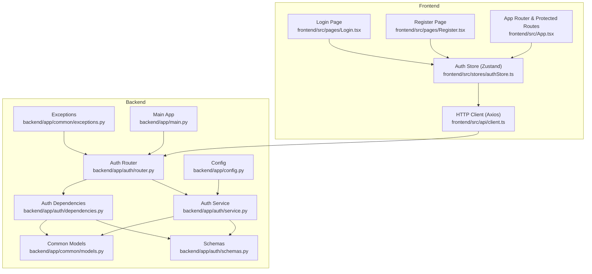

**Diagram sources**
- [frontend/src/pages/Login.tsx:1-103](file://frontend/src/pages/Login.tsx#L1-L103)
- [frontend/src/pages/Register.tsx:1-120](file://frontend/src/pages/Register.tsx#L1-L120)
- [frontend/src/stores/authStore.ts:1-101](file://frontend/src/stores/authStore.ts#L1-L101)
- [frontend/src/api/client.ts:1-63](file://frontend/src/api/client.ts#L1-L63)
- [frontend/src/App.tsx:1-95](file://frontend/src/App.tsx#L1-L95)
- [backend/app/auth/router.py:1-91](file://backend/app/auth/router.py#L1-L91)
- [backend/app/auth/service.py:1-165](file://backend/app/auth/service.py#L1-L165)
- [backend/app/auth/dependencies.py:1-66](file://backend/app/auth/dependencies.py#L1-L66)
- [backend/app/auth/schemas.py:1-57](file://backend/app/auth/schemas.py#L1-L57)
- [backend/app/common/models.py:1-76](file://backend/app/common/models.py#L1-L76)
- [backend/app/common/exceptions.py:1-87](file://backend/app/common/exceptions.py#L1-L87)
- [backend/app/config.py:1-62](file://backend/app/config.py#L1-L62)
- [backend/app/main.py:1-89](file://backend/app/main.py#L1-L89)

**Section sources**
- [frontend/src/pages/Login.tsx:1-103](file://frontend/src/pages/Login.tsx#L1-L103)
- [frontend/src/pages/Register.tsx:1-120](file://frontend/src/pages/Register.tsx#L1-L120)
- [frontend/src/stores/authStore.ts:1-101](file://frontend/src/stores/authStore.ts#L1-L101)
- [frontend/src/api/client.ts:1-63](file://frontend/src/api/client.ts#L1-L63)
- [frontend/src/App.tsx:1-95](file://frontend/src/App.tsx#L1-L95)
- [backend/app/auth/router.py:1-91](file://backend/app/auth/router.py#L1-L91)
- [backend/app/auth/service.py:1-165](file://backend/app/auth/service.py#L1-L165)
- [backend/app/auth/dependencies.py:1-66](file://backend/app/auth/dependencies.py#L1-L66)
- [backend/app/auth/schemas.py:1-57](file://backend/app/auth/schemas.py#L1-L57)
- [backend/app/common/models.py:1-76](file://backend/app/common/models.py#L1-L76)
- [backend/app/common/exceptions.py:1-87](file://backend/app/common/exceptions.py#L1-L87)
- [backend/app/config.py:1-62](file://backend/app/config.py#L1-L62)
- [backend/app/main.py:1-89](file://backend/app/main.py#L1-L89)

## Core Components
- Login and Register pages: Render forms, capture user input, submit via the auth store, and handle loading and error states.
- Auth store (Zustand): Manages user state, loading, and error; integrates with the backend API; persists tokens in local storage; synchronizes state on app load.
- HTTP client (Axios): Adds Authorization headers automatically; intercepts 401 responses to refresh tokens or redirect to login.
- Protected routes: Guard access to dashboard, editor, and settings; redirect unauthenticated users to login.
- Backend authentication endpoints: Registration, login, token refresh, and profile retrieval.
- Business logic and schemas: Password hashing, token creation/verification, request/response validation, and user model definition.
- Global exception handling: Consistent error responses across the API.

**Section sources**
- [frontend/src/pages/Login.tsx:17-31](file://frontend/src/pages/Login.tsx#L17-L31)
- [frontend/src/pages/Register.tsx:17-33](file://frontend/src/pages/Register.tsx#L17-L33)
- [frontend/src/stores/authStore.ts:37-98](file://frontend/src/stores/authStore.ts#L37-L98)
- [frontend/src/api/client.ts:19-60](file://frontend/src/api/client.ts#L19-L60)
- [frontend/src/App.tsx:23-39](file://frontend/src/App.tsx#L23-L39)
- [backend/app/auth/router.py:37-91](file://backend/app/auth/router.py#L37-L91)
- [backend/app/auth/service.py:28-88](file://backend/app/auth/service.py#L28-L88)
- [backend/app/auth/schemas.py:18-57](file://backend/app/auth/schemas.py#L18-L57)
- [backend/app/common/models.py:40-76](file://backend/app/common/models.py#L40-L76)
- [backend/app/common/exceptions.py:16-87](file://backend/app/common/exceptions.py#L16-L87)

## Architecture Overview
The authentication architecture follows a clear separation of concerns:
- Frontend pages trigger actions in the auth store.
- The auth store calls the backend API via the Axios client.
- The backend validates requests, performs authentication, and returns tokens and user data.
- The Axios client manages token injection and automatic refresh on 401.
- Protected routes enforce authentication and redirect as needed.

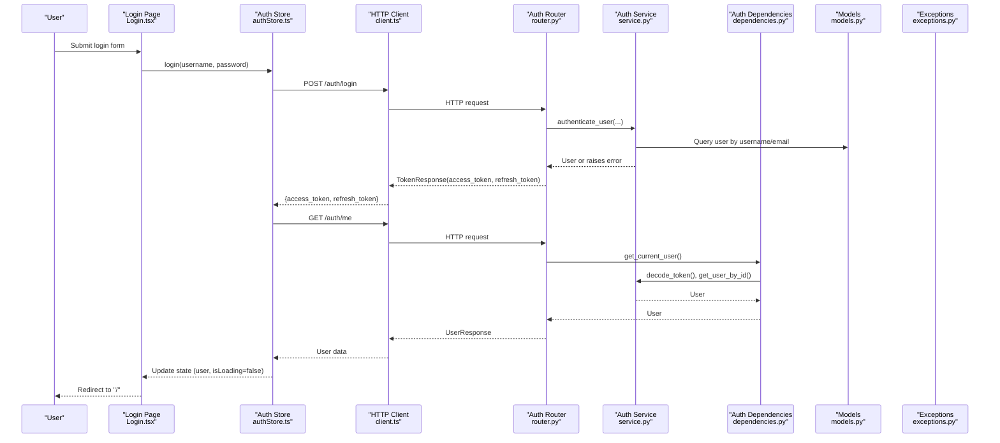

**Diagram sources**
- [frontend/src/pages/Login.tsx:23-31](file://frontend/src/pages/Login.tsx#L23-L31)
- [frontend/src/stores/authStore.ts:42-58](file://frontend/src/stores/authStore.ts#L42-L58)
- [frontend/src/api/client.ts:19-60](file://frontend/src/api/client.ts#L19-L60)
- [backend/app/auth/router.py:56-67](file://backend/app/auth/router.py#L56-L67)
- [backend/app/auth/service.py:125-149](file://backend/app/auth/service.py#L125-L149)
- [backend/app/auth/dependencies.py:27-51](file://backend/app/auth/dependencies.py#L27-L51)
- [backend/app/common/models.py:40-76](file://backend/app/common/models.py#L40-L76)
- [backend/app/common/exceptions.py:44-49](file://backend/app/common/exceptions.py#L44-L49)

## Detailed Component Analysis

### Login Page
- Purpose: Accept username/email and password, submit to the auth store, and redirect on success.
- Form validation: Uses HTML5 required attributes and placeholder text; no client-side regex validation is present.
- Loading and error handling: Reads isLoading and error from the auth store; displays error banner with close action.
- Submission workflow: Prevents default form submission, calls login, navigates to home on success.

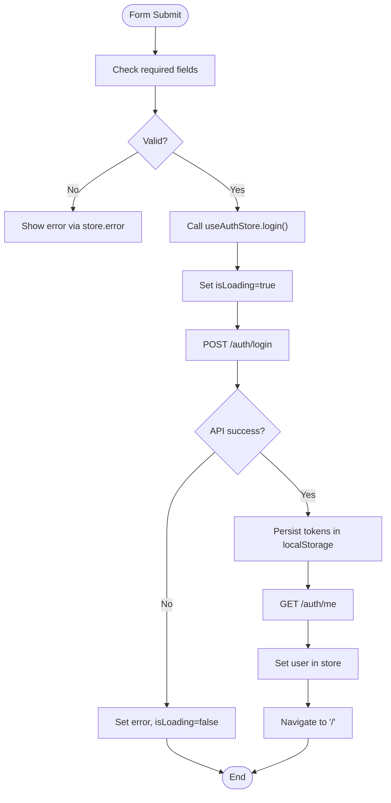

**Diagram sources**
- [frontend/src/pages/Login.tsx:23-31](file://frontend/src/pages/Login.tsx#L23-L31)
- [frontend/src/stores/authStore.ts:42-58](file://frontend/src/stores/authStore.ts#L42-L58)
- [frontend/src/api/client.ts:19-60](file://frontend/src/api/client.ts#L19-L60)

**Section sources**
- [frontend/src/pages/Login.tsx:17-31](file://frontend/src/pages/Login.tsx#L17-L31)

### Register Page
- Purpose: Collect username, email, optional display name, and password; submit to the auth store; redirect to login on success.
- Form validation: Enforces minimum length for username and password; uses HTML5 email input type.
- Loading and error handling: Mirrors the login page’s error and loading UX.
- Submission workflow: Calls register with optional display name, navigates to login on success.

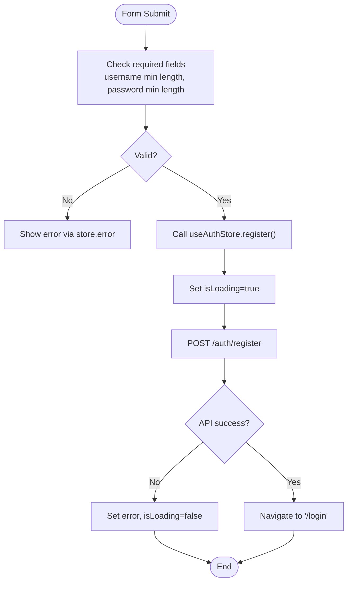

**Diagram sources**
- [frontend/src/pages/Register.tsx:25-33](file://frontend/src/pages/Register.tsx#L25-L33)
- [frontend/src/stores/authStore.ts:60-77](file://frontend/src/stores/authStore.ts#L60-L77)

**Section sources**
- [frontend/src/pages/Register.tsx:17-33](file://frontend/src/pages/Register.tsx#L17-L33)

### Auth Store (Zustand)
- Responsibilities:
  - Manage user, loading, and error state.
  - Perform login, register, logout, and fetchUser.
  - Persist tokens in localStorage on successful login.
  - Fetch user profile after login.
  - Clear error messages.
- Token persistence: Stores access_token and refresh_token in localStorage upon login.
- Error propagation: Captures API errors and surfaces them to UI via store.error.

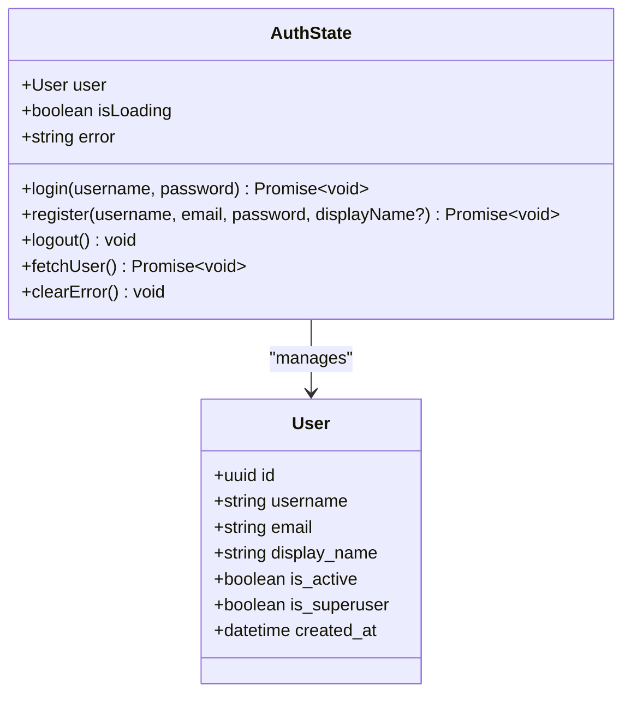

**Diagram sources**
- [frontend/src/stores/authStore.ts:25-35](file://frontend/src/stores/authStore.ts#L25-L35)
- [frontend/src/stores/authStore.ts:15-23](file://frontend/src/stores/authStore.ts#L15-L23)

**Section sources**
- [frontend/src/stores/authStore.ts:37-98](file://frontend/src/stores/authStore.ts#L37-L98)

### HTTP Client (Axios Interceptors)
- Request interceptor: Attaches Authorization: Bearer <access_token> if present.
- Response interceptor: On 401:
  - Attempts to refresh tokens using refresh_token.
  - On success, updates localStorage and retries the original request.
  - On failure, clears tokens and redirects to /login.
- Base URL: Uses a relative path to integrate with the backend.

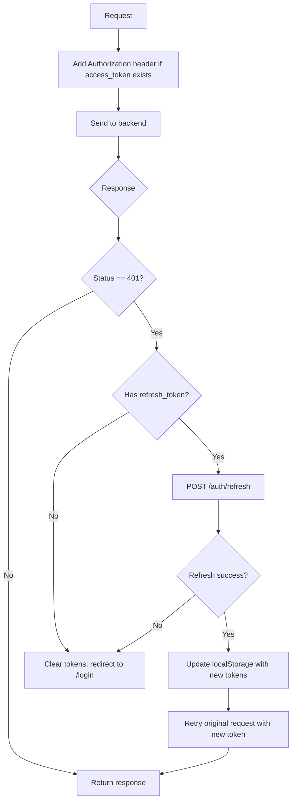

**Diagram sources**
- [frontend/src/api/client.ts:19-60](file://frontend/src/api/client.ts#L19-L60)

**Section sources**
- [frontend/src/api/client.ts:19-60](file://frontend/src/api/client.ts#L19-L60)

### Protected Routes
- Implementation: A ProtectedRoute wrapper checks store.user and isLoading.
- Behavior:
  - While loading, renders a spinner.
  - If not authenticated, redirects to /login.
  - Otherwise, renders children.
- Initialization: App fetches user on mount to synchronize state.

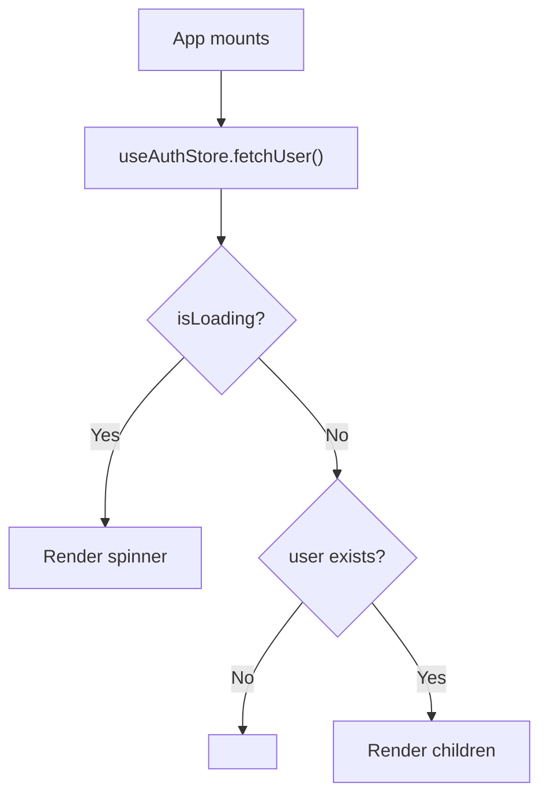

**Diagram sources**
- [frontend/src/App.tsx:23-39](file://frontend/src/App.tsx#L23-L39)
- [frontend/src/App.tsx:42-46](file://frontend/src/App.tsx#L42-L46)

**Section sources**
- [frontend/src/App.tsx:23-39](file://frontend/src/App.tsx#L23-L39)
- [frontend/src/App.tsx:41-46](file://frontend/src/App.tsx#L41-L46)

### Backend Authentication Endpoints
- Endpoints:
  - POST /auth/register: Validates input, hashes password, creates user.
  - POST /auth/login: Authenticates user and returns access/refresh tokens.
  - POST /auth/refresh: Validates refresh token and issues new token pair.
  - GET /auth/me: Returns current user profile using bearer token.
- Validation: Uses Pydantic schemas for request/response validation.
- Security: Passwords are hashed; tokens carry type claims; user must be active.

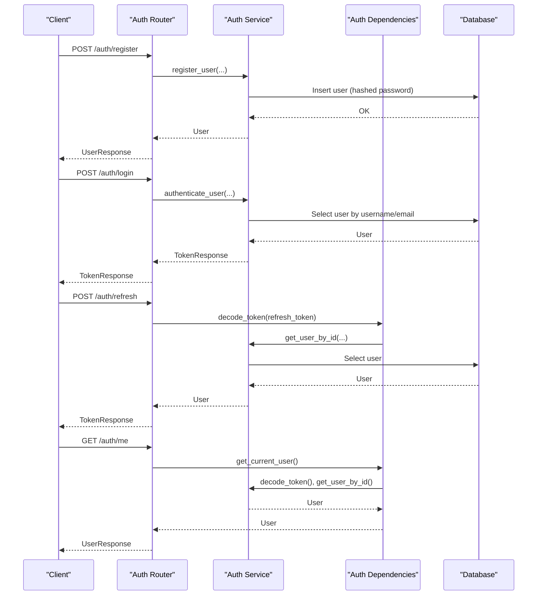

**Diagram sources**
- [backend/app/auth/router.py:37-91](file://backend/app/auth/router.py#L37-L91)
- [backend/app/auth/service.py:91-149](file://backend/app/auth/service.py#L91-L149)
- [backend/app/auth/dependencies.py:27-51](file://backend/app/auth/dependencies.py#L27-L51)
- [backend/app/auth/schemas.py:18-57](file://backend/app/auth/schemas.py#L18-L57)
- [backend/app/common/models.py:40-76](file://backend/app/common/models.py#L40-L76)

**Section sources**
- [backend/app/auth/router.py:37-91](file://backend/app/auth/router.py#L37-L91)
- [backend/app/auth/service.py:91-149](file://backend/app/auth/service.py#L91-L149)
- [backend/app/auth/dependencies.py:27-51](file://backend/app/auth/dependencies.py#L27-L51)
- [backend/app/auth/schemas.py:18-57](file://backend/app/auth/schemas.py#L18-L57)
- [backend/app/common/models.py:40-76](file://backend/app/common/models.py#L40-L76)

### JWT Token Management
- Access token: Short-lived; used for API requests.
- Refresh token: Long-lived; used to obtain new token pair.
- Token types: Payload includes a type claim to distinguish access vs refresh.
- Storage: Frontend stores tokens in localStorage; Axios injects Authorization header automatically.
- Refresh logic: On 401, attempts refresh; on failure, clears tokens and redirects to login.

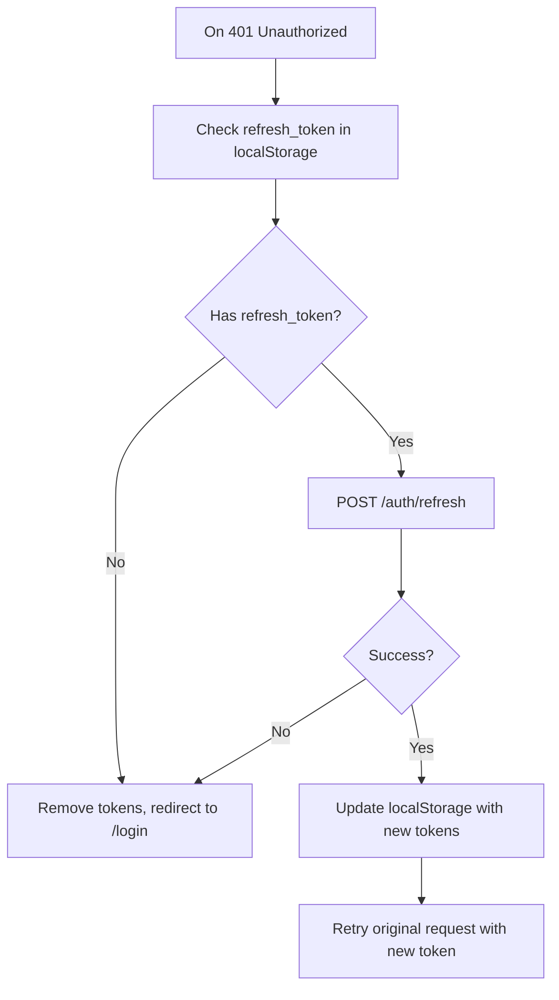

**Diagram sources**
- [frontend/src/api/client.ts:28-60](file://frontend/src/api/client.ts#L28-L60)
- [backend/app/auth/router.py:70-84](file://backend/app/auth/router.py#L70-L84)
- [backend/app/auth/service.py:71-88](file://backend/app/auth/service.py#L71-L88)

**Section sources**
- [frontend/src/api/client.ts:28-60](file://frontend/src/api/client.ts#L28-L60)
- [backend/app/auth/router.py:70-84](file://backend/app/auth/router.py#L70-L84)
- [backend/app/auth/service.py:42-88](file://backend/app/auth/service.py#L42-L88)

### Protected Route Implementation and Redirect Logic
- ProtectedRoute:
  - Renders a spinner while isLoading.
  - Redirects to /login if user is null.
  - Renders children otherwise.
- App initialization:
  - Calls fetchUser on mount to hydrate state from localStorage and backend.
- Redirect behavior:
  - After successful login, navigates to "/".
  - After registration, navigates to "/login".
  - On 401, Axios interceptor clears tokens and redirects to "/login".

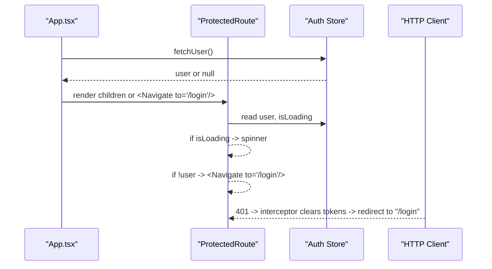

**Diagram sources**
- [frontend/src/App.tsx:23-39](file://frontend/src/App.tsx#L23-L39)
- [frontend/src/App.tsx:42-46](file://frontend/src/App.tsx#L42-L46)
- [frontend/src/api/client.ts:28-60](file://frontend/src/api/client.ts#L28-L60)

**Section sources**
- [frontend/src/App.tsx:23-39](file://frontend/src/App.tsx#L23-L39)
- [frontend/src/App.tsx:41-46](file://frontend/src/App.tsx#L41-L46)
- [frontend/src/api/client.ts:28-60](file://frontend/src/api/client.ts#L28-L60)

### API Integration and Error Handling
- Login:
  - POST /auth/login returns TokenResponse with access_token and refresh_token.
  - Frontend saves tokens and fetches /auth/me to populate user.
- Register:
  - POST /auth/register with validated fields; returns UserResponse.
- Me:
  - GET /auth/me requires a valid access token; returns UserResponse.
- Error handling:
  - Backend raises specific exceptions (Unauthorized, Forbidden, Conflict, etc.) with consistent JSON responses.
  - Frontend captures error messages and displays them to the user.
  - Axios interceptor handles 401 globally.

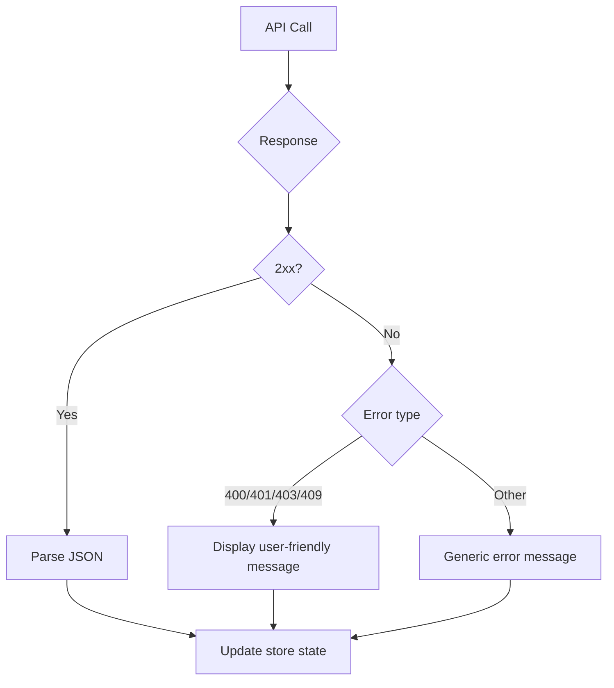

**Diagram sources**
- [backend/app/common/exceptions.py:16-87](file://backend/app/common/exceptions.py#L16-L87)
- [frontend/src/stores/authStore.ts:51-57](file://frontend/src/stores/authStore.ts#L51-L57)
- [frontend/src/api/client.ts:28-60](file://frontend/src/api/client.ts#L28-L60)

**Section sources**
- [backend/app/auth/router.py:37-91](file://backend/app/auth/router.py#L37-L91)
- [backend/app/common/exceptions.py:16-87](file://backend/app/common/exceptions.py#L16-L87)
- [frontend/src/stores/authStore.ts:51-57](file://frontend/src/stores/authStore.ts#L51-L57)
- [frontend/src/api/client.ts:28-60](file://frontend/src/api/client.ts#L28-L60)

### User Experience Patterns and Form Submission Workflows
- Login:
  - Fields: username/email, password.
  - Behavior: Submit triggers login; disables button while loading; shows error banner; redirects on success.
- Register:
  - Fields: username, email, display_name (optional), password.
  - Behavior: Submit triggers register; disables button while loading; shows error banner; navigates to login on success.
- Protected routes:
  - Loading state: Spinner while checking authentication.
  - Redirect: Unauthenticated users are redirected to login.

**Section sources**
- [frontend/src/pages/Login.tsx:17-31](file://frontend/src/pages/Login.tsx#L17-L31)
- [frontend/src/pages/Register.tsx:17-33](file://frontend/src/pages/Register.tsx#L17-L33)
- [frontend/src/App.tsx:23-39](file://frontend/src/App.tsx#L23-L39)

### Security Considerations
- Token storage: Access and refresh tokens are stored in localStorage. Consider HttpOnly cookies for stronger protection.
- Token types: Backend enforces token type validation; only access tokens are accepted for protected endpoints.
- Password hashing: bcrypt is used for secure password hashing.
- Input validation: Pydantic schemas validate request payloads; backend rejects invalid inputs.
- Active user enforcement: Deactivated users cannot authenticate.
- CORS: Configured origins allow development; adjust for production.

**Section sources**
- [frontend/src/stores/authStore.ts:46-47](file://frontend/src/stores/authStore.ts#L46-L47)
- [backend/app/auth/service.py:28-39](file://backend/app/auth/service.py#L28-L39)
- [backend/app/auth/dependencies.py:42-49](file://backend/app/auth/dependencies.py#L42-L49)
- [backend/app/auth/schemas.py:18-31](file://backend/app/auth/schemas.py#L18-L31)
- [backend/app/config.py:56-57](file://backend/app/config.py#L56-L57)

## Dependency Analysis
- Frontend dependencies:
  - Login and Register depend on the auth store.
  - Auth store depends on the HTTP client and backend endpoints.
  - Protected routes depend on the auth store for user state.
  - Axios client depends on localStorage and backend endpoints.
- Backend dependencies:
  - Auth router depends on service and dependencies modules.
  - Service depends on schemas, models, and configuration.
  - Dependencies depend on service and database.
  - Main app wires routers and exception handlers.

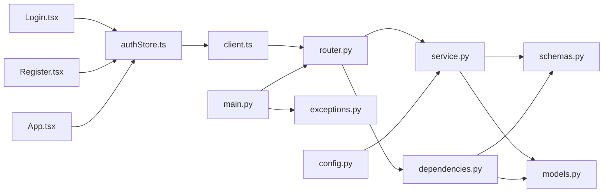

**Diagram sources**
- [frontend/src/pages/Login.tsx](file://frontend/src/pages/Login.tsx#L15)
- [frontend/src/pages/Register.tsx](file://frontend/src/pages/Register.tsx#L15)
- [frontend/src/stores/authStore.ts](file://frontend/src/stores/authStore.ts#L13)
- [frontend/src/App.tsx](file://frontend/src/App.tsx#L13)
- [frontend/src/api/client.ts](file://frontend/src/api/client.ts#L12)
- [backend/app/auth/router.py:11-34](file://backend/app/auth/router.py#L11-L34)
- [backend/app/auth/service.py:15-26](file://backend/app/auth/service.py#L15-L26)
- [backend/app/auth/dependencies.py:14-21](file://backend/app/auth/dependencies.py#L14-L21)
- [backend/app/auth/schemas.py](file://backend/app/auth/schemas.py#L15)
- [backend/app/common/models.py](file://backend/app/common/models.py#L20)
- [backend/app/common/exceptions.py](file://backend/app/common/exceptions.py#L12)
- [backend/app/config.py:16-42](file://backend/app/config.py#L16-L42)
- [backend/app/main.py:59-72](file://backend/app/main.py#L59-L72)

**Section sources**
- [frontend/src/pages/Login.tsx](file://frontend/src/pages/Login.tsx#L15)
- [frontend/src/pages/Register.tsx](file://frontend/src/pages/Register.tsx#L15)
- [frontend/src/stores/authStore.ts](file://frontend/src/stores/authStore.ts#L13)
- [frontend/src/App.tsx](file://frontend/src/App.tsx#L13)
- [frontend/src/api/client.ts](file://frontend/src/api/client.ts#L12)
- [backend/app/auth/router.py:11-34](file://backend/app/auth/router.py#L11-L34)
- [backend/app/auth/service.py:15-26](file://backend/app/auth/service.py#L15-L26)
- [backend/app/auth/dependencies.py:14-21](file://backend/app/auth/dependencies.py#L14-L21)
- [backend/app/auth/schemas.py](file://backend/app/auth/schemas.py#L15)
- [backend/app/common/models.py](file://backend/app/common/models.py#L20)
- [backend/app/common/exceptions.py](file://backend/app/common/exceptions.py#L12)
- [backend/app/config.py:16-42](file://backend/app/config.py#L16-L42)
- [backend/app/main.py:59-72](file://backend/app/main.py#L59-L72)

## Performance Considerations
- Token refresh overhead: Minimize unnecessary refresh attempts by batching requests and avoiding rapid successive 401s.
- Local storage I/O: Frequent reads/writes can block the UI thread; cache tokens in memory when safe.
- Loading indicators: Use spinners during fetchUser to prevent redundant re-renders.
- Network timeouts: Configure Axios timeout to fail fast on slow networks.
- Backend pagination: For large datasets, implement pagination in protected routes to reduce initial load.

[No sources needed since this section provides general guidance]

## Troubleshooting Guide
- Login fails immediately:
  - Verify backend is running and reachable.
  - Check network tab for 404/500 responses.
  - Confirm credentials are correct and user is active.
- Stuck on loading spinner:
  - Ensure fetchUser completes; check console for errors.
  - Verify localStorage contains tokens; clear and retry.
- Redirect loop to /login:
  - Inspect Authorization header in browser dev tools.
  - Confirm token validity and expiration.
  - Check refresh endpoint availability.
- Registration rejected:
  - Ensure username and email uniqueness.
  - Verify password meets length requirements.
- 401 Unauthorized after login:
  - Confirm access_token is persisted and attached to requests.
  - Check refresh_token validity and backend refresh endpoint.
- CORS errors:
  - Adjust CORS_ORIGINS in backend configuration for your frontend origin.

**Section sources**
- [frontend/src/App.tsx:23-39](file://frontend/src/App.tsx#L23-L39)
- [frontend/src/api/client.ts:28-60](file://frontend/src/api/client.ts#L28-L60)
- [backend/app/auth/service.py:125-149](file://backend/app/auth/service.py#L125-L149)
- [backend/app/common/exceptions.py:44-62](file://backend/app/common/exceptions.py#L44-L62)
- [backend/app/config.py:56-57](file://backend/app/config.py#L56-L57)

## Conclusion
The authentication system combines robust backend endpoints with a clean frontend implementation. The login and registration pages provide straightforward user experiences, the auth store centralizes state and API interactions, and the Axios interceptors manage token lifecycle seamlessly. Protected routes ensure secure access to sensitive areas, while consistent error handling and loading states improve usability. For production, consider enhancing token security with HttpOnly cookies and adding CSRF protections.