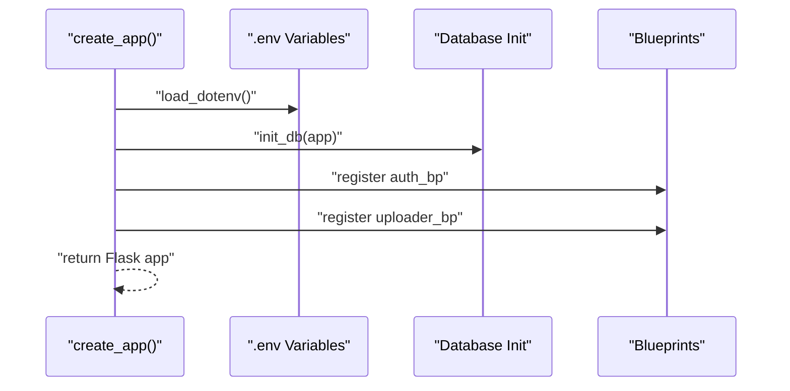
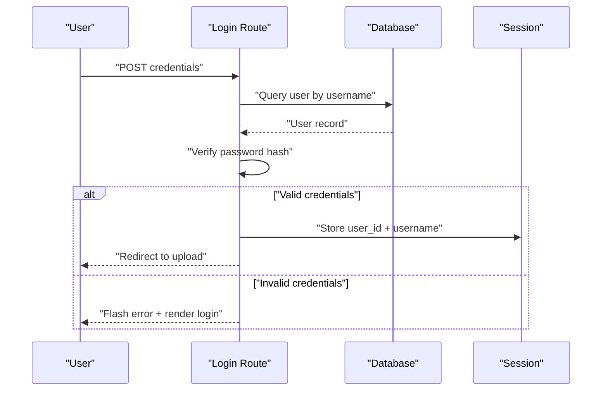
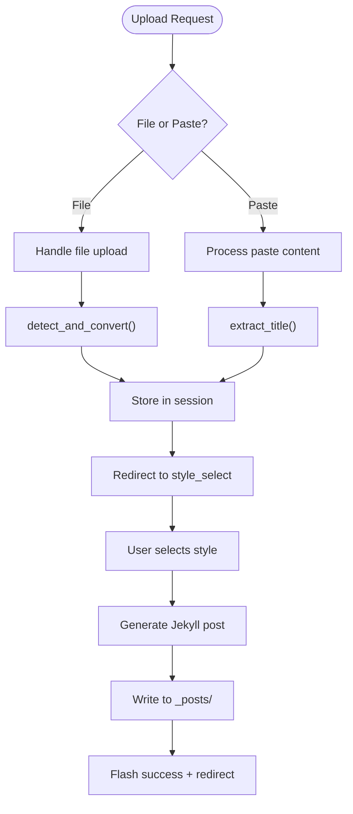
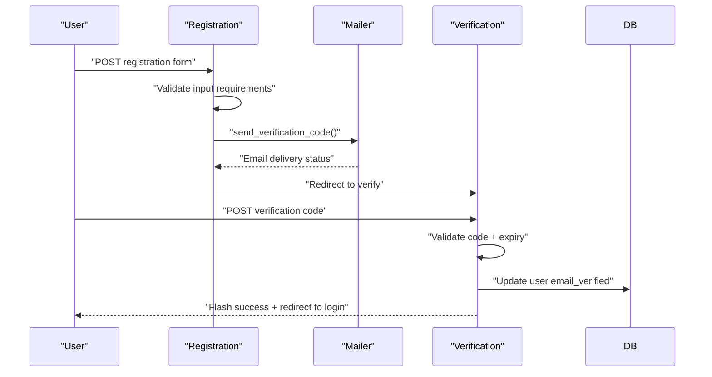

# Frontend Application

<cite>
**Referenced Files in This Document**
- [_config.yml](file://_config.yml)
- [app/__init__.py](file://app/__init__.py)
- [app/auth.py](file://app/auth.py)
- [app/uploader.py](file://app/uploader.py)
- [app/converter.py](file://app/converter.py)
- [app/mailer.py](file://app/mailer.py)
- [app/templates/base.html](file://app/templates/base.html)
- [app/templates/upload.html](file://app/templates/upload.html)
- [app/templates/style_select.html](file://app/templates/style_select.html)
- [app/templates/login.html](file://app/templates/login.html)
- [app/templates/register.html](file://app/templates/register.html)
- [app/templates/verify.html](file://app/templates/verify.html)
- [app/templates/password.html](file://app/templates/password.html)
- [app/templates/articles.html](file://app/templates/articles.html)
- [_layouts/default.html](file://_layouts/default.html)
- [_layouts/deep-technical.html](file://_layouts/deep-technical.html)
- [_layouts/academic-insight.html](file://_layouts/academic-insight.html)
- [_layouts/industry-vision.html](file://_layouts/industry-vision.html)
- [_layouts/friendly-explainer.html](file://_layouts/friendly-explainer.html)
- [_layouts/creative-visual.html](file://_layouts/creative-visual.html)
- [index.html](file://index.html)
- [Gemfile](file://Gemfile)
- [requirements.txt](file://requirements.txt)
</cite>

## Update Summary
**Changes Made**
- Complete architectural replacement from React/TypeScript to Flask/Jinja2 templating
- Replaced client-side routing with server-side Flask blueprints
- Removed all React components, hooks, and Zustand stores
- Implemented premium dark gold aesthetic with glass-morphism effects
- Integrated static Jekyll processing for blog generation
- Added Flask authentication system with session-based security
- Created comprehensive Jinja2 template system with base templates and style variants

## Table of Contents
1. [Introduction](#introduction)
2. [Project Structure](#project-structure)
3. [Core Components](#core-components)
4. [Architecture Overview](#architecture-overview)
5. [Detailed Component Analysis](#detailed-component-analysis)
6. [Template System](#template-system)
7. [Authentication Flow](#authentication-flow)
8. [Content Management](#content-management)
9. [Styling and Design System](#styling-and-design-system)
10. [Deployment and Static Generation](#deployment-and-static-generation)
11. [Migration Impact](#migration-impact)
12. [Conclusion](#conclusion)

## Introduction
This document describes the frontend application built with Flask and Jinja2 templating, replacing the previous React/TypeScript architecture. The system now follows a premium dark gold aesthetic with glass-morphism effects, utilizing Flask blueprints for routing, session-based authentication, and static Jekyll processing for blog generation. The application maintains administrative functionality for content upload, style selection, and article management while leveraging Jinja2 templates for dynamic content rendering.

## Project Structure
The application is organized around Flask blueprints and Jinja2 templates:
- Flask application factory creates the WSGI application with configured blueprints
- Authentication blueprint handles login, registration, verification, and password management
- Uploader blueprint manages file uploads, content conversion, style selection, and article generation
- Template system provides base templates with style variants and reusable components
- Jekyll integration processes generated content into static blog posts

```mermaid
graph TB
subgraph "Flask Application"
APP["app/__init__.py<br/>create_app()"] --> AUTH["auth.py<br/>Authentication Blueprint"]
APP --> UP["uploader.py<br/>Uploader Blueprint"]
end
subgraph "Templates"
BASE["base.html<br/>Base Template"] --> UPLOAD["upload.html<br/>Upload Interface"]
BASE --> STYLE["style_select.html<br/>Style Selection"]
BASE --> LOGIN["login.html<br/>Login Form"]
BASE --> REGISTER["register.html<br/>Registration Form"]
BASE --> VERIFY["verify.html<br/>Email Verification"]
BASE --> PASSWORD["password.html<br/>Password Change"]
BASE --> ARTICLES["articles.html<br/>Articles List"]
END
subgraph "Layouts"
DEFAULT["_layouts/default.html<br/>Default Layout"] --> DT["_layouts/deep-technical.html<br/>Technical Layout"]
DEFAULT --> AI["_layouts/academic-insight.html<br/>Academic Layout"]
DEFAULT --> IV["_layouts/industry-vision.html<br/>Industry Layout"]
DEFAULT --> FE["_layouts/friendly-explainer.html<br/>Explainer Layout"]
DEFAULT --> CV["_layouts/creative-visual.html<br/>Creative Layout"]
END
subgraph "Static Processing"
CONV["converter.py<br/>Content Conversion"] --> JEKYLL["Jekyll<br/>Static Generation"]
MAILER["mailer.py<br/>Email Verification"] --> AUTH
END
AUTH --> BASE
UP --> BASE
UPLOAD --> DT
UPLOAD --> AI
UPLOAD --> IV
UPLOAD --> FE
UPLOAD --> CV
```

**Diagram sources**
- [app/__init__.py:43-62](file://app/__init__.py#L43-L62)
- [app/auth.py:13-168](file://app/auth.py#L13-L168)
- [app/uploader.py:14-210](file://app/uploader.py#L14-L210)
- [app/templates/base.html:1-226](file://app/templates/base.html#L1-L226)
- [app/templates/upload.html:1-82](file://app/templates/upload.html#L1-L82)
- [app/templates/style_select.html:1-41](file://app/templates/style_select.html#L1-L41)

**Section sources**
- [app/__init__.py:1-62](file://app/__init__.py#L1-L62)
- [app/auth.py:1-168](file://app/auth.py#L1-L168)
- [app/uploader.py:1-210](file://app/uploader.py#L1-L210)

## Core Components
- **Flask Application Factory**: Creates the WSGI application with database initialization, secret key configuration, and blueprint registration
- **Authentication Blueprint**: Handles user authentication, registration with email verification, password management, and session-based security
- **Uploader Blueprint**: Manages file uploads, content conversion, style selection, article generation, and Git deployment
- **Template System**: Base templates with dark gold aesthetic, glass-morphism effects, and style variants for different content types
- **Content Converter**: Processes PDF, DOCX, HTML, and Markdown files into standardized content format
- **Jekyll Integration**: Generates static blog posts with proper front matter and metadata

Key implementation patterns:
- Session-based authentication with login decorators for route protection
- Modular blueprint architecture for clean separation of concerns
- Jinja2 template inheritance for consistent styling across pages
- Static file processing pipeline for content transformation
- Git automation for seamless deployment workflow

**Section sources**
- [app/__init__.py:43-62](file://app/__init__.py#L43-L62)
- [app/auth.py:26-48](file://app/auth.py#L26-L48)
- [app/uploader.py:76-118](file://app/uploader.py#L76-L118)
- [app/templates/base.html:10-191](file://app/templates/base.html#L10-L191)
- [app/converter.py:58-88](file://app/converter.py#L58-L88)

## Architecture Overview
The application follows a server-side rendered architecture with Flask and Jinja2:
- **Presentation Layer**: Jinja2 templates with base layouts and style variants
- **Business Logic**: Flask blueprints handling authentication and content management
- **Data Access**: SQLite database with SQLAlchemy-like interface through Flask g object
- **Static Generation**: Jekyll processing for blog post creation and deployment
- **Security**: Session-based authentication with CSRF protection and secure password hashing

```mermaid
graph TB
UI["Jinja2 Templates<br/>base.html + variants"] --> BP["Flask Blueprints<br/>auth + uploader"]
BP --> DB["SQLite Database<br/>users table"]
BP --> FS["File System<br/>_posts + uploads"]
BP --> CONV["Content Converter<br/>PDF/DOCX/HTML → Markdown"]
CONV --> JEKYLL["Jekyll Processor<br/>Static Site Generation"]
JEKYLL --> GH["GitHub Pages<br/>Deployment"]
subgraph "Authentication"
SESSION["Session Management<br/>user_id + username"]
LOGIN["Login Decorator<br/>@login_required"]
END
BP --> SESSION
SESSION --> LOGIN
```

**Diagram sources**
- [app/templates/base.html:194-225](file://app/templates/base.html#L194-L225)
- [app/auth.py:16-23](file://app/auth.py#L16-L23)
- [app/uploader.py:190-210](file://app/uploader.py#L190-L210)
- [app/converter.py:58-88](file://app/converter.py#L58-L88)

## Detailed Component Analysis

### Flask Application Factory
The application factory pattern creates a configured Flask instance with:
- Database connection management through `get_db()` and teardown handlers
- Environment variable loading for configuration
- Blueprint registration for authentication and uploader functionality
- Secret key configuration for session security
- Maximum file upload size enforcement



**Diagram sources**
- [app/__init__.py:43-62](file://app/__init__.py#L43-L62)
- [app/__init__.py:26-41](file://app/__init__.py#L26-L41)

**Section sources**
- [app/__init__.py:1-62](file://app/__init__.py#L1-L62)

### Authentication Blueprint
Handles user authentication lifecycle:
- Login with username/password validation and session establishment
- Registration with QQ email requirement and verification code system
- Email verification with 5-minute expiry and session-based flow
- Password change functionality with current password verification
- Logout with session cleanup and redirect



**Diagram sources**
- [app/auth.py:26-48](file://app/auth.py#L26-L48)
- [app/auth.py:34-45](file://app/auth.py#L34-L45)

**Section sources**
- [app/auth.py:1-168](file://app/auth.py#L1-L168)

### Uploader Blueprint
Manages content upload and article generation:
- File upload handling with drag-and-drop support and size limits
- Content conversion pipeline for various document formats
- Style selection with five distinct visual themes
- Article generation with proper Jekyll front matter
- Git automation for deployment workflow



**Diagram sources**
- [app/uploader.py:76-118](file://app/uploader.py#L76-L118)
- [app/uploader.py:130-168](file://app/uploader.py#L130-L168)
- [app/converter.py:58-88](file://app/converter.py#L58-L88)

**Section sources**
- [app/uploader.py:1-210](file://app/uploader.py#L1-L210)
- [app/converter.py:1-88](file://app/converter.py#L1-L88)

## Template System
The Jinja2 template system provides a flexible foundation for consistent UI:
- **Base Template**: Comprehensive dark gold aesthetic with glass-morphism effects
- **Navigation**: Session-aware navigation with conditional rendering
- **Form Components**: Consistent styling for inputs, buttons, and validation states
- **Layout Variants**: Five distinct content layouts for different writing styles
- **Responsive Design**: Mobile-first approach with breakpoint-specific adjustments

Key template features:
- CSS custom properties for theme consistency
- Glass-morphism card containers with backdrop blur
- Dark gold color scheme with gradient accents
- Interactive elements with hover states and transitions
- Flash messaging system for user feedback

**Section sources**
- [app/templates/base.html:1-226](file://app/templates/base.html#L1-L226)
- [app/templates/upload.html:1-82](file://app/templates/upload.html#L1-L82)
- [app/templates/style_select.html:1-41](file://app/templates/style_select.html#L1-L41)

## Authentication Flow
The authentication system implements session-based security:
- Login decorator protects routes requiring authentication
- Session storage for user identity and preferences
- Flash messaging for error and success states
- Secure password hashing with Werkzeug utilities
- Email verification workflow for registration



**Diagram sources**
- [app/auth.py:51-96](file://app/auth.py#L51-L96)
- [app/auth.py:99-133](file://app/auth.py#L99-L133)

**Section sources**
- [app/auth.py:1-168](file://app/auth.py#L1-L168)

## Content Management
The content management system handles multiple document formats:
- **Supported Formats**: PDF, DOCX, DOC, HTML, MD, MARKDOWN, TXT
- **Conversion Pipeline**: Specialized converters with fallback mechanisms
- **Title Extraction**: Automatic detection from headings or content
- **Style Selection**: Five distinct visual themes with color coding
- **Front Matter Generation**: Proper Jekyll metadata for blog posts

Content processing workflow:
1. File upload or paste content submission
2. Format detection and conversion
3. Title extraction and metadata collection
4. Style selection interface
5. Jekyll post generation with front matter
6. Static file writing to `_posts/` directory

**Section sources**
- [app/uploader.py:29-47](file://app/uploader.py#L29-L47)
- [app/converter.py:58-88](file://app/converter.py#L58-L88)
- [app/uploader.py:143-168](file://app/uploader.py#L143-L168)

## Styling and Design System
The premium dark gold aesthetic implements glass-morphism effects:
- **Color Palette**: Deep blacks (#050508), dark gold (#E4BF7A), and warm accents
- **Glass Effects**: Backdrop blur with translucent backgrounds
- **Typography**: Noto Serif SC for headings, system fonts for body text
- **Interactive States**: Smooth transitions with cubic-bezier easing
- **Component Library**: Cards, forms, buttons, and navigation elements

Design system features:
- CSS custom properties for theme variables
- Responsive grid layouts for style cards
- Hover animations with transform and shadow effects
- Gradient button styling with gold accents
- Consistent spacing and typography scales

**Section sources**
- [app/templates/base.html:10-191](file://app/templates/base.html#L10-L191)
- [app/templates/upload.html:14-35](file://app/templates/upload.html#L14-L35)
- [app/templates/style_select.html:13-29](file://app/templates/style_select.html#L13-L29)

## Deployment and Static Generation
The system integrates with Jekyll for static site generation:
- **Configuration**: Jekyll settings in `_config.yml` with pagination and plugins
- **Post Processing**: Generated Markdown files with proper front matter
- **Layout Selection**: Automatic layout assignment based on content style
- **Git Automation**: One-click deployment through Git commands
- **GitHub Pages**: Seamless integration with GitHub hosting

Deployment workflow:
1. Article generation with Jekyll-compatible front matter
2. Git staging and commit with timestamp messages
3. Push to remote repository for GitHub Pages deployment
4. Automatic site regeneration through GitHub Actions

**Section sources**
- [_config.yml:1-49](file://_config.yml#L1-L49)
- [app/uploader.py:190-210](file://app/uploader.py#L190-L210)

## Migration Impact
The migration from React/TypeScript to Flask/Jinja2 brings significant changes:
- **Architectural Shift**: Client-side JavaScript replaced with server-side rendering
- **State Management**: Global state replaced with Flask sessions and database persistence
- **Routing**: Dynamic client-side routing replaced with server-side Flask routes
- **Styling**: TailwindCSS replaced with custom CSS-in-JS approach
- **Build Process**: Single-page application replaced with static site generation
- **Performance**: Reduced client-side complexity, increased server-side processing

Benefits of the new architecture:
- Simplified deployment with static site generation
- Improved SEO through server-side rendering
- Enhanced security through server-side authentication
- Reduced client-side dependencies and bundle size
- Better integration with GitHub Pages workflow

**Section sources**
- [app/__init__.py:43-62](file://app/__init__.py#L43-L62)
- [app/templates/base.html:10-191](file://app/templates/base.html#L10-L191)

## Conclusion
The application successfully migrated from a React/TypeScript architecture to a Flask/Jinja2-based system, implementing a premium dark gold aesthetic with glass-morphism effects. The new architecture leverages server-side rendering, session-based authentication, and static Jekyll processing for content generation. The template system provides consistent styling across all administrative interfaces, while the blueprint architecture maintains clean separation of concerns. This migration improves deployment simplicity, enhances security through server-side processing, and provides better integration with static hosting platforms.