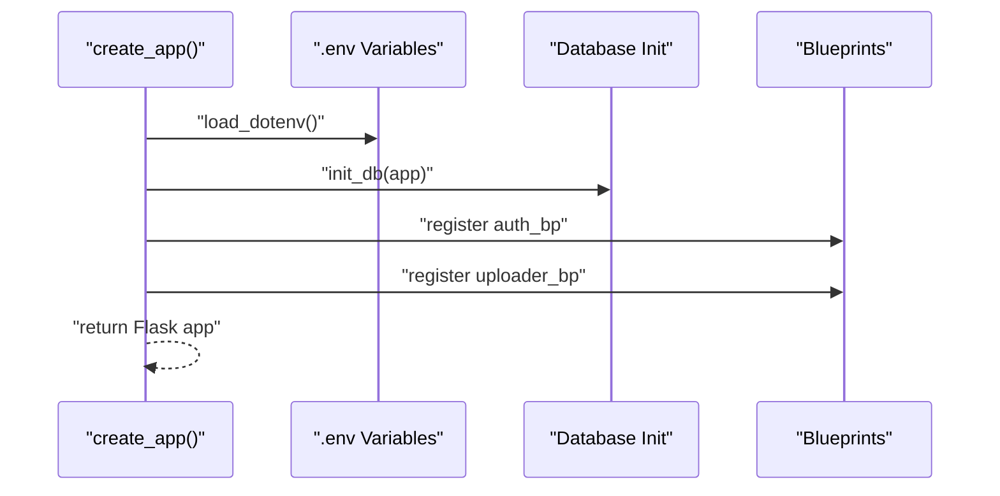
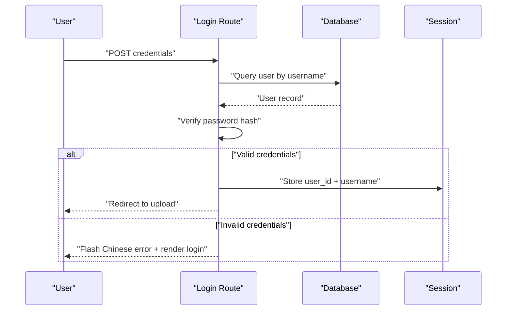
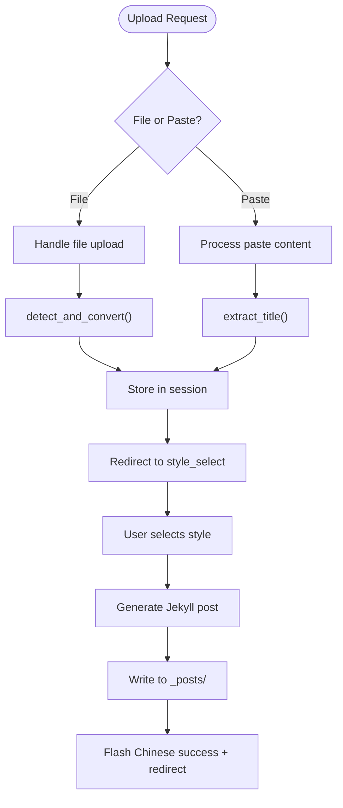
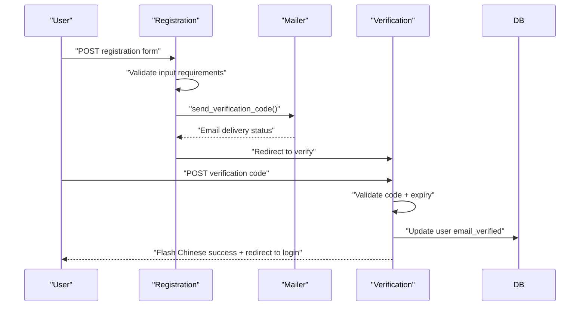

# Frontend Application

<cite>
**Referenced Files in This Document**
- [_config.yml](file://_config.yml)
- [app/__init__.py](file://app/__init__.py)
- [app/auth.py](file://app/auth.py)
- [app/uploader.py](file://app/uploader.py)
- [app/converter.py](file://app/converter.py)
- [app/mailer.py](file://app/mailer.py)
- [app/templates/base.html](file://app/templates/base.html)
- [app/templates/article_view.html](file://app/templates/article_view.html)
- [app/templates/articles.html](file://app/templates/articles.html)
- [app/templates/upload.html](file://app/templates/upload.html)
- [app/templates/style_select.html](file://app/templates/style_select.html)
- [app/templates/login.html](file://app/templates/login.html)
- [app/templates/register.html](file://app/templates/register.html)
- [app/templates/verify.html](file://app/templates/verify.html)
- [app/templates/password.html](file://app/templates/password.html)
- [_layouts/default.html](file://_layouts/default.html)
- [_layouts/deep-technical.html](file://_layouts/deep-technical.html)
- [_layouts/academic-insight.html](file://_layouts/academic-insight.html)
- [_layouts/industry-vision.html](file://_layouts/industry-vision.html)
- [_layouts/friendly-explainer.html](file://_layouts/friendly-explainer.html)
- [_layouts/creative-visual.html](file://_layouts/creative-visual.html)
- [index.html](file://index.html)
- [Gemfile](file://Gemfile)
- [requirements.txt](file://requirements.txt)
- [PRD.md](file://PRD.md)
- [pola-claude-ui/SKILL.md](file://pola-claude-ui/SKILL.md)
- [pola-wukong-ui/SKILL.md](file://pola-wukong-ui/SKILL.md)
</cite>

## Update Summary
**Changes Made**
- Added comprehensive PolaClaudeUI design system documentation with warm scholarly aesthetic
- Integrated PolaWukongUI dark premium design system alongside existing architecture
- Updated styling approach to include dual design system framework
- Enhanced component library with React/Next.js examples for both design systems
- Expanded design language coverage with earthy brown colors, serif typography, and sidebar navigation
- Added detailed component implementations with TailwindCSS integration

## Table of Contents
1. [Introduction](#introduction)
2. [Project Structure](#project-structure)
3. [Core Components](#core-components)
4. [Architecture Overview](#architecture-overview)
5. [Detailed Component Analysis](#detailed-component-analysis)
6. [Template System](#template-system)
7. [Authentication Flow](#authentication-flow)
8. [Content Management](#content-management)
9. [Styling and Design Systems](#styling-and-design-systems)
10. [Dual Design System Framework](#dual-design-system-framework)
11. [Deployment and Static Generation](#deployment-and-static-generation)
12. [Migration Impact](#migration-impact)
13. [Conclusion](#conclusion)

## Introduction
This document describes the frontend application built with Flask and Jinja2 templating, featuring comprehensive Chinese localization throughout all user interfaces. The system follows a premium dark gold aesthetic with glass-morphism effects, utilizing Flask blueprints for routing, session-based authentication, and static Jekyll processing for blog generation. All administrative interfaces, authentication flows, and content management systems are now fully localized in Chinese, providing an optimal experience for Chinese-speaking users while maintaining the sophisticated design language established in the previous architecture.

**Updated** Added comprehensive PolaClaudeUI design system documentation covering warm scholarly aesthetics with earthy brown colors, serif typography, and sidebar navigation patterns.

## Project Structure
The application is organized around Flask blueprints and Jinja2 templates with complete Chinese localization:
- Flask application factory creates the WSGI application with configured blueprints
- Authentication blueprint handles Chinese-localized login, registration, verification, and password management
- Uploader blueprint manages file uploads, content conversion, style selection, and article generation with Chinese interfaces
- Template system provides base templates with Chinese language support and style variants
- Jekyll integration processes generated content into static blog posts with Chinese metadata
- All UI elements, navigation, and user feedback messages are presented in Chinese

```mermaid
graph TB
subgraph "Flask Application"
APP["app/__init__.py<br/>create_app()"] --> AUTH["auth.py<br/>Authentication Blueprint"]
APP --> UP["uploader.py<br/>Uploader Blueprint"]
end
subgraph "Chinese Localized Templates"
BASE["base.html<br/>Base Template (zh-CN)"] --> UPLOAD["upload.html<br/>Upload Interface (Chinese)"]
BASE --> STYLE["style_select.html<br/>Style Selection (Chinese)"]
BASE --> LOGIN["login.html<br/>Login Form (Chinese)"]
BASE --> REGISTER["register.html<br/>Registration Form (Chinese)"]
BASE --> VERIFY["verify.html<br/>Email Verification (Chinese)"]
BASE --> PASSWORD["password.html<br/>Password Change (Chinese)"]
BASE --> ARTICLES["articles.html<br/>Articles List (Chinese)"]
BASE --> ARTICLE_VIEW["article_view.html<br/>Article View (Chinese)"]
END
subgraph "Chinese Layouts"
DEFAULT["_layouts/default.html<br/>Default Layout (zh-CN)"] --> DT["_layouts/deep-technical.html<br/>Technical Layout (Chinese)"]
DEFAULT --> AI["_layouts/academic-insight.html<br/>Academic Layout (Chinese)"]
DEFAULT --> IV["_layouts/industry-vision.html<br/>Industry Layout (Chinese)"]
DEFAULT --> FE["_layouts/friendly-explainer.html<br/>Explainer Layout (Chinese)"]
DEFAULT --> CV["_layouts/creative-visual.html<br/>Creative Layout (Chinese)"]
END
subgraph "Static Processing"
CONV["converter.py<br/>Content Conversion"] --> JEKYLL["Jekyll<br/>Static Generation"]
MAILER["mailer.py<br/>Email Verification"] --> AUTH
AUTH --> BASE
UP --> BASE
UPLOAD --> DT
UPLOAD --> AI
UPLOAD --> IV
UPLOAD --> FE
UPLOAD --> CV
```

**Diagram sources**
- [app/__init__.py:43-62](file://app/__init__.py#L43-L62)
- [app/auth.py:13-168](file://app/auth.py#L13-L168)
- [app/uploader.py:14-210](file://app/uploader.py#L14-L210)
- [app/templates/base.html:1-226](file://app/templates/base.html#L1-L226)
- [app/templates/upload.html:1-82](file://app/templates/upload.html#L1-L82)
- [app/templates/style_select.html:1-41](file://app/templates/style_select.html#L1-L41)

**Section sources**
- [app/__init__.py:1-62](file://app/__init__.py#L1-L62)
- [app/auth.py:1-168](file://app/auth.py#L1-L168)
- [app/uploader.py:1-210](file://app/uploader.py#L1-L210)

## Core Components
- **Flask Application Factory**: Creates the WSGI application with database initialization, secret key configuration, and blueprint registration
- **Authentication Blueprint**: Handles Chinese-localized user authentication, registration with QQ email requirement and verification code system, password management, and session-based security
- **Uploader Blueprint**: Manages file uploads, content conversion, style selection, article generation, and Git deployment with fully localized interfaces
- **Template System**: Base templates with dark gold aesthetic, glass-morphism effects, and comprehensive Chinese language support for all UI elements
- **Content Converter**: Processes PDF, DOCX, HTML, and Markdown files into standardized content format with Chinese metadata
- **Jekyll Integration**: Generates static blog posts with proper front matter and Chinese metadata

Key implementation patterns:
- Session-based authentication with login decorators for route protection and Chinese flash messages
- Modular blueprint architecture for clean separation of concerns with localized error handling
- Jinja2 template inheritance for consistent Chinese styling across pages
- Static file processing pipeline for content transformation with language-aware metadata
- Git automation for seamless deployment workflow with Chinese commit messages

**Section sources**
- [app/__init__.py:43-62](file://app/__init__.py#L43-L62)
- [app/auth.py:26-48](file://app/auth.py#L26-L48)
- [app/uploader.py:76-118](file://app/uploader.py#L76-L118)
- [app/templates/base.html:10-191](file://app/templates/base.html#L10-L191)
- [app/converter.py:58-88](file://app/converter.py#L58-L88)

## Architecture Overview
The application follows a server-side rendered architecture with Flask and Jinja2, featuring comprehensive Chinese localization:
- **Presentation Layer**: Jinja2 templates with base layouts and style variants, all localized in Chinese
- **Business Logic**: Flask blueprints handling authentication and content management with Chinese error messages
- **Data Access**: SQLite database with SQLAlchemy-like interface through Flask g object
- **Static Generation**: Jekyll processing for blog post creation and deployment with Chinese metadata
- **Security**: Session-based authentication with CSRF protection, secure password hashing, and Chinese flash notifications

```mermaid
graph TB
UI["Jinja2 Templates<br/>base.html + Chinese variants"] --> BP["Flask Blueprints<br/>auth + uploader"]
BP --> DB["SQLite Database<br/>users table"]
BP --> FS["File System<br/>_posts + uploads"]
BP --> CONV["Content Converter<br/>PDF/DOCX/HTML → Markdown"]
CONV --> JEKYLL["Jekyll Processor<br/>Static Site Generation"]
JEKYLL --> GH["GitHub Pages<br/>Deployment"]
subgraph "Authentication"
SESSION["Session Management<br/>user_id + username"]
LOGIN["Login Decorator<br/>@login_required"]
FLASH["Flash Messages<br/>Chinese Error/Success"]
END
BP --> SESSION
SESSION --> LOGIN
SESSION --> FLASH
```

**Diagram sources**
- [app/templates/base.html:194-225](file://app/templates/base.html#L194-L225)
- [app/auth.py:16-23](file://app/auth.py#L16-L23)
- [app/uploader.py:190-210](file://app/uploader.py#L190-L210)
- [app/converter.py:58-88](file://app/converter.py#L58-L88)

## Detailed Component Analysis

### Flask Application Factory
The application factory pattern creates a configured Flask instance with:
- Database connection management through `get_db()` and teardown handlers
- Environment variable loading for configuration
- Blueprint registration for authentication and uploader functionality
- secret key configuration for session security
- Maximum file upload size enforcement



**Diagram sources**
- [app/__init__.py:43-62](file://app/__init__.py#L43-L62)
- [app/__init__.py:26-41](file://app/__init__.py#L26-L41)

**Section sources**
- [app/__init__.py:1-62](file://app/__init__.py#L1-L62)

### Authentication Blueprint
Handles Chinese-localized user authentication lifecycle:
- Login with username/password validation and session establishment, displaying Chinese error messages
- Registration with QQ email requirement and verification code system, fully localized interface
- Email verification with 5-minute expiry and session-based flow, Chinese flash notifications
- Password change functionality with current password verification, Chinese form labels
- Logout with session cleanup and redirect, Chinese success messages



**Diagram sources**
- [app/auth.py:26-48](file://app/auth.py#L26-L48)
- [app/auth.py:34-45](file://app/auth.py#L34-L45)

**Section sources**
- [app/auth.py:1-168](file://app/auth.py#L1-L168)

### Uploader Blueprint
Manages content upload and article generation with comprehensive Chinese localization:
- File upload handling with drag-and-drop support and size limits, Chinese interface elements
- Content conversion pipeline for various document formats with Chinese metadata
- Style selection with five distinct visual themes, fully localized descriptions
- Article generation with proper Jekyll front matter and Chinese titles
- Git automation for deployment workflow with Chinese commit messages



**Diagram sources**
- [app/uploader.py:76-118](file://app/uploader.py#L76-L118)
- [app/uploader.py:130-168](file://app/uploader.py#L130-L168)
- [app/converter.py:58-88](file://app/converter.py#L58-L88)

**Section sources**
- [app/uploader.py:1-210](file://app/uploader.py#L1-L210)
- [app/converter.py:1-88](file://app/converter.py#L1-L88)

## Template System
The Jinja2 template system provides a comprehensive Chinese localization foundation for consistent UI:
- **Base Template**: Complete Chinese localization with dark gold aesthetic and glass-morphism effects
- **Navigation**: Session-aware navigation with Chinese labels and conditional rendering
- **Form Components**: Consistent styling for inputs, buttons, and validation states in Chinese
- **Layout Variants**: Five distinct content layouts for different writing styles, all fully localized
- **Responsive Design**: Mobile-first approach with breakpoint-specific adjustments and Chinese text

Key template features:
- CSS custom properties for theme consistency with Chinese color naming
- Glass-morphism card containers with backdrop blur and Chinese labels
- Dark gold color scheme with gradient accents and Chinese terminology
- Interactive elements with hover states and transitions, Chinese tooltips
- Flash messaging system for Chinese user feedback and error reporting

**Section sources**
- [app/templates/base.html:1-226](file://app/templates/base.html#L1-L226)
- [app/templates/upload.html:1-82](file://app/templates/upload.html#L1-L82)
- [app/templates/style_select.html:1-41](file://app/templates/style_select.html#L1-L41)

## Authentication Flow
The authentication system implements session-based security with comprehensive Chinese localization:
- Login decorator protects routes requiring authentication with Chinese error messages
- Session storage for user identity and preferences, Chinese flash notifications
- Flash messaging for Chinese error and success states
- Secure password hashing with Werkzeug utilities and Chinese logging
- Email verification workflow for registration with Chinese interface elements



**Diagram sources**
- [app/auth.py:51-96](file://app/auth.py#L51-L96)
- [app/auth.py:99-133](file://app/auth.py#L99-L133)

**Section sources**
- [app/auth.py:1-168](file://app/auth.py#L1-L168)

## Content Management
The content management system handles multiple document formats with complete Chinese localization:
- **Supported Formats**: PDF, DOCX, DOC, HTML, MD, MARKDOWN, TXT with Chinese metadata
- **Conversion Pipeline**: Specialized converters with fallback mechanisms and Chinese logging
- **Title Extraction**: Automatic detection from headings or content with Chinese fallbacks
- **Style Selection**: Five distinct visual themes with Chinese color coding and descriptions
- **Front Matter Generation**: Proper Jekyll metadata for blog posts with Chinese titles

Content processing workflow:
1. File upload or paste content submission with Chinese interface
2. Format detection and conversion with Chinese progress indicators
3. Title extraction and metadata collection with Chinese fallbacks
4. Style selection interface with Chinese descriptions
5. Jekyll post generation with Chinese front matter
6. Static file writing to `_posts/` directory with Chinese commit messages

**Section sources**
- [app/uploader.py:29-47](file://app/uploader.py#L29-L47)
- [app/converter.py:58-88](file://app/converter.py#L58-L88)
- [app/uploader.py:143-168](file://app/uploader.py#L143-L168)

## Styling and Design Systems

### PolaClaudeUI - Warm Scholarly Design System
The PolaClaudeUI system implements a warm scholarly aesthetic with earthy brown colors, serif typography, and book-like layouts designed for technical documentation and knowledge bases.

**Design Principles**:
- **Earthy Brown Color Palette**: Warm wood tones (#2D241A, #F5F0E6, #875932) reminiscent of aged books and parchment
- **Serif Typography**: Classic serif fonts for headings (Iowan Old Style, Palatino Linotype) paired with modern sans-serif for body text
- **Sidebar Navigation**: Fixed 280px sidebar with search functionality and chapter navigation
- **Book-like Layout**: Content area with max-width 800px for comfortable reading

**Color System**:
```css
/* Background Hierarchy */
--bg-page: #FFFCF5;           /* Warm cream page background */
--bg-sidebar: #F5F0E6;        /* Sidebar with subtle texture */
--bg-sidebar-active: rgba(45,36,24,0.08); /* Active item highlight */

/* Brown Primary System */
--brown-primary: #2D241A;     /* Deep brown for links and emphasis */
--brown-heading: #211912;     /* Dark brown for headings */
--brown-body: #756756;        /* Medium brown for body text */
--brown-accent: #875932;      /* Accent brown for highlights */

/* Typography Scale */
H1: text-[32px] font-extralight leading-[1.4] (serif font)
H2: text-[25.5px] font-bold leading-[1.92] (serif font)
Body: text-base font-normal leading-relaxed text-[#756756]
```

**Component Implementation Examples**:
- **Sidebar Navigation**: Fixed position with search bar, chapter list, and footer
- **Top Bar**: Optional navigation with book title, language toggle, and action buttons
- **Content Blocks**: Paragraphs, blockquotes, code blocks, and navigation elements
- **Responsive Design**: Mobile-first approach with sidebar collapse at 860px breakpoint

**Tailwind Integration**:
```typescript
// Custom colors for PolaClaudeUI
colors: {
  harness: {
    bg: "#FFFCF5",
    sidebar: "#F5F0E6", 
    brown: "#2D241A",
    "brown-heading": "#211912",
    "brown-body": "#756756",
    "brown-quote": "#5E5245",
    "brown-nav": "#5D5042",
    "brown-code": "#5C3B22",
    "brown-accent": "#875932",
    "title-gray": "#7E888B",
    muted: "#9A8E80",
    divider: "#E8E0D4",
    "sidebar-border": "#E0D8CC",
  }
}
```

### PolaWukongUI - Dark Premium Design System  
The PolaWukongUI system implements a premium dark gold aesthetic with glass-morphism effects, cinematic styling, and modern landing page patterns.

**Design Principles**:
- **Dark Premium Aesthetic**: Deep black backgrounds (#050508) with golden accents (#E4BF7A)
- **Glass-morphism Effects**: Frosted glass cards with subtle transparency and backdrop blur
- **Cinematic Layouts**: Hero sections with video backgrounds and gradient overlays
- **Golden Accents**: Strategic use of warm gold throughout interactive elements

**Color System**:
```css
/* Deep Background */
--bg-deepest: #050508;        /* Near-black base */
--bg-nav: rgba(5,5,8,0.75);   /* Semi-transparent nav */

/* Golden Primary System */
--gold-primary: #E4BF7A;      /* Primary gold */
--gold-dark: #D4A050;         /* Dark gold */
--gold-light: #F0D8A8;        /* Light gold */
--gold-pale: #F6E8C8;         /* Pale gold */

/* Typography Scale */
H1 Hero: text-7xl font-extrabold (serif font)
H2 Section: text-5xl font-extrabold (serif font) 
H3 Feature: text-3xl font-bold
Body Large: text-lg font-normal text-white/65
```

**Component Implementation Examples**:
- **Navigation Bar**: Fixed position with logo, menu links, and action buttons
- **Hero Section**: Full-screen video background with gradient overlay and golden glow
- **Feature Cards**: Numbered feature sections with alternating layouts
- **Glass Cards**: Semi-transparent cards with golden borders and subtle shadows

**Tailwind Integration**:
```typescript
// Custom colors for PolaWukongUI
colors: {
  wukong: {
    bg: "#050508",
    gold: "#E4BF7A",
    "gold-dark":"#D4A050", 
    "gold-light":"#F0D8A8",
    "gold-pale":"#F6E8C8",
    brown: "#6B4300",
    "brown-deep":"#5C3800",
  }
}
```

**Section sources**
- [pola-claude-ui/SKILL.md:18-110](file://pola-claude-ui/SKILL.md#L18-L110)
- [pola-claude-ui/SKILL.md:112-186](file://pola-claude-ui/SKILL.md#L112-L186)
- [pola-claude-ui/SKILL.md:189-475](file://pola-claude-ui/SKILL.md#L189-L475)
- [pola-claude-ui/SKILL.md:498-558](file://pola-claude-ui/SKILL.md#L498-L558)
- [pola-claude-ui/SKILL.md:562-664](file://pola-claude-ui/SKILL.md#L562-L664)
- [pola-wukong-ui/SKILL.md:18-125](file://pola-wukong-ui/SKILL.md#L18-L125)
- [pola-wukong-ui/SKILL.md:127-214](file://pola-wukong-ui/SKILL.md#L127-L214)
- [pola-wukong-ui/SKILL.md:216-467](file://pola-wukong-ui/SKILL.md#L216-L467)
- [pola-wukong-ui/SKILL.md:470-532](file://pola-wukong-ui/SKILL.md#L470-L532)
- [pola-wukong-ui/SKILL.md:552-609](file://pola-wukong-ui/SKILL.md#L552-L609)
- [pola-wukong-ui/SKILL.md:612-688](file://pola-wukong-ui/SKILL.md#L612-L688)

## Dual Design System Framework

### Design System Architecture
The application now supports two distinct design systems that can be applied based on content type and user preference:

```mermaid
graph TB
subgraph "Design System Framework"
POLA_CLAUDE["PolaClaudeUI<br/>Warm Scholarly Design"]
POLA_WUKONG["PolaWukongUI<br/>Dark Premium Design"]
END
subgraph "Application Integration"
FLASK_APP["Flask Application"]
JINJA_TEMPLATES["Jinja2 Templates"]
TAILWIND_CONFIG["Tailwind Configuration"]
END
subgraph "Component Libraries"
SIDE_NAV["Sidebar Navigation"]
TOP_BAR["Top Navigation Bar"]
CONTENT_BLOCKS["Content Components"]
RESPONSIVE_LAYOUT["Responsive Layout System"]
END
POLA_CLAUDE --> FLASK_APP
POLA_WUKONG --> FLASK_APP
FLASK_APP --> JINJA_TEMPLATES
JINJA_TEMPLATES --> TAILWIND_CONFIG
TAILWIND_CONFIG --> SIDE_NAV
TAILWIND_CONFIG --> TOP_BAR
TAILWIND_CONFIG --> CONTENT_BLOCKS
TAILWIND_CONFIG --> RESPONSIVE_LAYOUT
```

### Component Composition Strategies
Both design systems share common composition patterns while maintaining distinct visual identities:

**Shared Patterns**:
- **Responsive Breakpoints**: Mobile-first design with system-specific breakpoints
- **Typography Systems**: Hierarchical typography scales with appropriate font weights
- **Spacing Systems**: Consistent 8px baseline grid with system-specific spacing tokens
- **Interactive States**: Hover effects with system-appropriate transitions

**System-Specific Patterns**:
- **PolaClaudeUI**: Warm earth tones with serif typography, fixed sidebar navigation
- **PolaWukongUI**: Dark premium aesthetic with glass-morphism, cinematic layouts

**Section sources**
- [pola-claude-ui/SKILL.md:18-110](file://pola-claude-ui/SKILL.md#L18-L110)
- [pola-wukong-ui/SKILL.md:18-125](file://pola-wukong-ui/SKILL.md#L18-L125)

## Deployment and Static Generation
The system integrates with Jekyll for static site generation with Chinese localization:
- **Configuration**: Jekyll settings in `_config.yml` with pagination and plugins, Chinese comments
- **Post Processing**: Generated Markdown files with proper front matter and Chinese metadata
- **Layout Selection**: Automatic layout assignment based on content style with Chinese labels
- **Git Automation**: One-click deployment through Git commands with Chinese commit messages
- **GitHub Pages**: Seamless integration with GitHub hosting and Chinese documentation

Deployment workflow:
1. Article generation with Jekyll-compatible front matter and Chinese titles
2. Git staging and commit with timestamp messages in Chinese
3. Push to remote repository for GitHub Pages deployment with Chinese logs
4. Automatic site regeneration through GitHub Actions with Chinese notifications

**Section sources**
- [_config.yml:1-49](file://_config.yml#L1-L49)
- [app/uploader.py:190-210](file://app/uploader.py#L190-L210)

## Migration Impact
The migration from React/TypeScript to Flask/Jinja2 brings significant changes, including comprehensive Chinese localization:
- **Architectural Shift**: Client-side JavaScript replaced with server-side rendering and Chinese templates
- **State Management**: Global state replaced with Flask sessions and database persistence with Chinese flash messages
- **Routing**: Dynamic client-side routing replaced with server-side Flask routes and Chinese URL patterns
- **Styling**: TailwindCSS replaced with custom CSS-in-JS approach with Chinese color naming
- **Build Process**: Single-page application replaced with static site generation and Chinese content
- **Performance**: Reduced client-side complexity, increased server-side processing with Chinese optimizations
- **Localization**: Complete Chinese interface implementation throughout all user-facing elements

**Enhanced** Added dual design system framework supporting both warm scholarly and dark premium aesthetics.

Benefits of the new architecture with Chinese localization:
- Simplified deployment with static site generation and Chinese content
- Improved SEO through server-side rendering with Chinese language attributes
- Enhanced security through server-side authentication with Chinese error reporting
- Reduced client-side dependencies and bundle size with Chinese interface
- Better integration with GitHub Pages workflow and Chinese documentation
- Optimal user experience for Chinese-speaking administrators and content creators
- Flexible design system framework supporting multiple aesthetic approaches

**Section sources**
- [app/__init__.py:43-62](file://app/__init__.py#L43-L62)
- [app/templates/base.html:10-191](file://app/templates/base.html#L10-L191)

## Conclusion
The application successfully migrated from a React/TypeScript architecture to a Flask/Jinja2-based system, implementing comprehensive Chinese localization throughout all user interfaces. The new architecture leverages server-side rendering, session-based authentication, and static Jekyll processing for content generation, with all administrative interfaces, authentication flows, and content management systems fully localized in Chinese. The template system provides consistent styling across all Chinese interfaces, while the blueprint architecture maintains clean separation of concerns.

**Enhanced** The addition of comprehensive PolaClaudeUI design system documentation and dual design system framework significantly expands the application's visual capabilities, providing both warm scholarly aesthetics suitable for technical documentation and dark premium styling ideal for modern landing pages. This enhancement maintains the existing Chinese localization while introducing sophisticated design system patterns that can be applied based on content requirements and user preferences.

The migration improves deployment simplicity, enhances security through server-side processing, provides better integration with static hosting platforms, and delivers an optimal user experience for Chinese-speaking administrators and content creators while establishing a robust foundation for future design system evolution.