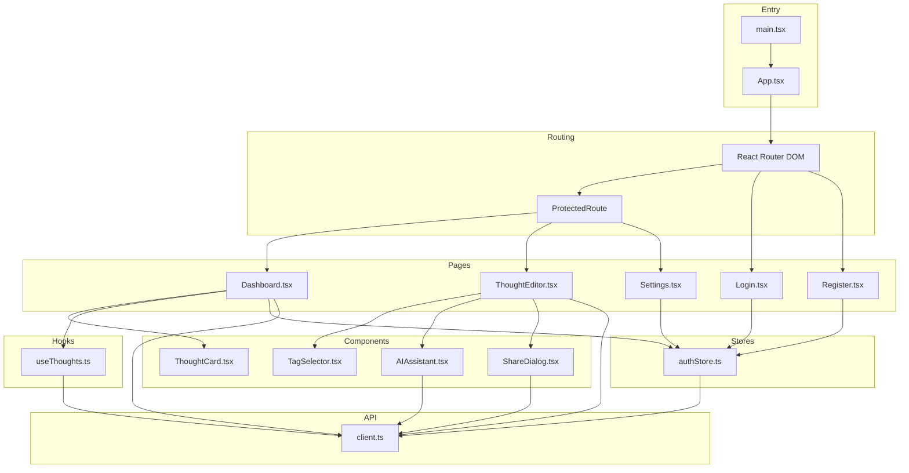
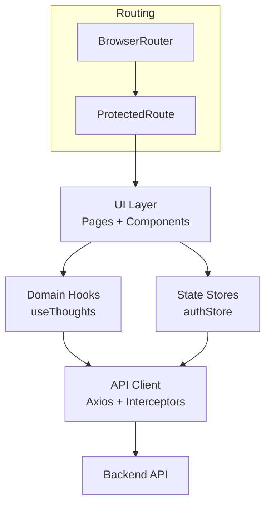
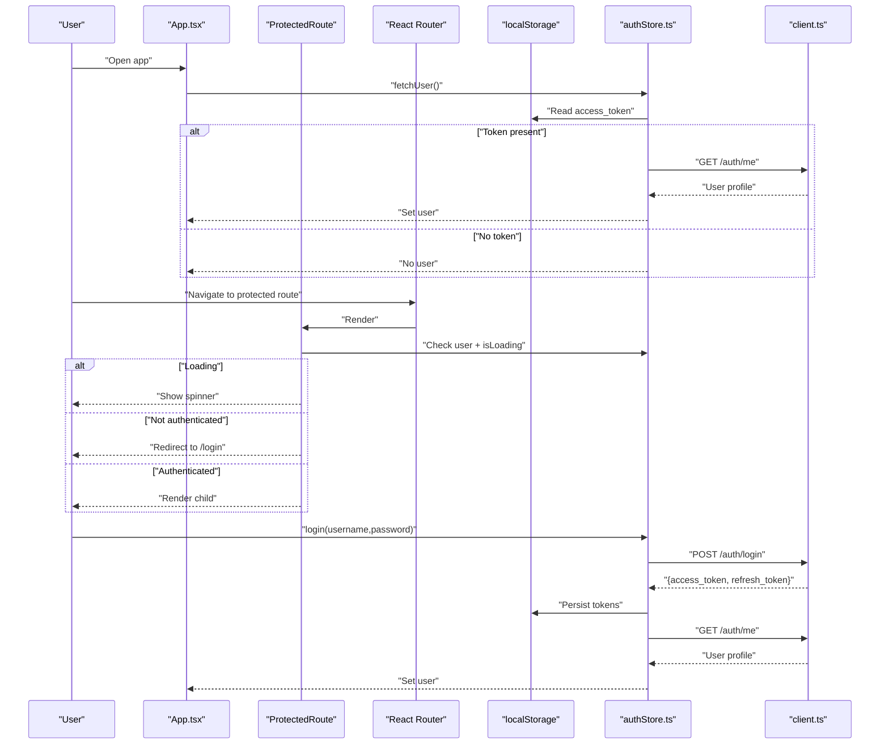
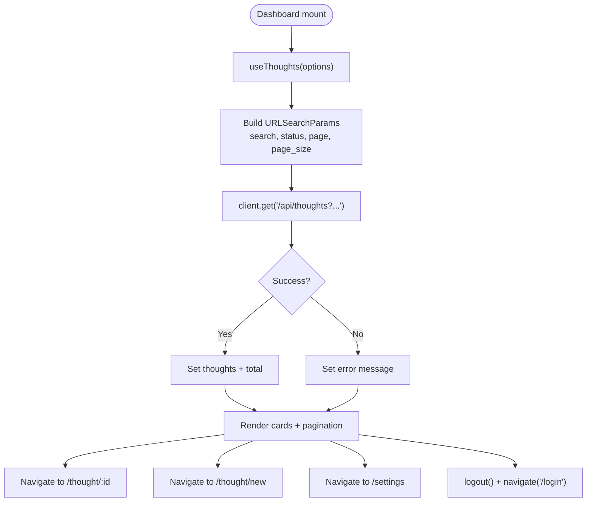
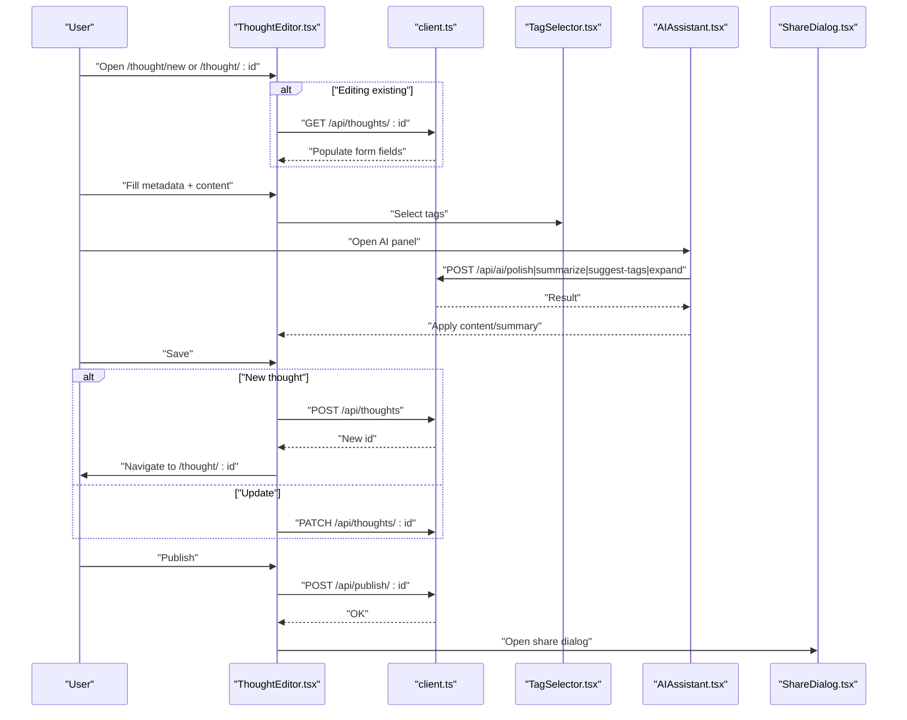
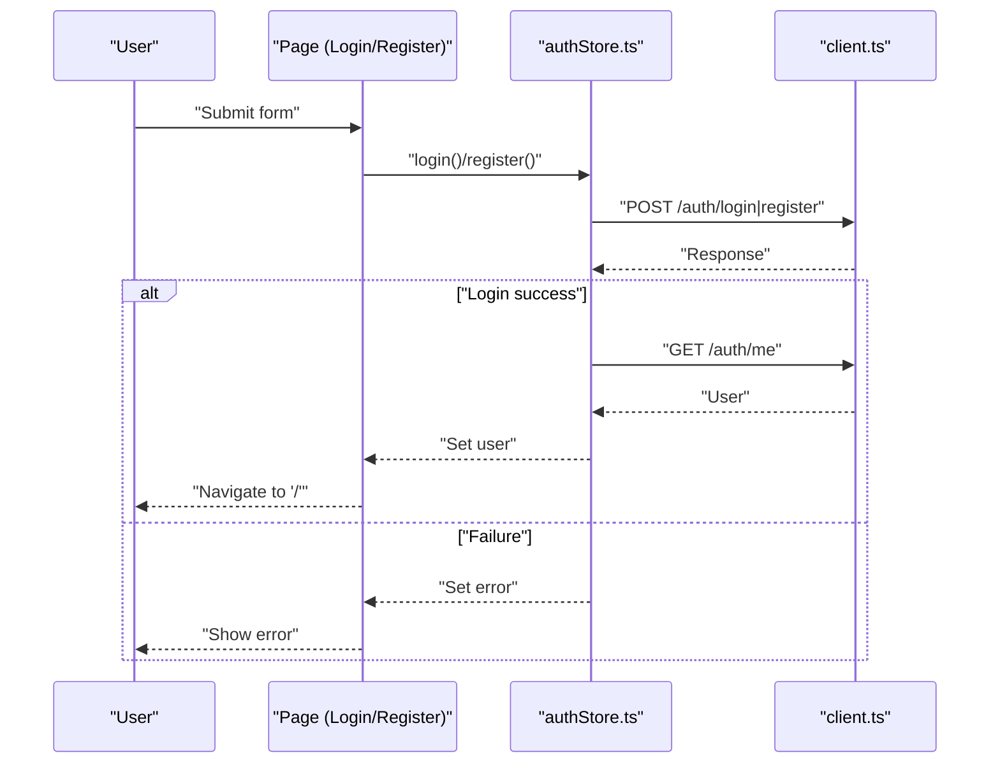
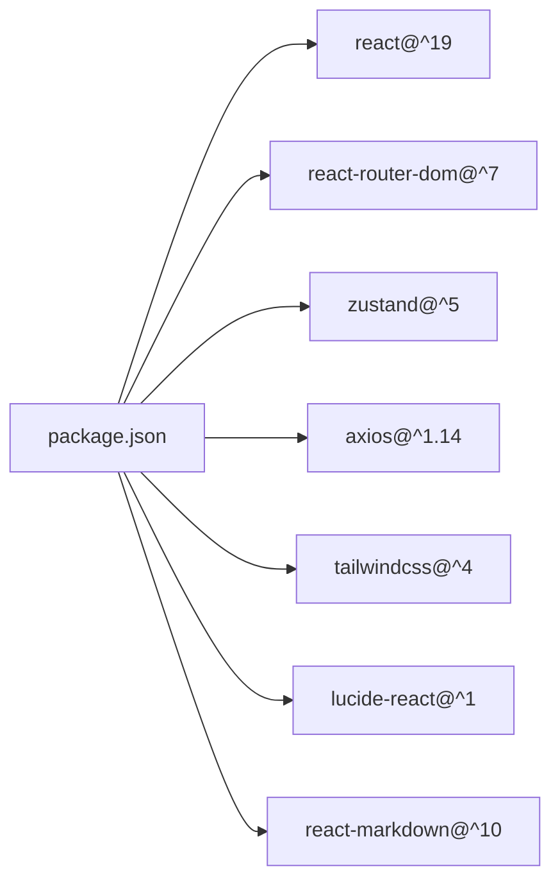

# Frontend Application

<cite>
**Referenced Files in This Document**
- [main.tsx](file://frontend/src/main.tsx)
- [App.tsx](file://frontend/src/App.tsx)
- [authStore.ts](file://frontend/src/stores/authStore.ts)
- [client.ts](file://frontend/src/api/client.ts)
- [package.json](file://frontend/package.json)
- [Dashboard.tsx](file://frontend/src/pages/Dashboard.tsx)
- [Login.tsx](file://frontend/src/pages/Login.tsx)
- [Register.tsx](file://frontend/src/pages/Register.tsx)
- [Settings.tsx](file://frontend/src/pages/Settings.tsx)
- [ThoughtEditor.tsx](file://frontend/src/pages/ThoughtEditor.tsx)
- [useThoughts.ts](file://frontend/src/hooks/useThoughts.ts)
- [ThoughtCard.tsx](file://frontend/src/components/ThoughtCard.tsx)
- [TagSelector.tsx](file://frontend/src/components/TagSelector.tsx)
- [AIAssistant.tsx](file://frontend/src/components/AIAssistant.tsx)
- [ShareDialog.tsx](file://frontend/src/components/ShareDialog.tsx)
</cite>

## Table of Contents
1. [Introduction](#introduction)
2. [Project Structure](#project-structure)
3. [Core Components](#core-components)
4. [Architecture Overview](#architecture-overview)
5. [Detailed Component Analysis](#detailed-component-analysis)
6. [Dependency Analysis](#dependency-analysis)
7. [Performance Considerations](#performance-considerations)
8. [Troubleshooting Guide](#troubleshooting-guide)
9. [Conclusion](#conclusion)
10. [Appendices](#appendices)

## Introduction
This document describes the frontend application built with React 19 and TypeScript. It covers the component architecture, routing configuration, state management via Zustand stores, page structure (dashboard, editor, login, registration, settings), custom hooks, API client integration, and utility components. It also explains the styling approach, responsive design patterns, component composition strategies, authentication flow, protected routes, user session management, performance optimization techniques, TypeScript integration patterns, and development workflow.

## Project Structure
The frontend is organized by feature and responsibility:
- Entry point renders the root application component.
- Routing defines public and protected routes with a ProtectedRoute wrapper.
- Pages implement domain-specific views.
- Components encapsulate reusable UI and logic.
- Hooks abstract data fetching and stateful logic.
- Stores manage global state (authentication).
- API client centralizes HTTP requests and token handling.

**Diagram sources**
- [main.tsx:1-20](file://frontend/src/main.tsx#L1-L20)
- [App.tsx:41-94](file://frontend/src/App.tsx#L41-L94)
- [Dashboard.tsx:20-166](file://frontend/src/pages/Dashboard.tsx#L20-L166)
- [Login.tsx:17-103](file://frontend/src/pages/Login.tsx#L17-L103)
- [Register.tsx:17-120](file://frontend/src/pages/Register.tsx#L17-L120)
- [Settings.tsx:17-93](file://frontend/src/pages/Settings.tsx#L17-L93)
- [ThoughtEditor.tsx:23-221](file://frontend/src/pages/ThoughtEditor.tsx#L23-L221)
- [ThoughtCard.tsx:26-70](file://frontend/src/components/ThoughtCard.tsx#L26-L70)
- [TagSelector.tsx:19-57](file://frontend/src/components/TagSelector.tsx#L19-L57)
- [AIAssistant.tsx:23-146](file://frontend/src/components/AIAssistant.tsx#L23-L146)
- [ShareDialog.tsx:31-144](file://frontend/src/components/ShareDialog.tsx#L31-L144)
- [useThoughts.ts:45-95](file://frontend/src/hooks/useThoughts.ts#L45-L95)
- [authStore.ts:37-101](file://frontend/src/stores/authStore.ts#L37-L101)
- [client.ts:14-63](file://frontend/src/api/client.ts#L14-L63)

**Section sources**
- [main.tsx:1-20](file://frontend/src/main.tsx#L1-L20)
- [App.tsx:41-94](file://frontend/src/App.tsx#L41-L94)

## Core Components
- Entry point: Initializes the React root and mounts the App component.
- App: Configures routing, protected routes, and bootstraps user session on load.
- Authentication store: Centralizes login, registration, logout, user fetching, and error handling.
- API client: Axios instance with request/response interceptors for JWT handling and automatic retry on 401.
- Pages: Dashboard, Login, Register, Settings, ThoughtEditor.
- Hooks: useThoughts for paginated thought listing and metadata fetching.
- Components: ThoughtCard, TagSelector, AIAssistant, ShareDialog.

Key implementation patterns:
- ProtectedRoute ensures authenticated access to dashboard, editor, and settings.
- Zustand store manages user state and exposes async actions that update local storage and server state.
- Axios interceptors attach Authorization headers and refresh tokens automatically.

**Section sources**
- [main.tsx:10-20](file://frontend/src/main.tsx#L10-L20)
- [App.tsx:23-39](file://frontend/src/App.tsx#L23-L39)
- [authStore.ts:37-101](file://frontend/src/stores/authStore.ts#L37-L101)
- [client.ts:19-60](file://frontend/src/api/client.ts#L19-L60)
- [Dashboard.tsx:20-166](file://frontend/src/pages/Dashboard.tsx#L20-L166)
- [useThoughts.ts:45-95](file://frontend/src/hooks/useThoughts.ts#L45-L95)
- [ThoughtCard.tsx:26-70](file://frontend/src/components/ThoughtCard.tsx#L26-L70)
- [TagSelector.tsx:19-57](file://frontend/src/components/TagSelector.tsx#L19-L57)
- [AIAssistant.tsx:23-146](file://frontend/src/components/AIAssistant.tsx#L23-L146)
- [ShareDialog.tsx:31-144](file://frontend/src/components/ShareDialog.tsx#L31-L144)

## Architecture Overview
The frontend follows a layered architecture:
- Presentation layer: Pages and components.
- Domain logic: Hooks and components encapsulating business logic.
- State management: Zustand stores for global state.
- Data access: Axios client with interceptors.
- Routing: React Router with protected route wrapper.

**Diagram sources**
- [App.tsx:48-94](file://frontend/src/App.tsx#L48-L94)
- [authStore.ts:37-101](file://frontend/src/stores/authStore.ts#L37-L101)
- [client.ts:14-63](file://frontend/src/api/client.ts#L14-L63)
- [useThoughts.ts:45-95](file://frontend/src/hooks/useThoughts.ts#L45-L95)

## Detailed Component Analysis

### Authentication Flow and Protected Routes
The authentication flow integrates the auth store with routing:
- On app mount, user session is fetched.
- ProtectedRoute checks authentication state and navigates unauthenticated users to login.
- Login and Register pages use the auth store to submit credentials and handle errors.
- Logout clears tokens and resets state.

**Diagram sources**
- [App.tsx:42-46](file://frontend/src/App.tsx#L42-L46)
- [App.tsx:23-39](file://frontend/src/App.tsx#L23-L39)
- [authStore.ts:42-58](file://frontend/src/stores/authStore.ts#L42-L58)
- [authStore.ts:79-83](file://frontend/src/stores/authStore.ts#L79-L83)
- [authStore.ts:85-95](file://frontend/src/stores/authStore.ts#L85-L95)
- [client.ts:29-60](file://frontend/src/api/client.ts#L29-L60)

**Section sources**
- [App.tsx:23-39](file://frontend/src/App.tsx#L23-L39)
- [authStore.ts:37-101](file://frontend/src/stores/authStore.ts#L37-L101)
- [client.ts:19-60](file://frontend/src/api/client.ts#L19-L60)

### Dashboard Page
The dashboard lists thoughts with search, filtering, pagination, and navigation to the editor. It composes ThoughtCard for item rendering and uses useThoughts for data fetching.

**Diagram sources**
- [Dashboard.tsx:27-34](file://frontend/src/pages/Dashboard.tsx#L27-L34)
- [useThoughts.ts:51-71](file://frontend/src/hooks/useThoughts.ts#L51-L71)
- [client.ts:14-17](file://frontend/src/api/client.ts#L14-L17)

**Section sources**
- [Dashboard.tsx:20-166](file://frontend/src/pages/Dashboard.tsx#L20-L166)
- [useThoughts.ts:45-95](file://frontend/src/hooks/useThoughts.ts#L45-L95)
- [ThoughtCard.tsx:26-70](file://frontend/src/components/ThoughtCard.tsx#L26-L70)

### Thought Editor Page
The editor supports creating and editing thoughts, with metadata fields, tags, AI assistant integration, and publishing to a static site.

**Diagram sources**
- [ThoughtEditor.tsx:40-53](file://frontend/src/pages/ThoughtEditor.tsx#L40-L53)
- [ThoughtEditor.tsx:55-79](file://frontend/src/pages/ThoughtEditor.tsx#L55-L79)
- [TagSelector.tsx:19-57](file://frontend/src/components/TagSelector.tsx#L19-L57)
- [AIAssistant.tsx:29-49](file://frontend/src/components/AIAssistant.tsx#L29-L49)
- [ShareDialog.tsx:36-42](file://frontend/src/components/ShareDialog.tsx#L36-L42)

**Section sources**
- [ThoughtEditor.tsx:23-221](file://frontend/src/pages/ThoughtEditor.tsx#L23-L221)
- [TagSelector.tsx:19-57](file://frontend/src/components/TagSelector.tsx#L19-L57)
- [AIAssistant.tsx:23-146](file://frontend/src/components/AIAssistant.tsx#L23-L146)
- [ShareDialog.tsx:31-144](file://frontend/src/components/ShareDialog.tsx#L31-L144)

### Login and Registration Pages
Both pages use the auth store to submit credentials and display errors. They integrate with ProtectedRoute indirectly by transitioning to protected routes after success.

**Diagram sources**
- [Login.tsx:23-31](file://frontend/src/pages/Login.tsx#L23-L31)
- [Register.tsx:25-33](file://frontend/src/pages/Register.tsx#L25-L33)
- [authStore.ts:42-77](file://frontend/src/stores/authStore.ts#L42-L77)
- [client.ts:14-17](file://frontend/src/api/client.ts#L14-L17)

**Section sources**
- [Login.tsx:17-103](file://frontend/src/pages/Login.tsx#L17-L103)
- [Register.tsx:17-120](file://frontend/src/pages/Register.tsx#L17-L120)
- [authStore.ts:37-101](file://frontend/src/stores/authStore.ts#L37-L101)

### Settings Page
Displays user profile and informational sections about AI provider configuration and site publishing.

**Section sources**
- [Settings.tsx:17-93](file://frontend/src/pages/Settings.tsx#L17-L93)
- [authStore.ts:25-35](file://frontend/src/stores/authStore.ts#L25-L35)

### Custom Hooks
- useThoughts: Fetches paginated thoughts with configurable filters and exposes loading/error states and a refresh function.
- useTags: Loads available tags for selection.

**Section sources**
- [useThoughts.ts:45-95](file://frontend/src/hooks/useThoughts.ts#L45-L95)

### Utility Components
- ThoughtCard: Renders a single thought preview with status, summary, date, tags, and category.
- TagSelector: Multi-select tag chips backed by useTags.
- AIAssistant: Calls AI endpoints to polish, summarize, suggest tags, and expand content; supports applying results or copying text.
- ShareDialog: Fetches share URLs and platform links; supports copying text and opening external links.

**Section sources**
- [ThoughtCard.tsx:26-70](file://frontend/src/components/ThoughtCard.tsx#L26-L70)
- [TagSelector.tsx:19-57](file://frontend/src/components/TagSelector.tsx#L19-L57)
- [AIAssistant.tsx:23-146](file://frontend/src/components/AIAssistant.tsx#L23-L146)
- [ShareDialog.tsx:31-144](file://frontend/src/components/ShareDialog.tsx#L31-L144)

## Dependency Analysis
External dependencies include React 19, React Router DOM, Zustand, Axios, TailwindCSS v4, and Lucide React icons. The project uses Vite for dev/build and TypeScript for type safety.

**Diagram sources**
- [package.json:12-36](file://frontend/package.json#L12-L36)

**Section sources**
- [package.json:12-36](file://frontend/package.json#L12-L36)

## Performance Considerations
- Memoization and callbacks: useThoughts uses a memoized fetch callback keyed on options to avoid unnecessary re-fetches.
- Conditional rendering: ProtectedRoute shows a spinner while loading; pages render skeleton states for lists and modals.
- Minimal re-renders: Zustand store updates only affected slices; components subscribe to minimal state.
- Lazy loading: Consider lazy-loading heavy components or pages if bundle size grows.
- Network retries: Axios interceptor handles 401 and attempts token refresh to reduce user interruptions.
- Pagination: Dashboard uses fixed page size and calculates total pages to limit DOM growth.

[No sources needed since this section provides general guidance]

## Troubleshooting Guide
Common issues and remedies:
- Authentication errors: Check error messages from the auth store and ensure tokens are persisted in localStorage.
- 401 Unauthorized: Verify interceptors attach Authorization header and refresh flow executes; confirm refresh tokens exist.
- API failures: Inspect error messages returned by endpoints and surface them to users.
- Token cleanup: On logout or 401, tokens are removed and user state reset; ensure navigation to login occurs.

**Section sources**
- [authStore.ts:51-57](file://frontend/src/stores/authStore.ts#L51-L57)
- [authStore.ts:79-83](file://frontend/src/stores/authStore.ts#L79-L83)
- [client.ts:29-60](file://frontend/src/api/client.ts#L29-L60)
- [Dashboard.tsx:113-117](file://frontend/src/pages/Dashboard.tsx#L113-L117)
- [Login.tsx:44-51](file://frontend/src/pages/Login.tsx#L44-L51)

## Conclusion
The frontend employs a clean separation of concerns with React 19, TypeScript, and Zustand. Routing is secured with a ProtectedRoute wrapper, and authentication state is centralized. The API client centralizes HTTP concerns with interceptors for token management. Pages and components are modular and reusable, with hooks abstracting data fetching. The design leverages TailwindCSS for responsive layouts and Lucide React for icons. The architecture supports scalability and maintainability through clear boundaries and predictable data flows.

[No sources needed since this section summarizes without analyzing specific files]

## Appendices
- Development workflow: Use Vite for fast development, TypeScript for type safety, ESLint for linting, and TailwindCSS for styling.
- Styling approach: Utility-first CSS with Tailwind v4; responsive breakpoints and component-level styling.
- Component composition: Presentational components (ThoughtCard, TagSelector, AIAssistant, ShareDialog) accept props and callbacks; pages orchestrate data and navigation.

[No sources needed since this section provides general guidance]