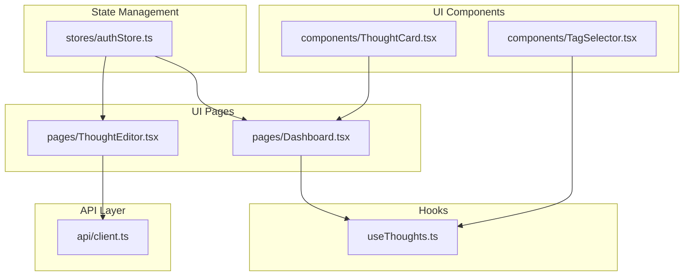
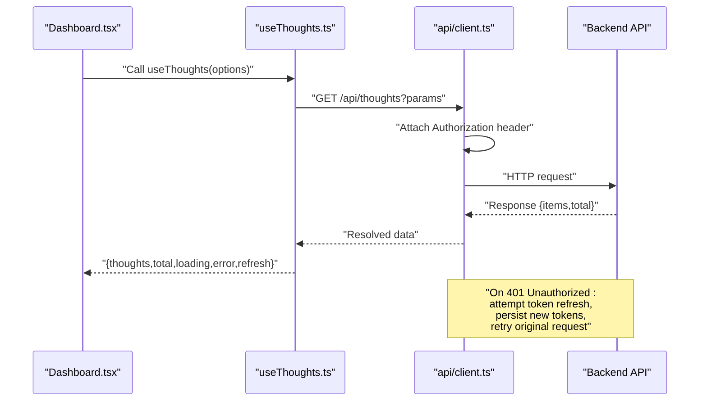
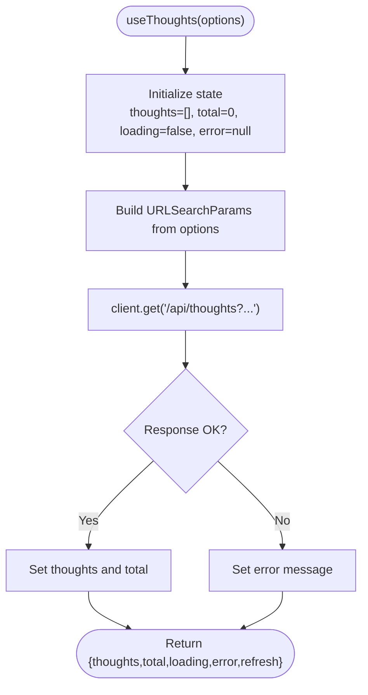
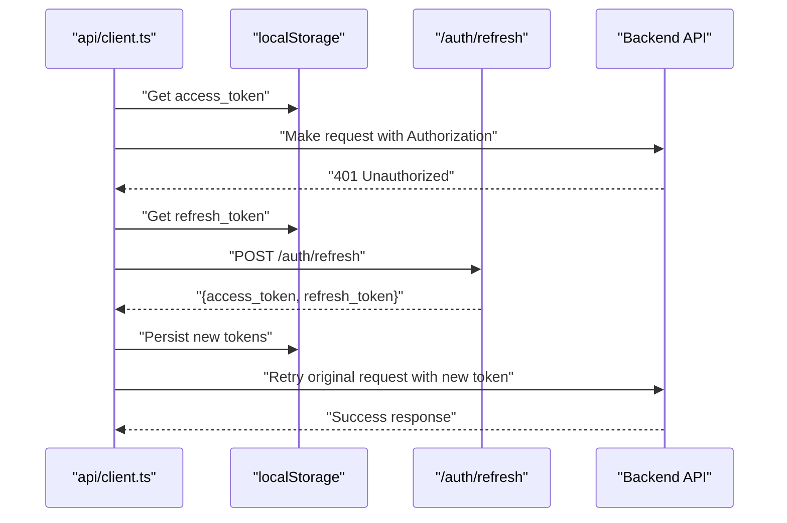
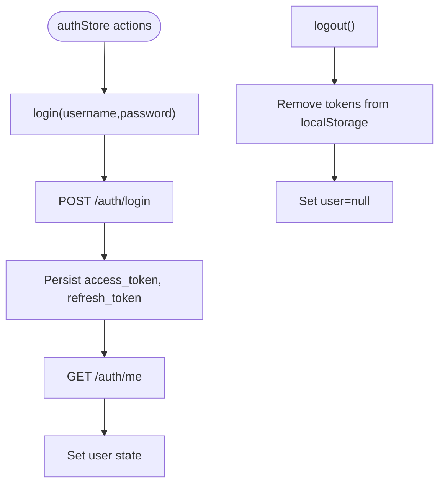
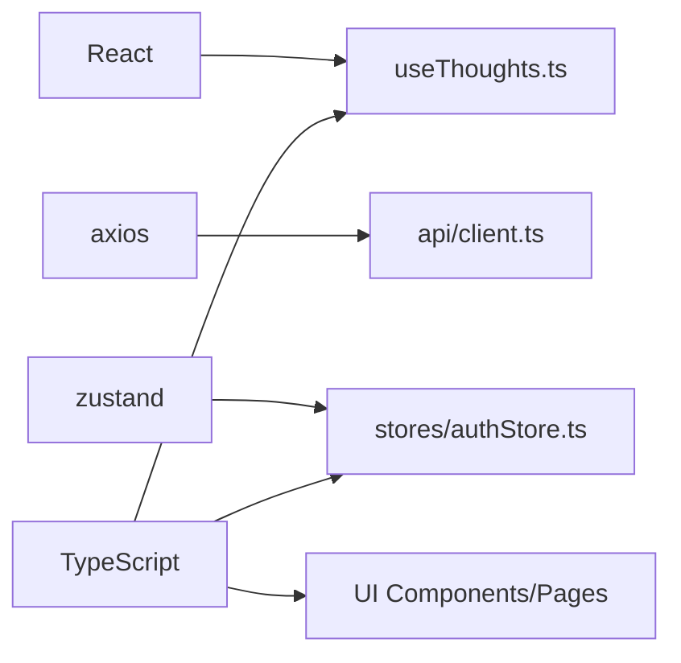

# Hooks and Utilities

<cite>
**Referenced Files in This Document**
- [useThoughts.ts](file://frontend/src/hooks/useThoughts.ts)
- [client.ts](file://frontend/src/api/client.ts)
- [authStore.ts](file://frontend/src/stores/authStore.ts)
- [Dashboard.tsx](file://frontend/src/pages/Dashboard.tsx)
- [ThoughtCard.tsx](file://frontend/src/components/ThoughtCard.tsx)
- [TagSelector.tsx](file://frontend/src/components/TagSelector.tsx)
- [ThoughtEditor.tsx](file://frontend/src/pages/ThoughtEditor.tsx)
- [package.json](file://frontend/package.json)
- [tsconfig.json](file://frontend/tsconfig.json)
</cite>

## Table of Contents
1. [Introduction](#introduction)
2. [Project Structure](#project-structure)
3. [Core Components](#core-components)
4. [Architecture Overview](#architecture-overview)
5. [Detailed Component Analysis](#detailed-component-analysis)
6. [Dependency Analysis](#dependency-analysis)
7. [Performance Considerations](#performance-considerations)
8. [Troubleshooting Guide](#troubleshooting-guide)
9. [Conclusion](#conclusion)
10. [Appendices](#appendices)

## Introduction
This document focuses on the custom hooks and utility functions used in the frontend application, with emphasis on:
- The useThoughts hook for fetching and managing thoughts data
- The API client configuration and request/response handling
- Authentication state management via a Zustand store
- UI components that integrate these hooks and utilities
- TypeScript integration, prop validation, and testing approaches
- Best practices for hook usage, performance optimizations, and common pitfalls

## Project Structure
The relevant parts of the frontend are organized around:
- Hooks for data fetching and state management
- An Axios-based API client with interceptors
- A Zustand store for authentication state
- UI pages and components that consume these hooks and utilities

**Diagram sources**
- [useThoughts.ts:1-95](file://frontend/src/hooks/useThoughts.ts#L1-L95)
- [client.ts:1-63](file://frontend/src/api/client.ts#L1-L63)
- [authStore.ts:1-101](file://frontend/src/stores/authStore.ts#L1-L101)
- [Dashboard.tsx:1-166](file://frontend/src/pages/Dashboard.tsx#L1-L166)
- [ThoughtEditor.tsx:1-221](file://frontend/src/pages/ThoughtEditor.tsx#L1-L221)
- [ThoughtCard.tsx:1-75](file://frontend/src/components/ThoughtCard.tsx#L1-L75)
- [TagSelector.tsx:1-58](file://frontend/src/components/TagSelector.tsx#L1-L58)

**Section sources**
- [useThoughts.ts:1-95](file://frontend/src/hooks/useThoughts.ts#L1-L95)
- [client.ts:1-63](file://frontend/src/api/client.ts#L1-L63)
- [authStore.ts:1-101](file://frontend/src/stores/authStore.ts#L1-L101)
- [Dashboard.tsx:1-166](file://frontend/src/pages/Dashboard.tsx#L1-L166)
- [ThoughtEditor.tsx:1-221](file://frontend/src/pages/ThoughtEditor.tsx#L1-L221)
- [ThoughtCard.tsx:1-75](file://frontend/src/components/ThoughtCard.tsx#L1-L75)
- [TagSelector.tsx:1-58](file://frontend/src/components/TagSelector.tsx#L1-L58)

## Core Components
- useThoughts: A custom hook that encapsulates fetching thoughts with filtering and pagination, and exposes loading, error, and refresh capabilities.
- useTags: A helper hook that fetches tags for selection.
- API client: Axios instance with request/response interceptors for JWT handling and automatic token refresh on 401.
- authStore: A Zustand store for authentication actions and user state.

Key responsibilities:
- Centralized data fetching and state updates for thoughts
- Token management and automatic retry on unauthorized responses
- Authentication lifecycle and user profile retrieval

**Section sources**
- [useThoughts.ts:45-78](file://frontend/src/hooks/useThoughts.ts#L45-L78)
- [useThoughts.ts:80-94](file://frontend/src/hooks/useThoughts.ts#L80-L94)
- [client.ts:14-60](file://frontend/src/api/client.ts#L14-L60)
- [authStore.ts:37-98](file://frontend/src/stores/authStore.ts#L37-L98)

## Architecture Overview
The system follows a layered architecture:
- UI pages and components depend on hooks and stores
- Hooks use the API client for server communication
- The API client manages authentication via interceptors
- The auth store coordinates login, registration, logout, and user retrieval

**Diagram sources**
- [Dashboard.tsx:27-32](file://frontend/src/pages/Dashboard.tsx#L27-L32)
- [useThoughts.ts:51-71](file://frontend/src/hooks/useThoughts.ts#L51-L71)
- [client.ts:29-60](file://frontend/src/api/client.ts#L29-L60)

## Detailed Component Analysis

### useThoughts Hook
Purpose:
- Fetch and manage a paginated list of thoughts with optional filters
- Expose loading, error, total count, and a refresh function

Implementation highlights:
- Uses URLSearchParams to build query parameters from options
- Encapsulates fetch in a memoized callback to avoid unnecessary re-fetches
- Updates state on success and sets error on failure
- Returns a refresh function bound to current options

**Diagram sources**
- [useThoughts.ts:45-78](file://frontend/src/hooks/useThoughts.ts#L45-L78)

Usage in Dashboard:
- The Dashboard composes search, status filter, and pagination controls
- It passes these as options to useThoughts and renders ThoughtCard entries

**Section sources**
- [useThoughts.ts:45-78](file://frontend/src/hooks/useThoughts.ts#L45-L78)
- [Dashboard.tsx:27-32](file://frontend/src/pages/Dashboard.tsx#L27-L32)
- [ThoughtCard.tsx:27-73](file://frontend/src/components/ThoughtCard.tsx#L27-L73)

### useTags Hook
Purpose:
- Fetch tags for selection in editors and filters

Implementation highlights:
- No parameters; fetches all tags on mount
- Returns loading state and tags array augmented with thought counts

Integration:
- Consumed by TagSelector to render selectable tag chips

**Section sources**
- [useThoughts.ts:80-94](file://frontend/src/hooks/useThoughts.ts#L80-L94)
- [TagSelector.tsx:20-57](file://frontend/src/components/TagSelector.tsx#L20-L57)

### API Client (Axios Interceptors)
Responsibilities:
- Base URL configuration and JSON headers
- Request interceptor: attach Authorization header if access token exists
- Response interceptor: handle 401 by attempting token refresh
- Persist refreshed tokens and retry original request
- Redirect to login on refresh failure

**Diagram sources**
- [client.ts:19-60](file://frontend/src/api/client.ts#L19-L60)

**Section sources**
- [client.ts:14-60](file://frontend/src/api/client.ts#L14-L60)

### Authentication Store (Zustand)
Responsibilities:
- Manage user session state and errors
- Provide login, register, logout, and fetchUser actions
- Persist tokens in localStorage during login

**Diagram sources**
- [authStore.ts:42-58](file://frontend/src/stores/authStore.ts#L42-L58)
- [authStore.ts:79-83](file://frontend/src/stores/authStore.ts#L79-L83)
- [authStore.ts:85-95](file://frontend/src/stores/authStore.ts#L85-L95)

**Section sources**
- [authStore.ts:37-98](file://frontend/src/stores/authStore.ts#L37-L98)

### UI Integration Examples
- Dashboard: Demonstrates composing filters and pagination with useThoughts and rendering ThoughtCard entries
- ThoughtEditor: Uses the API client directly for CRUD operations and integrates TagSelector for tag selection
- ThoughtCard: Renders thought previews with status, summary, tags, and category
- TagSelector: Renders selectable tag chips and toggles selections

**Section sources**
- [Dashboard.tsx:20-165](file://frontend/src/pages/Dashboard.tsx#L20-L165)
- [ThoughtEditor.tsx:23-221](file://frontend/src/pages/ThoughtEditor.tsx#L23-L221)
- [ThoughtCard.tsx:27-73](file://frontend/src/components/ThoughtCard.tsx#L27-L73)
- [TagSelector.tsx:20-57](file://frontend/src/components/TagSelector.tsx#L20-L57)

## Dependency Analysis
External dependencies relevant to hooks and utilities:
- React: Custom hooks and effects
- Axios: HTTP client with interceptors
- Zustand: Lightweight state management for auth
- TypeScript: Type safety for props and state

**Diagram sources**
- [package.json:12-21](file://frontend/package.json#L12-L21)
- [useThoughts.ts:11-12](file://frontend/src/hooks/useThoughts.ts#L11-L12)
- [client.ts:12-17](file://frontend/src/api/client.ts#L12-L17)
- [authStore.ts:12-13](file://frontend/src/stores/authStore.ts#L12-L13)

**Section sources**
- [package.json:12-21](file://frontend/package.json#L12-L21)
- [tsconfig.json:1-8](file://frontend/tsconfig.json#L1-L8)

## Performance Considerations
- Memoization: The fetch function in useThoughts is memoized via useCallback with a dependency array built from options, preventing unnecessary re-fetches when options remain unchanged.
- Minimal re-renders: useThoughts returns a single refresh function bound to current options, reducing closure churn.
- Pagination: Dashboard computes total pages and disables pagination buttons appropriately to avoid redundant requests.
- Token refresh: The client retries the original request after refreshing tokens, minimizing UI flicker and extra network calls.
- Loading states: Components render loading spinners and empty states to improve perceived performance and UX.

Best practices:
- Keep option objects stable when possible to avoid triggering refetches
- Use shallow comparisons for option keys to prevent accidental re-renders
- Debounce search inputs if integrating with useThoughts to reduce rapid fetches
- Cache tag lists locally if the tag set is relatively static

**Section sources**
- [useThoughts.ts:51-71](file://frontend/src/hooks/useThoughts.ts#L51-L71)
- [Dashboard.tsx:140-161](file://frontend/src/pages/Dashboard.tsx#L140-L161)
- [client.ts:32-51](file://frontend/src/api/client.ts#L32-L51)

## Troubleshooting Guide
Common issues and resolutions:
- Unauthorized responses (401):
  - The client attempts to refresh tokens automatically; if refresh fails, it clears tokens and redirects to login
  - Ensure refresh tokens are present in localStorage and the backend endpoint is reachable
- Fetch failures:
  - useThoughts sets a human-readable error message derived from the response detail
  - Verify network connectivity and backend health checks
- Empty tag lists:
  - useTags fetches tags on mount; if tags are missing, confirm the backend tags endpoint returns data
- Token persistence:
  - authStore persists tokens on login; if login appears stuck, check localStorage availability and CORS policies

**Section sources**
- [client.ts:29-60](file://frontend/src/api/client.ts#L29-L60)
- [useThoughts.ts:66-70](file://frontend/src/hooks/useThoughts.ts#L66-L70)
- [authStore.ts:42-58](file://frontend/src/stores/authStore.ts#L42-L58)

## Conclusion
The hooks and utilities provide a cohesive pattern for data fetching, state management, and authentication:
- useThoughts centralizes thought retrieval with robust error handling and refresh capabilities
- The API client enforces secure communication with automatic token refresh
- authStore manages authentication lifecycles with minimal boilerplate
- UI components integrate these building blocks to deliver a responsive and reliable experience

## Appendices

### TypeScript Integration and Prop Validation
- Strong typing for Thought and Tag interfaces ensures compile-time safety
- Props in ThoughtCard and TagSelector are typed to enforce correct shapes
- Zustand store defines explicit state and action signatures

Recommendations:
- Add runtime validation for server responses if schema flexibility increases
- Consider using a schema library (e.g., Zod) for request/response validation in the future

**Section sources**
- [useThoughts.ts:14-34](file://frontend/src/hooks/useThoughts.ts#L14-L34)
- [ThoughtCard.tsx:17-19](file://frontend/src/components/ThoughtCard.tsx#L17-L19)
- [TagSelector.tsx:15-18](file://frontend/src/components/TagSelector.tsx#L15-L18)
- [authStore.ts:15-35](file://frontend/src/stores/authStore.ts#L15-L35)

### Testing Approaches
Recommended strategies:
- Mock the API client to isolate hook behavior and simulate success/failure scenarios
- Test useThoughts by asserting state transitions (loading, data, error) under various options
- Snapshot test UI components (Dashboard, ThoughtCard, TagSelector) to guard against regressions
- Unit-test authStore actions by mocking localStorage and server endpoints

[No sources needed since this section provides general guidance]