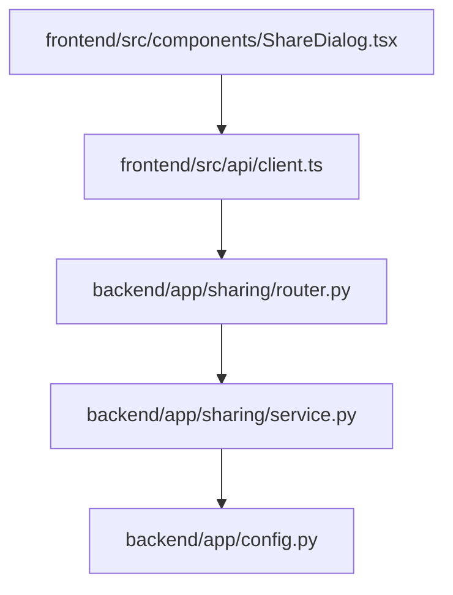
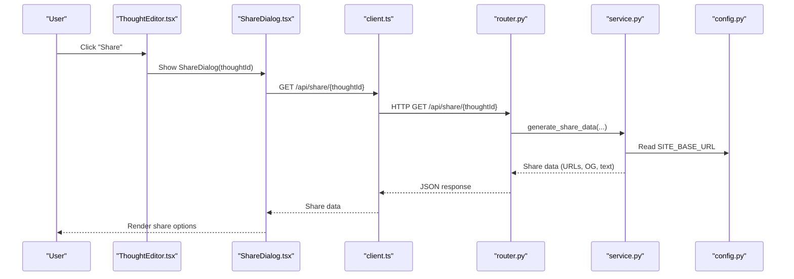
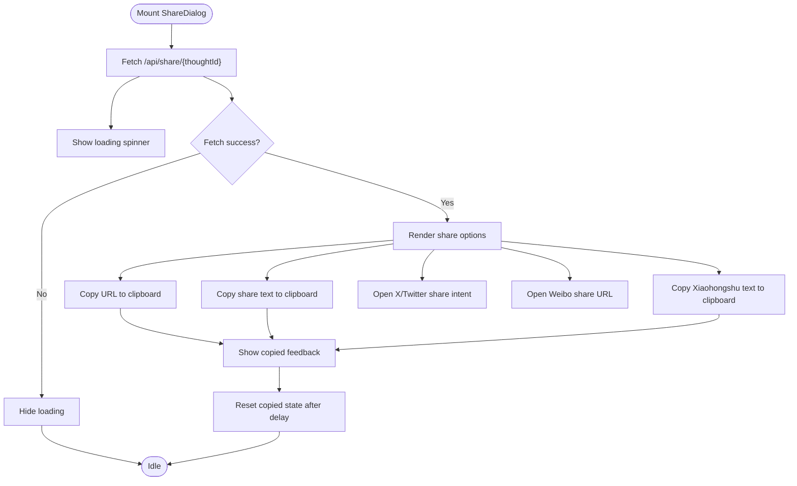
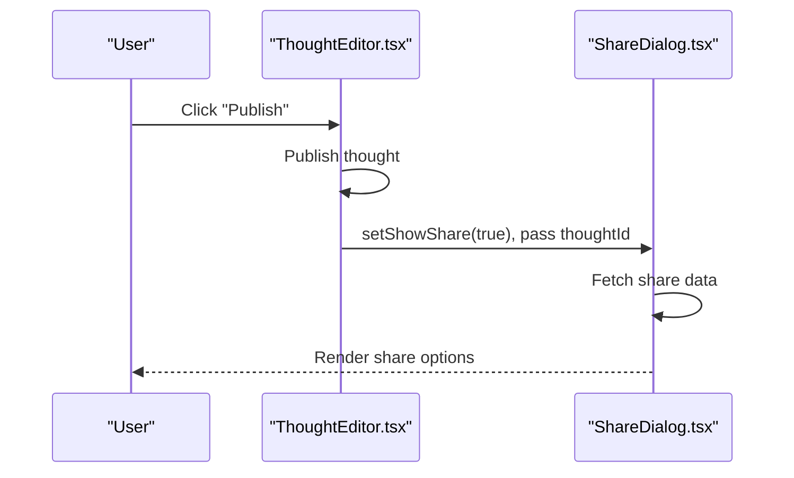
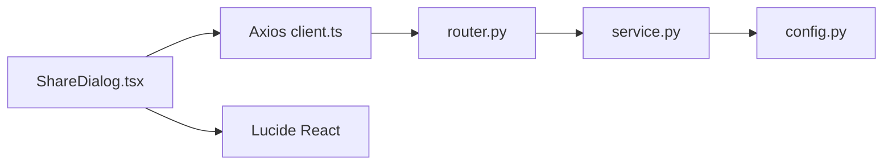

# Share Dialog

<cite>
**Referenced Files in This Document**
- [ShareDialog.tsx](file://frontend/src/components/ShareDialog.tsx)
- [client.ts](file://frontend/src/api/client.ts)
- [router.py](file://backend/app/sharing/router.py)
- [service.py](file://backend/app/sharing/service.py)
- [config.py](file://backend/app/config.py)
- [ThoughtEditor.tsx](file://frontend/src/pages/ThoughtEditor.tsx)
- [test_sharing.py](file://backend/tests/test_sharing.py)
</cite>

## Table of Contents
1. [Introduction](#introduction)
2. [Project Structure](#project-structure)
3. [Core Components](#core-components)
4. [Architecture Overview](#architecture-overview)
5. [Detailed Component Analysis](#detailed-component-analysis)
6. [Dependency Analysis](#dependency-analysis)
7. [Performance Considerations](#performance-considerations)
8. [Troubleshooting Guide](#troubleshooting-guide)
9. [Conclusion](#conclusion)

## Introduction
This document provides comprehensive documentation for the social sharing dialog component. It covers the user interface, platform selection, and sharing workflow. It explains the integration with social media platforms, URL generation, and metadata handling. It details the clipboard functionality, share button implementations, and platform-specific formatting. It also documents the component's state management, modal behavior, and user interaction patterns, along with the sharing API integration, platform-specific configurations, error handling strategies, user experience design, accessibility considerations, responsive behavior, and troubleshooting guidance.

## Project Structure
The sharing dialog spans both frontend and backend components:
- Frontend: React component that renders the modal and handles user interactions.
- Backend: FastAPI router and service that generate platform-specific share URLs and metadata.



**Diagram sources**
- [ShareDialog.tsx:1-145](file://frontend/src/components/ShareDialog.tsx#L1-145)
- [client.ts:1-63](file://frontend/src/api/client.ts#L1-63)
- [router.py:1-46](file://backend/app/sharing/router.py#L1-46)
- [service.py:1-103](file://backend/app/sharing/service.py#L1-103)
- [config.py:1-62](file://backend/app/config.py#L1-62)

**Section sources**
- [ShareDialog.tsx:1-145](file://frontend/src/components/ShareDialog.tsx#L1-145)
- [client.ts:1-63](file://frontend/src/api/client.ts#L1-63)
- [router.py:1-46](file://backend/app/sharing/router.py#L1-46)
- [service.py:1-103](file://backend/app/sharing/service.py#L1-103)
- [config.py:1-62](file://backend/app/config.py#L1-62)

## Core Components
- ShareDialog (frontend): A modal dialog that displays shareable URLs and text, and provides copy-to-clipboard actions.
- Sharing API (backend): An endpoint that generates platform-specific share URLs and metadata for a given thought.

Key responsibilities:
- Frontend: Render UI, manage loading and copied states, integrate with clipboard API, and trigger navigation to platform share intents.
- Backend: Build public post URLs, assemble Open Graph metadata, and construct platform-specific share URLs/text.

**Section sources**
- [ShareDialog.tsx:32-144](file://frontend/src/components/ShareDialog.tsx#L32-144)
- [router.py:25-45](file://backend/app/sharing/router.py#L25-45)
- [service.py:25-73](file://backend/app/sharing/service.py#L25-73)

## Architecture Overview
The sharing workflow involves the frontend requesting share data from the backend, which computes platform-specific URLs and metadata, and returns them to the frontend for rendering.



**Diagram sources**
- [ThoughtEditor.tsx:213-216](file://frontend/src/pages/ThoughtEditor.tsx#L213-216)
- [ShareDialog.tsx:37-43](file://frontend/src/components/ShareDialog.tsx#L37-43)
- [client.ts:14-17](file://frontend/src/api/client.ts#L14-L17)
- [router.py:25-45](file://backend/app/sharing/router.py#L25-45)
- [service.py:25-73](file://backend/app/sharing/service.py#L25-73)
- [config.py:52-54](file://backend/app/config.py#L52-54)

## Detailed Component Analysis

### ShareDialog Component (Frontend)
Responsibilities:
- Fetch share data for a thought via the API.
- Display a modal with:
  - Public URL field and copy-to-clipboard action.
  - Platform buttons for X/Twitter and Weibo that open share intents in new tabs.
  - Xiaohongshu share text area with copy-to-clipboard action.
  - Button to copy the entire formatted share text.
- Manage loading state while fetching data.
- Track whether a copy operation was successful.

State management:
- data: ShareData object containing URL, platform URLs, and share text.
- loading: Boolean indicating network activity.
- copied: Boolean toggled when copy feedback is shown.

User interactions:
- Close button dismisses the modal.
- Copy buttons trigger navigator.clipboard.writeText and show temporary feedback.
- Platform links open in new tabs with safe attributes.

Platform-specific behavior:
- X/Twitter: Uses a web intent URL constructed by the backend.
- Weibo: Uses a web share URL constructed by the backend.
- Xiaohongshu: No web intent; returns preformatted text for manual paste.

Accessibility and UX:
- Clear labels for each section.
- Disabled input fields for URLs and text areas to prevent accidental edits.
- Hover and focus states for interactive elements.
- Responsive layout with Tailwind classes.

Clipboard integration:
- Uses Clipboard API for copying text.
- Provides immediate visual feedback when a copy succeeds.



**Diagram sources**
- [ShareDialog.tsx:32-144](file://frontend/src/components/ShareDialog.tsx#L32-144)

**Section sources**
- [ShareDialog.tsx:32-144](file://frontend/src/components/ShareDialog.tsx#L32-144)

### Sharing API (Backend)
Responsibilities:
- Validate and load the thought by ID.
- Compute:
  - Public post URL using SITE_BASE_URL and slug.
  - Open Graph metadata (OG tags).
  - Platform-specific share URLs for X/Twitter and Weibo.
  - Preformatted share text for clipboard.
- Return structured JSON to the frontend.

Data structure returned:
- url: Public URL of the thought.
- og: Dictionary of Open Graph metadata.
- platforms: Dictionary with keys x, weibo, xiaohongshu and their respective URLs/text.
- share_text: Preformatted text for clipboard.

Platform-specific formatting:
- X/Twitter: Intent URL with text and URL parameters; optional hashtags.
- Weibo: Web share URL with URL and title parameters.
- Xiaohongshu: Preformatted text for manual paste.

Configuration:
- SITE_BASE_URL determines the base URL for public post links.

```mermaid
classDiagram
class Router {
+GET /api/share/{thought_id}
}
class Service {
+generate_share_data(title, slug, summary, tags) dict
-_post_url(slug) str
-_twitter_share_url(url, text, tags) str
-_weibo_share_url(url, title) str
-_xiaohongshu_share_text(title, description, tags, url) str
}
class Config {
+SITE_BASE_URL : str
+APP_NAME : str
}
Router --> Service : "calls"
Service --> Config : "reads"
```

**Diagram sources**
- [router.py:25-45](file://backend/app/sharing/router.py#L25-45)
- [service.py:25-103](file://backend/app/sharing/service.py#L25-103)
- [config.py:52-54](file://backend/app/config.py#L52-54)

**Section sources**
- [router.py:25-45](file://backend/app/sharing/router.py#L25-45)
- [service.py:25-103](file://backend/app/sharing/service.py#L25-103)
- [config.py:52-54](file://backend/app/config.py#L52-54)

### Integration with ThoughtEditor
The ShareDialog is integrated into the ThoughtEditor page:
- After publishing a thought, the editor sets a flag to show the ShareDialog.
- The dialog receives the thought ID and a close handler.



**Diagram sources**
- [ThoughtEditor.tsx:81-89](file://frontend/src/pages/ThoughtEditor.tsx#L81-89)
- [ThoughtEditor.tsx:213-216](file://frontend/src/pages/ThoughtEditor.tsx#L213-216)
- [ShareDialog.tsx:37-43](file://frontend/src/components/ShareDialog.tsx#L37-43)

**Section sources**
- [ThoughtEditor.tsx:81-89](file://frontend/src/pages/ThoughtEditor.tsx#L81-89)
- [ThoughtEditor.tsx:213-216](file://frontend/src/pages/ThoughtEditor.tsx#L213-216)

## Dependency Analysis
- Frontend depends on:
  - Axios client for HTTP requests.
  - Lucide icons for UI elements.
  - React for state and lifecycle.
- Backend depends on:
  - FastAPI for routing.
  - SQLAlchemy for ORM operations.
  - Pydantic settings for configuration.
  - urllib.parse for URL encoding.



**Diagram sources**
- [ShareDialog.tsx:14-15](file://frontend/src/components/ShareDialog.tsx#L14-15)
- [client.ts:14-17](file://frontend/src/api/client.ts#L14-L17)
- [router.py:19-20](file://backend/app/sharing/router.py#L19-L20)
- [service.py](file://backend/app/sharing/service.py#L16)
- [config.py](file://backend/app/config.py#L61)

**Section sources**
- [ShareDialog.tsx:14-15](file://frontend/src/components/ShareDialog.tsx#L14-15)
- [client.ts:14-17](file://frontend/src/api/client.ts#L14-L17)
- [router.py:19-20](file://backend/app/sharing/router.py#L19-L20)
- [service.py](file://backend/app/sharing/service.py#L16)
- [config.py](file://backend/app/config.py#L61)

## Performance Considerations
- Network latency: The dialog shows a loading spinner while fetching share data. Consider adding a timeout or retry mechanism if needed.
- Clipboard operations: Copy actions are instantaneous; ensure they do not block the UI thread.
- Rendering: The dialog uses Tailwind utilities; keep styles minimal to avoid layout thrashing.
- Backend computation: URL construction and text formatting are lightweight; caching may not be necessary unless share data is frequently accessed.

## Troubleshooting Guide
Common issues and resolutions:
- Empty or missing share data:
  - Verify the thought exists and is published.
  - Ensure the backend route returns the expected fields.
- Platform links not opening:
  - Confirm the generated URLs are valid and accessible.
  - Check browser popup blockers.
- Xiaohongshu copy text not pasting:
  - The backend returns preformatted text; ensure users paste into the intended app.
- Clipboard errors:
  - Some browsers restrict clipboard access in insecure contexts; ensure HTTPS is used.
  - On mobile devices, clipboard permissions may require user gesture.
- Authentication failures:
  - The Axios client attaches JWT tokens; ensure tokens are present and valid.
  - If refresh fails, the client redirects to login; verify refresh token availability.

Validation and tests:
- Backend tests confirm the presence of required fields and platform URLs.

**Section sources**
- [test_sharing.py:14-47](file://backend/tests/test_sharing.py#L14-47)
- [client.ts:29-60](file://frontend/src/api/client.ts#L29-60)

## Conclusion
The social sharing dialog integrates seamlessly with the ThoughtEditor, providing users with quick access to share their thoughts across X/Twitter, Weibo, and Xiaohongshu. The backend generates platform-specific URLs and metadata, while the frontend delivers a clean, accessible, and responsive UI with robust clipboard support. The component’s design balances simplicity with flexibility, enabling straightforward sharing workflows and clear fallbacks for platforms without web intents.