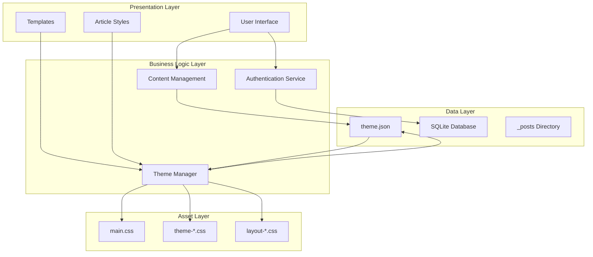
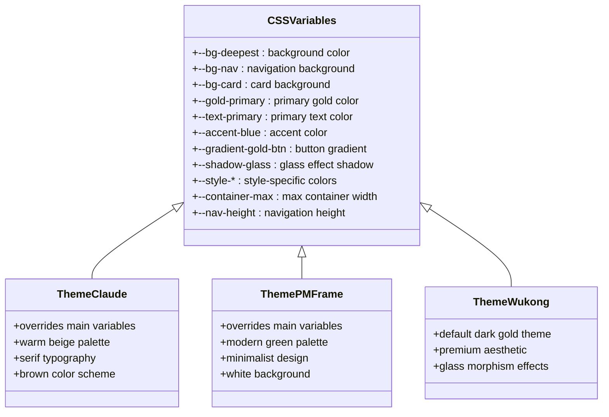
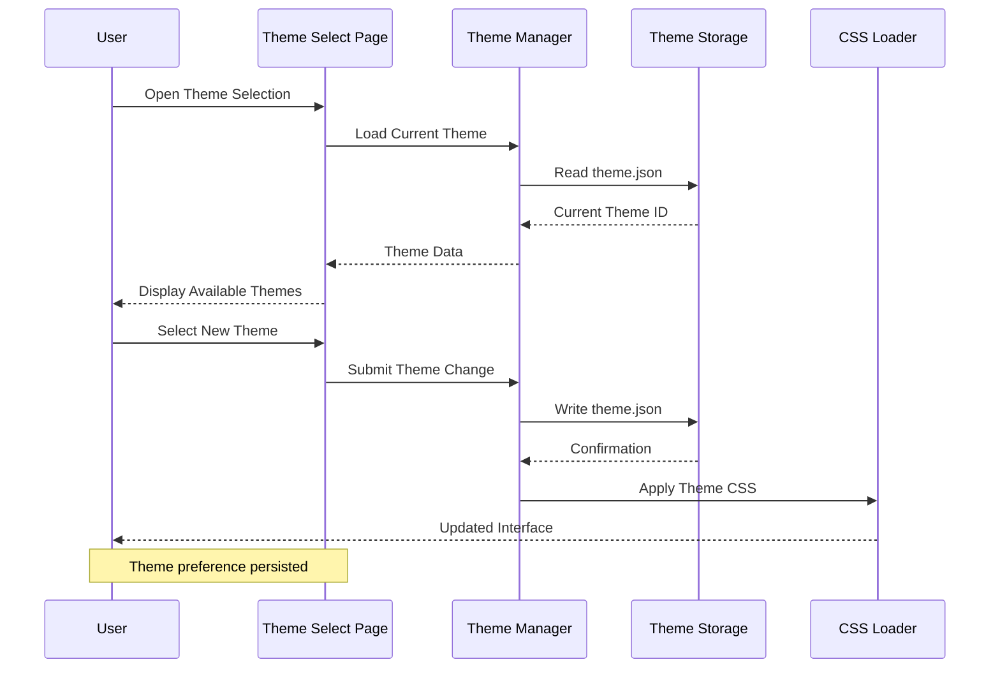
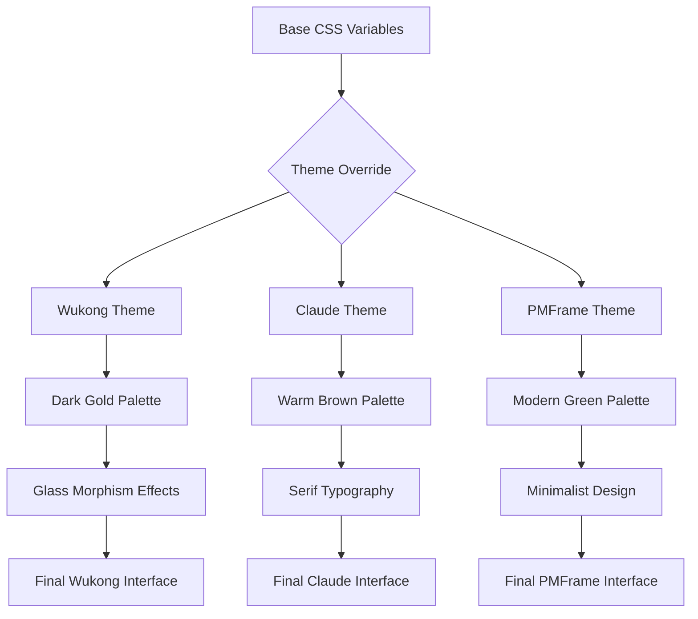
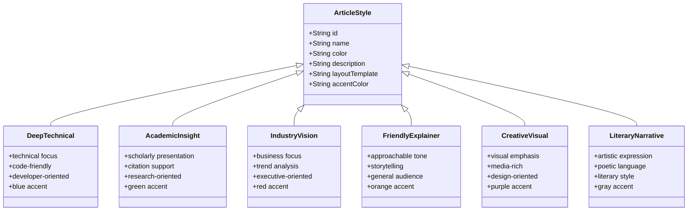
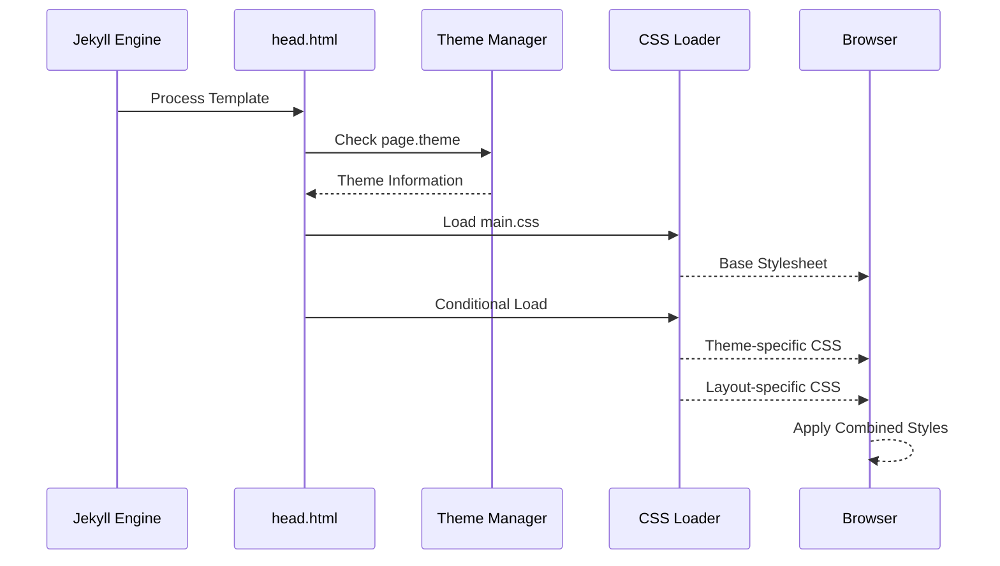
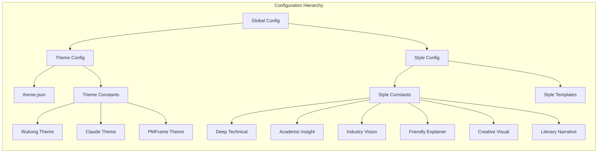

# Theme Management System

<cite>
**Referenced Files in This Document**
- [_config.yml](_config.yml)
- [theme.json](data/theme.json)
- [app/__init__.py](app/__init__.py)
- [assets/css/main.css](assets/css/main.css)
- [assets/css/theme-claude.css](assets/css/theme-claude.css)
- [assets/css/theme-pmframe.css](assets/css/theme-pmframe.css)
- [app/templates/theme_select.html](app/templates/theme_select.html)
- [app/templates/style_select.html](app/templates/style_select.html)
- [app/uploader.py](app/uploader.py)
- [app/auth.py](app/auth.py)
- [_includes/head.html](_includes/head.html)
- [_layouts/deep-technical.html](_layouts/deep-technical.html)
- [_layouts/academic-insight.html](_layouts/academic-insight.html)
- [_layouts/industry-vision.html](_layouts/industry-vision.html)
- [_layouts/friendly-explainer.html](_layouts/friendly-explainer.html)
- [_layouts/creative-visual.html](_layouts/creative-visual.html)
- [_layouts/literary-narrative.html](_layouts/literary-narrative.html)
</cite>

## Table of Contents
1. [Introduction](#introduction)
2. [System Architecture](#system-architecture)
3. [Theme System Components](#theme-system-components)
4. [CSS Theme Architecture](#css-theme-architecture)
5. [UI Theme Management](#ui-theme-management)
6. [Article Style System](#article-style-system)
7. [Integration Points](#integration-points)
8. [Configuration Management](#configuration-management)
9. [Deployment and Assets](#deployment-and-assets)
10. [Troubleshooting Guide](#troubleshooting-guide)
11. [Conclusion](#conclusion)

## Introduction

The Theme Management System is a comprehensive theming solution built for the PolaZhenJing blog platform. This system manages two distinct but interconnected theming mechanisms: **UI Theme Management** for the administrative interface and **Article Style System** for content presentation. The system supports three UI themes (Wukong, Claude, PMFrame) and six article styles (Deep Technical, Academic Insight, Industry Vision, Friendly Explainer, Creative Visual, Literary Narrative), providing a flexible and professional blogging experience.

The system is designed with modularity in mind, separating concerns between user interface theming, content styling, and dynamic asset loading. It leverages modern web technologies including CSS custom properties, Jekyll templating, and Flask-based backend services to deliver a seamless theming experience.

## System Architecture

The Theme Management System follows a layered architecture pattern with clear separation between presentation, business logic, and data persistence layers.



**Diagram sources**
- [app/uploader.py](app/uploader.py#L23-L78)
- [app/auth.py](app/auth.py#L13-L24)
- [app/__init__.py](app/__init__.py#L44-L76)

The architecture consists of four main layers:

1. **Presentation Layer**: Handles user interface rendering and template management
2. **Business Logic Layer**: Manages authentication, content creation, and theme switching
3. **Data Layer**: Stores theme preferences, user credentials, and published articles
4. **Asset Layer**: Provides CSS themes and layout stylesheets

## Theme System Components

### CSS Custom Properties System

The foundation of the theming system is built upon CSS custom properties (variables) that define the complete visual palette for each theme. The main CSS file establishes a comprehensive variable system covering backgrounds, typography, colors, shadows, and layout properties.



**Diagram sources**
- [assets/css/main.css](assets/css/main.css#L7-L64)
- [assets/css/theme-claude.css](assets/css/theme-claude.css#L4-L40)
- [assets/css/theme-pmframe.css](assets/css/theme-pmframe.css#L4-L40)

### Theme Selection Interface

The UI theme selection interface provides an intuitive way for administrators to switch between available themes. The system maintains theme preferences in persistent storage and applies changes dynamically across the interface.



**Diagram sources**
- [app/templates/theme_select.html](app/templates/theme_select.html#L11-L30)
- [app/uploader.py](app/uploader.py#L56-L77)
- [data/theme.json](data/theme.json#L1-L1)

**Section sources**
- [assets/css/main.css](assets/css/main.css#L1-L522)
- [assets/css/theme-claude.css](assets/css/theme-claude.css#L1-L68)
- [assets/css/theme-pmframe.css](assets/css/theme-pmframe.css#L1-L66)

## CSS Theme Architecture

### Base Theme Variables

The main CSS file establishes a comprehensive set of custom properties that form the foundation for all themes. These variables define the complete visual language including color palettes, typography scales, spacing systems, and interactive states.

The variable system is organized into logical categories:

- **Background Layers**: Multi-tiered background system supporting glass morphism effects
- **Gold Palette**: Primary color scheme with multiple variations for different UI elements
- **Text Hierarchy**: Clear typographic scale from primary to disabled states
- **Gradients**: Consistent gradient definitions for buttons and decorative elements
- **Shadows**: Sophisticated shadow systems for depth and dimensionality
- **Layout Properties**: Container widths, navigation heights, and corner radii

### Theme-Specific Overrides

Each theme provides targeted overrides that modify the base variables while maintaining design consistency. The Claude theme introduces warm brown tones with serif typography, while the PMFrame theme adopts a minimalist green palette with clean white backgrounds.



**Diagram sources**
- [assets/css/main.css](assets/css/main.css#L7-L64)
- [assets/css/theme-claude.css](assets/css/theme-claude.css#L4-L40)
- [assets/css/theme-pmframe.css](assets/css/theme-pmframe.css#L4-L40)

**Section sources**
- [assets/css/main.css](assets/css/main.css#L6-L64)
- [assets/css/theme-claude.css](assets/css/theme-claude.css#L1-L68)
- [assets/css/theme-pmframe.css](assets/css/theme-pmframe.css#L1-L66)

## UI Theme Management

### Theme Persistence and Loading

The UI theme system uses JSON-based persistence to maintain user preferences across sessions. The theme selection process involves reading from persistent storage, validating against available themes, and applying the appropriate CSS overrides.

```mermaid
stateDiagram-v2
[*] --> ThemeCheck
ThemeCheck --> ThemeExists{Theme Exists?}
ThemeExists --> |Yes| LoadTheme : Load from theme.json
ThemeExists --> |No| DefaultTheme : Use 'wukong'
LoadTheme --> ApplyOverrides : Apply CSS Overrides
DefaultTheme --> ApplyOverrides
ApplyOverrides --> ThemeActive : Theme Active
ThemeActive --> ThemeChange : User Changes Theme
ThemeChange --> ValidateTheme{Valid Theme?}
ValidateTheme --> |Yes| PersistTheme : Save to theme.json
ValidateTheme --> |No| ErrorState : Show Error
PersistTheme --> ThemeActive
ErrorState --> ThemeActive
```

**Diagram sources**
- [app/uploader.py](app/uploader.py#L56-L77)
- [data/theme.json](data/theme.json#L1-L1)

### Theme Application Process

The theme application process follows a systematic approach to ensure consistent visual updates across the interface:

1. **Theme Detection**: Read current theme from theme.json file
2. **Validation**: Verify theme exists in available theme list
3. **CSS Loading**: Dynamically load appropriate theme stylesheet
4. **Variable Override**: Apply theme-specific CSS custom property overrides
5. **Interface Update**: Refresh UI components with new styling

**Section sources**
- [app/uploader.py](app/uploader.py#L56-L77)
- [app/templates/theme_select.html](app/templates/theme_select.html#L1-L42)
- [data/theme.json](data/theme.json#L1-L1)

## Article Style System

### Style Categories and Definitions

The article style system provides six distinct presentation modes, each optimized for different content types and reader experiences. Each style defines specific visual characteristics, layout patterns, and semantic markup.



**Diagram sources**
- [app/uploader.py](app/uploader.py#L25-L47)
- [app/uploader.py](app/uploader.py#L80-L87)

### Style Implementation Details

Each article style is implemented through dedicated Jekyll layouts that provide specific HTML structures and CSS classes. The system automatically applies appropriate styling based on the selected style during content generation.

**Section sources**
- [app/uploader.py](app/uploader.py#L25-L47)
- [app/uploader.py](app/uploader.py#L80-L87)
- [_layouts/deep-technical.html](_layouts/deep-technical.html#L1-L22)
- [_layouts/academic-insight.html](_layouts/academic-insight.html#L1-L28)
- [_layouts/industry-vision.html](_layouts/industry-vision.html#L1-L20)
- [_layouts/friendly-explainer.html](_layouts/friendly-explainer.html#L1-L26)
- [_layouts/creative-visual.html](_layouts/creative-visual.html#L1-L20)
- [_layouts/literary-narrative.html](_layouts/literary-narrative.html#L1-L22)

## Integration Points

### Asset Loading Strategy

The theme system employs a sophisticated asset loading strategy that ensures optimal performance and flexibility. The system dynamically loads CSS files based on runtime conditions, minimizing unnecessary resource consumption.



**Diagram sources**
- [_includes/head.html](_includes/head.html#L12-L23)

### Dynamic Theme Switching

The system supports real-time theme switching through JavaScript-based client-side interactions. Users can preview theme changes before committing to permanent modifications.

**Section sources**
- [_includes/head.html](_includes/head.html#L1-L28)
- [app/templates/theme_select.html](app/templates/theme_select.html#L33-L41)

## Configuration Management

### Theme Configuration Structure

The theme management system uses a hierarchical configuration approach that separates UI themes from article styles while maintaining cohesive visual consistency.



**Diagram sources**
- [app/uploader.py](app/uploader.py#L40-L47)
- [app/uploader.py](app/uploader.py#L25-L38)

### Environment Integration

The system integrates seamlessly with the broader Jekyll ecosystem, leveraging existing configuration patterns and deployment workflows. Theme preferences are respected across both development and production environments.

**Section sources**
- [app/uploader.py](app/uploader.py#L40-L47)
- [_config.yml](_config.yml#L1-L50)

## Deployment and Assets

### Static Asset Organization

The theme system organizes static assets in a structured manner that supports efficient loading and maintenance. CSS files are separated by theme and style to enable granular control over asset delivery.

### Production Considerations

The system is designed with production deployment in mind, ensuring that theme switching occurs smoothly without disrupting user experience or causing performance degradation.

## Troubleshooting Guide

### Common Theme Issues

**Theme Not Applying**: Verify that theme.json exists and contains valid theme identifiers. Check browser developer tools for CSS loading errors.

**Style Conflicts**: Review CSS specificity conflicts between base styles and theme overrides. Ensure proper cascade ordering.

**Performance Issues**: Monitor asset loading times and consider implementing CSS bundling for production deployments.

### Debugging Steps

1. **Verify Theme Persistence**: Check theme.json file contents and permissions
2. **Inspect CSS Loading**: Use browser dev tools to confirm proper stylesheet loading
3. **Test Theme Switching**: Validate the complete theme application lifecycle
4. **Check Layout Compatibility**: Ensure article layouts work correctly with selected themes

**Section sources**
- [app/uploader.py](app/uploader.py#L56-L77)
- [app/templates/theme_select.html](app/templates/theme_select.html#L1-L42)

## Conclusion

The Theme Management System represents a sophisticated approach to content presentation and user interface customization. By separating concerns between UI theming and article styling while maintaining cohesive visual consistency, the system provides both flexibility and reliability.

Key strengths of the system include:

- **Modular Architecture**: Clear separation between theme types enables easy maintenance and extension
- **Persistent Preferences**: User theme choices are reliably maintained across sessions
- **Dynamic Loading**: Efficient asset loading minimizes performance impact
- **Flexible Integration**: Seamless compatibility with Jekyll and Flask ecosystems
- **Scalable Design**: Foundation supports future theme additions and enhancements

The system successfully balances developer productivity with user experience, providing an intuitive theming interface while maintaining technical excellence in implementation. This foundation enables continued evolution of the PolaZhenJing platform while preserving the quality and consistency that define the brand identity.