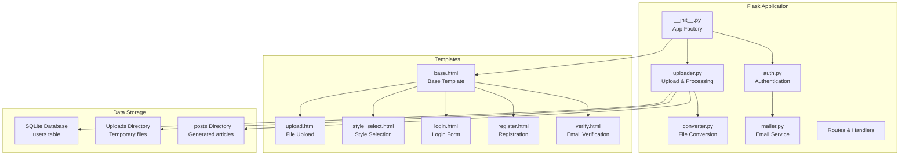
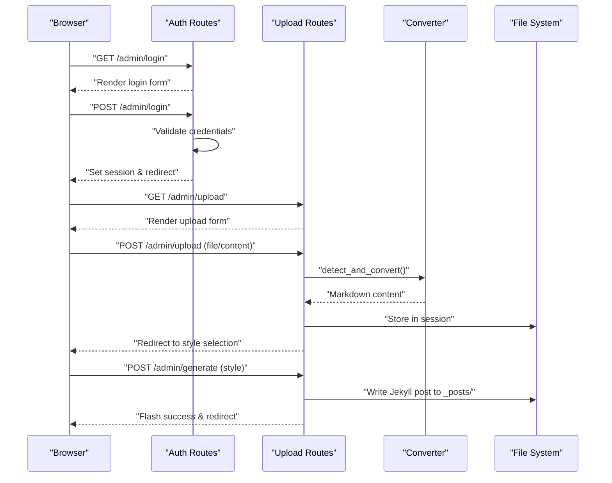

# Thought Management

<cite>
**Referenced Files in This Document**
- [__init__.py](file://app/__init__.py)
- [uploader.py](file://app/uploader.py)
- [converter.py](file://app/converter.py)
- [auth.py](file://app/auth.py)
- [mailer.py](file://app/mailer.py)
- [base.html](file://app/templates/base.html)
- [upload.html](file://app/templates/upload.html)
- [style_select.html](file://app/templates/style_select.html)
- [login.html](file://app/templates/login.html)
- [register.html](file://app/templates/register.html)
- [verify.html](file://app/templates/verify.html)
</cite>

## Update Summary
**Changes Made**
- Complete replacement of thought management system with Flask-based file upload and conversion pipeline
- Replaced REST API endpoints with file-based content processing workflow
- Integrated authentication system with email verification
- Added comprehensive file conversion capabilities (PDF, DOCX, HTML to Markdown)
- Implemented Jekyll-style article generation with multiple layout styles
- Removed all previous React frontend components and hooks
- Replaced with server-side rendered Flask application

## Table of Contents
1. [Introduction](#introduction)
2. [Project Structure](#project-structure)
3. [Core Components](#core-components)
4. [Architecture Overview](#architecture-overview)
5. [Detailed Component Analysis](#detailed-component-analysis)
6. [Authentication System](#authentication-system)
7. [File Upload and Conversion Pipeline](#file-upload-and-conversion-pipeline)
8. [Article Generation and Publishing](#article-generation-and-publishing)
9. [Template System](#template-system)
10. [Performance Considerations](#performance-considerations)
11. [Troubleshooting Guide](#troubleshooting-guide)
12. [Conclusion](#conclusion)

## Introduction
This document describes the thought management system built on Flask, featuring a comprehensive file upload and conversion pipeline. The system processes various document formats (PDF, DOCX, HTML, Markdown) and generates Jekyll-compatible articles with multiple styling options. Users can authenticate via email verification, upload content through drag-and-drop or paste interface, select from five distinct writing styles, and publish articles directly to GitHub Pages.

**Updated** Complete architectural shift from React frontend with REST API to Flask-based server-side rendering with file processing pipeline.

## Project Structure
The system is built around a Flask application with the following structure:
- Flask application with Blueprints for authentication and upload management
- File conversion utilities for multiple document formats
- Template-based frontend with responsive design
- SQLite database for user management
- Static file serving for uploaded content

**Diagram sources**
- [__init__.py:43-61](file://app/__init__.py#L43-L61)
- [auth.py:13](file://app/auth.py#L13)
- [uploader.py:14](file://app/uploader.py#L14)
- [converter.py:1](file://app/converter.py#L1)
- [mailer.py:8](file://app/mailer.py#L8)

**Section sources**
- [__init__.py:1-62](file://app/__init__.py#L1-L62)
- [uploader.py:1-210](file://app/uploader.py#L1-L210)
- [auth.py:1-168](file://app/auth.py#L1-L168)
- [converter.py:1-88](file://app/converter.py#L1-L88)
- [mailer.py:1-53](file://app/mailer.py#L1-L53)

## Core Components
- **Flask Application Factory**: Creates and configures the Flask app with database initialization and blueprint registration
- **Authentication Blueprint**: Handles user registration, login, password changes, and email verification
- **Uploader Blueprint**: Manages file uploads, content conversion, style selection, and article generation
- **File Converter**: Processes PDF, DOCX, HTML, and text files into Markdown format
- **Template System**: Server-side rendered HTML templates with responsive design
- **Database Layer**: SQLite-based user management with session-based authentication
- **Email Service**: QQ Email SMTP integration for verification codes

**Updated** Complete replacement of React components with Flask Blueprints and server-side templates.

**Section sources**
- [__init__.py:43-61](file://app/__init__.py#L43-L61)
- [auth.py:13-168](file://app/auth.py#L13-L168)
- [uploader.py:14-210](file://app/uploader.py#L14-L210)
- [converter.py:1-88](file://app/converter.py#L1-L88)

## Architecture Overview
The system follows a traditional web application architecture with server-side rendering. Users interact through browser forms that submit to Flask routes, which process files, generate content, and render templates. The authentication system uses session-based cookies, while the file processing pipeline handles conversions and article generation.

**Diagram sources**
- [auth.py:26-48](file://app/auth.py#L26-L48)
- [uploader.py:76-118](file://app/uploader.py#L76-L118)
- [uploader.py:130-169](file://app/uploader.py#L130-L169)
- [converter.py:58-82](file://app/converter.py#L58-L82)

## Detailed Component Analysis

### Flask Application Factory
The application factory pattern creates a configured Flask instance with proper database setup, secret key configuration, and blueprint registration. It initializes the SQLite database with user tables and sets up teardown handlers for database connections.

**Section sources**
- [__init__.py:9-24](file://app/__init__.py#L9-L24)
- [__init__.py:26-41](file://app/__init__.py#L26-L41)
- [__init__.py:43-61](file://app/__init__.py#L43-L61)

### Authentication System
The authentication blueprint provides comprehensive user management including registration with QQ email validation, login/logout functionality, password changes, and email verification via SMTP.

#### Registration Flow
Users register with username, QQ email, and password. The system generates a 6-digit verification code stored in session with timestamp validation, then sends via QQ Email SMTP. Successful verification updates user records with email verification status.

#### Login and Session Management
Authenticated users gain access to upload functionality. The login_required decorator protects all administrative routes. Session-based authentication stores user_id and username for route protection.

**Section sources**
- [auth.py:51-96](file://app/auth.py#L51-L96)
- [auth.py:99-133](file://app/auth.py#L99-L133)
- [auth.py:26-48](file://app/auth.py#L26-L48)
- [auth.py:16-23](file://app/auth.py#L16-L23)

### File Upload and Conversion Pipeline
The uploader blueprint implements a sophisticated file processing pipeline supporting multiple input methods and formats.

#### Supported Input Methods
- **File Upload**: Drag-and-drop or file browser selection with 16MB size limit
- **Content Paste**: Direct Markdown content entry with automatic title extraction
- **Format Support**: PDF, DOCX, DOC, HTML, HTM, MD, MARKDOWN, TXT

#### Conversion Process
The system automatically detects file types and applies appropriate conversion:
- PDF: PyMuPDF text extraction with fallback handling
- DOCX/DOC: Mammoth HTML conversion followed by html2text processing
- HTML: Direct html2text conversion
- Text files: Direct content reading

#### Title Extraction
Intelligent title detection from Markdown headers or first non-empty line, with fallback to filename parsing.

**Section sources**
- [uploader.py:76-118](file://app/uploader.py#L76-L118)
- [converter.py:7-88](file://app/converter.py#L7-L88)
- [uploader.py:34-43](file://app/uploader.py#L34-L43)

### Article Generation and Publishing
The system generates Jekyll-compatible articles with configurable layouts and metadata.

#### Style Selection
Five distinct writing styles with unique color schemes and descriptions:
- Deep Technical: Code-heavy, technical depth
- Academic Insight: Scholarly, citation-heavy  
- Industry Vision: Bold opinions, industry trends
- Friendly Explainer: Warm, approachable, clear
- Creative Visual: Visual storytelling, rich media

#### Jekyll Post Generation
Articles are written to `_posts/` directory with YAML front matter containing:
- Layout specification (style choice)
- Title and date metadata
- Tag arrays from comma-separated input
- Optional description field

#### Git Integration
Built-in synchronization functionality performs git operations:
- Automatic staging of all changes
- Timestamped commit messages
- Push to remote repository for deployment

**Section sources**
- [uploader.py:16-27](file://app/uploader.py#L16-L27)
- [uploader.py:130-169](file://app/uploader.py#L130-L169)
- [uploader.py:190-210](file://app/uploader.py#L190-L210)

### Template System
The Jinja2-based template system provides a responsive, dark-themed admin interface with comprehensive styling.

#### Base Template Features
- Dark gold color scheme with glass-morphism cards
- Responsive design with mobile-first approach
- Comprehensive CSS variables for consistent theming
- Interactive elements with hover effects and transitions
- Flash message system for user feedback

#### Form Components
- Tabbed interface for upload vs paste methods
- Drag-and-drop file upload zones
- Style selection cards with visual previews
- Form validation and error handling
- CSRF protection through Flask-WTF

**Section sources**
- [base.html:10-31](file://app/templates/base.html#L10-L31)
- [base.html:164-175](file://app/templates/base.html#L164-L175)
- [upload.html:7-59](file://app/templates/upload.html#L7-L59)
- [style_select.html:13-29](file://app/templates/style_select.html#L13-L29)

## Authentication System
The authentication system provides secure user management with email verification integration.

### Security Features
- Password hashing using Werkzeug security utilities
- Session-based authentication with automatic cleanup
- Rate limiting through verification code expiration (5 minutes)
- Email domain restrictions (QQ.com only)
- Secure secret key configuration

### Email Verification Workflow
The system implements a two-step verification process:
1. User registration captures QQ email address
2. 6-digit code generated and stored in session with timestamp
3. Code sent via QQ Email SMTP with HTML formatting
4. Verification validates code and marks user as verified
5. Session cleanup removes temporary verification data

**Section sources**
- [auth.py:51-96](file://app/auth.py#L51-L96)
- [auth.py:99-133](file://app/auth.py#L99-L133)
- [mailer.py:8-53](file://app/mailer.py#L8-L53)

## File Upload and Conversion Pipeline
The conversion pipeline handles multiple document formats with intelligent fallback mechanisms.

### Conversion Algorithms
Each format has specialized processing:
- **PDF Processing**: PyMuPDF extracts text from each page, concatenating with double newlines
- **Word Documents**: Mammoth converts to HTML, then html2text processes to Markdown
- **HTML Files**: Direct conversion preserving links and images
- **Text Files**: Simple UTF-8 reading with error handling

### Error Handling
Robust error handling with graceful degradation:
- Missing conversion libraries fall back to informative error messages
- File encoding issues ignored with UTF-8 error handling
- Conversion failures reported through flash messages
- Session cleanup prevents orphaned temporary files

**Section sources**
- [converter.py:7-88](file://app/converter.py#L7-L88)
- [uploader.py:95-101](file://app/uploader.py#L95-L101)

## Article Generation and Publishing
The article generation system creates production-ready Jekyll posts with metadata and styling.

### Metadata Processing
Automatic metadata extraction and formatting:
- Title detection from Markdown headers or content
- Slug generation from titles with URL-safe transformation
- Tag processing from comma-separated input
- Date formatting for Jekyll compatibility

### Styling System
Five distinct layout styles with unique characteristics:
- **Deep Technical**: Code-focused with monospace fonts and technical emphasis
- **Academic Insight**: Scholarly presentation with citation-friendly formatting
- **Industry Vision**: Bold typography emphasizing industry insights
- **Friendly Explainer**: Approachable design with clear explanations
- **Creative Visual**: Rich media support for visual storytelling

**Section sources**
- [uploader.py:144-165](file://app/uploader.py#L144-L165)
- [uploader.py:16-27](file://app/uploader.py#L16-L27)

## Template System
The template system provides a comprehensive admin interface with modern design principles.

### Design Principles
- Dark theme optimized for developer ergonomics
- Gold accent color for visual hierarchy and branding
- Glass-morphism cards with subtle borders
- Responsive grid layouts for different screen sizes
- Consistent spacing and typography scales

### Interactive Elements
- Smooth hover animations and transitions
- Visual feedback for user actions
- Accessible form controls with proper labeling
- Mobile-responsive navigation and layouts
- Drag-and-drop zone with visual state changes

**Section sources**
- [base.html:10-31](file://app/templates/base.html#L10-L31)
- [base.html:164-175](file://app/templates/base.html#L164-L175)
- [upload.html:62-81](file://app/templates/upload.html#L62-L81)

## Performance Considerations
The Flask-based system offers several performance advantages:

### Memory Management
- Temporary file processing with automatic cleanup
- Session-based content storage for multi-step workflows
- Database connections managed per-request with proper teardown
- Limited memory footprint for file conversions

### Scalability Factors
- Stateless design allows horizontal scaling
- Static asset serving optimized for CDN deployment
- Minimal dependencies reduce attack surface
- SQLite database suitable for small to medium workloads

### User Experience
- Immediate feedback through flash messages
- Progressive enhancement for JavaScript-disabled browsers
- Responsive design reduces bandwidth requirements
- Efficient form validation prevents unnecessary submissions

## Troubleshooting Guide
Common issues and resolution strategies:

### Authentication Issues
- **Registration failures**: Verify QQ email domain requirement and SMTP configuration
- **Login problems**: Check session storage and database connectivity
- **Verification timeouts**: Ensure 5-minute window hasn't expired

### File Upload Problems
- **Conversion errors**: Install required Python packages (PyMuPDF, mammoth, html2text)
- **Large file uploads**: Check MAX_CONTENT_LENGTH setting (16MB default)
- **Unsupported formats**: Verify file extensions are in ALLOWED_EXT list

### Template Rendering Issues
- **Missing styles**: Ensure static files are served correctly
- **Form submission errors**: Check CSRF token validation
- **Navigation problems**: Verify blueprint URL prefixes

**Section sources**
- [auth.py:164-168](file://app/auth.py#L164-L168)
- [uploader.py:47](file://app/uploader.py#L47)
- [__init__.py:47](file://app/__init__.py#L47)

## Conclusion
The thought management system represents a complete architectural evolution from a React-based API-driven approach to a Flask-powered server-side rendering solution. The new system provides robust file processing capabilities, comprehensive authentication with email verification, and flexible article generation with multiple styling options. While it lacks the real-time features of the previous implementation, it offers improved security, simpler deployment, and better integration with static site generators like Jekyll.