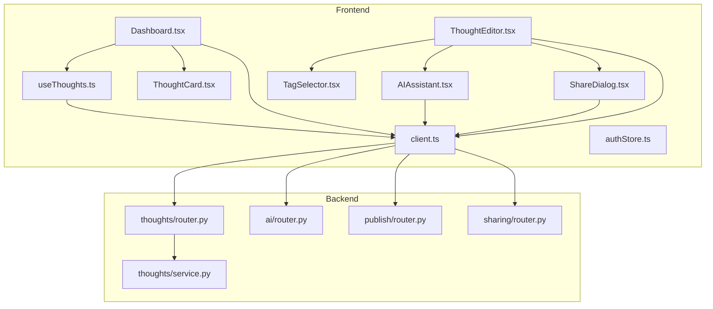
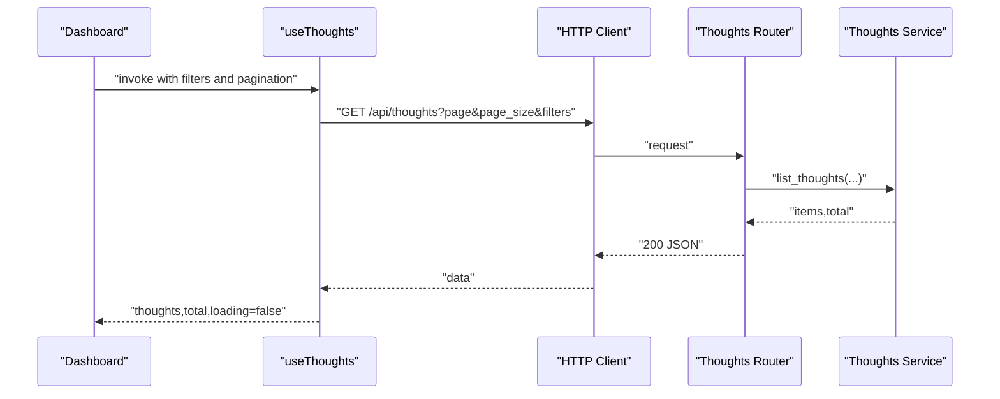
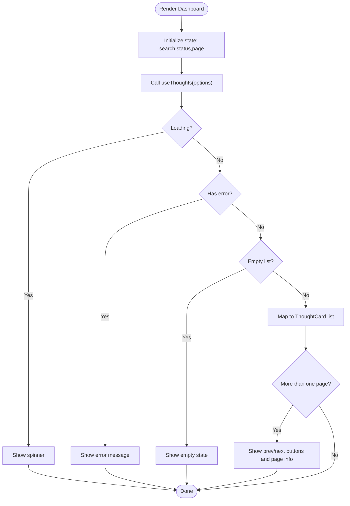
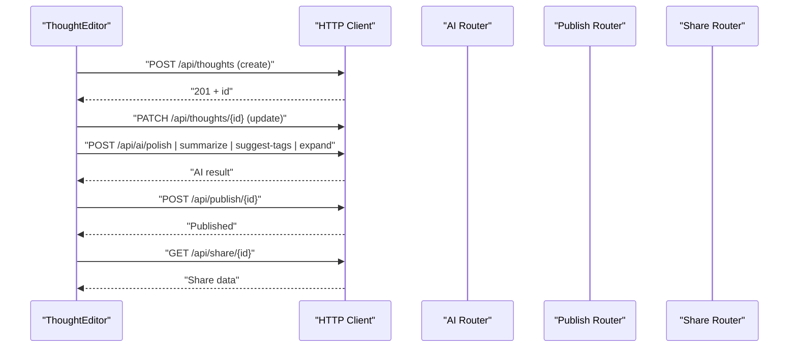
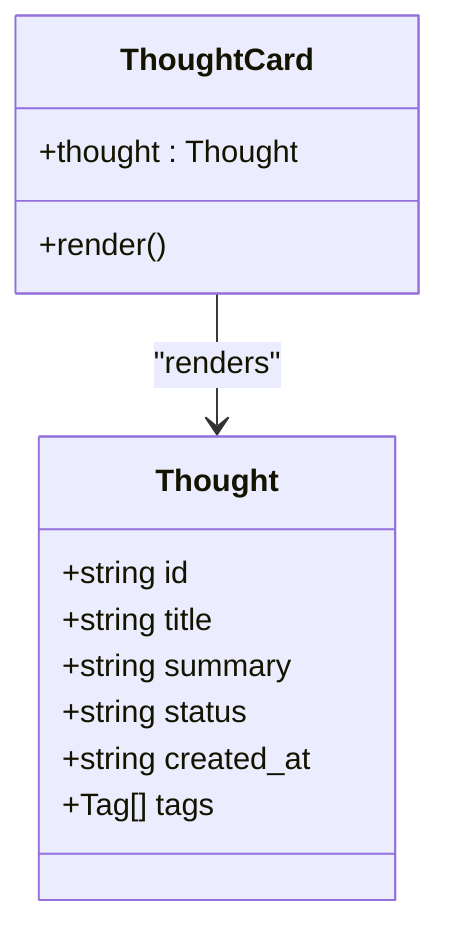
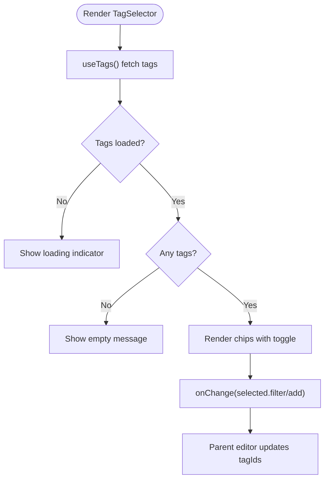
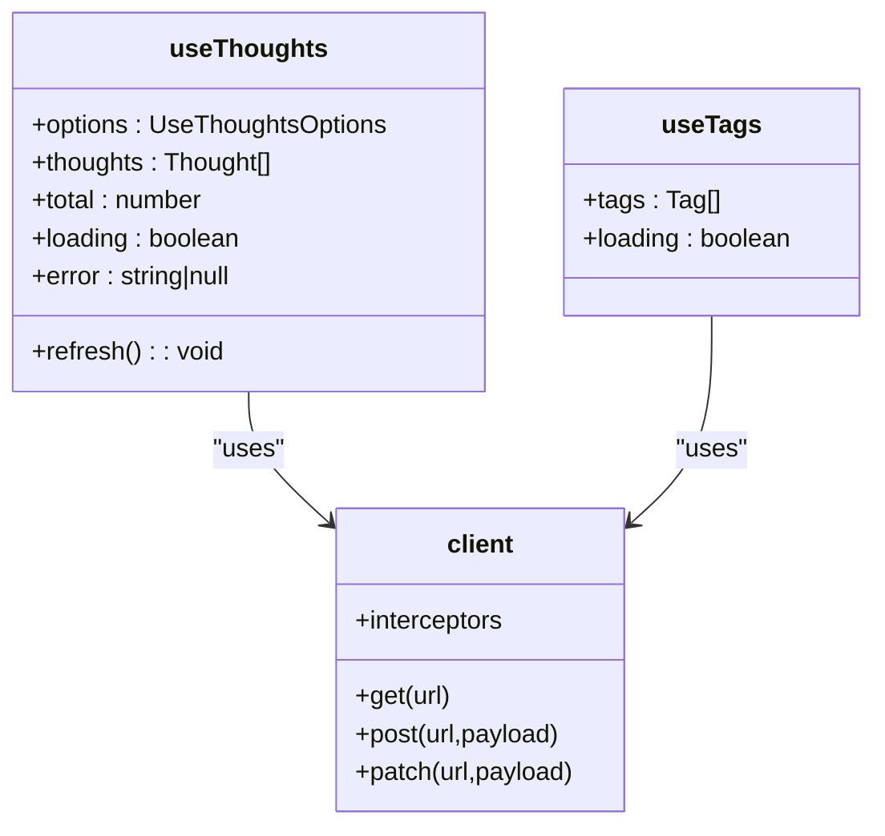
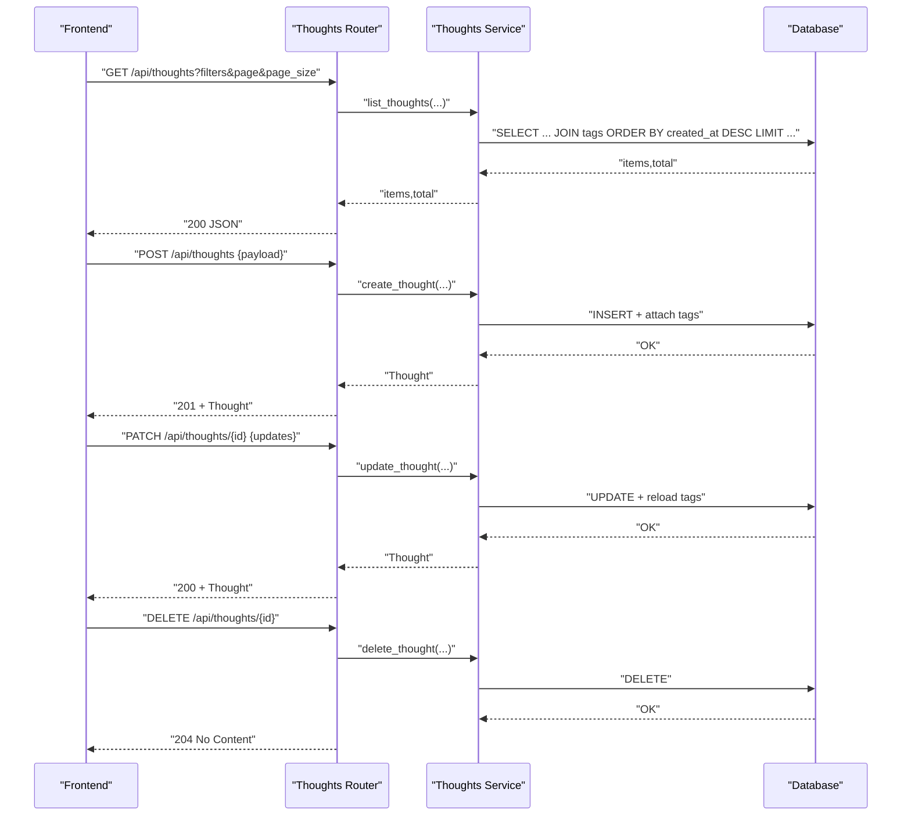
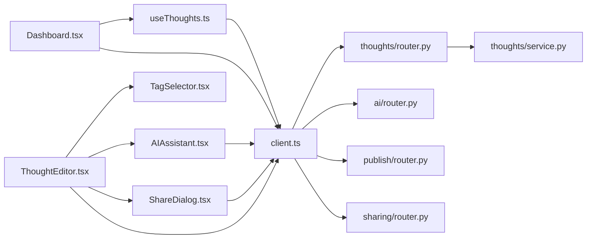

# Thought Management

<cite>
**Referenced Files in This Document**
- [Dashboard.tsx](file://frontend/src/pages/Dashboard.tsx)
- [ThoughtEditor.tsx](file://frontend/src/pages/ThoughtEditor.tsx)
- [ThoughtCard.tsx](file://frontend/src/components/ThoughtCard.tsx)
- [TagSelector.tsx](file://frontend/src/components/TagSelector.tsx)
- [useThoughts.ts](file://frontend/src/hooks/useThoughts.ts)
- [AIAssistant.tsx](file://frontend/src/components/AIAssistant.tsx)
- [ShareDialog.tsx](file://frontend/src/components/ShareDialog.tsx)
- [client.ts](file://frontend/src/api/client.ts)
- [authStore.ts](file://frontend/src/stores/authStore.ts)
- [router.py](file://backend/app/thoughts/router.py)
- [service.py](file://backend/app/thoughts/service.py)
- [router.py](file://backend/app/ai/router.py)
- [router.py](file://backend/app/publish/router.py)
- [router.py](file://backend/app/sharing/router.py)
</cite>

## Table of Contents
1. [Introduction](#introduction)
2. [Project Structure](#project-structure)
3. [Core Components](#core-components)
4. [Architecture Overview](#architecture-overview)
5. [Detailed Component Analysis](#detailed-component-analysis)
6. [Dependency Analysis](#dependency-analysis)
7. [Performance Considerations](#performance-considerations)
8. [Troubleshooting Guide](#troubleshooting-guide)
9. [Conclusion](#conclusion)

## Introduction
This document describes the thought management system covering the dashboard, thought editor, cards, tag selector, and supporting hooks and APIs. It explains how users browse, filter, and paginate thoughts; create and edit them with markdown; leverage AI assistance; organize content via tags; and publish to a static site. It also documents the custom hooks for data fetching and state management, and outlines optimistic UI patterns, real-time update considerations, and performance optimizations for large datasets.

## Project Structure
The system comprises:
- Frontend React application with TypeScript, using custom hooks, components, and a shared HTTP client with JWT support.
- Backend FastAPI application exposing REST endpoints for thoughts, AI assistance, publishing, and sharing.

**Diagram sources**
- [Dashboard.tsx:1-166](file://frontend/src/pages/Dashboard.tsx#L1-L166)
- [ThoughtEditor.tsx:1-221](file://frontend/src/pages/ThoughtEditor.tsx#L1-L221)
- [ThoughtCard.tsx:1-75](file://frontend/src/components/ThoughtCard.tsx#L1-L75)
- [TagSelector.tsx:1-58](file://frontend/src/components/TagSelector.tsx#L1-L58)
- [useThoughts.ts:1-95](file://frontend/src/hooks/useThoughts.ts#L1-L95)
- [AIAssistant.tsx:1-146](file://frontend/src/components/AIAssistant.tsx#L1-L146)
- [ShareDialog.tsx:1-145](file://frontend/src/components/ShareDialog.tsx#L1-L145)
- [client.ts:1-63](file://frontend/src/api/client.ts#L1-L63)
- [authStore.ts:1-101](file://frontend/src/stores/authStore.ts#L1-L101)
- [router.py:1-116](file://backend/app/thoughts/router.py#L1-L116)
- [service.py:1-173](file://backend/app/thoughts/service.py#L1-L173)
- [router.py:1-109](file://backend/app/ai/router.py#L1-L109)
- [router.py:1-64](file://backend/app/publish/router.py#L1-L64)
- [router.py:1-46](file://backend/app/sharing/router.py#L1-L46)

**Section sources**
- [Dashboard.tsx:1-166](file://frontend/src/pages/Dashboard.tsx#L1-L166)
- [ThoughtEditor.tsx:1-221](file://frontend/src/pages/ThoughtEditor.tsx#L1-L221)
- [useThoughts.ts:1-95](file://frontend/src/hooks/useThoughts.ts#L1-L95)
- [client.ts:1-63](file://frontend/src/api/client.ts#L1-L63)

## Core Components
- Dashboard page: renders thought list, search/filter toolbar, pagination, and loading/error states; delegates data fetching to a custom hook.
- Thought editor: markdown editor with title, content, summary, category, status, tags, AI assistant panel, and share dialog; supports save and publish flows.
- Thought card: compact preview with status badge, summary snippet, creation date, tags, and category; navigates to the editor.
- Tag selector: multi-select chips for tags; toggles selection and reflects loading states.
- Custom hooks: centralized data fetching and caching for thoughts and tags; exposes refresh and loading/error states.
- API client: Axios instance with JWT request interceptor and automatic 401 refresh handling.
- Authentication store: user session and profile management with login, register, logout, and token persistence.

**Section sources**
- [Dashboard.tsx:20-165](file://frontend/src/pages/Dashboard.tsx#L20-L165)
- [ThoughtEditor.tsx:23-220](file://frontend/src/pages/ThoughtEditor.tsx#L23-L220)
- [ThoughtCard.tsx:27-74](file://frontend/src/components/ThoughtCard.tsx#L27-L74)
- [TagSelector.tsx:20-57](file://frontend/src/components/TagSelector.tsx#L20-L57)
- [useThoughts.ts:45-94](file://frontend/src/hooks/useThoughts.ts#L45-L94)
- [client.ts:14-62](file://frontend/src/api/client.ts#L14-L62)
- [authStore.ts:37-101](file://frontend/src/stores/authStore.ts#L37-L101)

## Architecture Overview
The frontend communicates with the backend via REST endpoints. Thought listing and CRUD are handled by the thoughts router and service. AI assistance, publishing, and sharing are separate routers backed by providers and services. The HTTP client injects JWT tokens and manages token refresh on 401 responses.

**Diagram sources**
- [Dashboard.tsx:27-34](file://frontend/src/pages/Dashboard.tsx#L27-L34)
- [useThoughts.ts:51-77](file://frontend/src/hooks/useThoughts.ts#L51-L77)
- [client.ts:14-62](file://frontend/src/api/client.ts#L14-L62)
- [router.py:37-63](file://backend/app/thoughts/router.py#L37-L63)
- [service.py:82-134](file://backend/app/thoughts/service.py#L82-L134)

## Detailed Component Analysis

### Dashboard: Thought Listing, Filtering, and Pagination
- State management: maintains search term, status filter, and current page; resets page on filter change.
- Data fetching: uses the custom hook with page size 20; computes total pages from total count.
- Rendering: displays error, spinner, empty state, thought cards, and pagination controls; disables navigation buttons when at boundaries.
- Navigation: “New Thought” link routes to the editor; each card navigates to the editor for the selected thought.

**Diagram sources**
- [Dashboard.tsx:20-165](file://frontend/src/pages/Dashboard.tsx#L20-L165)

**Section sources**
- [Dashboard.tsx:20-165](file://frontend/src/pages/Dashboard.tsx#L20-L165)
- [useThoughts.ts:45-78](file://frontend/src/hooks/useThoughts.ts#L45-L78)

### Thought Editor: Rich Text Editing, AI Assistance, Draft/Publish Workflows
- Fields: title, markdown content, optional summary, category, status, tags.
- Load existing thought: GET by id; populates form fields; sets error on failure.
- Save: POST for new, PATCH for existing; payload includes title, content, summary, category, status, tag ids; shows saving state and error messages.
- Publish: POST to publish endpoint; opens share dialog upon success.
- AI assistant: toggles panel; calls AI endpoints (polish, summarize, suggest tags, expand); applies results to editor fields or copies text.
- Share dialog: fetches share URLs and share text; supports copying to clipboard and opening platform links.

**Diagram sources**
- [ThoughtEditor.tsx:55-89](file://frontend/src/pages/ThoughtEditor.tsx#L55-L89)
- [AIAssistant.tsx:29-49](file://frontend/src/components/AIAssistant.tsx#L29-L49)
- [router.py:51-108](file://backend/app/ai/router.py#L51-L108)
- [router.py:36-51](file://backend/app/publish/router.py#L36-L51)
- [router.py:25-45](file://backend/app/sharing/router.py#L25-L45)

**Section sources**
- [ThoughtEditor.tsx:23-220](file://frontend/src/pages/ThoughtEditor.tsx#L23-L220)
- [AIAssistant.tsx:23-145](file://frontend/src/components/AIAssistant.tsx#L23-L145)
- [ShareDialog.tsx:32-144](file://frontend/src/components/ShareDialog.tsx#L32-L144)

### Thought Card: Display Individual Thoughts
- Displays title, status badge (draft/published/archived), optional summary, creation date, tags, and category.
- Navigates to the editor route for the thought.

**Diagram sources**
- [ThoughtCard.tsx:27-74](file://frontend/src/components/ThoughtCard.tsx#L27-L74)
- [useThoughts.ts:22-34](file://frontend/src/hooks/useThoughts.ts#L22-L34)

**Section sources**
- [ThoughtCard.tsx:27-74](file://frontend/src/components/ThoughtCard.tsx#L27-L74)
- [useThoughts.ts:22-34](file://frontend/src/hooks/useThoughts.ts#L22-L34)

### Tag Selector: Content Organization and Filtering
- Loads tags via the custom hook; toggles selection in the parent editor; shows loading and empty states.
- Selected tags are passed to the editor’s save/update payload.

**Diagram sources**
- [TagSelector.tsx:20-57](file://frontend/src/components/TagSelector.tsx#L20-L57)
- [useThoughts.ts:80-94](file://frontend/src/hooks/useThoughts.ts#L80-L94)

**Section sources**
- [TagSelector.tsx:20-57](file://frontend/src/components/TagSelector.tsx#L20-L57)
- [useThoughts.ts:80-94](file://frontend/src/hooks/useThoughts.ts#L80-L94)

### Custom Hooks: Data Fetching, State Management, and API Integration
- useThoughts: constructs query params from options (search, category, tag, status, page, page_size), fetches list and total, exposes loading/error states, and a refresh function.
- useTags: fetches tags with thought counts and loading state.
- Both integrate with the shared HTTP client and expose typed interfaces for Thought and Tag.

**Diagram sources**
- [useThoughts.ts:45-94](file://frontend/src/hooks/useThoughts.ts#L45-L94)
- [client.ts:14-62](file://frontend/src/api/client.ts#L14-L62)

**Section sources**
- [useThoughts.ts:45-94](file://frontend/src/hooks/useThoughts.ts#L45-L94)
- [client.ts:14-62](file://frontend/src/api/client.ts#L14-L62)

### Thought CRUD Operations and Backend Behavior
- List thoughts: supports category, tag slug, search, status, pagination; returns items and total; orders by created_at desc.
- Create thought: auto-generates slug, ensures uniqueness, assigns author, and attaches tags.
- Get thought: loads by id with tags eagerly.
- Update thought: supports partial updates for title, content, summary, category, status, and tag ids; regenerates slug on title change.
- Delete thought: removes by id.

**Diagram sources**
- [router.py:37-115](file://backend/app/thoughts/router.py#L37-L115)
- [service.py:25-172](file://backend/app/thoughts/service.py#L25-L172)

**Section sources**
- [router.py:37-115](file://backend/app/thoughts/router.py#L37-L115)
- [service.py:25-172](file://backend/app/thoughts/service.py#L25-L172)

### Real-Time Updates and Optimistic UI Patterns
- Current implementation uses request-response cycles for saves and publishes; there is no explicit WebSocket or subscription mechanism.
- Optimistic UI patterns are not implemented in the current codebase. Recommended enhancements:
  - On save, temporarily show the updated fields while awaiting server response.
  - On publish, immediately mark as published and open share dialog optimistically.
  - On delete, remove item from list immediately and revert on failure.
  - Integrate a WebSocket connection to receive live updates for other users’ changes.

[No sources needed since this section provides general guidance]

### Performance Considerations
- Pagination: backend enforces page_size limits and orders by created_at desc; frontend uses page size 20 on the dashboard.
- Efficient queries: backend uses selectinload for tags and applies filters; count is computed via subquery.
- Frontend rendering: ThoughtCard uses minimal DOM and clamped text; TagSelector chips render conditionally.
- Recommendations:
  - Virtualize long lists if pagination becomes insufficient.
  - Debounce search input to avoid excessive requests.
  - Cache tag lists locally to reduce repeated network calls.
  - Lazy load AI panel and share dialog to minimize initial bundle size.

[No sources needed since this section provides general guidance]

### Troubleshooting Guide
- Authentication errors:
  - 401 responses trigger token refresh; if refresh fails, user is redirected to login.
  - Verify tokens in local storage and network tab.
- Thought listing failures:
  - Check error message propagation from the hook; confirm filters and pagination values.
- Editor save/publish failures:
  - Inspect error field in the editor; ensure required fields are present and status is valid.
- AI assistant failures:
  - Confirm content length and endpoint availability; review error messages returned by the AI router.
- Share dialog failures:
  - Ensure thought exists and is published; verify share router response shape.

**Section sources**
- [client.ts:28-60](file://frontend/src/api/client.ts#L28-L60)
- [useThoughts.ts:66-70](file://frontend/src/hooks/useThoughts.ts#L66-L70)
- [ThoughtEditor.tsx:74-88](file://frontend/src/pages/ThoughtEditor.tsx#L74-L88)
- [AIAssistant.tsx:44-49](file://frontend/src/components/AIAssistant.tsx#L44-L49)
- [router.py:56-63](file://backend/app/ai/router.py#L56-L63)

## Dependency Analysis
- Frontend dependencies:
  - Dashboard depends on useThoughts and ThoughtCard.
  - ThoughtEditor depends on TagSelector, AIAssistant, ShareDialog, and client.
  - useThoughts depends on client and exposes typed Thought/Tag interfaces.
  - client depends on axios and localStorage for tokens.
  - authStore integrates with client for login/register/logout and user fetching.
- Backend dependencies:
  - Thoughts router depends on thoughts service and auth dependencies.
  - AI router depends on AI provider factory and schemas.
  - Publish and sharing routers depend on their respective services and thought retrieval.

**Diagram sources**
- [Dashboard.tsx:17-18](file://frontend/src/pages/Dashboard.tsx#L17-L18)
- [ThoughtEditor.tsx:18-21](file://frontend/src/pages/ThoughtEditor.tsx#L18-L21)
- [useThoughts.ts:11-12](file://frontend/src/hooks/useThoughts.ts#L11-L12)
- [client.ts:12-17](file://frontend/src/api/client.ts#L12-L17)
- [router.py:14-34](file://backend/app/thoughts/router.py#L14-L34)
- [service.py:16-22](file://backend/app/thoughts/service.py#L16-L22)
- [router.py:17-23](file://backend/app/ai/router.py#L17-L23)
- [router.py:18-23](file://backend/app/publish/router.py#L18-L23)
- [router.py:16-22](file://backend/app/sharing/router.py#L16-L22)

**Section sources**
- [Dashboard.tsx:17-18](file://frontend/src/pages/Dashboard.tsx#L17-L18)
- [ThoughtEditor.tsx:18-21](file://frontend/src/pages/ThoughtEditor.tsx#L18-L21)
- [useThoughts.ts:11-12](file://frontend/src/hooks/useThoughts.ts#L11-L12)
- [client.ts:12-17](file://frontend/src/api/client.ts#L12-L17)
- [router.py:14-34](file://backend/app/thoughts/router.py#L14-L34)
- [service.py:16-22](file://backend/app/thoughts/service.py#L16-L22)
- [router.py:17-23](file://backend/app/ai/router.py#L17-L23)
- [router.py:18-23](file://backend/app/publish/router.py#L18-L23)
- [router.py:16-22](file://backend/app/sharing/router.py#L16-L22)

## Performance Considerations
- Pagination and ordering: backend enforces safe page sizes and sorts by created_at desc to keep recent items visible.
- Tag eager loading: tags are loaded with thoughts to avoid N+1 queries.
- Frontend rendering: clamp text and avoid unnecessary re-renders by passing memoized props.
- Recommendations:
  - Debounce search input to limit frequent requests.
  - Cache tag lists and reuse across components.
  - Consider virtualization for very large lists.
  - Lazy-load AI panel and share dialog.

[No sources needed since this section provides general guidance]

## Troubleshooting Guide
- Authentication:
  - 401 triggers token refresh; if refresh fails, user is redirected to login.
- Thought listing:
  - Error messages propagate from the hook; verify filters and page size.
- Editor:
  - Save and publish errors surface from API responses; ensure required fields and valid status.
- AI assistant:
  - Endpoint availability and content length checks; review error messages.
- Share dialog:
  - Ensure thought exists and share router returns expected structure.

**Section sources**
- [client.ts:28-60](file://frontend/src/api/client.ts#L28-L60)
- [useThoughts.ts:66-70](file://frontend/src/hooks/useThoughts.ts#L66-L70)
- [ThoughtEditor.tsx:74-88](file://frontend/src/pages/ThoughtEditor.tsx#L74-L88)
- [AIAssistant.tsx:44-49](file://frontend/src/components/AIAssistant.tsx#L44-L49)
- [router.py:56-63](file://backend/app/ai/router.py#L56-L63)

## Conclusion
The thought management system provides a cohesive workflow for browsing, creating, editing, organizing, and publishing thoughts. The frontend components and hooks encapsulate data fetching and state, while the backend enforces robust filtering, pagination, and business rules. Enhancements such as optimistic UI, real-time updates, and performance optimizations can further improve user experience at scale.