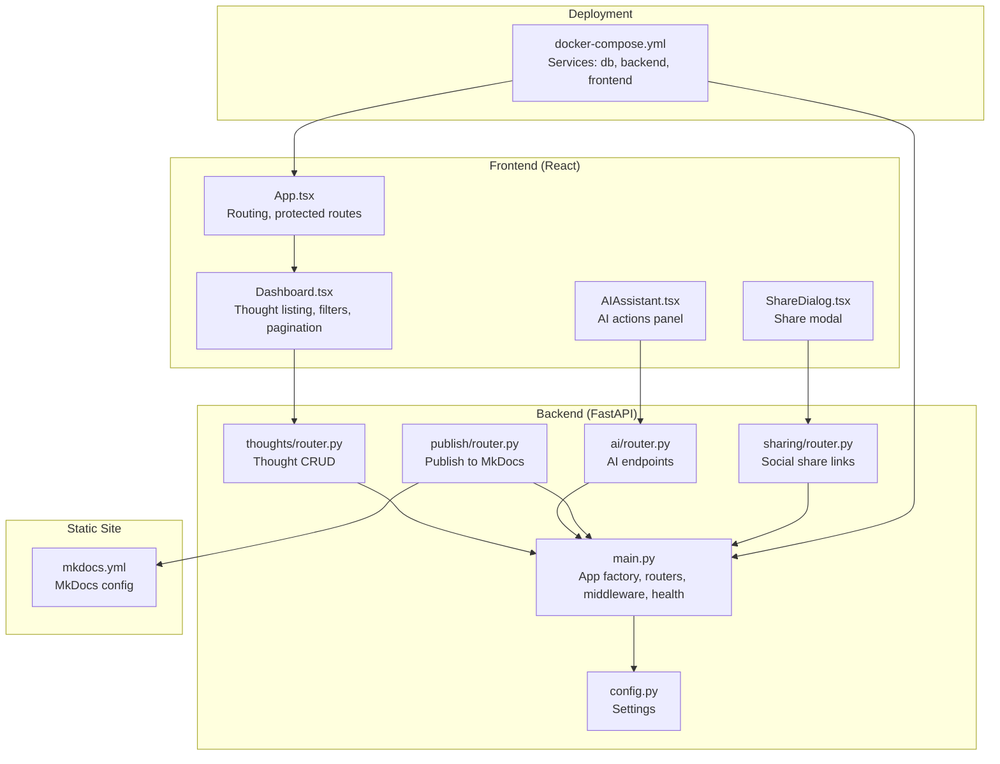
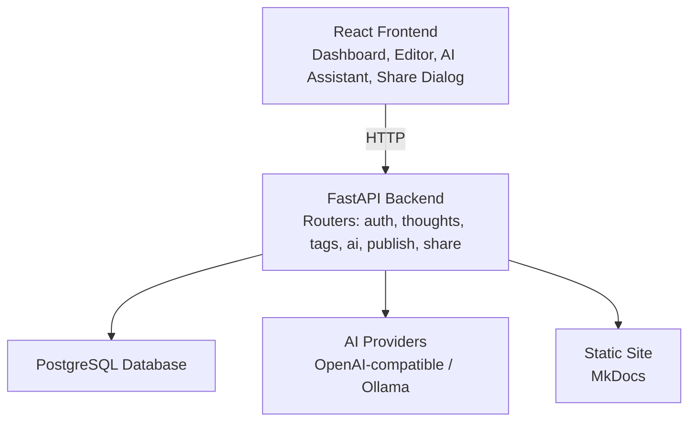
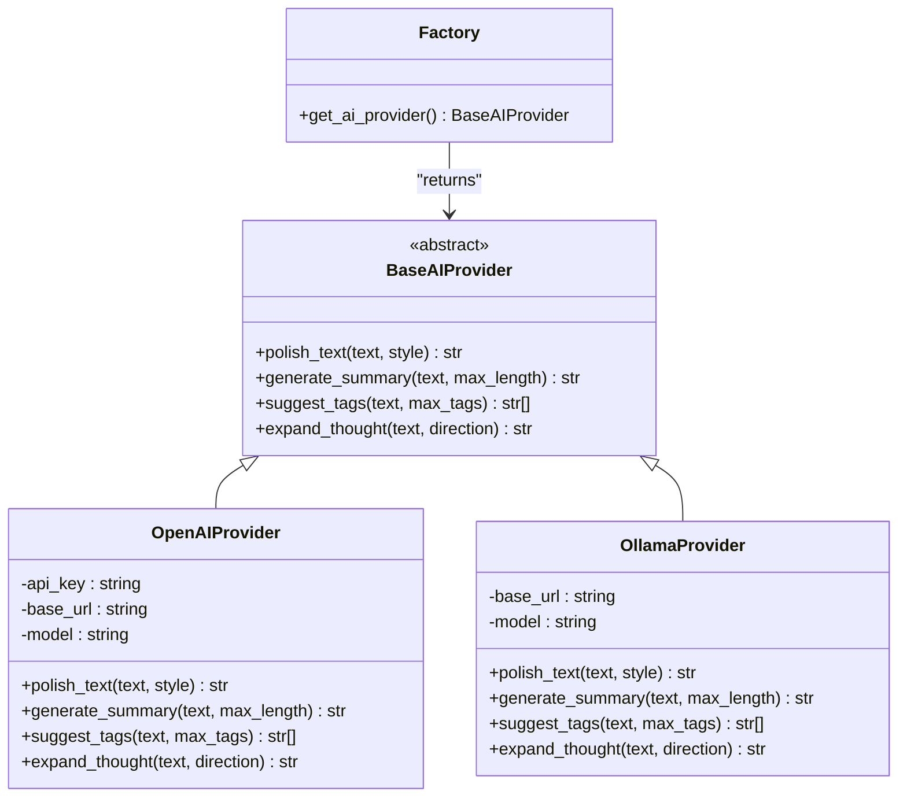
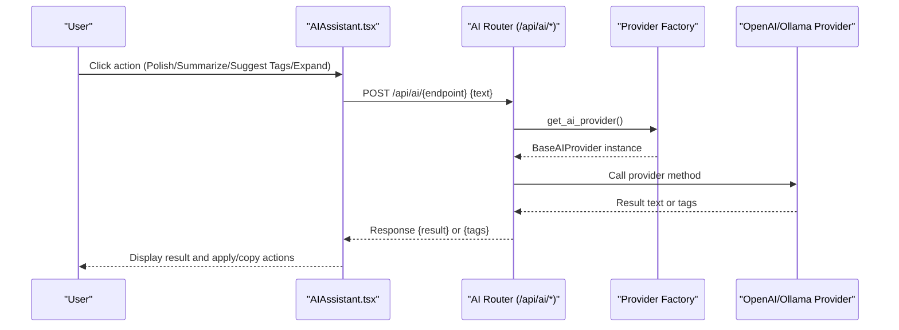
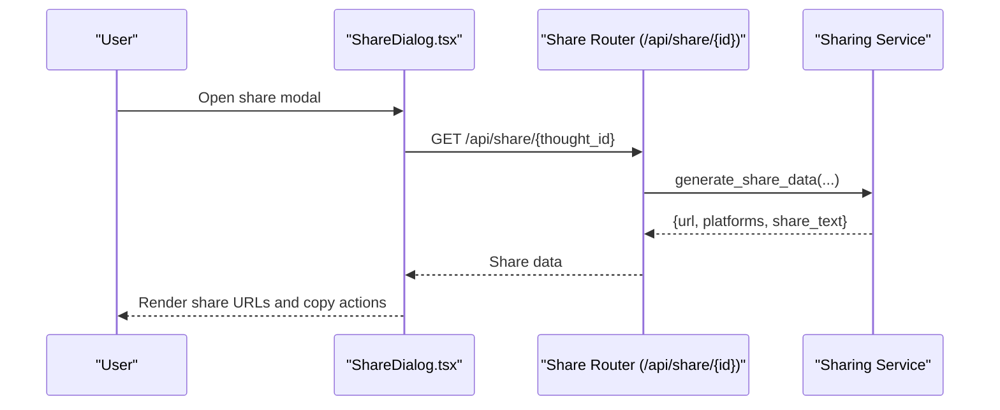
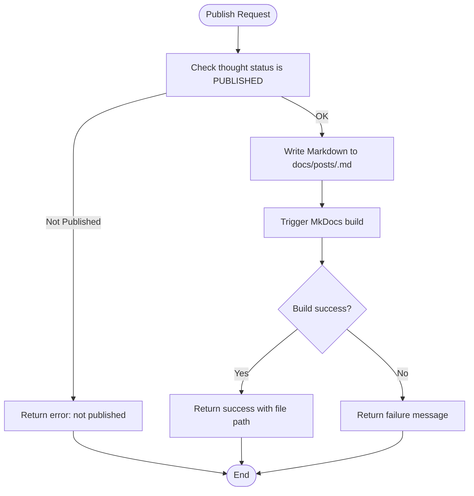
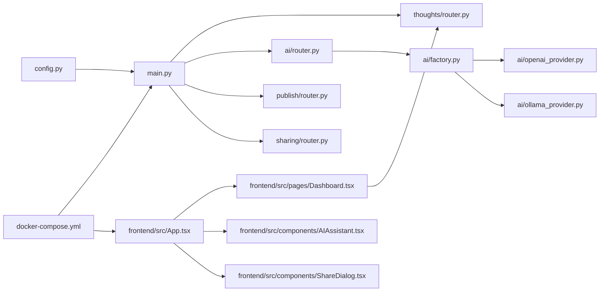

# Project Overview

<cite>
**Referenced Files in This Document**
- [backend/app/main.py](file://backend/app/main.py)
- [backend/app/config.py](file://backend/app/config.py)
- [backend/app/thoughts/router.py](file://backend/app/thoughts/router.py)
- [backend/app/ai/router.py](file://backend/app/ai/router.py)
- [backend/app/ai/factory.py](file://backend/app/ai/factory.py)
- [backend/app/ai/openai_provider.py](file://backend/app/ai/openai_provider.py)
- [backend/app/ai/ollama_provider.py](file://backend/app/ai/ollama_provider.py)
- [backend/app/publish/router.py](file://backend/app/publish/router.py)
- [backend/app/sharing/router.py](file://backend/app/sharing/router.py)
- [frontend/src/App.tsx](file://frontend/src/App.tsx)
- [frontend/src/pages/Dashboard.tsx](file://frontend/src/pages/Dashboard.tsx)
- [frontend/src/components/AIAssistant.tsx](file://frontend/src/components/AIAssistant.tsx)
- [frontend/src/components/ShareDialog.tsx](file://frontend/src/components/ShareDialog.tsx)
- [docker-compose.yml](file://docker-compose.yml)
- [site/mkdocs.yml](file://site/mkdocs.yml)
</cite>

## Table of Contents
1. [Introduction](#introduction)
2. [Project Structure](#project-structure)
3. [Core Components](#core-components)
4. [Architecture Overview](#architecture-overview)
5. [Detailed Component Analysis](#detailed-component-analysis)
6. [Dependency Analysis](#dependency-analysis)
7. [Performance Considerations](#performance-considerations)
8. [Troubleshooting Guide](#troubleshooting-guide)
9. [Conclusion](#conclusion)

## Introduction
PolaZhenJing is an AI-powered personal knowledge wiki and sharing platform designed to help individuals capture, refine, organize, publish, and share their daily thoughts and reflections. It combines a modern web interface with a robust backend and a static site generation pipeline to deliver a seamless experience for personal knowledge management and social knowledge sharing.

Key value propositions:
- Thought management: Create, edit, filter, search, and paginate personal thoughts with status tracking and tagging.
- AI integration: Leverage AI providers (OpenAI-compatible or local Ollama) to polish, summarize, tag, and expand written content.
- Publishing pipeline: Convert thoughts into Markdown and build a static site using MkDocs for easy hosting and distribution.
- Social sharing: Generate ready-to-share URLs and content for popular platforms to spread ideas with minimal friction.
- Developer-friendly stack: FastAPI backend, React frontend, configurable AI providers, and a reproducible Docker-based deployment.

Target audience:
- Knowledge workers and researchers who want a private yet publishable knowledge base.
- Writers and thinkers who benefit from AI-assisted writing and editing.
- Educators and students seeking a structured way to manage reflective writing and study notes.
- Anyone who wants to publish a personal blog or knowledge wiki with minimal infrastructure overhead.

Core benefits:
- Streamlined thought lifecycle from creation to publication and sharing.
- Flexible AI provider configuration supporting cloud APIs and local LLMs.
- Static site generation for reliable, fast, and free hosting.
- Strong separation of concerns enabling easy extension and customization.

## Project Structure
The repository is organized into three main areas:
- backend: FastAPI application with modular routers for authentication, thoughts, tags, AI, publishing, and sharing.
- frontend: React application with routing, protected routes, and UI components for thought management and AI assistance.
- site: MkDocs project configuration for static site generation and hosting.

**Diagram sources**
- [backend/app/main.py:39-71](file://backend/app/main.py#L39-L71)
- [backend/app/thoughts/router.py:33-115](file://backend/app/thoughts/router.py#L33-L115)
- [backend/app/ai/router.py:23-109](file://backend/app/ai/router.py#L23-L109)
- [backend/app/publish/router.py:23-64](file://backend/app/publish/router.py#L23-L64)
- [backend/app/sharing/router.py:22-46](file://backend/app/sharing/router.py#L22-L46)
- [backend/app/config.py:15-61](file://backend/app/config.py#L15-L61)
- [frontend/src/App.tsx:41-94](file://frontend/src/App.tsx#L41-L94)
- [frontend/src/pages/Dashboard.tsx:20-166](file://frontend/src/pages/Dashboard.tsx#L20-L166)
- [frontend/src/components/AIAssistant.tsx:22-145](file://frontend/src/components/AIAssistant.tsx#L22-L145)
- [frontend/src/components/ShareDialog.tsx:31-144](file://frontend/src/components/ShareDialog.tsx#L31-L144)
- [site/mkdocs.yml:8-78](file://site/mkdocs.yml#L8-L78)
- [docker-compose.yml:9-67](file://docker-compose.yml#L9-L67)

**Section sources**
- [backend/app/main.py:39-71](file://backend/app/main.py#L39-L71)
- [frontend/src/App.tsx:41-94](file://frontend/src/App.tsx#L41-L94)
- [docker-compose.yml:9-67](file://docker-compose.yml#L9-L67)

## Core Components
- Backend entry point and routing: The FastAPI application wires together middleware, exception handlers, and all routers for authentication, thoughts, tags, AI, publishing, and sharing.
- Configuration: Centralized settings for application metadata, database, JWT, AI provider selection, and site publishing parameters.
- Thought management: REST endpoints for listing, creating, retrieving, updating, and deleting thoughts with filtering and pagination.
- AI integration: Unified AI endpoints for polishing, summarizing, suggesting tags, and expanding content, powered by a configurable provider (OpenAI-compatible or Ollama).
- Publishing pipeline: Converts published thoughts into Markdown files and triggers a MkDocs build for static site generation.
- Social sharing: Generates platform-specific share URLs and preformatted content for X (Twitter), Weibo, and Xiaohongshu.
- Frontend routing and UX: Protected routes, dashboard with search and filters, AI assistant panel, and share dialog.

**Section sources**
- [backend/app/main.py:39-88](file://backend/app/main.py#L39-L88)
- [backend/app/config.py:15-61](file://backend/app/config.py#L15-L61)
- [backend/app/thoughts/router.py:36-115](file://backend/app/thoughts/router.py#L36-L115)
- [backend/app/ai/router.py:51-109](file://backend/app/ai/router.py#L51-L109)
- [backend/app/publish/router.py:36-64](file://backend/app/publish/router.py#L36-L64)
- [backend/app/sharing/router.py:25-46](file://backend/app/sharing/router.py#L25-L46)
- [frontend/src/App.tsx:23-94](file://frontend/src/App.tsx#L23-L94)
- [frontend/src/pages/Dashboard.tsx:20-166](file://frontend/src/pages/Dashboard.tsx#L20-L166)
- [frontend/src/components/AIAssistant.tsx:22-145](file://frontend/src/components/AIAssistant.tsx#L22-L145)
- [frontend/src/components/ShareDialog.tsx:31-144](file://frontend/src/components/ShareDialog.tsx#L31-L144)

## Architecture Overview
High-level architecture:
- Backend: FastAPI application exposing REST endpoints grouped by domain (auth, thoughts, tags, AI, publish, share).
- Frontend: React SPA with protected routes and UI components for thought management and AI assistance.
- Data: PostgreSQL database managed via asynchronous SQLAlchemy sessions.
- AI: Pluggable provider strategy supporting OpenAI-compatible APIs and local Ollama instances.
- Publishing: Thought-to-Markdown conversion and MkDocs site build orchestrated by the backend.
- Deployment: Docker Compose orchestrating database, backend, and frontend services.

**Diagram sources**
- [backend/app/main.py:39-71](file://backend/app/main.py#L39-L71)
- [backend/app/config.py:43-54](file://backend/app/config.py#L43-L54)
- [frontend/src/App.tsx:41-94](file://frontend/src/App.tsx#L41-L94)
- [site/mkdocs.yml:8-78](file://site/mkdocs.yml#L8-L78)
- [docker-compose.yml:9-67](file://docker-compose.yml#L9-L67)

## Detailed Component Analysis

### Backend: AI Provider Factory and Providers
The AI subsystem uses a factory to select a provider at runtime based on configuration, enabling switching between OpenAI-compatible APIs and local Ollama instances.

**Diagram sources**
- [backend/app/ai/factory.py:18-44](file://backend/app/ai/factory.py#L18-L44)
- [backend/app/ai/openai_provider.py:24-105](file://backend/app/ai/openai_provider.py#L24-L105)
- [backend/app/ai/ollama_provider.py:23-99](file://backend/app/ai/ollama_provider.py#L23-L99)

**Section sources**
- [backend/app/ai/factory.py:18-44](file://backend/app/ai/factory.py#L18-L44)
- [backend/app/ai/openai_provider.py:24-105](file://backend/app/ai/openai_provider.py#L24-L105)
- [backend/app/ai/ollama_provider.py:23-99](file://backend/app/ai/ollama_provider.py#L23-L99)

### Frontend: AI Assistant Panel
The AI Assistant component integrates with backend AI endpoints to polish, summarize, suggest tags, and expand content. It supports applying results back into editors and copying outputs.

**Diagram sources**
- [frontend/src/components/AIAssistant.tsx:28-48](file://frontend/src/components/AIAssistant.tsx#L28-L48)
- [backend/app/ai/router.py:51-109](file://backend/app/ai/router.py#L51-L109)
- [backend/app/ai/factory.py:18-44](file://backend/app/ai/factory.py#L18-L44)
- [backend/app/ai/openai_provider.py:68-104](file://backend/app/ai/openai_provider.py#L68-L104)
- [backend/app/ai/ollama_provider.py:62-98](file://backend/app/ai/ollama_provider.py#L62-L98)

**Section sources**
- [frontend/src/components/AIAssistant.tsx:22-145](file://frontend/src/components/AIAssistant.tsx#L22-L145)
- [backend/app/ai/router.py:26-109](file://backend/app/ai/router.py#L26-L109)
- [backend/app/ai/factory.py:18-44](file://backend/app/ai/factory.py#L18-L44)

### Frontend: Share Dialog
The Share Dialog fetches share URLs and preformatted content for X (Twitter), Weibo, and Xiaohongshu, enabling quick sharing and clipboard copy.

**Diagram sources**
- [frontend/src/components/ShareDialog.tsx:31-144](file://frontend/src/components/ShareDialog.tsx#L31-L144)
- [backend/app/sharing/router.py:25-46](file://backend/app/sharing/router.py#L25-L46)

**Section sources**
- [frontend/src/components/ShareDialog.tsx:31-144](file://frontend/src/components/ShareDialog.tsx#L31-L144)
- [backend/app/sharing/router.py:25-46](file://backend/app/sharing/router.py#L25-L46)

### Publishing Pipeline
The publishing flow converts a thought into Markdown and triggers a MkDocs build to regenerate the static site.

**Diagram sources**
- [backend/app/publish/router.py:36-64](file://backend/app/publish/router.py#L36-L64)

**Section sources**
- [backend/app/publish/router.py:23-64](file://backend/app/publish/router.py#L23-L64)
- [site/mkdocs.yml:8-78](file://site/mkdocs.yml#L8-L78)

### Conceptual Overview
- Personal knowledge wiki: Users create and manage thoughts, tag them, and publish them to a static site for long-term archival and sharing.
- AI-assisted writing: The AI assistant helps polish, summarize, tag, and expand content to improve quality and depth.
- Social sharing: Thought-specific share URLs and content enable quick distribution across platforms.
- Publishing pipeline: Thoughts are transformed into Markdown and built into a static site using MkDocs.

[No sources needed since this section doesn't analyze specific source files]

## Dependency Analysis
- Backend depends on configuration for database, JWT, AI provider settings, and site base URL.
- Routers depend on services and shared models; AI endpoints depend on the provider factory and concrete providers.
- Frontend components depend on the API client and React Router for navigation.
- Docker Compose ties together database, backend, and frontend services with shared volumes and environment configuration.

**Diagram sources**
- [backend/app/config.py:15-61](file://backend/app/config.py#L15-L61)
- [backend/app/main.py:39-71](file://backend/app/main.py#L39-L71)
- [backend/app/ai/factory.py:18-44](file://backend/app/ai/factory.py#L18-L44)
- [backend/app/ai/openai_provider.py:24-105](file://backend/app/ai/openai_provider.py#L24-L105)
- [backend/app/ai/ollama_provider.py:23-99](file://backend/app/ai/ollama_provider.py#L23-L99)
- [frontend/src/App.tsx:41-94](file://frontend/src/App.tsx#L41-L94)
- [frontend/src/pages/Dashboard.tsx:20-166](file://frontend/src/pages/Dashboard.tsx#L20-L166)
- [frontend/src/components/AIAssistant.tsx:22-145](file://frontend/src/components/AIAssistant.tsx#L22-L145)
- [frontend/src/components/ShareDialog.tsx:31-144](file://frontend/src/components/ShareDialog.tsx#L31-L144)
- [docker-compose.yml:9-67](file://docker-compose.yml#L9-L67)

**Section sources**
- [backend/app/config.py:15-61](file://backend/app/config.py#L15-L61)
- [backend/app/main.py:39-71](file://backend/app/main.py#L39-L71)
- [docker-compose.yml:9-67](file://docker-compose.yml#L9-L67)

## Performance Considerations
- Asynchronous operations: Backend uses async SQLAlchemy sessions and async HTTP clients to minimize blocking during AI calls and database operations.
- Caching: AI provider factory uses caching to avoid repeated instantiation of the same provider.
- Streaming and timeouts: AI providers configure timeouts appropriate for model inference latency; adjust base URLs and models per performance needs.
- Pagination and filtering: Thought listing supports pagination and filters to reduce payload sizes and improve responsiveness.
- Static site generation: MkDocs build is triggered on demand; consider incremental builds or CI/CD for frequent updates.

[No sources needed since this section provides general guidance]

## Troubleshooting Guide
- Health checks: Use the backend health endpoint to verify service availability and version.
- AI provider errors: AI endpoints return a service-unavailable error when provider calls fail; check provider configuration and network connectivity.
- Publishing failures: Verify thought status is published and that MkDocs configuration is correct; inspect server logs for build errors.
- Authentication: Protected routes redirect unauthenticated users to login; ensure JWT secrets and algorithms are configured securely.
- Environment variables: Confirm database URL, AI provider settings, and site base URL are set via environment or .env.

**Section sources**
- [backend/app/main.py:75-88](file://backend/app/main.py#L75-L88)
- [backend/app/ai/router.py:58-63](file://backend/app/ai/router.py#L58-L63)
- [backend/app/publish/router.py:58-63](file://backend/app/publish/router.py#L58-L63)
- [backend/app/config.py:35-54](file://backend/app/config.py#L35-L54)
- [frontend/src/App.tsx:23-39](file://frontend/src/App.tsx#L23-L39)

## Conclusion
PolaZhenJing delivers a cohesive solution for personal knowledge management and sharing by combining a modern React frontend, a FastAPI backend, flexible AI providers, and a static site generation pipeline. Its modular design, strong configuration management, and Docker-based deployment make it suitable for individual creators, educators, and researchers who want a powerful yet simple system to capture, refine, publish, and share their thoughts.