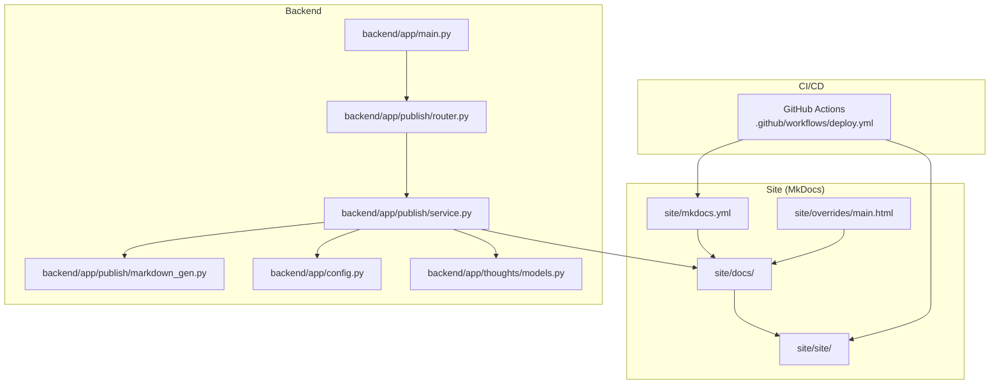
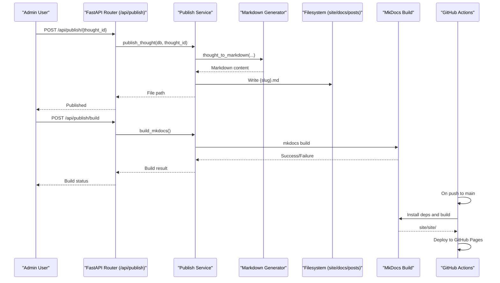
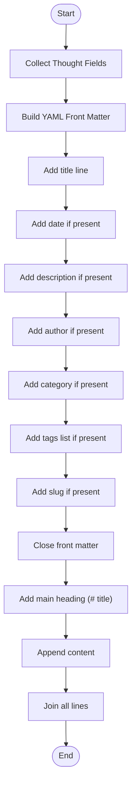
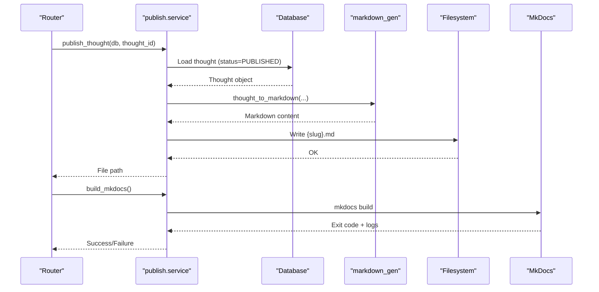
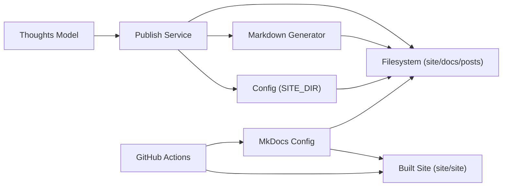

# Static Site Generation

<cite>
**Referenced Files in This Document**
- [mkdocs.yml](file://site/mkdocs.yml)
- [overrides/main.html](file://site/overrides/main.html)
- [index.md](file://site/docs/index.md)
- [markdown_gen.py](file://backend/app/publish/markdown_gen.py)
- [service.py](file://backend/app/publish/service.py)
- [router.py](file://backend/app/publish/router.py)
- [deploy.yml](file://.github/workflows/deploy.yml)
- [config.py](file://backend/app/config.py)
- [models.py](file://backend/app/thoughts/models.py)
- [service.py](file://backend/app/thoughts/service.py)
- [main.py](file://backend/app/main.py)
- [test_markdown_gen.py](file://backend/tests/test_markdown_gen.py)
</cite>

## Table of Contents
1. [Introduction](#introduction)
2. [Project Structure](#project-structure)
3. [Core Components](#core-components)
4. [Architecture Overview](#architecture-overview)
5. [Detailed Component Analysis](#detailed-component-analysis)
6. [Dependency Analysis](#dependency-analysis)
7. [Performance Considerations](#performance-considerations)
8. [Troubleshooting Guide](#troubleshooting-guide)
9. [Conclusion](#conclusion)
10. [Appendices](#appendices)

## Introduction
This document explains PolaZhenJing’s static site generation system built on MkDocs Material. It covers MkDocs configuration, theme customization, Markdown generation workflow, content processing, asset management, and the automated deployment pipeline to GitHub Pages. It also documents site structure, navigation, content organization patterns, integration with the main application, caching and performance strategies, build triggers, and maintenance procedures.

## Project Structure
The static site is organized under the site/ directory with:
- site/mkdocs.yml: MkDocs configuration and theme settings
- site/overrides/main.html: Jinja override adding Open Graph and Twitter meta tags
- site/docs/: Markdown content for the site (index.md and posts/)
- site/site/: built static site output (generated by MkDocs build)

The backend publishes content by converting ORM thought objects into Markdown files placed under site/docs/posts/, then triggers an MkDocs build. GitHub Actions automates building and deploying the site to GitHub Pages on pushes to the main branch.

**Diagram sources**
- [mkdocs.yml:1-78](file://site/mkdocs.yml#L1-L78)
- [overrides/main.html:1-38](file://site/overrides/main.html#L1-L38)
- [index.md:1-20](file://site/docs/index.md#L1-L20)
- [router.py:1-64](file://backend/app/publish/router.py#L1-L64)
- [service.py:1-110](file://backend/app/publish/service.py#L1-L110)
- [markdown_gen.py:1-88](file://backend/app/publish/markdown_gen.py#L1-L88)
- [config.py:1-61](file://backend/app/config.py#L1-L61)
- [models.py:1-70](file://backend/app/thoughts/models.py#L1-L70)
- [deploy.yml:1-63](file://.github/workflows/deploy.yml#L1-L63)

**Section sources**
- [mkdocs.yml:1-78](file://site/mkdocs.yml#L1-L78)
- [overrides/main.html:1-38](file://site/overrides/main.html#L1-L38)
- [index.md:1-20](file://site/docs/index.md#L1-L20)
- [deploy.yml:1-63](file://.github/workflows/deploy.yml#L1-L63)

## Core Components
- MkDocs configuration and theme:
  - Theme: Material with custom_dir overrides, language set to Chinese, dual-color palette (light/dark), and UI features (instant navigation, tabs, top scroll-to-top, search suggestions/highlight, copy code).
  - Plugins: search (supports Chinese and English), tags.
  - Markdown extensions: admonitions, syntax highlighting with line anchors, superfences, details, emoji, TOC with permalink, meta.
  - Navigation: Home → index.md, Posts → posts/.
  - Extra: social icons and links, generator disabled.
- Theme override:
  - Adds Open Graph and Twitter Card meta tags to improve SEO and social sharing.
- Markdown generation:
  - Converts a Thought ORM object into a Markdown file with YAML front matter (title, date, description, author, category, tags, slug) and a main heading followed by content.
- Publishing service:
  - Validates thought status, gathers metadata, writes Markdown to site/docs/posts/{slug}.md, and triggers MkDocs build via subprocess.
- API endpoints:
  - Publish a single thought and trigger a full site build.
- CI/CD:
  - GitHub Actions workflow installs MkDocs and Material, builds the site with strict mode, uploads the artifact, and deploys to GitHub Pages.

**Section sources**
- [mkdocs.yml:8-78](file://site/mkdocs.yml#L8-L78)
- [overrides/main.html:11-37](file://site/overrides/main.html#L11-L37)
- [markdown_gen.py:15-82](file://backend/app/publish/markdown_gen.py#L15-L82)
- [service.py:37-109](file://backend/app/publish/service.py#L37-L109)
- [router.py:36-63](file://backend/app/publish/router.py#L36-L63)
- [deploy.yml:9-63](file://.github/workflows/deploy.yml#L9-L63)

## Architecture Overview
The publishing pipeline integrates the backend thought model with MkDocs static generation and GitHub Pages deployment.

**Diagram sources**
- [router.py:36-63](file://backend/app/publish/router.py#L36-L63)
- [service.py:37-109](file://backend/app/publish/service.py#L37-L109)
- [markdown_gen.py:15-82](file://backend/app/publish/markdown_gen.py#L15-L82)
- [deploy.yml:27-63](file://.github/workflows/deploy.yml#L27-L63)

## Detailed Component Analysis

### MkDocs Configuration and Theme Customization
- Theme and UI:
  - Material theme with custom_dir overrides for Jinja templates.
  - Language set to Chinese; dual palette toggles between light and dark modes.
  - Features enable instant navigation, tabbed navigation, section navigation, top button, search suggestions/highlight, and code copy.
  - Fonts configured for text and code.
- Plugins:
  - Search plugin enabled with multilingual support.
  - Tags plugin enabled for tagging support.
- Markdown extensions:
  - Admonitions, syntax highlighting with line anchors, superfences, details, emoji, TOC with permalink, meta.
- Navigation:
  - Two top-level entries: Home → index.md, Posts → posts/.
- Extra:
  - Social links and generator flag disabled.

**Section sources**
- [mkdocs.yml:13-78](file://site/mkdocs.yml#L13-L78)

### Theme Override for SEO and Social Sharing
- Adds Open Graph meta tags (type, site name, title, description, canonical URL).
- Adds Twitter Card meta tags (card type, title, description).
- Uses page and config values for dynamic rendering.

**Section sources**
- [overrides/main.html:11-37](file://site/overrides/main.html#L11-L37)

### Markdown Generation Workflow
- Input: Thought ORM fields (title, content, summary, category, tags, author, created_at, slug).
- Output: Markdown with YAML front matter and a main heading.
- Escaping: Double quotes are escaped in YAML string values.
- Validation: Only published thoughts are exported to Markdown.

**Diagram sources**
- [markdown_gen.py:15-82](file://backend/app/publish/markdown_gen.py#L15-L82)

**Section sources**
- [markdown_gen.py:15-82](file://backend/app/publish/markdown_gen.py#L15-L82)

### Publishing Service and Build Orchestration
- Publishing:
  - Validates that the thought exists and is in PUBLISHED status.
  - Gathers tag names and author display name.
  - Generates Markdown and writes to site/docs/posts/{slug}.md.
- Build:
  - Spawns mkdocs build as a subprocess in the site/ directory.
  - Logs stdout/stderr and returns success/failure.
  - Handles missing mkdocs command gracefully.

**Diagram sources**
- [service.py:37-109](file://backend/app/publish/service.py#L37-L109)
- [markdown_gen.py:15-82](file://backend/app/publish/markdown_gen.py#L15-L82)

**Section sources**
- [service.py:37-109](file://backend/app/publish/service.py#L37-L109)

### API Endpoints for Publishing and Building
- POST /api/publish/{thought_id}: Publishes a single thought to Markdown and returns the file path.
- POST /api/publish/build: Triggers a full MkDocs build and returns success/failure.

**Section sources**
- [router.py:36-63](file://backend/app/publish/router.py#L36-L63)

### CI/CD Pipeline for GitHub Pages Deployment
- Triggers:
  - On push to main branch, limited to site/** paths.
  - Manual dispatch via workflow_dispatch.
- Steps:
  - Checkout repository.
  - Set up Python 3.12.
  - Install MkDocs and Material.
  - Build MkDocs site with strict mode.
  - Upload site/site as artifact.
  - Deploy artifact to GitHub Pages.

**Section sources**
- [deploy.yml:9-63](file://.github/workflows/deploy.yml#L9-L63)

### Site Structure, Navigation, and Content Organization
- Site structure:
  - site/docs/index.md as the landing page.
  - site/docs/posts/ for individual thought articles.
- Navigation:
  - Top-level entries: Home → index.md, Posts → posts/.
- Content organization:
  - Each published thought becomes a Markdown file named by its slug under posts/.
  - Front matter includes metadata for MkDocs Material (title, date, description, author, category, tags, slug).

**Section sources**
- [mkdocs.yml:65-69](file://site/mkdocs.yml#L65-L69)
- [index.md:1-20](file://site/docs/index.md#L1-L20)
- [service.py:76-78](file://backend/app/publish/service.py#L76-L78)

### Integration Between Published Content and the Main Application
- Thought model and status:
  - Thoughts are stored with status (draft, published, archived).
  - Publishing service requires PUBLISHED status.
- Metadata enrichment:
  - Tags and author display name are derived from related models.
- Configuration:
  - SITE_DIR points to the MkDocs project root for file writes and builds.

**Section sources**
- [models.py:23-66](file://backend/app/thoughts/models.py#L23-L66)
- [service.py:55-74](file://backend/app/publish/service.py#L55-L74)
- [config.py:51-54](file://backend/app/config.py#L51-L54)

### Asset Management and SEO Enhancements
- Overrides:
  - Open Graph and Twitter Card meta tags included via overrides/main.html.
- Fonts and theme:
  - Material theme fonts configured for readable text and code.
- Search and tags:
  - Search plugin supports Chinese and English; tags plugin enables tagging.

**Section sources**
- [overrides/main.html:11-37](file://site/overrides/main.html#L11-L37)
- [mkdocs.yml:39-49](file://site/mkdocs.yml#L39-L49)

## Dependency Analysis
The publishing pipeline depends on:
- Backend thought model and status for content selection.
- Markdown generation module for front matter and content formatting.
- MkDocs configuration and theme for rendering and navigation.
- GitHub Actions workflow for automated build and deployment.

**Diagram sources**
- [models.py:30-66](file://backend/app/thoughts/models.py#L30-L66)
- [service.py:37-109](file://backend/app/publish/service.py#L37-L109)
- [markdown_gen.py:15-82](file://backend/app/publish/markdown_gen.py#L15-L82)
- [config.py:51-54](file://backend/app/config.py#L51-L54)
- [mkdocs.yml:1-78](file://site/mkdocs.yml#L1-L78)
- [deploy.yml:27-63](file://.github/workflows/deploy.yml#L27-L63)

**Section sources**
- [models.py:30-66](file://backend/app/thoughts/models.py#L30-L66)
- [service.py:37-109](file://backend/app/publish/service.py#L37-L109)
- [markdown_gen.py:15-82](file://backend/app/publish/markdown_gen.py#L15-L82)
- [config.py:51-54](file://backend/app/config.py#L51-L54)
- [mkdocs.yml:1-78](file://site/mkdocs.yml#L1-L78)
- [deploy.yml:27-63](file://.github/workflows/deploy.yml#L27-L63)

## Performance Considerations
- Build performance:
  - MkDocs build is executed as a subprocess; typical completion time is under five seconds for small sites.
- Subprocess execution:
  - Stdout and stderr are captured; errors are logged for diagnostics.
- Caching and incremental builds:
  - No explicit caching mechanism is configured in the workflow; consider enabling MkDocs cache or GitHub Actions cache for dependencies if build times increase.
- Static site benefits:
  - Serving prebuilt HTML reduces runtime overhead compared to dynamic rendering.

[No sources needed since this section provides general guidance]

## Troubleshooting Guide
- MkDocs command not found:
  - The build step returns failure when mkdocs is not installed; ensure MkDocs and Material are installed in the environment.
- Thought not published:
  - Publishing fails if the thought is not in PUBLISHED status; verify status before publishing.
- Build failures:
  - Review logs from the build step; strict mode will surface configuration or content issues.
- Missing social meta tags:
  - Confirm overrides/main.html is applied and page metadata is present.

**Section sources**
- [service.py:107-109](file://backend/app/publish/service.py#L107-L109)
- [service.py:57-60](file://backend/app/publish/service.py#L57-L60)
- [deploy.yml:40-46](file://.github/workflows/deploy.yml#L40-L46)

## Conclusion
PolaZhenJing’s static site generation system cleanly integrates the backend thought model with MkDocs Material, producing a fast, searchable, and SEO-friendly site. The publishing service converts thoughts into Markdown with rich front matter, while GitHub Actions automates building and deploying to GitHub Pages. The theme customization and overrides enhance user experience and discoverability. With clear build triggers and straightforward maintenance procedures, the system scales from local development to automated production deployments.

[No sources needed since this section summarizes without analyzing specific files]

## Appendices

### Build Triggers and Maintenance Procedures
- Local publishing:
  - Call the publish endpoint for a specific thought to generate Markdown.
  - Call the build endpoint to regenerate the site.
- CI/CD:
  - Push to main branch triggers the workflow; manual dispatch is available.
  - The workflow installs dependencies, builds with strict mode, and deploys to GitHub Pages.
- Maintenance:
  - Keep MkDocs and Material versions aligned with the workflow.
  - Monitor logs for build and publishing errors.
  - Validate Markdown generation with unit tests.

**Section sources**
- [router.py:36-63](file://backend/app/publish/router.py#L36-L63)
- [deploy.yml:9-63](file://.github/workflows/deploy.yml#L9-L63)
- [test_markdown_gen.py:16-51](file://backend/tests/test_markdown_gen.py#L16-L51)