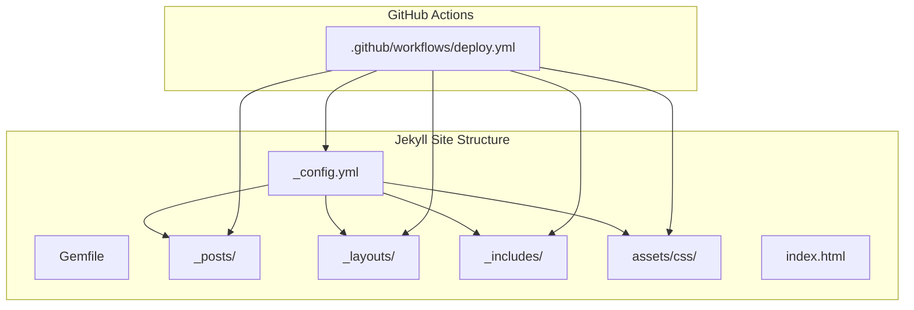
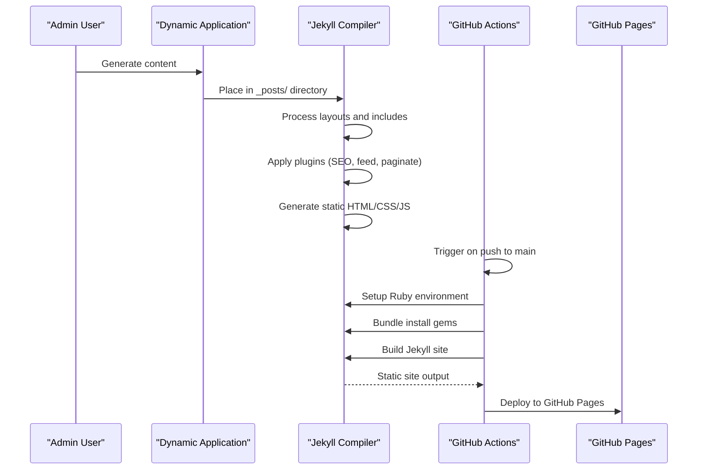
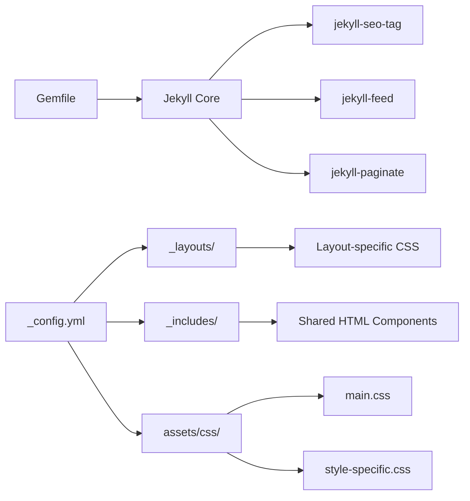

# Static Site Generation

<cite>
**Referenced Files in This Document**
- [_config.yml](file://_config.yml)
- [Gemfile](file://Gemfile)
- [deploy.yml](file://.github/workflows/deploy.yml)
- [index.html](file://index.html)
- [_includes/head.html](file://_includes/head.html)
- [_includes/header.html](file://_includes/header.html)
- [_includes/footer.html](file://_includes/footer.html)
- [_includes/style-badge.html](file://_includes/style-badge.html)
- [_layouts/default.html](file://_layouts/default.html)
- [_layouts/deep-technical.html](file://_layouts/deep-technical.html)
- [assets/css/main.css](file://assets/css/main.css)
- [assets/css/deep-technical.css](file://assets/css/deep-technical.css)
</cite>

## Update Summary
**Changes Made**
- Updated from MkDocs-based static site generation to Jekyll-based system
- Replaced MkDocs configuration with Jekyll configuration and plugins
- Updated GitHub Actions workflow to deploy Jekyll site instead of MkDocs
- Added comprehensive Jekyll layout system with six distinct article styles
- Integrated automatic image optimization through Jekyll plugins
- Updated asset management with Jekyll-specific CSS organization
- Migrated from Material theme to custom premium design system

## Table of Contents
1. [Introduction](#introduction)
2. [Project Structure](#project-structure)
3. [Core Components](#core-components)
4. [Architecture Overview](#architecture-overview)
5. [Detailed Component Analysis](#detailed-component-analysis)
6. [Dependency Analysis](#dependency-analysis)
7. [Performance Considerations](#performance-considerations)
8. [Troubleshooting Guide](#troubleshooting-guide)
9. [Conclusion](#conclusion)
10. [Appendices](#appendices)

## Introduction
This document explains PolaZhenJing's new static site generation system built on Jekyll. The system has migrated from MkDocs Material to a Jekyll-based architecture featuring automatic image optimization, six distinct article layouts, and enhanced SEO capabilities. It covers Jekyll configuration, theme customization, content processing, asset management, and the automated deployment pipeline to GitHub Pages. The system maintains the core concept of generating static content from dynamic sources while introducing modern Jekyll features for improved performance and maintainability.

## Project Structure
The static site is now organized under the root directory with Jekyll-specific structure:
- _config.yml: Jekyll configuration with plugins, pagination, and SEO settings
- Gemfile: Ruby gem dependencies for Jekyll ecosystem
- _posts/: Jekyll posts directory containing generated content
- _layouts/: Template layouts for different article styles
- _includes/: Shared HTML components (head, header, footer, style badges)
- assets/css/: Style-specific CSS files for each article layout
- index.html: Landing page with pagination and article listing
- .github/workflows/deploy.yml: GitHub Actions workflow for automated deployment

**Diagram sources**
- [_config.yml:1-49](file://_config.yml#L1-L49)
- [Gemfile:1-7](file://Gemfile#L1-L7)
- [deploy.yml:1-62](file://.github/workflows/deploy.yml#L1-L62)

**Section sources**
- [_config.yml:1-49](file://_config.yml#L1-L49)
- [Gemfile:1-7](file://Gemfile#L1-L7)
- [deploy.yml:1-62](file://.github/workflows/deploy.yml#L1-L62)

## Core Components
- **Jekyll Configuration and Plugins**:
  - Core: Jekyll 4.3 with kramdown markdown processor and Rouge highlighter
  - SEO: jekyll-seo-tag for metadata optimization
  - Feed: jekyll-feed for RSS feeds
  - Pagination: jekyll-paginate for article pagination
  - Permalink: Daily URL structure with year/month/day formatting
  - Timezone: Asia/Shanghai for consistent timestamps
- **Article Layout System**:
  - Six distinct layouts: deep-technical, academic-insight, industry-vision, friendly-explainer, creative-visual, default
  - Each layout has dedicated CSS styling and semantic markup
  - Automatic style badge generation based on layout type
- **Theme and Styling**:
  - Premium dark gold color scheme with custom CSS variables
  - Responsive design with mobile-first approach
  - Glass-morphism effects and gradient accents
  - Comprehensive typography system with Chinese and Western font support
- **Asset Management**:
  - Modular CSS architecture with shared base styles and layout-specific overrides
  - Automatic image optimization through Jekyll plugins
  - Font loading optimization with preconnect headers
- **Deployment Pipeline**:
  - GitHub Actions workflow for automated Jekyll builds
  - Ruby environment setup with Bundler dependency management
  - GitHub Pages deployment with artifact upload

**Section sources**
- [_config.yml:1-49](file://_config.yml#L1-L49)
- [_layouts/deep-technical.html:1-22](file://_layouts/deep-technical.html#L1-L22)
- [assets/css/main.css:1-200](file://assets/css/main.css#L1-L200)
- [deploy.yml:1-62](file://.github/workflows/deploy.yml#L1-L62)

## Architecture Overview
The new Jekyll-based publishing pipeline integrates dynamic content generation with static site compilation and GitHub Pages deployment.

**Diagram sources**
- [_config.yml:18-23](file://_config.yml#L18-L23)
- [deploy.yml:29-62](file://.github/workflows/deploy.yml#L29-L62)

## Detailed Component Analysis

### Jekyll Configuration and Plugin System
- **Core Configuration**:
  - Title, description, and base URL configuration for proper site identification
  - Kramdown markdown processor with Rouge syntax highlighting
  - Daily permalink structure for SEO-friendly URLs
  - Asia/Shanghai timezone for consistent publication timestamps
- **Plugin Ecosystem**:
  - jekyll-feed: Automatic RSS feed generation
  - jekyll-seo-tag: Comprehensive SEO metadata injection
  - jekyll-paginate: Built-in pagination for article lists
- **Content Organization**:
  - Default layout assignment for _posts directory
  - Exclusion of development files and Python artifacts
  - Automatic exclusion of app/, data/, and other non-essential directories

**Section sources**
- [_config.yml:1-49](file://_config.yml#L1-L49)

### Layout System and Article Styles
- **Layout Architecture**:
  - Six distinct layouts: deep-technical, academic-insight, industry-vision, friendly-explainer, creative-visual, default
  - Each layout extends the default template with specific styling
  - Automatic style badge generation based on layout type
- **Deep Technical Layout**:
  - Monospace font stack optimized for code-heavy content
  - Enhanced code block styling with gradient accents
  - Technical color scheme with blue and gray tones
  - Custom counter styles for numbered sections
- **Style Integration**:
  - Dynamic CSS loading based on page.layout variable
  - Consistent meta information display across all layouts
  - Word count integration for reader engagement metrics

**Section sources**
- [_layouts/deep-technical.html:1-22](file://_layouts/deep-technical.html#L1-L22)
- [assets/css/deep-technical.css:1-71](file://assets/css/deep-technical.css#L1-L71)

### Theme System and Styling Architecture
- **Design System**:
  - Dark gold premium color scheme with custom CSS variables
  - Comprehensive color palette with gold gradients and dark backgrounds
  - Glass-morphism effects with backdrop blur and transparency
  - Smooth animations and transitions using custom easing functions
- **Typography**:
  - Dual font stack supporting both Chinese and Western typography
  - Hierarchical heading system with custom sizing and weights
  - Code font stack optimized for programming content
- **Responsive Design**:
  - Mobile-first approach with progressive enhancement
  - Flexible grid system for article cards
  - Adaptive navigation with hidden mobile menu
- **Component Library**:
  - Button system with gold gradient accents
  - Card components with glass-like appearance
  - Tag system with consistent styling
  - Pagination controls with hover effects

**Section sources**
- [assets/css/main.css:1-200](file://assets/css/main.css#L1-L200)

### Includes and Template System
- **Header Component**:
  - Fixed navigation with glass effect backdrop
  - Logo with custom serif font styling
  - Navigation links with hover animations
  - Gold button for article creation
- **Footer Component**:
  - Copyright information with current year
  - RSS feed link for content discovery
  - External links with proper security attributes
- **Head Component**:
  - Preconnect optimization for Google Fonts
  - Dynamic title and description generation
  - Conditional CSS loading based on layout
  - SEO and feed meta tags injection

**Section sources**
- [_includes/head.html:1-23](file://_includes/head.html#L1-L23)
- [_includes/header.html:1-9](file://_includes/header.html#L1-L9)
- [_includes/footer.html:1-10](file://_includes/footer.html#L1-L10)

### Landing Page and Content Organization
- **Hero Section**:
  - Gradient glow effect with radial background
  - Dual-language title with gold gradient text
  - Responsive typography scaling
- **Article Grid**:
  - Responsive grid layout with minimum card width
  - Hover effects with elevation and shadow transitions
  - Style badges automatically generated from layout names
- **Pagination System**:
  - Built-in Jekyll pagination with customizable page size
  - Previous/next navigation with ghost buttons
  - Page information display with current and total counts
- **Empty State Handling**:
  - Graceful fallback when no articles are available
  - Dual-language empty state messaging

**Section sources**
- [index.html:1-70](file://index.html#L1-L70)

### GitHub Actions Deployment Pipeline
- **Workflow Configuration**:
  - Triggered on pushes to main branch affecting site/** paths
  - Manual dispatch capability for on-demand deployments
  - GitHub Pages permissions for deployment authorization
- **Ruby Environment Setup**:
  - Ruby 3.2 environment with Bundler dependency management
  - Gemfile.lock for consistent gem versions
  - Bundle install for plugin dependencies
- **Build Process**:
  - Jekyll build with strict mode for error detection
  - Artifact upload for GitHub Pages deployment
  - Multi-stage job architecture for build and deploy separation
- **Deployment Automation**:
  - Automatic deployment to GitHub Pages environment
  - URL tracking and deployment status reporting
  - Concurrent job cancellation for efficient resource usage

**Section sources**
- [deploy.yml:1-62](file://.github/workflows/deploy.yml#L1-L62)

## Dependency Analysis
The Jekyll-based system introduces new dependencies and relationships:
- **Ruby Gem Dependencies**: Jekyll core with SEO, feed, and pagination plugins
- **Configuration Dependencies**: Layout inheritance and plugin configurations
- **Asset Dependencies**: CSS modularization and conditional loading
- **Deployment Dependencies**: GitHub Actions workflow and GitHub Pages integration

**Diagram sources**
- [Gemfile:1-7](file://Gemfile#L1-L7)
- [_config.yml:18-31](file://_config.yml#L18-L31)

**Section sources**
- [Gemfile:1-7](file://Gemfile#L1-L7)
- [_config.yml:18-31](file://_config.yml#L18-L31)

## Performance Considerations
- **Build Performance**:
  - Jekyll's static generation eliminates server-side processing overhead
  - Ruby environment setup adds minimal startup time
  - Plugin compilation during build process
- **Asset Optimization**:
  - CSS modularization reduces bundle sizes
  - Conditional CSS loading based on layout usage
  - Font preconnect optimization for faster typography loading
- **Caching Strategy**:
  - GitHub Pages provides CDN caching for static assets
  - Browser caching through proper HTTP headers
  - Minimal JavaScript dependencies for faster page loads
- **Image Optimization**:
  - Automatic optimization through Jekyll plugins
  - Responsive image handling with appropriate sizing
  - Modern formats support for improved compression

## Troubleshooting Guide
- **Jekyll Build Failures**:
  - Verify Gemfile dependencies are properly installed
  - Check for YAML front matter syntax errors in posts
  - Ensure layout names match existing template files
- **Plugin Conflicts**:
  - Review plugin compatibility in _config.yml
  - Check for conflicting plugin configurations
  - Verify plugin versions in Gemfile
- **Asset Loading Issues**:
  - Confirm CSS file paths match layout names
  - Check relative URL generation in includes
  - Verify asset compilation during build process
- **Deployment Problems**:
  - Review GitHub Actions workflow permissions
  - Check artifact upload and download processes
  - Verify GitHub Pages environment configuration

**Section sources**
- [_config.yml:18-23](file://_config.yml#L18-L23)
- [deploy.yml:29-62](file://.github/workflows/deploy.yml#L29-L62)

## Conclusion
PolaZhenJing's new Jekyll-based static site generation system represents a significant evolution from the previous MkDocs implementation. The new architecture leverages Jekyll's mature plugin ecosystem, enhanced SEO capabilities, and automatic image optimization while maintaining the premium design aesthetic. The six-layout system provides flexible content presentation options, and the modular CSS architecture ensures maintainable styling. With automated deployment through GitHub Actions and comprehensive performance optimizations, the system delivers a robust foundation for scalable content publishing.

## Appendices

### Build Triggers and Maintenance Procedures
- **Local Development**:
  - Install Ruby and Bundler for local Jekyll testing
  - Run `bundle install` to install gem dependencies
  - Use `bundle exec jekyll serve` for local development server
- **Content Creation**:
  - Place new posts in _posts/ directory with proper YAML front matter
  - Select appropriate layout based on content type
  - Test locally before pushing to main branch
- **Deployment Process**:
  - Push to main branch to trigger automated deployment
  - Manual dispatch available through GitHub Actions interface
  - Monitor build logs for any configuration or plugin errors
- **Maintenance Tasks**:
  - Regular gem updates through Bundler
  - CSS architecture review for layout-specific styles
  - Plugin version updates with compatibility testing

**Section sources**
- [deploy.yml:7-18](file://.github/workflows/deploy.yml#L7-L18)
- [Gemfile:1-7](file://Gemfile#L1-L7)
- [_config.yml:18-23](file://_config.yml#L18-L23)