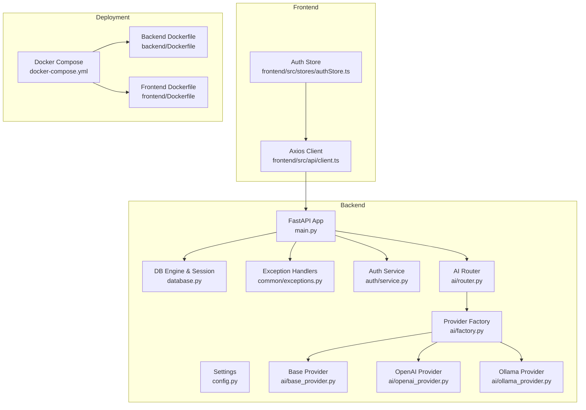
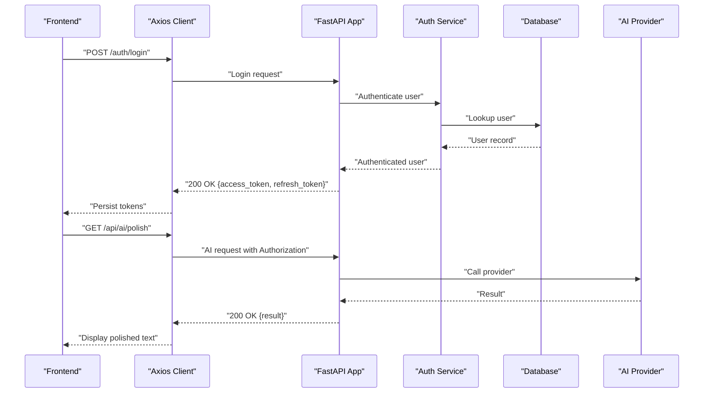
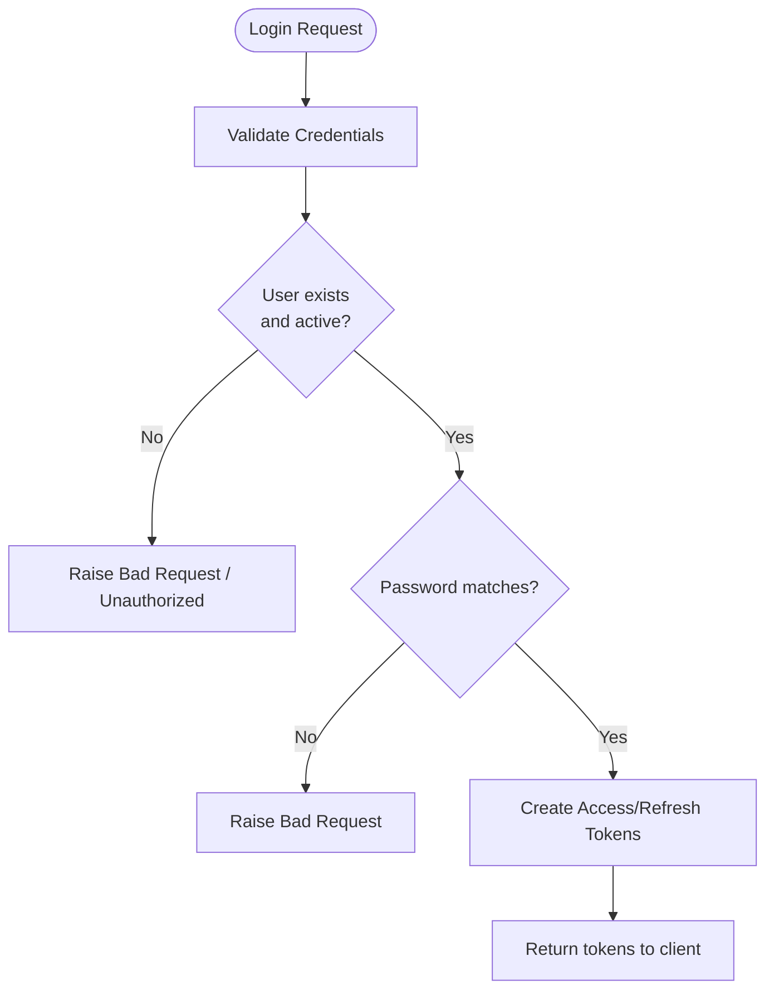
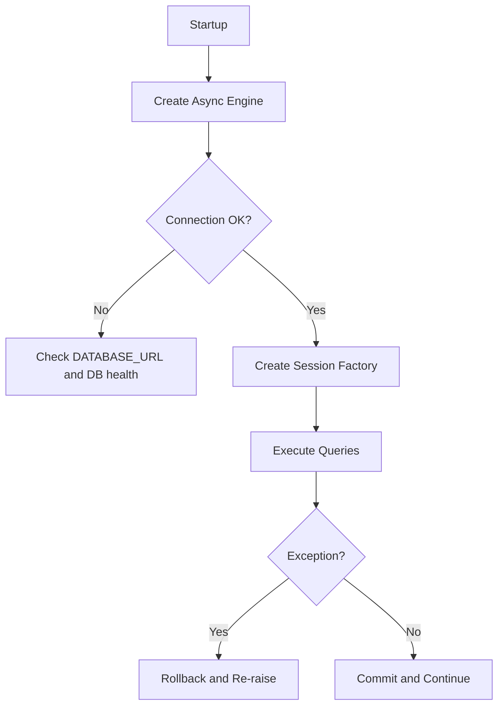
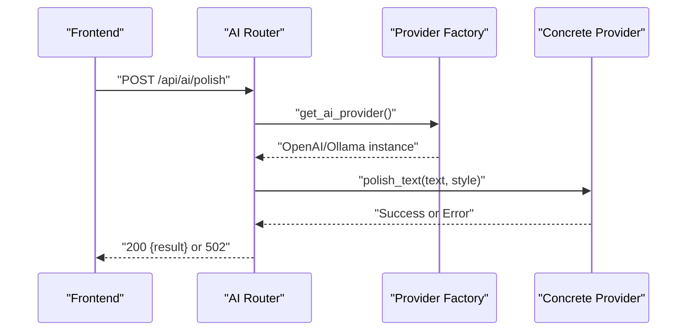
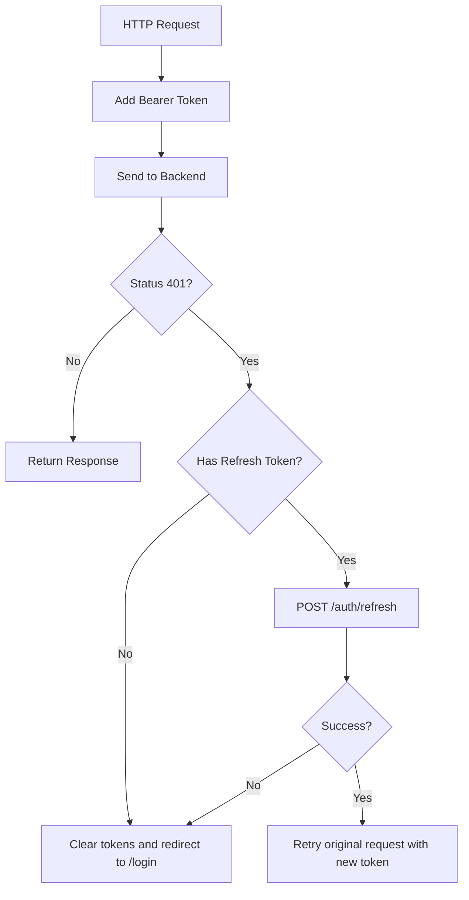
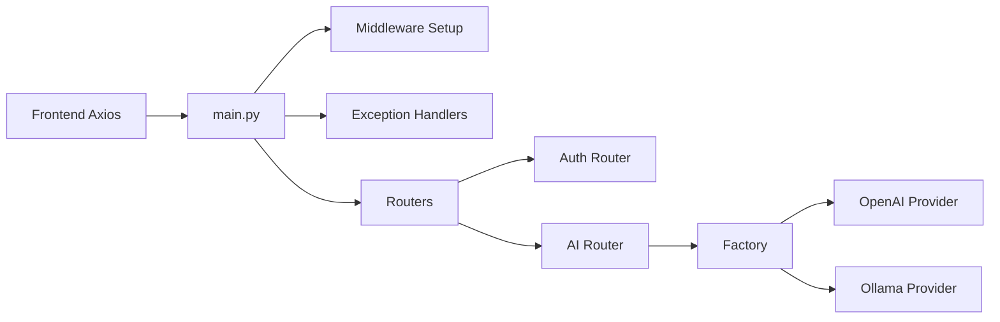

# Troubleshooting and FAQ

<cite>
**Referenced Files in This Document**
- [backend/app/main.py](file://backend/app/main.py)
- [backend/app/config.py](file://backend/app/config.py)
- [backend/app/database.py](file://backend/app/database.py)
- [backend/app/common/exceptions.py](file://backend/app/common/exceptions.py)
- [backend/app/auth/service.py](file://backend/app/auth/service.py)
- [backend/app/ai/router.py](file://backend/app/ai/router.py)
- [backend/app/ai/factory.py](file://backend/app/ai/factory.py)
- [backend/app/ai/base_provider.py](file://backend/app/ai/base_provider.py)
- [backend/app/ai/openai_provider.py](file://backend/app/ai/openai_provider.py)
- [backend/app/ai/ollama_provider.py](file://backend/app/ai/ollama_provider.py)
- [frontend/src/stores/authStore.ts](file://frontend/src/stores/authStore.ts)
- [frontend/src/api/client.ts](file://frontend/src/api/client.ts)
- [docker-compose.yml](file://docker-compose.yml)
- [backend/Dockerfile](file://backend/Dockerfile)
- [frontend/Dockerfile](file://frontend/Dockerfile)
</cite>

## Table of Contents
1. [Introduction](#introduction)
2. [Project Structure](#project-structure)
3. [Core Components](#core-components)
4. [Architecture Overview](#architecture-overview)
5. [Detailed Component Analysis](#detailed-component-analysis)
6. [Dependency Analysis](#dependency-analysis)
7. [Performance Considerations](#performance-considerations)
8. [Troubleshooting Guide](#troubleshooting-guide)
9. [Maintenance Procedures](#maintenance-procedures)
10. [FAQ](#faq)
11. [Conclusion](#conclusion)

## Introduction
This document provides comprehensive troubleshooting and FAQ guidance for PolaZhenJing. It covers authentication issues, database connectivity, AI provider integration failures, and deployment concerns. It also includes performance optimization tips, debugging techniques, maintenance procedures, and step-by-step resolution guides for complex issues.

## Project Structure
The system comprises:
- Backend: FastAPI application with routers for authentication, thoughts, tags, AI, publishing, and sharing; async database sessions; centralized configuration; and unified exception handling.
- AI subsystem: Pluggable provider strategy supporting OpenAI-compatible and Ollama providers.
- Frontend: React + Vite SPA using Axios for HTTP requests and Zustand for state management.
- Deployment: Docker Compose orchestrating Postgres, backend, and frontend services.

**Diagram sources**
- [backend/app/main.py:1-88](file://backend/app/main.py#L1-L88)
- [backend/app/config.py:1-61](file://backend/app/config.py#L1-L61)
- [backend/app/database.py:1-62](file://backend/app/database.py#L1-L62)
- [backend/app/common/exceptions.py:1-87](file://backend/app/common/exceptions.py#L1-L87)
- [backend/app/auth/service.py:1-165](file://backend/app/auth/service.py#L1-L165)
- [backend/app/ai/router.py:1-109](file://backend/app/ai/router.py#L1-L109)
- [backend/app/ai/factory.py:1-44](file://backend/app/ai/factory.py#L1-L44)
- [backend/app/ai/base_provider.py:1-80](file://backend/app/ai/base_provider.py#L1-L80)
- [backend/app/ai/openai_provider.py:1-105](file://backend/app/ai/openai_provider.py#L1-L105)
- [backend/app/ai/ollama_provider.py:1-99](file://backend/app/ai/ollama_provider.py#L1-L99)
- [frontend/src/api/client.ts:1-63](file://frontend/src/api/client.ts#L1-L63)
- [frontend/src/stores/authStore.ts:1-101](file://frontend/src/stores/authStore.ts#L1-L101)
- [docker-compose.yml:1-67](file://docker-compose.yml#L1-L67)
- [backend/Dockerfile:1-29](file://backend/Dockerfile#L1-L29)
- [frontend/Dockerfile:1-20](file://frontend/Dockerfile#L1-L20)

**Section sources**
- [backend/app/main.py:1-88](file://backend/app/main.py#L1-L88)
- [docker-compose.yml:1-67](file://docker-compose.yml#L1-L67)

## Core Components
- Configuration: Centralized settings via environment variables and .env, including database URL, JWT secrets, AI provider selection, and CORS origins.
- Database: Async SQLAlchemy engine with connection pooling and automatic rollback/commit semantics.
- Authentication: Password hashing, JWT access/refresh tokens, and user lookup with explicit error handling.
- AI Providers: Strategy pattern with OpenAI-compatible and Ollama providers; factory resolves provider based on configuration.
- Frontend HTTP client: Axios client with automatic Authorization header injection and 401 refresh flow.

**Section sources**
- [backend/app/config.py:1-61](file://backend/app/config.py#L1-L61)
- [backend/app/database.py:1-62](file://backend/app/database.py#L1-L62)
- [backend/app/auth/service.py:1-165](file://backend/app/auth/service.py#L1-L165)
- [backend/app/ai/factory.py:1-44](file://backend/app/ai/factory.py#L1-L44)
- [frontend/src/api/client.ts:1-63](file://frontend/src/api/client.ts#L1-L63)

## Architecture Overview
The backend exposes REST endpoints, authenticates requests, accesses the database, and delegates AI operations to pluggable providers. The frontend communicates with the backend using Axios and maintains authentication state in localStorage.

**Diagram sources**
- [frontend/src/api/client.ts:1-63](file://frontend/src/api/client.ts#L1-L63)
- [backend/app/main.py:1-88](file://backend/app/main.py#L1-L88)
- [backend/app/auth/service.py:1-165](file://backend/app/auth/service.py#L1-L165)
- [backend/app/ai/router.py:1-109](file://backend/app/ai/router.py#L1-L109)
- [backend/app/ai/openai_provider.py:1-105](file://backend/app/ai/openai_provider.py#L1-L105)
- [backend/app/ai/ollama_provider.py:1-99](file://backend/app/ai/ollama_provider.py#L1-L99)

## Detailed Component Analysis

### Authentication Flow and Common Issues
- Symptoms: Login fails, “Invalid username or password,” or “User not found.”
- Causes:
  - Incorrect credentials or deactivated account.
  - Missing or invalid JWT secret.
  - Token decoding/validation errors.
- Resolution steps:
  1. Verify credentials and activation status via authentication service.
  2. Confirm JWT_SECRET_KEY and algorithm match configuration.
  3. Ensure Authorization header is present in requests.
  4. Clear browser localStorage tokens and re-authenticate.

**Diagram sources**
- [backend/app/auth/service.py:125-149](file://backend/app/auth/service.py#L125-L149)
- [frontend/src/stores/authStore.ts:42-58](file://frontend/src/stores/authStore.ts#L42-L58)

**Section sources**
- [backend/app/auth/service.py:1-165](file://backend/app/auth/service.py#L1-L165)
- [frontend/src/stores/authStore.ts:1-101](file://frontend/src/stores/authStore.ts#L1-L101)

### Database Connectivity and Queries
- Symptoms: Connection refused, timeouts, or session commit/rollback errors.
- Causes:
  - Incorrect DATABASE_URL.
  - Postgres not running or unhealthy.
  - Pool exhaustion or pre-ping failures.
- Resolution steps:
  1. Confirm DATABASE_URL matches running Postgres service.
  2. Check container health and logs for Postgres.
  3. Adjust pool_size and max_overflow if needed.
  4. Enable debug logging to inspect SQL statements.

**Diagram sources**
- [backend/app/database.py:24-62](file://backend/app/database.py#L24-L62)
- [docker-compose.yml:10-27](file://docker-compose.yml#L10-L27)

**Section sources**
- [backend/app/database.py:1-62](file://backend/app/database.py#L1-L62)
- [docker-compose.yml:1-67](file://docker-compose.yml#L1-L67)

### AI Provider Integration Failures
- Symptoms: AI endpoints return 502 “AI service unavailable.”
- Causes:
  - Provider misconfiguration (API key, base URL, model).
  - Network timeouts or provider unavailability.
  - Malformed responses (e.g., invalid JSON for tags).
- Resolution steps:
  1. Verify AI_PROVIDER setting and provider-specific keys/URLs.
  2. Test provider endpoints externally (curl or Postman).
  3. Inspect provider logs for HTTP status and error messages.
  4. Validate request payloads and limits (length, tags count).

**Diagram sources**
- [backend/app/ai/router.py:51-63](file://backend/app/ai/router.py#L51-L63)
- [backend/app/ai/factory.py:18-44](file://backend/app/ai/factory.py#L18-L44)
- [backend/app/ai/openai_provider.py:38-66](file://backend/app/ai/openai_provider.py#L38-L66)
- [backend/app/ai/ollama_provider.py:36-59](file://backend/app/ai/ollama_provider.py#L36-L59)

**Section sources**
- [backend/app/ai/router.py:1-109](file://backend/app/ai/router.py#L1-L109)
- [backend/app/ai/factory.py:1-44](file://backend/app/ai/factory.py#L1-L44)
- [backend/app/ai/openai_provider.py:1-105](file://backend/app/ai/openai_provider.py#L1-L105)
- [backend/app/ai/ollama_provider.py:1-99](file://backend/app/ai/ollama_provider.py#L1-L99)

### Frontend Authentication and Token Management
- Symptoms: Stuck on login, redirected to login after 401, or “Access denied.”
- Causes:
  - Missing or expired access token.
  - Refresh token invalid or missing.
  - Axios interceptors not attaching Authorization header.
- Resolution steps:
  1. Ensure localStorage contains both access_token and refresh_token.
  2. Verify request interceptor sets Authorization header.
  3. Confirm response interceptor attempts refresh on 401.
  4. Clear tokens and re-login if refresh fails.

**Diagram sources**
- [frontend/src/api/client.ts:19-60](file://frontend/src/api/client.ts#L19-L60)
- [frontend/src/stores/authStore.ts:79-95](file://frontend/src/stores/authStore.ts#L79-L95)

**Section sources**
- [frontend/src/api/client.ts:1-63](file://frontend/src/api/client.ts#L1-L63)
- [frontend/src/stores/authStore.ts:1-101](file://frontend/src/stores/authStore.ts#L1-L101)

## Dependency Analysis
- Backend startup wires middleware, exception handlers, and routers; health check endpoint exposed.
- AI provider selection is resolved at runtime via factory; provider implementations depend on httpx and configuration.
- Frontend depends on Axios interceptors and local storage for token persistence.

**Diagram sources**
- [backend/app/main.py:40-71](file://backend/app/main.py#L40-L71)
- [backend/app/ai/factory.py:18-44](file://backend/app/ai/factory.py#L18-L44)
- [frontend/src/api/client.ts:14-26](file://frontend/src/api/client.ts#L14-L26)

**Section sources**
- [backend/app/main.py:1-88](file://backend/app/main.py#L1-L88)
- [backend/app/ai/factory.py:1-44](file://backend/app/ai/factory.py#L1-L44)
- [frontend/src/api/client.ts:1-63](file://frontend/src/api/client.ts#L1-L63)

## Performance Considerations
- Database
  - Tune pool_size and max_overflow based on workload.
  - Enable SQL echo only temporarily for profiling.
  - Use connection pre-ping to detect stale connections.
- AI Requests
  - Increase timeouts for Ollama; reduce for OpenAI-compatible APIs.
  - Validate prompt constraints to avoid excessive token usage.
- Frontend
  - Debounce AI requests and avoid redundant calls.
  - Cache small, static results where appropriate.

[No sources needed since this section provides general guidance]

## Troubleshooting Guide

### Authentication Problems
- Symptom: Login returns bad request or unauthorized.
  - Check username/email uniqueness and password hashing.
  - Verify JWT_SECRET_KEY and algorithm.
  - Confirm user is active.
- Symptom: 401 Unauthorized after successful login.
  - Ensure Authorization header is attached.
  - Attempt token refresh; clear tokens if refresh fails.
- Symptom: “User not found” during protected route access.
  - Validate token decoding and payload presence.

**Section sources**
- [backend/app/auth/service.py:91-165](file://backend/app/auth/service.py#L91-L165)
- [frontend/src/api/client.ts:29-60](file://frontend/src/api/client.ts#L29-L60)

### Database Connection Errors
- Symptom: Startup or runtime connection failures.
  - Verify DATABASE_URL matches Postgres service.
  - Confirm Postgres container health and logs.
  - Adjust pool settings and enable debug logging.
- Symptom: Transaction errors or deadlocks.
  - Review session commit/rollback behavior.
  - Reduce concurrent writes or batch operations.

**Section sources**
- [backend/app/database.py:24-62](file://backend/app/database.py#L24-L62)
- [docker-compose.yml:10-27](file://docker-compose.yml#L10-L27)

### AI Provider Integration Failures
- Symptom: 502 “AI service unavailable.”
  - Validate AI_PROVIDER and provider-specific keys/URLs.
  - Test provider endpoints independently.
  - Inspect provider logs for HTTP status and error bodies.
- Symptom: Tags endpoint returns empty list.
  - Provider may return non-JSON; ensure parsing robustness.
- Symptom: Slow responses or timeouts.
  - Increase provider timeouts; optimize prompts.

**Section sources**
- [backend/app/ai/router.py:51-109](file://backend/app/ai/router.py#L51-L109)
- [backend/app/ai/openai_provider.py:38-66](file://backend/app/ai/openai_provider.py#L38-L66)
- [backend/app/ai/ollama_provider.py:36-59](file://backend/app/ai/ollama_provider.py#L36-L59)

### Deployment Issues
- Symptom: Backend cannot connect to Postgres.
  - Ensure DATABASE_URL uses internal service name.
  - Confirm depends_on with healthcheck.
- Symptom: Frontend hot reload not working.
  - Mount project directory and node_modules volume exclusion.
- Symptom: Port conflicts or exposure issues.
  - Verify published ports and host bindings.

**Section sources**
- [docker-compose.yml:34-49](file://docker-compose.yml#L34-L49)
- [backend/Dockerfile:1-29](file://backend/Dockerfile#L1-L29)
- [frontend/Dockerfile:1-20](file://frontend/Dockerfile#L1-L20)

### Debugging Techniques and Log Analysis
- Enable DEBUG logging to capture request/response and SQL statements.
- Inspect backend logs for exception stack traces and AI provider errors.
- Use curl or Postman to isolate API-level issues.
- Monitor Postgres logs for connection and query performance.

**Section sources**
- [backend/app/main.py:21-25](file://backend/app/main.py#L21-L25)
- [backend/app/common/exceptions.py:73-86](file://backend/app/common/exceptions.py#L73-L86)
- [backend/app/ai/openai_provider.py:62-63](file://backend/app/ai/openai_provider.py#L62-L63)
- [backend/app/ai/ollama_provider.py:56-57](file://backend/app/ai/ollama_provider.py#L56-L57)

### Step-by-Step Resolution Guides

#### Resolve Authentication Failures
1. Confirm credentials and user activation.
2. Verify JWT_SECRET_KEY and algorithm.
3. Clear tokens and retry login.
4. Inspect backend logs for UnauthorizedException details.

**Section sources**
- [backend/app/auth/service.py:125-149](file://backend/app/auth/service.py#L125-L149)
- [frontend/src/stores/authStore.ts:42-58](file://frontend/src/stores/authStore.ts#L42-L58)

#### Fix Database Connectivity
1. Validate DATABASE_URL and Postgres service availability.
2. Check container healthcheck and logs.
3. Adjust pool_size/max_overflow and enable debug logging.
4. Restart backend after fixing configuration.

**Section sources**
- [backend/app/database.py:24-36](file://backend/app/database.py#L24-L36)
- [docker-compose.yml:22-26](file://docker-compose.yml#L22-L26)

#### Resolve AI Provider Unavailable
1. Set AI_PROVIDER to supported value.
2. Configure API key and base URL for selected provider.
3. Test provider endpoints externally.
4. Increase timeouts if needed; handle malformed responses.

**Section sources**
- [backend/app/ai/factory.py:18-44](file://backend/app/ai/factory.py#L18-L44)
- [backend/app/ai/openai_provider.py:32-36](file://backend/app/ai/openai_provider.py#L32-L36)
- [backend/app/ai/ollama_provider.py:31-33](file://backend/app/ai/ollama_provider.py#L31-L33)

#### Fix Frontend 401 Errors
1. Ensure localStorage contains both tokens.
2. Confirm request interceptor adds Authorization header.
3. Allow response interceptor to refresh on 401.
4. Clear tokens and redirect to login if refresh fails.

**Section sources**
- [frontend/src/api/client.ts:19-60](file://frontend/src/api/client.ts#L19-L60)
- [frontend/src/stores/authStore.ts:79-95](file://frontend/src/stores/authStore.ts#L79-L95)

### Escalation Procedures
- Capture backend logs with DEBUG enabled.
- Provide AI provider error logs and HTTP status codes.
- Include database connection logs and pool metrics.
- Document frontend token lifecycle and interceptor behavior.

[No sources needed since this section provides general guidance]

## Maintenance Procedures

### Database Cleanup
- Remove inactive users or old records periodically.
- Vacuum and analyze Postgres tables to maintain performance.
- Back up before large cleanup operations.

[No sources needed since this section provides general guidance]

### Log Rotation
- Use system logrotate or container logging drivers to rotate backend logs.
- Archive rotated logs offsite.

[No sources needed since this section provides general guidance]

### Backup Procedures
- Schedule regular Postgres logical backups.
- Snapshot persistent volumes for development environments.
- Test restore procedures regularly.

[No sources needed since this section provides general guidance]

## FAQ

- How do I configure the AI provider?
  - Set AI_PROVIDER to either "openai" or "ollama". For OpenAI-compatible, configure OPENAI_API_KEY, OPENAI_BASE_URL, and OPENAI_MODEL. For Ollama, configure OLLAMA_BASE_URL and OLLAMA_MODEL.

- Why am I getting 401 Unauthorized?
  - Missing or expired access token; ensure Authorization header is present. The frontend attempts to refresh automatically; if refresh fails, clear tokens and re-login.

- How do I fix database connection errors?
  - Verify DATABASE_URL matches the Postgres service. Confirm container health and adjust pool settings if needed.

- How can I improve API response times?
  - Tune database pool settings, reduce AI request timeouts, and debounce frontend requests.

- How do I enable debug logging?
  - Set DEBUG=true in configuration to increase verbosity. Use DEBUG logs to trace SQL and exceptions.

**Section sources**
- [backend/app/config.py:32-56](file://backend/app/config.py#L32-L56)
- [frontend/src/api/client.ts:19-60](file://frontend/src/api/client.ts#L19-L60)
- [backend/app/database.py:24-36](file://backend/app/database.py#L24-L36)
- [backend/app/main.py:21-25](file://backend/app/main.py#L21-L25)

## Conclusion
By following the troubleshooting steps, leveraging the provided diagnostics, and adhering to the maintenance procedures, most issues with PolaZhenJing can be quickly identified and resolved. For persistent problems, escalate with detailed logs and reproduction steps.