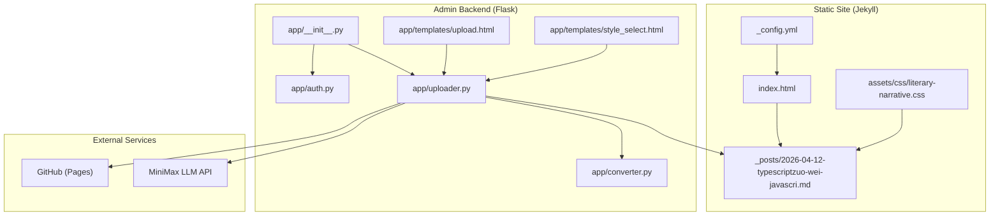
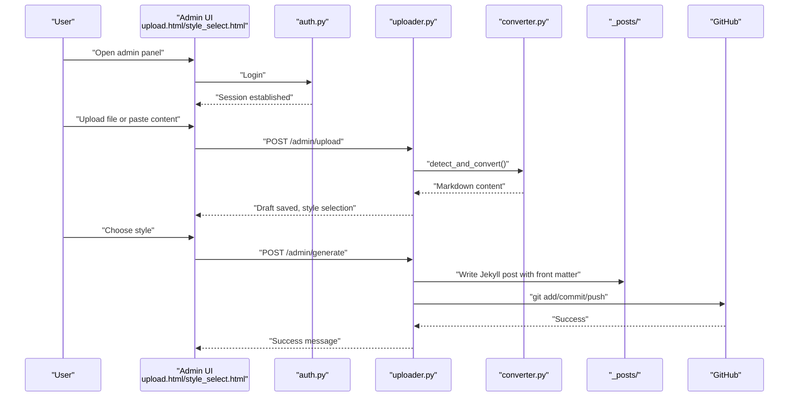
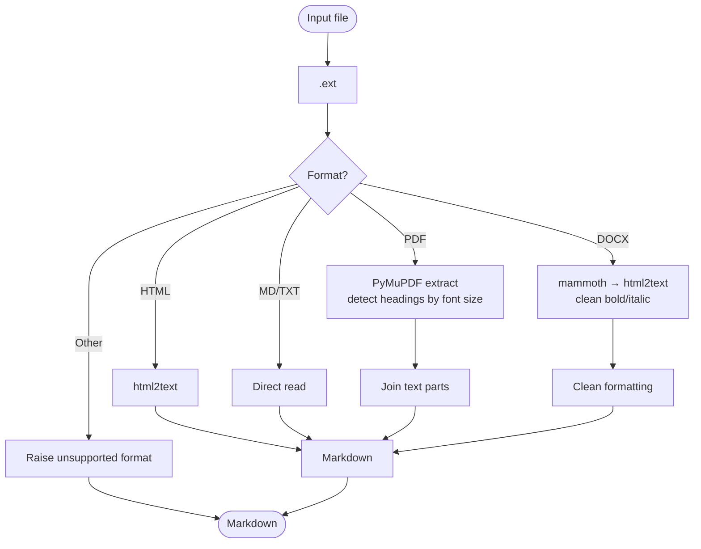
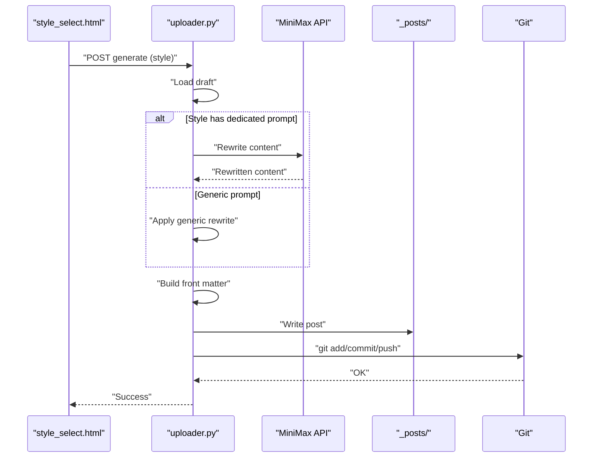
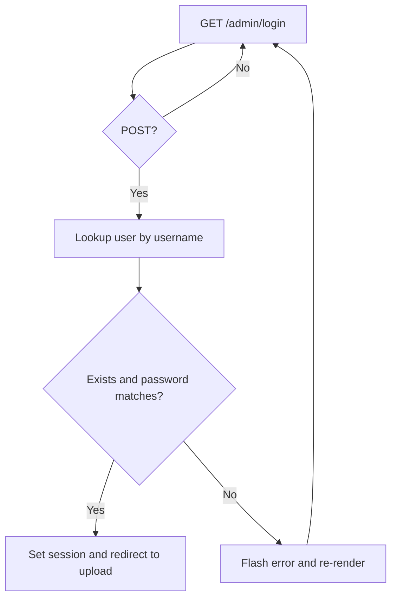
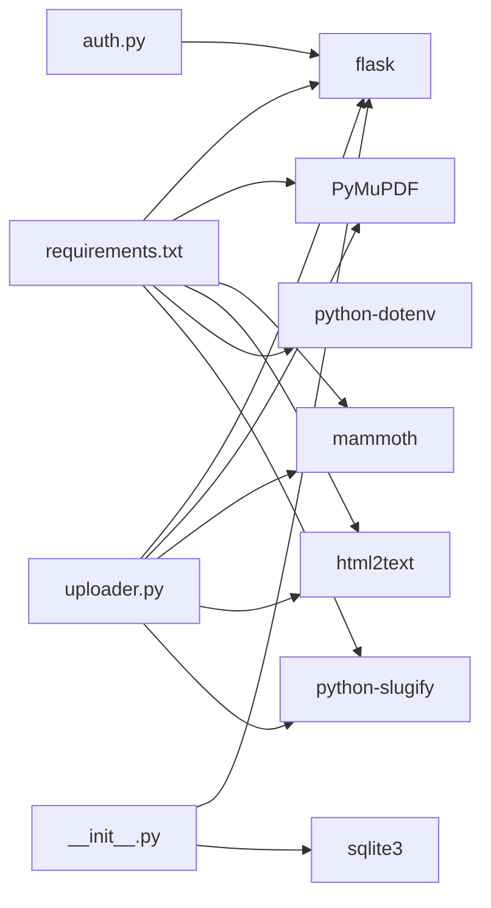

# Typescript Article

<cite>
**Referenced Files in This Document**
- [_posts/2026-04-12-typescriptzuo-wei-javascri.md](file://_posts/2026-04-12-typescriptzuo-wei-javascri.md)
- [_config.yml](file://_config.yml)
- [index.html](file://index.html)
- [app/__init__.py](file://app/__init__.py)
- [app/converter.py](file://app/converter.py)
- [app/uploader.py](file://app/uploader.py)
- [app/auth.py](file://app/auth.py)
- [app/templates/upload.html](file://app/templates/upload.html)
- [app/templates/style_select.html](file://app/templates/style_select.html)
- [assets/css/literary-narrative.css](file://assets/css/literary-narrative.css)
- [requirements.txt](file://requirements.txt)
</cite>

## Table of Contents
1. [Introduction](#introduction)
2. [Project Structure](#project-structure)
3. [Core Components](#core-components)
4. [Architecture Overview](#architecture-overview)
5. [Detailed Component Analysis](#detailed-component-analysis)
6. [Dependency Analysis](#dependency-analysis)
7. [Performance Considerations](#performance-considerations)
8. [Troubleshooting Guide](#troubleshooting-guide)
9. [Conclusion](#conclusion)

## Introduction
This document explains the Typescript article and the end-to-end system that supports it. The article explores how TypeScript enhances JavaScript with a static type system, improves developer productivity, and enables safer collaboration—especially in AI-assisted development. It also documents the supporting backend and admin UI that converts uploaded content into a Jekyll-ready article, applies a chosen writing style, and publishes it to GitHub Pages.

## Project Structure
The repository is a hybrid static site (Jekyll) with a small Python/Flask admin backend. The Typescript article is authored as a Markdown post and rendered by Jekyll. The admin backend handles file uploads, content conversion, style selection, optional LLM rewriting, and publishing to GitHub.

**Diagram sources**
- [_config.yml](file://_config.yml)
- [index.html](file://index.html)
- [_posts/2026-04-12-typescriptzuo-wei-javascri.md](file://_posts/2026-04-12-typescriptzuo-wei-javascri.md)
- [assets/css/literary-narrative.css](file://assets/css/literary-narrative.css)
- [app/__init__.py](file://app/__init__.py)
- [app/auth.py](file://app/auth.py)
- [app/uploader.py](file://app/uploader.py)
- [app/converter.py](file://app/converter.py)
- [app/templates/upload.html](file://app/templates/upload.html)
- [app/templates/style_select.html](file://app/templates/style_select.html)

**Section sources**
- [_config.yml](file://_config.yml)
- [index.html](file://index.html)
- [app/__init__.py](file://app/__init__.py)
- [app/uploader.py](file://app/uploader.py)
- [app/converter.py](file://app/converter.py)
- [app/auth.py](file://app/auth.py)
- [app/templates/upload.html](file://app/templates/upload.html)
- [app/templates/style_select.html](file://app/templates/style_select.html)
- [assets/css/literary-narrative.css](file://assets/css/literary-narrative.css)

## Core Components
- Typescript article content: A Jekyll post authored in Markdown with front matter and literary narrative styling.
- Admin backend: A Flask application providing authentication, upload, conversion, style selection, optional LLM rewriting, and GitHub synchronization.
- Static rendering: Jekyll builds the site using layouts and stylesheets, including the literary narrative theme for the article.

Key responsibilities:
- Typescript article: Narrates the value of TypeScript’s static typing, IDE support, and AI collaboration.
- Converter: Extracts and normalizes content from PDF/DOCX/HTML/MD/TXT into Markdown.
- Uploader: Orchestrates conversion, style selection, optional LLM rewriting, and publishing to GitHub Pages.
- Authentication: Protects admin routes and manages user sessions.
- Styles: Applies CSS themes (e.g., literary-narrative) to the rendered article.

**Section sources**
- [_posts/2026-04-12-typescriptzuo-wei-javascri.md](file://_posts/2026-04-12-typescriptzuo-wei-javascri.md)
- [app/converter.py](file://app/converter.py)
- [app/uploader.py](file://app/uploader.py)
- [app/auth.py](file://app/auth.py)
- [assets/css/literary-narrative.css](file://assets/css/literary-narrative.css)

## Architecture Overview
The system combines a static blog generator with a lightweight admin service. The Typescript article is authored as Markdown and styled via Jekyll layouts and CSS. The admin backend automates content ingestion, normalization, and publication.

**Diagram sources**
- [app/templates/upload.html](file://app/templates/upload.html)
- [app/templates/style_select.html](file://app/templates/style_select.html)
- [app/auth.py](file://app/auth.py)
- [app/uploader.py](file://app/uploader.py)
- [app/converter.py](file://app/converter.py)

## Detailed Component Analysis

### Typescript Article Content
- Purpose: A literary narrative piece exploring TypeScript’s role as JavaScript’s “skeleton,” its type system, interfaces, toolchain, and AI collaboration.
- Rendering: Published as a Jekyll post with front matter and rendered by the literary-narrative layout and stylesheet.
- Themes: Static safety, developer ergonomics, and future-proofing in AI-augmented development.

**Section sources**
- [_posts/2026-04-12-typescriptzuo-wei-javascri.md](file://_posts/2026-04-12-typescriptzuo-wei-javascri.md)
- [_config.yml](file://_config.yml)
- [index.html](file://index.html)
- [assets/css/literary-narrative.css](file://assets/css/literary-narrative.css)

### Converter Pipeline
- Functionality: Converts PDF, DOCX, HTML, MD, TXT into normalized Markdown. Detects headings by font size (PDF), cleans formatting artifacts (DOCX), and preserves structure for HTML/MD.
- Robustness: Provides fallback behavior when conversion libraries are missing and strips excessive bold/italic wrappers.

**Diagram sources**
- [app/converter.py](file://app/converter.py)

**Section sources**
- [app/converter.py](file://app/converter.py)

### Uploader Workflow
- Upload: Accepts file or paste input, validates extension, saves draft, and forwards to style selection.
- Style Selection: Presents six writing styles with previews and color accents; captures selected style.
- Generation: Optionally calls an LLM to rewrite content per style, builds Jekyll front matter, writes the post to _posts/, and pushes to GitHub.
- Preview: Renders Markdown to HTML locally for previewing before publishing.

**Diagram sources**
- [app/templates/style_select.html](file://app/templates/style_select.html)
- [app/uploader.py](file://app/uploader.py)

**Section sources**
- [app/uploader.py](file://app/uploader.py)
- [app/templates/style_select.html](file://app/templates/style_select.html)

### Authentication and Authorization
- Login: Validates credentials against SQLite and starts a session.
- Registration: Requires a QQ.com email, generates a 6-digit verification code, sends via mailer, and marks email as verified.
- Password Change: Updates hashed password for the current user.
- Protected Routes: Decorator enforces session presence for admin endpoints.

**Diagram sources**
- [app/auth.py](file://app/auth.py)

**Section sources**
- [app/auth.py](file://app/auth.py)
- [app/__init__.py](file://app/__init__.py)

### Static Site Rendering and Styling
- Jekyll config: Defines permalinks, pagination, plugins, and defaults for posts.
- Index page: Lists paginated posts with layout badges and excerpts.
- Literary narrative style: Custom CSS for typography, drop caps, blockquotes, links, and tables tailored for the article’s tone.

**Section sources**
- [_config.yml](file://_config.yml)
- [index.html](file://index.html)
- [assets/css/literary-narrative.css](file://assets/css/literary-narrative.css)

## Dependency Analysis
- Python runtime and packages: Flask, PyMuPDF, mammoth, html2text, python-dotenv, python-slugify.
- Admin backend depends on:
  - SQLite for user storage.
  - Optional external LLM API for content rewriting.
  - Git CLI for publishing to GitHub.
- Frontend templates depend on:
  - Jinja2 templating for dynamic rendering.
  - CSS modules for layout and typography.

**Diagram sources**
- [requirements.txt](file://requirements.txt)
- [app/uploader.py](file://app/uploader.py)
- [app/auth.py](file://app/auth.py)
- [app/__init__.py](file://app/__init__.py)

**Section sources**
- [requirements.txt](file://requirements.txt)
- [app/uploader.py](file://app/uploader.py)
- [app/auth.py](file://app/auth.py)
- [app/__init__.py](file://app/__init__.py)

## Performance Considerations
- Conversion cost: PDF parsing and DOCX transformations can be CPU-intensive; ensure adequate memory and avoid concurrent heavy conversions.
- LLM calls: Rate limits and latency apply; consider retries and timeouts.
- Publishing: Git operations can block; keep repository clean and avoid large binary assets.
- Rendering: Jekyll builds are generally fast; keep front matter minimal and avoid heavy Liquid filters.

## Troubleshooting Guide
Common issues and resolutions:
- Missing conversion libraries: Install optional dependencies to enable PDF/DOCX/HTML conversion.
- LLM API key missing: Set the API key environment variable; the backend logs warnings when absent.
- Unsupported file type: Only accepted extensions are supported; verify the file extension.
- Draft not found: Ensure the session carries a valid draft ID; regenerate if expired.
- Git push failures: Check network connectivity and credentials; review flashed error messages.

Operational checks:
- Verify environment variables for secrets and API keys.
- Confirm SQLite initialization and permissions.
- Validate Jekyll configuration and plugin availability.

**Section sources**
- [app/converter.py](file://app/converter.py)
- [app/uploader.py](file://app/uploader.py)
- [app/auth.py](file://app/auth.py)
- [app/__init__.py](file://app/__init__.py)

## Conclusion
The Typescript article presents TypeScript not merely as a superset of JavaScript, but as a framework for clarity, safety, and collaboration—particularly in AI-augmented workflows. The supporting backend streamlines content ingestion, normalization, stylistic shaping, and automated publishing, enabling authors to focus on ideas while the system handles the mechanics of production-ready articles.