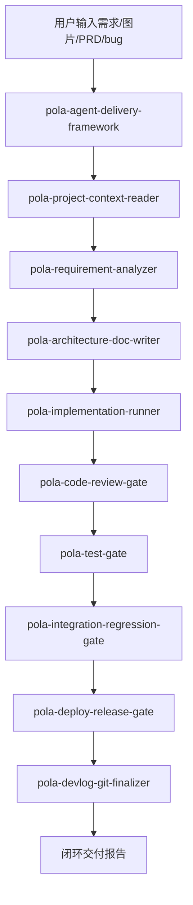

# Pola A2A Agent Skill Framework 使用文档

## 1. 这套技能解决什么问题

`pola-` 技能组是一套面向软件项目交付的 Agent-to-Agent（A2A）闭环框架。它把一个需求从“想法、截图、会议草图、PRD 或 bug 描述”一路推进到：

- 读取项目上下文
- 需求分析
- 架构开发文档
- 编码实现
- 代码 review
- 单元测试和质量门禁
- 集成测试和回归测试
- 发布部署准备
- 开发日志和 git 收尾

核心思想是：**一个总控 Agent 编排多个阶段 Agent，每个阶段都有明确输入、输出、门禁和 artifact，最终形成可追踪、可复查、可上线的闭环交付。**

## 2. 技能清单

| Skill | 角色 | 主要输出 |
| --- | --- | --- |
| `pola-agent-delivery-framework` | 总控 Agent | 全链路阶段表、delivery summary |
| `pola-project-context-reader` | 项目侦察 Agent | `project-context` |
| `pola-requirement-analyzer` | 需求分析 Agent | `requirement` |
| `pola-architecture-doc-writer` | 架构设计 Agent | `architecture-plan` |
| `pola-implementation-runner` | 编码执行 Agent | `implementation` |
| `pola-code-review-gate` | 代码审查 Agent | `review` |
| `pola-test-gate` | 测试门禁 Agent | `test-evidence` |
| `pola-integration-regression-gate` | 集成回归 Agent | `regression-evidence` |
| `pola-deploy-release-gate` | 发布部署 Agent | `release-plan` |
| `pola-devlog-git-finalizer` | 日志和提交 Agent | `finalization` |
| `pola-devlog-writer` | 开发日志专项 Agent | `开发日志.md` 或 `DEVLOG.md` |

## 3. A2A 闭环工作流

### 3.1 总体流程



### 3.2 A2A 数据交接

每个阶段都输出一个 artifact，下一阶段直接读取上一个 artifact，而不是重新猜上下文。

```text
project-context
  -> requirement
  -> architecture-plan
  -> implementation
  -> review
  -> test-evidence
  -> regression-evidence
  -> release-plan
  -> finalization
```

artifact 字段定义在：

[artifact-contract.md](./pola-agent-delivery-framework/references/artifact-contract.md)

阶段门禁定义在：

[workflow-gates.md](./pola-agent-delivery-framework/references/workflow-gates.md)

## 4. 推荐安装方式

把压缩包解压到你的 Codex skills 目录，或放在项目仓库内按需引用。

常见位置：

```bash
mkdir -p ~/.codex/skills
unzip pola-a2a-skills-package.zip -d ~/.codex/skills
```

如果你希望这些 skill 只在某个项目里使用，也可以解压到项目目录，例如：

```bash
unzip pola-a2a-skills-package.zip -d ./skills
```

## 5. 最常用的触发方式

### 5.1 从一个需求开始完整交付

```text
使用 pola-agent-delivery-framework，把这个需求从分析、架构、编码、review、测试、发布准备到开发日志和 git 收尾完整跑一遍。

需求：
...
```

适合：新功能、复杂 bugfix、跨模块需求、需要上线的需求。

### 5.2 只做需求分析和架构规划

```text
使用 pola-agent-delivery-framework，先 Plan only，不改代码。根据下面图片和项目目录形成需求分析和架构开发文档。
```

适合：需求还没拍板、需要先评审方案。

### 5.3 对已有 diff 做 review 和测试闭环

```text
使用 pola-code-review-gate 和 pola-test-gate，检查当前 diff，补充测试建议和发布风险。
```

适合：代码已经写完，但缺少审查和验证。

### 5.4 发布前检查

```text
使用 pola-deploy-release-gate，基于当前改动生成发布清单、部署步骤、回滚方案和发布后回归计划。
```

适合：准备 staging 或 production 发布。

### 5.5 完成开发日志和 git 收尾

```text
使用 pola-devlog-git-finalizer，更新开发日志，检查 diff，生成中文 commit message，并准备提交。
```

适合：开发完成后归档和提交。

## 6. 一个项目从头到尾如何闭环

下面是一条标准交付路径。

### Step 1：读取项目

触发：

```text
使用 pola-project-context-reader 读取当前项目，输出 project-context。
```

产出：

- 技术栈
- 启动命令
- 测试命令
- 构建命令
- 部署方式
- 文档和规范
- git 状态
- 风险点

可用脚本：

```bash
bash pola-project-context-reader/scripts/detect_project.sh .
bash pola-project-context-reader/scripts/collect_context.sh .
```

### Step 2：需求分析

触发：

```text
使用 pola-requirement-analyzer，根据我的描述、图片和 project-context，整理 requirement。
```

产出：

- 需求目标
- 用户路径
- 输入和输出
- 非目标
- 假设
- 验收标准
- 风险和待澄清问题

要求：没有可验证的验收标准，不进入编码。

### Step 3：架构开发文档

触发：

```text
使用 pola-architecture-doc-writer，把 requirement 转成 architecture-plan。
```

产出：

- 当前系统理解
- 推荐方案和备选方案
- 模块影响
- 数据流和接口
- 文件改动计划
- 测试策略
- 部署和回滚
- 验收映射

模板参考：

[doc-templates.md](./pola-architecture-doc-writer/references/doc-templates.md)

### Step 4：编码实现

触发：

```text
使用 pola-implementation-runner，按 architecture-plan 实现代码，并维护验收项映射。
```

执行规则：

- 先读相似实现
- 小步修改
- 不覆盖用户已有改动
- 不做无关重构
- 同步补测试
- 记录关键决策

产出：

- 改动文件
- 验收项映射
- 新增测试
- 实现风险

### Step 5：代码 review

触发：

```text
使用 pola-code-review-gate，对本次 diff 做 review。
```

检查：

- 正确性
- 安全
- 可维护性
- 测试缺口
- 发布风险

rubric 参考：

[review-rubric.md](./pola-code-review-gate/references/review-rubric.md)

门禁：P0/P1 问题未解决，不进入发布准备。

### Step 6：测试门禁

触发：

```text
使用 pola-test-gate，运行最小相关测试、lint、typecheck、build。
```

可用脚本：

```bash
bash pola-test-gate/scripts/run_quality_gates.sh
```

产出：

- 命令
- 退出码
- 关键结果
- 失败分类
- 未覆盖项

### Step 7：集成与回归

触发：

```text
使用 pola-integration-regression-gate，验证真实用户路径和 bugfix 原始复现 case。
```

覆盖：

- API 请求
- 前端页面
- 表单和结果
- 历史记录
- 下载
- 计费
- 日志
- 部署后健康检查

要求：不能把“单测通过”说成“回归通过”。

### Step 8：发布部署准备

触发：

```text
使用 pola-deploy-release-gate，生成 release-plan，不执行生产命令，先给我确认。
```

产出：

- 发布面
- 待发布 commit
- 发布前验证
- 部署步骤
- 发布后验证
- 回滚方案
- 观察项

规则：生产写操作、重启、迁移、切流、覆盖配置前必须单独确认。

### Step 9：开发日志和 git 收尾

触发：

```text
使用 pola-devlog-git-finalizer，更新开发日志，检查 diff，生成中文 commit message。
```

产出：

- 开发日志
- CHANGELOG 判断
- 需求状态回填
- git 状态
- commit message
- push 状态

如果只是写开发日志，可以直接使用：

```text
使用 pola-devlog-writer，给这个项目更新开发日志。
```

## 7. 总控一键式提示词

可以直接复制使用：

```text
使用 pola-agent-delivery-framework 完成这个需求的 A2A 闭环交付。

执行模式：Ship ready

要求：
1. 先读取项目上下文，输出 project-context。
2. 根据我的需求形成 requirement，验收标准必须可验证。
3. 生成 architecture-plan，包含文件改动计划、测试策略、部署和回滚。
4. 按计划编码，保护用户已有改动。
5. 做 code review，P0/P1 必须修复。
6. 运行 test gate，记录命令和结果。
7. 做 integration/regression gate，覆盖真实用户路径。
8. 生成 release-plan，但生产命令需要我确认后才能执行。
9. 更新开发日志，检查 diff，生成中文 commit message。

需求如下：
...
```

## 8. 执行模式建议

| 模式 | 适用场景 | 是否改代码 | 是否部署 |
| --- | --- | --- | --- |
| `Plan only` | 需求评审、架构讨论 | 否 | 否 |
| `Implement` | 本地开发 | 是 | 否 |
| `Ship ready` | 准备提交和发布 | 是 | 否 |
| `Deploy` | 用户明确要求上线 | 是 | 是，需逐步确认 |

## 9. 项目中的文档落点

如果项目没有自己的文档约定，建议使用：

```text
docs/
├── pola/
│   ├── requirements/YYYY-MM-DD-需求短名.md
│   ├── architecture/YYYY-MM-DD-需求短名.md
│   ├── test-reports/YYYY-MM-DD-需求短名.md
│   └── release/YYYY-MM-DD-需求短名.md
└── requirement_delivery_logs/YYYY-MM/YYYY-MM-DD-需求短名.md
```

如果是 skill 仓库或轻量项目，可以只保留：

- `POLA_SKILL_DEVELOPMENT_PLAN.md`
- `POLA_A2A_SKILL_USAGE.md`
- 各 skill 目录

## 10. Harness 校验

这套框架自带 harness：

```bash
./pola-agent-delivery-framework/scripts/validate_pola_skills.py
```

它会检查：

- 必要章节是否齐全
- reference 是否存在
- artifact 是否显式声明
- 脚本是否可执行和语法正确
- 开发计划是否覆盖全部 skill

建议每次修改 skill 后都跑：

```bash
./pola-agent-delivery-framework/scripts/validate_pola_skills.py
```

再跑基础 skill 校验：

```bash
for d in pola-agent-delivery-framework pola-project-context-reader pola-requirement-analyzer pola-architecture-doc-writer pola-implementation-runner pola-code-review-gate pola-test-gate pola-integration-regression-gate pola-deploy-release-gate pola-devlog-git-finalizer pola-devlog-writer; do
  python yun-skills/skill-creator/scripts/quick_validate.py "$d"
done
```

## 11. 最终交付报告格式

一次完整 A2A 交付结束后，建议输出：

```markdown
**交付结论**
- 完成 / 未完成 / 阻塞

**阶段结果**
| 阶段 | 状态 | artifact | 证据 |
| --- | --- | --- | --- |
| 项目画像 | Done | project-context | ... |
| 需求分析 | Done | requirement | ... |
| 架构设计 | Done | architecture-plan | ... |
| 编码 | Done | implementation | ... |
| Review | Done | review | ... |
| 测试 | Done | test-evidence | ... |
| 回归 | Done | regression-evidence | ... |
| 发布 | Ready | release-plan | ... |
| 收尾 | Done | finalization | ... |

**风险和 blocker**
-

**下一步**
-
```

## 12. 最佳实践

- 总控负责串联，阶段 skill 负责专业判断。
- 每个阶段都输出 artifact，不要只写口头总结。
- 需求不清时只问会改变方案的问题。
- 测试失败要分类，不要笼统说环境问题。
- 发布前必须有回滚点。
- 生产动作必须逐步确认。
- git 收尾前必须审阅 diff。
- 每次修改这套框架后都跑 harness。
