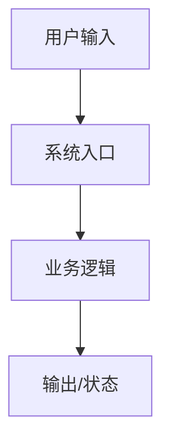

# Pola Architecture Doc Writer

## 目标

在编码前把“怎么改、为什么这样改、怎么验证、怎么部署、怎么回滚”写清楚。输出应能直接指导实现和 review。

## 何时需要完整架构文档

以下情况必须写完整文档：

- 跨两个以上模块。
- 涉及数据库、缓存、队列、文件存储、权限或计费。
- 涉及生产部署、环境变量、迁移、回滚。
- 涉及 AI 编排、多步骤任务、异步任务、第三方 API。
- 需求来自模糊图片、会议草稿或多人协作，需要统一口径。

小型文案、样式、单文件 bugfix 可以写轻量方案，但仍要保留验收和测试策略。

## 默认流程

1. 读取 `pola-project-context-reader` 的项目画像。
2. 读取 `pola-requirement-analyzer` 的需求口径和验收标准。
3. 找到相关模块和已有实现模式。
4. 设计最小可行改动，避免无关重构。
5. 写出测试和部署策略。

## 设计步骤

1. **现状建模**
   - 当前入口在哪里。
   - 数据或控制流如何经过系统。
   - 已有类似能力如何实现。

2. **方案选择**
   - 给出推荐方案。
   - 如有备选方案，比较复杂度、风险、验证成本、回滚成本。

3. **接口和数据**
   - 列出新增或变更的函数、组件、API、配置、数据结构。
   - 标注兼容性和迁移策略。

4. **实现拆分**
   - 拆成可 review 的小任务。
   - 每个任务绑定文件范围和验收项。

5. **验证设计**
   - 单测覆盖纯逻辑。
   - 集成覆盖模块边界。
   - UI/E2E 覆盖用户路径。
   - 回归覆盖旧路径和原始 bug case。

6. **发布设计**
   - 写清是否需要部署、重启、迁移、配置、回滚。

## 文档结构

详细模板见 `references/doc-templates.md`。默认输出 artifact 名称为 `architecture-plan`。

```markdown
# 架构开发文档：需求名称

## 1. 背景和目标

## 2. 当前系统理解

## 3. 方案概览

### 推荐方案

### 备选方案和取舍

## 4. 模块影响

| 模块 | 改动 | 原因 | 风险 |
| --- | --- | --- | --- |

## 5. 数据流和接口



## 6. 文件改动计划

| 文件 | 操作 | 内容 | 对应验收 |
| --- | --- | --- | --- |

## 7. 测试策略

| 测试类型 | 命令或方式 | 覆盖验收 |
| --- | --- | --- |

## 8. 部署和回滚

## 9. 验收映射

| 验收项 | 实现点 | 验证方式 |
| --- | --- | --- |

## 10. 未决问题
```

## 写作规则

- 只写本次需求相关内容。
- 用项目真实文件和模块命名，不写泛泛架构词。
- 如果方案有两条路，给出推荐方案和取舍理由。
- 涉及生产、数据、计费、权限时必须写回滚和观察点。
- 方案未确认前，不进入大规模编码。

## 存放规则

- 有 `docs/architecture/` 或 `docs/adr/` 时优先放入对应目录。
- 没有文档目录时使用 `docs/pola/architecture/YYYY-MM-DD-短名.md`。
- 用户只要求规划时，可先在回复中给出方案，不落文件。

## 完成标准

架构文档必须让另一个 Agent 能回答：

- 改哪些文件。
- 为什么这样改。
- 怎么验证。
- 怎么部署。
- 怎么回滚。
- 哪些风险还没解决。

## Artifact 输出

阶段结束时输出：

```markdown
artifact: architecture-plan
fields:
  title:
  affected_modules:
  data_flow:
  api_changes:
  file_plan:
  test_strategy:
  deploy_plan:
  rollback_plan:
  acceptance_mapping:
```
