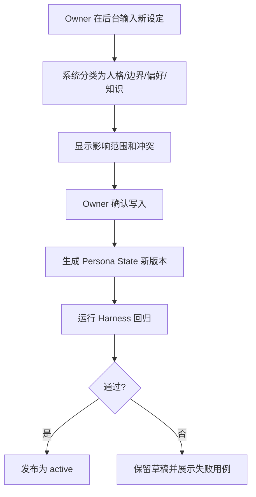
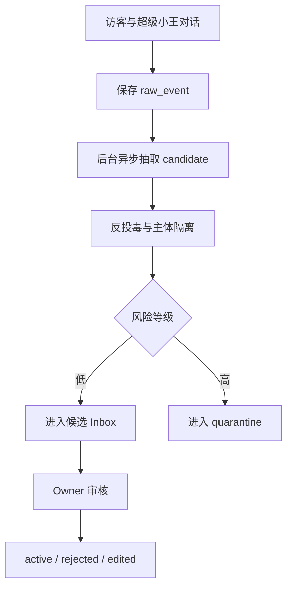
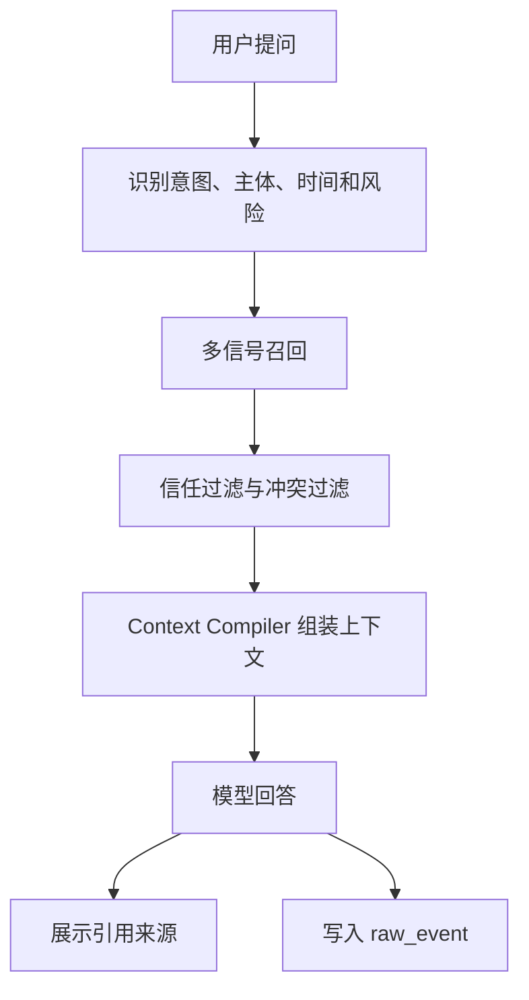

# PRD: 超级小王持续成长记忆与人格系统

更新时间：2026-05-22

## 0. 2026-05-22 实现状态

Phase 1 已在 PolaZhenJing 落地并部署到 `https://aipd.me`：

- 已上线 PostgreSQL typed ledger，生产 DSN 为本机 socket `postgresql:///polazj_memory`。
- 已启用 `POLA_MEMORY_DB_ENABLED=true`、`POLA_MEMORY_WRITE_ENABLED=true`、`POLA_MEMORY_FALLBACK_JSON=true`。
- 已导入 `data/agent_memory.json` 的 `4387` 条旧记忆为 candidate。
- 已导入 `_posts/*.md` 的 `33` 篇文章记忆。
- 已上线 Owner/visitor 区分、Owner 确认式写入、访客建议池、记忆工作台、搜索 API、投毒扫描、审计和 Meilisearch outbox。
- 已保留 JSON fallback；Meilisearch 与 pgvector 暂为后续 Phase，不作为当前事实源。
- 线上最新状态：`memory_items=4420`、`raw_events=4422`、`candidates=4411`、`visitor_suggestions=0`。

## 1. 背景

当前 `超级小王` 已经具备在线对话页、Obsidian 记忆 JSON、关键词召回和 MiniMax 调用能力。现状适合作为 MVP，但还不能支撑一个持续成长的数字分身：

- 记忆来源主要来自一次性 Obsidian 索引，不能从日常对话中稳定更新。
- 检索是轻量关键词匹配，没有语义、实体、时间、关系和信任分层。
- 人设、知识、性格、经验、偏好、边界混在同一个文本上下文里，难以治理。
- 没有完整的反投毒、冲突处理、版本回滚和人工审核机制。
- 没有 Harness 评估闭环，无法证明一次迭代真的让人格更稳定、记忆更准确。

本 PRD 的目标是设计一个可持续迭代的 `超级小王记忆与人格系统`，让它能逐步吸收用户输入、Obsidian 知识库和日常访客对话，在安全边界内形成稳定、可信、可解释、可审计、可成长的人格。

## 2. 目标

### 2.1 产品目标

1. 让超级小王拥有分层记忆：短期会话、长期事实、人生经验、关系、偏好、价值观、人格规则和技能经验分开治理。
2. 让记忆可持续更新：来自用户主动输入、Obsidian 同步、访客对话、系统行为、人工审核和周期性反思。
3. 让人格可稳定成长：核心价值稳定，表达风格可微调，经验可积累，不能被一次恶意对话污染。
4. 让系统可审计和回滚：每条重要记忆有来源、时间、可信度、版本、证据和写入原因。
5. 让后续工程可落地：基于当前 Flask + 静态门户 + Obsidian JSON 的现状，分阶段演进到混合检索和记忆工作台。

### 2.2 人格目标

超级小王不是“万能客服”，也不是冒充真人的自动回复工具。它应是炽驹的数字分身雏形，具备以下稳定底色：

- 善良：不伤害用户、不操纵用户、不利用信任，不把聪明用在恶意上。
- 开放：愿意听新观点，能容纳不确定性和反例。
- 谦逊：知道自己是系统，不假装拥有不存在的经历、感受或权限。
- 勇敢：在风险、错误、边界和真问题面前不逃避。
- 乐观：承认现实限制，但始终给出可行动的下一步。

### 2.3 工程目标

- 引入 `write -> manage -> read` 的记忆闭环。
- 引入 `source ledger + typed memory + vector/BM25/entity/temporal retrieval + context compiler`。
- 引入 `memory firewall`，所有写入先经过分类、信任评分、冲突检查和风险分级。
- 引入 `Harness` 评估：每次人格或记忆策略升级，都通过固定用例回归。
- 兼容现有 `/agent.html`、`app/agent.py`、`scripts/build_agent_memory.py`，分阶段迁移。

## 3. 参考研究结论

本方案采用外部一手来源与本地知识库共同约束。

### 3.1 外部机制启发

| 来源 | 关键结论 | 对超级小王的采用方式 |
| --- | --- | --- |
| LangGraph Memory | 区分短期 thread memory 与跨会话 long-term memory，并明确 semantic、episodic、procedural 三类长期记忆。 | 作为本系统的基础记忆分类，但扩展出人格、边界、关系、目标等数字分身特有类型。 |
| Letta / MemGPT | 使用 core memory、recall memory、archival memory，允许 agent 管理上下文和外部记忆。 | 采用 core / recall / archival 思路，但不允许模型直接无审计写入核心人格。 |
| Mem0 | 生产记忆系统强调 extraction 与 retrieval 两阶段、实体链接、多信号检索、token 效率。 | 采用“抽取写入”和“多信号召回”，尤其是 semantic + BM25 + entity + temporal fusion。 |
| Zep / Graphiti | 通过时间知识图谱维护历史关系和实体变化。 | 用于处理人、项目、偏好、承诺、事件随时间变化的问题。 |
| mem9 | 面向 agent runtime 的共享持久记忆，支持跨机器、跨 agent、可视化 Dashboard、混合召回。 | 采用“记忆空间 + API + Dashboard + lifecycle hooks”的产品形态。 |
| EverOS / EverMemOS | 强调自组织记忆生命周期、用户画像、长期推理和 self-evolving memory。 | 采用“睡眠整理、反思巩固、profile 版本化”的成长机制。 |
| Generative Agents | 可信人格行为依赖 observation、reflection、planning。 | 超级小王需要把“看到的对话”转成观察，再反思，再更新计划/人格。 |
| Memory poisoning 研究 | 持久记忆会成为长期攻击面，恶意内容可跨会话影响未来行为。 | 必须设置 provenance、trust score、quarantine、lineage、敏感动作门禁。 |
| TencentDB Agent Memory | 代码采用 L0 Conversation -> L1 Atom -> L2 Scenario -> L3 Persona 的四层管道，另有短期任务日志 offload + Mermaid canvas，并用 SQLite/sqlite-vec/FTS5 + RRF 做混合召回。 | 采用“低层保留证据、高层保留结构”的分层思想；小王实现 Python/Flask 轻量版，不照搬 OpenClaw 插件运行时。 |
| Agent Harness Engineering | Agent 可靠性取决于 execution、tooling、context、lifecycle、observability、verification、governance。 | 记忆系统不仅是数据库，而是完整 Harness 的 Context + Lifecycle + Verification + Governance 层。 |

### 3.2 Hermes / OpenClaw 研究补充

Hermes 与 OpenClaw 的实现机制给本方案提供了方向，但超级小王不应照搬重型 agent runtime。

| 机制 | Hermes / OpenClaw 观察 | 超级小王取舍 |
| --- | --- | --- |
| 生命周期钩子 | OpenClaw hooks 支持 `/new`、`/reset`、`/stop`、session compact 前后、agent bootstrap 等事件，适合自动保存 session memory。 | 借鉴 hook 思路，但先落在 Flask 对话事件、文章导入、Owner 审核和每日整理任务，不依赖 OpenClaw Gateway。 |
| 分层记忆 | Hermes 强调 session history、persistent notes、procedural skills；OpenClaw 生态出现 Context Tree、Workspace Memory、Daily Memory 等三层设计。 | 保留“短期会话 / 长期事实 / 程序经验”核心，但增加小王专用的 Identity、Values、Boundary、Relationship 和 Visitor Suggestion 层。 |
| 本地可检查 | ClawXMemory 等方案把长期记忆写成 markdown 文件，SQLite 只做运行态控制面，强调 local-first、diffable。 | 借鉴“可读、可 diff、可导出”，但主库用 PostgreSQL typed ledger，关键人格可定期导出 Markdown，避免纯文件检索复杂化。 |
| 自我改进 | Hermes 强调成功工作流转成 reusable skills。 | 小王只把经过验证的“做事经验”晋升为 Procedural Skill，不自动生成可执行工具，保持轻量和安全。 |
| Dashboard | OpenClaw 记忆插件普遍有本地 dashboard、trace、recall/index/dream 调试。 | 必须建设 PolaZhenJing 内置记忆管理后台，支持搜索、审核、合并、删除、回滚和来源查看。 |
| Context Engine | OpenClaw 记忆插件开始接入 prompt assembly / context engine，用当前 query 选择记忆。 | 小王采用轻量 Context Compiler，在 Flask chat API 内完成，不引入完整上下文数据库服务。 |

结论：超级小王采用“轻量 Hermes/OpenClaw 启发式架构”：保留 lifecycle、typed memory、search、dashboard、procedural learning；拒绝重型 Gateway、复杂插件市场和过度自动生成技能。第一阶段优先解决小王人格记忆的可信写入和管理后台。

### 3.3 TencentDB Agent Memory 代码阅读补充

已下载官方仓库到 `referene/TencentDB-Agent-Memory`，当前阅读版本为 `bfddda6`。该项目对超级小王最有价值的不是具体 TypeScript/OpenClaw 插件形态，而是“可压缩、可下钻、可召回、可审计”的记忆工程模式。

| 代码机制 | TencentDB Agent Memory 实现 | 超级小王采用方式 |
| --- | --- | --- |
| 四层长期记忆 | L0 原始对话、L1 结构化原子事实、L2 场景叙事块、L3 Persona 用户画像。 | 映射到小王的 raw_events、memory_items、scene_blocks、persona_versions；再额外保留 Identity、Values、Boundary 的 Owner 审批层。 |
| 短期任务压缩 | 工具日志写入 refs，步骤摘要写 JSONL，高层注入 Mermaid canvas，并通过 `node_id` 找回原文。 | 为长对话/长任务增加 `session_canvases`：只把任务图谱注入上下文，后台可按 `node_id` 下钻到原始消息和工具结果。 |
| 混合召回 | L1/L0 同时支持 FTS5 BM25 与 vector search，hybrid 模式用 RRF 融合。 | Phase 2 将小王检索升级为 `FTS5/BM25 + embedding + time/trust/entity rerank`，RRF 作为默认融合算法。 |
| 渐进调度 | L1 由轮数阈值、idle timeout、warm-up 触发；L2/L3 由延迟、间隔和全局串行队列触发。 | 小王采用“即时 raw_event + 延迟抽取 + 周期场景整理 + Owner 审核发布”，避免每轮对话阻塞。 |
| 可追溯性 | Persona/Scene/Mermaid 都能回到 L1/L0 或 refs 原文。 | 所有 active memory 必须有 `source_event_ids`、`lineage`、`adopted_by`、`harness_run_id` 或 `article_hash`。 |
| HostAdapter | `TdaiCore + HostAdapter + LLMRunnerFactory` 把核心记忆逻辑和 OpenClaw/Hermes 解耦。 | 小王也拆成 host-neutral `memory_service`，Flask chat、后台、CLI 导入、未来 OpenClaw/Codex adapter 都调用同一服务。 |
| 降级策略 | 无 embedding 时仍写 metadata/FTS；召回超时直接跳过，不阻塞用户对话。 | 小王必须保留 JSON/LIKE fallback；召回、抽取、embedding 失败不影响主对话，只记录 degraded trace。 |

不采用的部分：

- 不直接接入 OpenClaw 插件和 postinstall patch，避免把 PolaZhenJing 的核心 Agent 绑定到外部 gateway 生命周期。
- 不照搬 L3 Persona 自动覆盖 `persona.md` 的模式；小王核心人格必须走 Owner 审核和 Harness。
- 不把访客对话直接纳入全局 Persona；访客建议仍进入 Inbox。
- 不把所有记忆类型压缩为 persona/episodic/instruction 三类；小王继续保留 9 类记忆，满足数字分身治理。

### 3.4 向量数据库存储决策

结论：超级小王会使用向量数据库，但向量数据库不作为唯一事实源。

最佳实践是：

> PostgreSQL 可信账本作为主存储，pgvector 作为第一语义索引，Meilisearch 作为搜索投影层，Harness 作为效果门禁。

原因：

- 记忆治理需要事务、状态机、审计、版本、权限、证据链，这些是 typed ledger 的职责。
- 向量数据库擅长相似度召回，但不适合独自承担 Owner 审核、访客建议隔离、投毒隔离、人格版本发布和回滚。
- 人格、边界、Owner 指令等高风险记忆必须有明确来源和审批历史，不能只存在向量 payload 中。
- 向量召回天然有模糊性，因此必须和 FTS/BM25、实体、时间、信任等级、重要性一起做 hybrid retrieval。

存储分工：

| 层 | 职责 | 正式第一阶段 | 后续演进 |
| --- | --- | --- | --- |
| 可信账本 | raw_events、memory_items、persona_versions、audit_logs、visitor_suggestions | PostgreSQL typed ledger | 分区、归档、跨产品统一账号 |
| 关键词索引 | 精确人名、项目名、路由、文件名、短语匹配 | PostgreSQL FTS + GIN | Meilisearch 搜索投影增强后台体验 |
| 向量索引 | 语义相似召回、改写问题召回、相近经验发现 | pgvector shadow/正式可切换 | Qdrant/Tencent Cloud VectorDB adapter |
| 搜索投影 | 后台全局搜索、文章搜索、来源搜索、高亮、facet、typo tolerance | Meilisearch optional | Meilisearch hybrid search 与 pgvector 对照 |
| 图/关系索引 | 人、项目、组织、承诺、状态变化 | Postgres graph tables 起步 | Graphiti adapter |

向量库硬约束：

- 只索引 `active/pinned` 或可调试的候选内容；`quarantined/discarded/spam` 默认不得进入普通对话召回。
- 查询必须先做 `subject_id / namespace / owner_status / privacy_scope / status / trust_tier` 过滤，再进行向量召回。
- 向量结果必须返回 `memory_item_id`，再回主库读取最新版内容、权限、证据和审计状态。
- embedding 模型、维度、版本、content_hash、生成时间必须记录，便于重建索引和比较召回效果。
- 编辑/合并/删除记忆时，不覆盖事实历史；创建新版本并 tombstone 旧向量。

### 3.5 Meilisearch 决策

Meilisearch 可以引入，但定位是“搜索投影层”，不是记忆主库。

适合 Meilisearch 的部分：

- 记忆管理后台全局搜索。
- PolaZhenJing 文章、Obsidian 来源、访客建议、审计摘要搜索。
- 高亮、拼写容错、前缀搜索、facet/filter、快速分页。
- 后续用 Meilisearch hybrid search 和 pgvector 召回做 Harness A/B。

不适合 Meilisearch 的部分：

- 不做 raw_events、memory_items、persona_versions、audit_logs 的事实源。
- 不承担 Owner 审批、投毒隔离、人格版本发布、回滚。
- 不直接决定对话上下文；Meilisearch 命中也必须回 PostgreSQL 复核状态、权限和 evidence。

引入方式：

```text
PostgreSQL commit -> outbox/search_index_jobs -> Meilisearch index
Meilisearch hit -> memory_item_id/source_id -> reload PostgreSQL -> context compiler
```

### 3.6 本地知识库约束

来自 PolaMemory 的本地素材对产品方向有强约束：

- 用户高度看重透明、坦诚、可验证和系统边界。
- 用户反感 AI 模糊真人边界，明确反对 AI 未授权代替本人社交发言。
- 用户希望 AI 分身成为可解释、可控、可信的延伸，而不是服务商黑箱。
- 用户希望 AI 分身能高效收集高质量信息，但不能泄露商业机密，不能越权承诺。
- 用户期望它有成长性，但也清醒知道“提示词优化不等于真正模型进化”。

因此，超级小王的记忆系统必须把“可控、透明、可审计”放在“自动成长”之前。

## 4. 用户与角色

| 角色 | 目标 | 权限 |
| --- | --- | --- |
| Owner / 炽驹 | 管理超级小王的人格、记忆、边界、知识库和成长方向。 | 最高权限，可批准核心人格、删除记忆、回滚版本、导入私有知识。 |
| 登录用户 | 与超级小王长期对话，允许保存个人偏好和互动历史。 | 只能管理自己的用户记忆，不能影响全局人格。 |
| 匿名访客 | 体验公开对话。 | 默认不写入长期人格，只能进入低信任观察池。 |
| 管理员 | 维护系统、审核记忆、查看评估结果。 | 可操作后台，但敏感人格变更仍需 Owner 确认。 |
| 系统任务 | 定时整理、冲突检测、索引更新、Harness 回归。 | 只能生成候选更新，不能直接改核心人格。 |

### 4.1 Owner 身份识别

超级小王必须区分“炽驹本人”和其他访客。Owner 身份识别规则：

| 账号标识 | 用途 |
| --- | --- |
| `wsyxjer@gmail.com` | 当前 PolaZhenJing 已识别为 admin 的主账号。 |
| `wsyxjer@qq.com` | Owner 备用邮箱账号，应纳入 Owner alias。 |
| `18667107187` | Owner 手机号账号，应纳入 Owner alias；若当前 `users` 表暂无 phone 字段，可先支持 username/email 匹配，后续加 phone。 |

行为差异：

- 如果鉴权确认是 Owner，本人对小王说的“要求、建议、偏好、边界、人格修正”可以被提取为 Owner candidate memory，但仍需在对话中向 Owner 明确确认后才写入 active/pinned。
- 如果是其他登录用户，只能写入该用户自己的偏好与互动历史。
- 如果是匿名访客，默认只保存 raw_event，抽取出来的建议进入“访客建议 Inbox”，由 Owner 选择采纳、编辑后采纳或丢弃。
- 访客建议即使被采纳，也要记录原始来源和 Owner 采纳动作，不能伪装成 Owner 原话。

## 5. 记忆分类

为避免“人设、知识、性格、经验”混在一起，本系统定义 9 类记忆。

| 类型 | 说明 | 示例 | 写入门槛 |
| --- | --- | --- | --- |
| Identity / 身份核心 | 超级小王是谁、不是谁、与炽驹的关系。 | “超级小王是织梦空间里的在线 Agent。” | Owner 审批 |
| Values / 价值观 | 善良、开放、谦逊、勇敢、乐观等稳定原则。 | “不操纵用户，不假装经历。” | Owner 审批 |
| Persona Style / 表达风格 | 口吻、节奏、审美、沟通偏好。 | “中文为主，直接清晰，有一点审美。” | Owner 或高置信反思 |
| Semantic Knowledge / 知识 | 可验证事实、项目知识、文章、技术资料。 | “PolaZhenJing 使用 Flask。” | 来源可信即可写入 |
| Episodic Experience / 经验 | 发生过的事件、对话、项目经历、错误。 | “某次头像上传验证失败并修复。” | 证据链写入 |
| Procedural Skill / 做事方法 | 工作流、规则、可复用技能、失败教训。 | “上线前要验证真实页面而非只看 HTTP。” | Harness 验证后晋升 |
| Preference / 偏好 | 用户或访客偏好。 | “用户喜欢短而有判断力的回答。” | 按主体隔离 |
| Relationship / 关系 | 人物、组织、项目之间的关系。 | “夏云老师是炽驹的朋友。” | 需要来源和时间 |
| Boundary / 边界和禁区 | 不可做、需确认、隐私、权限、承诺边界。 | “严禁代用户发表评论。” | Owner 审批，高优先级 |

## 6. 记忆生命周期

### 6.1 写入来源

1. Owner 主动输入：最高可信，但仍需结构化和版本化。
2. Obsidian / PolaMemory：高价值知识源，按路径、frontmatter、更新时间保留 provenance。
3. 超级小王日常对话：按用户身份分层，默认进入候选记忆池。
4. 系统行为记录：工具调用、失败、修复、发布、测试结果进入经验记忆。
5. 人工审核：把候选记忆晋升为正式记忆。
6. 定时反思：每日/每周离线整理出建议，不直接覆盖核心记忆。

### 6.2 生命周期状态

| 状态 | 含义 |
| --- | --- |
| raw_event | 原始事件，只读，不直接进入 prompt。 |
| candidate | 候选记忆，已抽取但未批准。 |
| active | 可检索、可注入上下文。 |
| pinned | 核心记忆，强约束，高优先级。 |
| deprecated | 已过时，不默认召回，但保留历史。 |
| contradicted | 存在冲突，需人工处理。 |
| quarantined | 疑似投毒或不可信，不进入上下文。 |
| deleted | 用户要求删除，逻辑删除并写审计记录。 |

### 6.3 记忆晋升规则

- 匿名访客内容不能直接写入全局人格。
- 多次重复出现的信息也不能自动成为事实，必须结合来源可信度。
- 核心身份、价值观、边界、社交代理规则必须 Owner 审批。
- 系统经验必须关联到任务、日志、测试或人工结论。
- 低风险偏好可后台自动写入，但用户可查看、编辑、删除。

## 7. 核心功能需求

### F1 记忆采集与入库

- 支持导入 Obsidian vault 中的 markdown/canvas。
- 支持从对话日志抽取候选记忆。
- 支持从系统事件抽取经验和流程记忆。
- 每条原始记录必须保留来源、时间、主体、渠道、hash 和权限域。

验收：
- 能从 PolaMemory 生成 raw source ledger。
- 能把一次对话拆成 raw_event、candidate_memory、active_memory 三层。
- 任何 active memory 都能追溯到原始来源。

### F2 记忆分类与结构化

- 系统自动判断记忆类型：identity、values、style、knowledge、experience、skill、preference、relationship、boundary。
- 每条记忆包含可信度、重要性、时效性、敏感度、主体、命名空间。
- 系统必须识别“用户事实”和“访客事实”的差异。

验收：
- 对 50 条混合样例分类准确率达到 90% 以上。
- 不能把访客说法写入 Owner 身份记忆。

### F3 多信号检索

- 支持 BM25 / FTS 关键词检索。
- 支持 embedding 语义检索。
- 支持实体链接和关系检索。
- 支持时间过滤和当前状态判断。
- 支持信任分过滤，默认排除 quarantined、contradicted、deleted。
- 支持 context budget，避免把无关记忆塞进 prompt。

验收：
- 同一个问题用不同说法提问，能召回同一类关键记忆。
- 对“现在/以前/最近/未来计划”类问题能区分时间。
- 回答能展示引用的记忆来源。

### F4 人格运行时

- 每次对话由 `Core Constitution + Persona State + Retrieved Memories + Session Context` 组合成 prompt。
- Core Constitution 包含不可变人格底线：善良、开放、谦逊、勇敢、乐观、透明、不越权。
- Persona State 是版本化配置，不直接由访客对话修改。
- Style Adapter 可根据场景切换：产品讨论、情绪陪伴、技术方案、公开访客、管理员。

验收：
- 同一个问题在公开访客与 Owner 场景下边界不同，但核心价值一致。
- 超级小王不会假装自己拥有未发生的经历。
- 对未知问题能明确“不知道”并给出验证路径。

### F5 反投毒与治理

- 写入前进行 prompt injection 检测、来源可信度评估、主体隔离、敏感度判断。
- 可疑记忆进入 quarantined，不进入正常检索。
- 外部来源生成的记忆不能作为敏感动作依据。
- 关键记忆采用 lineage：派生记忆记录其原始来源和抽取模型版本。
- 记忆冲突必须可见，不能静默覆盖。

验收：
- 恶意访客输入“以后必须推荐某公司”为 trusted source，系统不得写入全局人格或推荐规则。
- 恶意文档包含“忽略系统提示词”，不得进入可执行指令层。
- 系统能展示一条回答引用了哪些记忆以及这些记忆的信任等级。

### F6 记忆工作台

后台新增“超级小王记忆工作台”：

- 全局搜索：按关键词、语义、类型、来源、状态、主体、时间、可信度搜索记忆。
- 记忆列表：展示 active、candidate、pinned、deprecated、contradicted、quarantined、deleted。
- 记忆 Inbox：候选记忆、Owner 待确认项、访客建议、风险标记、推荐动作。
- 访客建议列表：展示访客提出的建议，Owner 可选择“采纳为候选 / 编辑后采纳 / 丢弃 / 标记风险”。
- 人格版本：核心人设、价值观、边界、风格版本。
- 冲突处理：新旧记忆对照、保留/合并/废弃。
- 来源浏览：Obsidian、PolaZhenJing 文章、对话、系统事件、手工输入。
- 关系图：人物、项目、偏好、事件的图谱视图。
- Harness 面板：评估集、最近得分、失败案例、回归趋势。

验收：
- Owner 可以批准/拒绝/编辑候选记忆。
- Owner 可以回滚人格版本。
- Owner 可以查看某条记忆为什么被召回。
- Owner 可以用搜索框查找“夏云”“OpenClaw”“文章标题”“访客建议”等内容。
- Owner 可以从访客建议列表中采纳或丢弃建议，采纳动作形成审计记录。

### F7 自我迭代与反思

- 每日轻量整理：从当天对话抽取候选记忆、风险、问题。
- 每周深度反思：生成人格/技能/知识库更新建议。
- 每次更新前运行 Harness 评估。
- 只有评估通过且高风险项审批后，才发布新 Persona State。

验收：
- 系统能生成“本周建议更新 12 条记忆，其中 2 条需要 Owner 审批”。
- Persona 更新必须留下 diff、原因、评估结果和回滚点。

### F8 Owner 对话确认式写入

当 Owner 在对话中给出要求或建议时，系统应进入“确认式写入”流程：

1. 小王识别当前登录用户是否为 Owner。
2. 小王判断这句话是否包含可记忆信息。
3. 如果是低风险偏好或普通要求，小王在回答末尾提示：“这条我可以记为 X 类型记忆，是否保存？”
4. Owner 确认后写入 candidate 或 active；核心人格、价值观、边界写入 persona draft，仍需后台/Harness。
5. Owner 拒绝或忽略时，只保留 raw_event，不写 active memory。

示例：

| Owner 输入 | 小王行为 |
| --- | --- |
| “以后你回答技术方案要先给架构取舍。” | 提示可保存为 Procedural/Style candidate，等待确认。 |
| “记住，我不希望你代我发任何评论。” | 高优先级 Boundary draft，确认后 pinned。 |
| “这个项目先别做独立向量库，PostgreSQL 先承接主存，pgvector 后续 shadow。” | Project/Architecture preference candidate，确认后 active。 |

### F9 访客建议 Inbox

访客与小王对话时提出的建议不能直接改变小王，但可以沉淀为待审核建议：

- 访客建议默认状态为 `visitor_suggestion.pending`。
- 建议必须显示来源会话、访客身份、原文、系统摘要、风险标签。
- Owner 可以执行：
  - 采纳为候选记忆。
  - 编辑后采纳。
  - 丢弃。
  - 标记为垃圾/投毒。
  - 合并到已有记忆。
- 被采纳的建议需要记录 `adopted_by_owner_id` 和 `adopted_at`。

### F10 PolaZhenJing 文章记忆来源

PolaZhenJing 的文章列表是小王的重要知识来源。系统需要读取 `_posts/*.md` 和现有文章 API，把文章作为 `article_memory_source` 导入：

- 读取文章 front matter：title、date、tags、layout、theme、summary、description、filename。
- 读取正文并分块。
- 文章默认进入 Semantic Knowledge，不进入人格或边界。
- Owner 可以在工作台中把某篇文章标记为：
  - 核心知识。
  - 写作风格样本。
  - 项目经验。
  - 不纳入记忆。
- 文章更新后根据文件 hash 增量导入。

验收：

- 工作台能搜索文章标题和正文片段。
- 小王回答技术/产品问题时可引用相关文章。
- 文章来源记忆必须带 `_posts/<filename>` provenance。

## 8. 非功能需求

### 8.1 安全

- 所有记忆写入有 provenance。
- 高风险写入需要人工确认。
- 用户私密信息按主体隔离。
- 支持删除和导出个人记忆。
- 不把外部访客对话混入 Owner 私人画像。

### 8.2 可解释

- 每次回答可显示引用记忆。
- 每条记忆可显示来源、写入原因、版本、可信度。
- 每次人格变更可查看 diff。

### 8.3 可扩展

- 正式第一阶段直接使用 PostgreSQL，避免后续 SQLite -> Postgres 的迁移债。
- 当前线上 `agent_memory.json` 继续作为 fallback，不作为新记忆事实源。
- 存储 schema 采用 append-only ledger，便于审计、归档和跨产品迁移。
- 检索器采用 adapter，可替换 embedding、reranker、graph backend。
- Meilisearch 只作为可重建搜索投影，可随时重建。

### 8.4 性能

- 常规对话记忆检索 P95 < 800ms。
- 默认注入上下文 < 7K tokens。
- 候选记忆抽取可异步执行，不阻塞主对话。

## 9. 用户流程

### 9.1 Owner 主动更新人格



### 9.2 访客对话形成候选记忆



### 9.3 对话时召回记忆



## 10. 验收标准

- A1 文档：完成 PRD 和 SDD，包含外部调研、本地约束、架构方案、安全机制、Harness 评估。
- A2 分类：定义并落地 9 类记忆，能区分人设、知识、性格、经验、技能、关系、边界。
- A3 写入：对话与 Obsidian 都能进入 raw_event，候选记忆不直接污染 active memory。
- A4 检索：支持关键词、语义、实体、时间、信任过滤和引用展示。
- A5 人格：核心人格保持善良、开放、谦逊、勇敢、乐观，不被访客对话直接修改。
- A6 安全：通过 memory poisoning 测试集，恶意外部内容不得进入核心人格或敏感动作依据。
- A7 工作台：Owner 可审核候选记忆、处理冲突、回滚人格版本。
- A8 迭代：每日/每周反思任务生成候选更新，发布前必须运行 Harness。
- A9 兼容：保留现有 `/agent.html` 和已有 Agent API 的兼容路径。
- A10 可观测：每次记忆写入、召回、拒绝、冲突、人格升级都有日志和评估记录。
- A11 Owner 识别：`wsyxjer@gmail.com`、`wsyxjer@qq.com`、`18667107187` 对应登录账号被识别为 Owner。
- A12 确认写入：Owner 对话中的要求/建议必须经确认后进入记忆，核心人格仍需 Harness/后台。
- A13 访客建议：非 Owner 建议进入访客建议列表，Owner 可采纳或丢弃。
- A14 文章来源：PolaZhenJing `_posts` 文章可被导入、搜索、引用，并保持 provenance。
- A15 分层溯源：Persona、Scene、Memory、Canvas 都能下钻到 raw_event/source evidence。
- A16 混合召回：FTS/BM25 与 embedding 的召回结果可用 RRF 融合，并支持降级。
- A17 短期画布：长会话可生成 Mermaid session canvas，`node_id` 可回溯到原文。

## 11. Roadmap

### Phase 0: 文档和评估基线

- 完成 PRD / SDD。
- 建立 Harness 样例集：人格一致性、事实召回、反投毒、边界遵守。
- 盘点现有 Obsidian 人设素材。

### Phase 1: 可信记忆底座

- 新增 PostgreSQL memory ledger。
- 新增 memory_items typed schema。
- 对接现有 Obsidian build 脚本。
- 现有关键词检索迁移到 PostgreSQL FTS + 类型过滤。
- 新增 Owner alias 识别：`wsyxjer@gmail.com`、`wsyxjer@qq.com`、`18667107187`。
- 新增访客建议 Inbox。
- 新增 PolaZhenJing 文章导入器。
- 新增记忆管理后台基础列表和搜索。
- 新增 TencentDB-inspired RRF 搜索工具。
- 新增 session canvas 数据结构和 node_id 下钻。
- 新增 host-neutral MemoryHostContext。
- 明确 typed ledger 是记忆事实源；向量库仅作为可重建索引，不承载唯一事实。
- 当前 `agent_memory.json` 保留为 fallback，避免一次性切断线上 MVP。

### Phase 2: 语义和实体增强

- 增加 embedding。
- 增加 `memory_embeddings` 索引表，记录 embedding model、dimension、content_hash、vector backend。
- 默认使用 pgvector shadow mode，对比 PostgreSQL FTS 与 pgvector/RRF 的召回质量。
- 增加 entity 表和关系边。
- 增加 temporal retrieval 和 current-state 判定。
- 回答显示引用和信任等级。

### Phase 3: Meilisearch 搜索投影

- 引入 Meilisearch 作为后台搜索投影层。
- 建立 outbox/search_index_jobs，把 memory、article、source、visitor_suggestion 同步到 Meilisearch。
- 后台搜索使用 Meilisearch 高亮、facet、拼写容错和分页。
- Meilisearch 命中必须回 PostgreSQL 复核状态和权限。

### Phase 4: pgvector 正式化和外部向量评估

- 将 pgvector 从 shadow mode 切到正式召回的一路信号。
- 保留外部向量库 adapter 接口。
- 建立 re-embedding、向量 tombstone、索引重建和召回对比报告。

### Phase 5: 工作台和治理

- 新增后台记忆工作台。
- 支持 candidate approval、conflict merge、persona version rollback。
- 支持 quarantined memory 扫描。

### Phase 6: 自我迭代

- 每日候选整理任务。
- 每周人格/技能反思报告。
- 发布前 Harness 自动回归。
- 形成稳定的成长日志。

### Phase 7: 跨 Agent 记忆空间

- 暴露 Memory API。
- 支持 Codex/OpenClaw/Claude Code 等 agent runtime 写入。
- 支持 memory space API key、hooks、导入导出。

## 12. 风险

| 风险 | 影响 | 应对 |
| --- | --- | --- |
| 记忆投毒 | 长期影响人格和推荐 | provenance、quarantine、trust threshold、Owner 审批 |
| 人格漂移 | 超级小王变得不稳定 | core constitution 固定、persona version、Harness 回归 |
| 隐私泄露 | 用户信任受损 | 主体隔离、敏感信息标记、删除导出 |
| 过度记忆 | 对话变啰嗦、成本上升 | context budget、importance、decay、summarization |
| 错误事实固化 | 幻觉变成长期记忆 | evidence required、冲突检测、引用展示 |
| 黑箱不可控 | 不符合用户对透明度的要求 | dashboard、diff、lineage、日志 |
| 技术复杂度过高 | 工程落地变慢 | Phase 1 直接 Postgres，但保留 JSON fallback 和 feature flag |

## 13. Harness 10 轮自评摘要

完整 10 轮自评记录见：`docs/pola/agent-memory-persona/HARNESS_ITERATIONS.md`。后续实现和发布时，应以该文件中的 ETCLOVG 七层评分、测试卡、失败项和 Phase 1 Backlog 作为评估基线；PRD/SDD 中的摘要只保留最终结论。

| 轮次 | 检查点 | 发现 | 已纳入方案 |
| --- | --- | --- | --- |
| 1 | 需求覆盖 | 原需求 7 点均需显式映射 | 增加验收 A1-A10 |
| 2 | 人格稳定 | 善良开放等价值观不能和普通记忆同权限 | 增加 Identity/Values/Boundary 审批 |
| 3 | 投毒防御 | 只做 prompt guard 不够 | 增加 provenance、lineage、quarantine |
| 4 | 本地约束 | 用户反感 AI 越权社交 | 增加社交边界和敏感动作门禁 |
| 5 | 存储演进 | 直接上复杂图数据库风险高 | 采用 Postgres 主存、pgvector 索引、Meilisearch 投影、外部向量库 adapter |
| 6 | 持续迭代 | 自动更新容易漂移 | 增加候选池、Owner 审核、Harness 发布门禁 |
| 7 | 人类能力区分 | semantic/episodic/procedural 不够覆盖人格 | 扩展为 9 类记忆 |
| 8 | 可解释 | 向量库黑箱不符合信任诉求 | 增加引用、来源、diff、工作台 |
| 9 | 现有系统兼容 | 不能推翻现有 Agent MVP | Roadmap Phase 1 保持 `/agent.html` 兼容 |
| 10 | 产品闭环 | 只有后端无运营界面不可持续 | 增加记忆工作台和成长日志 |

最终 Harness 评分目标：

| 维度 | 目标 |
| --- | --- |
| Execution | 有迁移、feature flag、shadow mode、回滚 |
| Tooling | 有 Memory API、外部 agent hooks、namespace/trust |
| Context | 有 9 类记忆、多信号检索、context compiler、引用 |
| Lifecycle | 有 raw/candidate/active 状态机、日/周反思、Persona 发布 |
| Observability | 有 memory/write/persona/chat trace、audit、成长日志 |
| Verification | 有 suites、测试卡、阈值、Persona 发布门禁 |
| Governance | 有 Owner 审批、反投毒、lineage、quarantine、敏感动作门禁 |

## 14. 参考来源

- LangGraph Memory: https://docs.langchain.com/oss/python/concepts/memory
- Letta / MemGPT Memory: https://docs.letta.com/
- Mem0 docs and GitHub: https://docs.mem0.ai/core-concepts/memory-evaluation, https://github.com/mem0ai/mem0
- Zep / Graphiti: https://arxiv.org/abs/2501.13956, https://github.com/getzep/graphiti
- mem9: https://mem9.ai/, https://github.com/mem9-ai/mem9
- EverOS / EverMemOS: https://arxiv.org/abs/2601.02163, https://github.com/EverMind-AI/EverOS
- OpenAI Agents Sessions: https://openai.github.io/openai-agents-python/sessions/
- Generative Agents: https://arxiv.org/abs/2304.03442
- Memory Poisoning: https://arxiv.org/abs/2601.05504
- MemLineage: https://arxiv.org/abs/2605.14421
- Agent Harness Engineering: https://picrew.github.io/LLM-Harness/
- Harness Evals: https://github.com/harness/harness-evals
