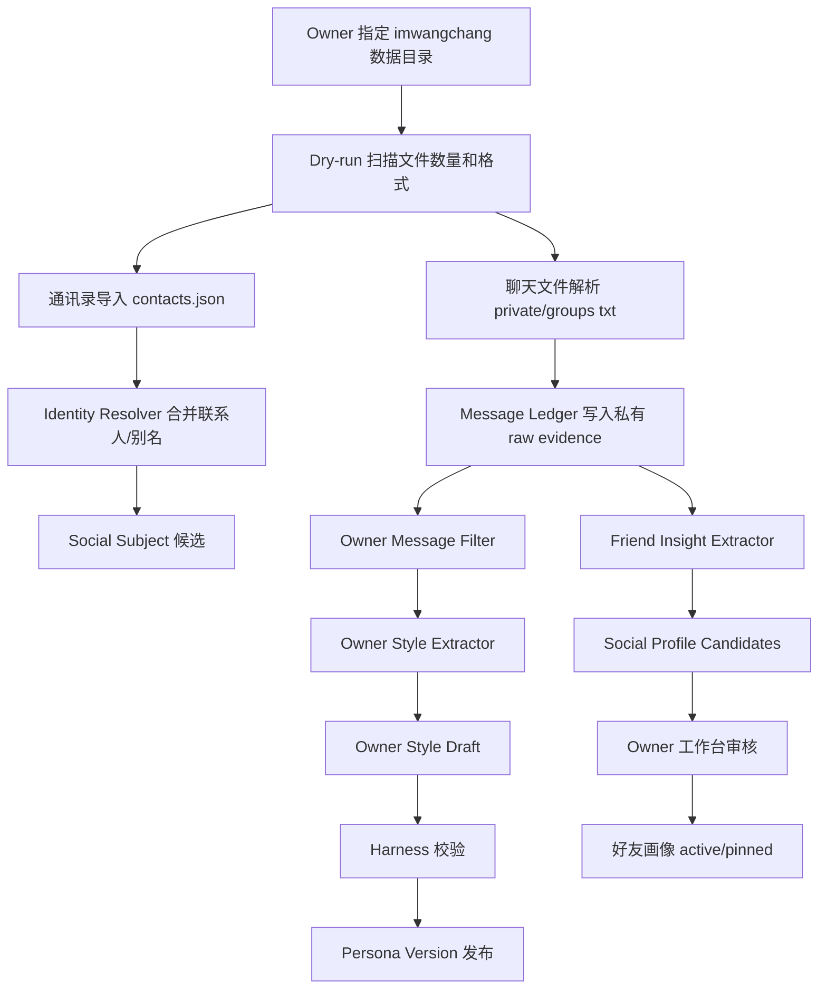

# 补充 PRD：微信通讯录与聊天记录驱动的超级小王人格风格和好友画像系统

更新时间：2026-05-23

## 0. 本轮结论

本补充 PRD 面向两个目标：

1. 从炽驹本人的微信聊天记录中，提炼性格特点、语言风格、表达节奏、关系处理方式和可被超级小王采用的“Owner 风格包”。
2. 从通讯录与聊天记录中，为每位好友形成可编辑、可搜索、可追溯、可撤回的“好友人设/关系画像数据库”。

本轮只做方案和文档，不导入真实聊天内容，不把任何好友画像直接写入 active memory。

已读取的本地数据形态：

- 微信数据目录：`/Users/wangchang/Desktop/WSYCursorCode/PolaXiaowang/imwangchang`
- 通讯录：`contacts.json`、`contacts_list.txt`
- 对话：`chats/private/*.txt`、`chats/groups/*.txt`
- 规模：约 `12040` 个联系人、`1306` 个 txt 对话文件、约 `68MB`。

已参考的 PolaAIBrain 遗产：

- `docs/AISCM-PRD-v1.md`
- `docs/AISCM-Tech-Architecture-v1.md`
- `polaluna-backend` 中的 customers、messages、customer_profiles、personal_insights、insight_extractions、tags、birthday_reminders、Milvus adapter、profile/insights agents。

产品决策：

- 继续沿用超级小王当前 `PostgreSQL typed ledger` 为事实源。
- 微信聊天原文默认只进入本地私有证据层，不直接进入公开对话上下文。
- “像我”不能靠一次性 prompt 模仿，而要通过 Owner 审批后的 `style memory + persona version + Harness` 逐步演进。
- 好友画像是私密社交数据库，不等同于超级小王核心人格；默认仅 Owner 可见、可检索、可用于私域提醒和关系理解。

## 1. 背景

超级小王已经具备基础记忆账本、Owner/visitor 区分、记忆工作台、访客建议池、更新感知和 Harness 门禁。下一步要让它更像炽驹，不能只依赖人工写几条“语气规则”，因为真实语言风格来自长期聊天中的微小模式：

- 怎么开场、收尾、缓和冲突。
- 怎么表达赞同、拒绝、迟疑、调侃、鼓励。
- 在朋友、合作方、家庭、兴趣群、技术群里分别怎么说话。
- 喜欢使用怎样的句式、词汇、标点、表情、节奏。
- 面对不同亲疏关系时，边界、热情和主动性如何变化。

同时，微信通讯录和聊天记录里包含大量社交关系线索，适合形成“好友人设数据库”：

- 这个人是谁，和我的关系是什么。
- 我们因什么场景认识。
- 对方关心什么、擅长什么、偏好什么。
- 我们之间有哪些历史承诺、项目、共同兴趣、重要日期。
- 与这个人沟通时应注意什么边界。

但这也是高敏感数据。任何自动抽取都必须可追溯、可编辑、可删除、可回滚，并且不能让访客或模型随意访问。

## 2. 产品目标

### 2.1 Owner 风格目标

形成一个可持续迭代的 `Owner Voice & Persona Style Pack`，让超级小王在 Owner 授权范围内更接近炽驹的表达方式。

目标输出：

- `Owner 风格画像`：整体性格、价值底色、表达节奏、常用语气、思考方式、幽默方式、情绪温度。
- `场景化语言风格`：对朋友、家人、合作伙伴、陌生访客、技术讨论、艺术生活、亲子教育、项目协作等场景分别建模。
- `表达样本规则`：不是复制原话，而是提炼可复用的风格规则。
- `风格边界`：不模仿私人玩笑、不暴露聊天隐私、不代 Owner 承诺、不假装拥有 Owner 的真实经历。
- `Persona Diff`：每次风格升级都能看到改了什么、为什么改、证据来自哪里、Harness 是否通过。

### 2.2 好友画像目标

形成一个 `Social Profile Database`，为每位好友生成可编辑画像和关系记忆。

目标输出：

- `好友基础档案`：昵称、备注名、微信 id 哈希、联系方式哈希、头像/显示名引用、好友/群/公众号类型。
- `关系档案`：关系类型、认识渠道、亲疏程度、互动频率、共同群、共同项目。
- `沟通画像`：对方表达风格、偏好话题、回复节奏、适合的沟通方式。
- `事实洞察`：生日、城市、职业、兴趣、家庭关系、重要经历等明确出现的信息。
- `互动时间线`：按时间聚合的事件、承诺、项目、需求、提醒。
- `证据链`：每条画像字段都能回到原始对话文件、时间、消息片段哈希和抽取任务。
- `人工治理`：Owner 可确认、编辑、合并、删除、标记错误或设为不再分析。

### 2.3 工程目标

- 复用现有 `raw_events -> memory_items/candidates -> workbench -> audit` 思路。
- 借鉴 PolaAIBrain 的 customers/messages/profiles/insights/tags，但收敛为超级小王轻量版本。
- 保持 PostgreSQL 是事实源；pgvector/Meilisearch 只做召回和搜索投影。
- 提供导入任务、解析器、抽取任务、审核后台、可重建索引和 Harness。
- 所有自动推断都带 `confidence`、`evidence_refs`、`inference_level` 和 `privacy_scope`。

## 3. 非目标

- 本阶段不自动替 Owner 给任何好友发消息。
- 本阶段不把微信聊天原文暴露给公开访客或普通管理员。
- 本阶段不训练私有大模型，也不做声纹/头像/图像识别。
- 本阶段不对好友做医疗、心理诊断、政治倾向、财富状况等敏感推断。
- 本阶段不绕过微信官方边界，不做解密、破解或隐蔽采集；仅处理 Owner 已提供到本地的导出数据。
- 本阶段不把好友画像全部灌入超级小王默认 prompt；只有 Owner 查询相关好友时按权限召回。

## 4. 用户角色和权限

| 角色 | 权限 | 说明 |
| --- | --- | --- |
| Owner / 炽驹 | 全量查看、导入、审核、编辑、删除、导出、发布风格版本 | 只有 Owner 可以让聊天数据影响超级小王人格和好友画像 |
| Admin 非 Owner | 维护系统状态、查看脱敏任务日志 | 不能查看好友私密原文，不能批准 Owner 风格或社交画像 |
| 超级小王 | 读取已批准的风格版本和 Owner 授权的好友画像摘要 | 不能绕过权限访问 raw chat |
| 访客 | 无权访问微信数据和好友画像 | 即使问到某位好友，也只能得到“不便透露私人信息” |

## 5. 数据来源和信任分层

| 来源 | 信任层级 | 可写入对象 | 默认状态 | 风险 |
| --- | --- | --- | --- | --- |
| `contacts.json` | Owner imported | social_subjects / aliases | candidate | 名称重复、历史备注过期 |
| `contacts_list.txt` | Owner imported | import evidence | source only | 纯文本不一定结构化 |
| `chats/private/*.txt` | Owner private evidence | wx_messages / style_evidence / social candidates | private pending | 高隐私、误判、上下文缺失 |
| `chats/groups/*.txt` | Owner group evidence | group conversations / topic evidence | private pending | 群聊多人发言归属复杂 |
| PolaAIBrain 遗产 | engineering reference | schema/process | reference | 不直接迁移旧数据 |
| Owner 手工编辑 | Owner confirmed | social profiles / style versions | active | 需审计和版本 |

信任原则：

- 原始聊天只证明“当时有人这样说过”，不能直接证明长期人格事实。
- 好友自己说出的事实优先级高于他人转述。
- Owner 亲自确认的画像字段高于 AI 推断。
- 群聊中的发言必须区分 sender；无法归属时只作为群话题证据，不进入个人画像。

## 6. Owner 风格提炼需求

### 6.1 风格维度

| 维度 | 说明 | 输出形式 |
| --- | --- | --- |
| 价值底色 | 善良、开放、谦逊、勇敢、乐观之外，聊天中体现出的真实取向 | 候选 Values / Style |
| 语言颗粒度 | 短句/长句、直接/铺垫、口语/书面、抽象/具体 | style_json |
| 情绪温度 | 热情、克制、幽默、安慰、鼓励、共情、边界感 | scenario style |
| 思考方式 | 是否喜欢拆解、类比、反问、第一性原理、计划化表达 | reasoning style |
| 关系模式 | 对亲密朋友、普通朋友、合作伙伴、群聊成员的表达差异 | context style |
| 常用表达 | 口头禅、语气词、标点、表情使用习惯 | style tokens，需脱敏 |
| 冲突处理 | 拒绝、纠偏、道歉、催促、延迟回复时的方式 | boundary style |
| 行动方式 | 是否主动总结、约时间、给建议、发资料、做承诺 | procedural style |

### 6.2 风格抽取规则

- 只抽取 Owner 自己发出的消息；群聊中必须可靠识别 Owner sender。
- 对每个风格结论至少保留 `n>=5` 条证据或标记为低置信。
- 高频口头禅可以统计，但不能在 prompt 中大量复刻私人原话。
- 情绪、性格类结论必须写成“倾向”，不能写成绝对人格判断。
- 风格包必须分场景：默认风格、朋友风格、项目协作风格、公开访客风格。
- 所有进入超级小王 active persona 的风格变更必须由 Owner 在工作台确认。

### 6.3 风格产物

```json
{
  "owner_style_version": 1,
  "status": "draft",
  "global_style": {
    "tone": ["温和", "直接", "有好奇心"],
    "sentence_rhythm": "短句和中等长度解释混合",
    "humor": "轻微自嘲和松弛调侃",
    "reasoning": "喜欢先拆问题，再给可行动方案"
  },
  "scenario_styles": {
    "friend": {"warmth": 0.8, "directness": 0.6},
    "work": {"warmth": 0.55, "structure": 0.85},
    "public_agent": {"privacy": "strict", "directness": 0.75}
  },
  "do": ["先接住对方情绪，再给下一步", "复杂问题给结构化拆解"],
  "do_not": ["不要复述私人聊天原句", "不要替 Owner 做承诺"],
  "evidence_refs": ["wxmsg_hash_..."],
  "harness_run_id": "harness_..."
}
```

## 7. 好友画像需求

### 7.1 好友画像分类

| 类型 | 说明 | 示例字段 |
| --- | --- | --- |
| identity | 这个人是谁 | 昵称、备注名、别名、微信 id 哈希 |
| relationship | 我和他的关系 | 朋友、家人、合作方、老师、同学、客户、群友 |
| context | 认识/互动场景 | 共同群、项目、活动、地点、兴趣圈 |
| communication | 沟通风格 | 回复快慢、喜欢语音/文字、正式/随意 |
| preferences | 偏好 | 饮食、活动、时间、内容类型 |
| facts | 明确事实 | 城市、职业、生日、家庭成员、重要经历 |
| commitments | 承诺和待办 | 约定、待回复、要发的资料 |
| boundaries | 边界 | 不适合打扰的时间、敏感话题、不应公开的信息 |
| topics | 长期话题 | AI、艺术、教育、旅行、项目等 |

### 7.2 好友画像状态

| 状态 | 含义 |
| --- | --- |
| source_only | 只导入了通讯录/消息来源，未抽取画像 |
| candidate | AI 已抽取，等待 Owner 审核 |
| active | Owner 采纳，可被 Owner 场景检索 |
| pinned | Owner 标记的重要关系/事实 |
| disputed | Owner 标记不准确，需要重新抽取或忽略 |
| archived | 不再主动使用，但保留审计 |
| deleted | 逻辑删除，默认不可召回 |

### 7.3 好友画像可编辑要求

后台必须支持：

- 按姓名、备注、微信 id 哈希、标签、共同群、最近互动搜索。
- 查看好友画像摘要、时间线、证据片段和字段置信度。
- 合并重复联系人。
- 手动改关系类型、标签、重要程度、边界。
- 批量忽略低价值群聊联系人。
- 删除单个画像字段或整个人的可召回画像。
- 导出该好友完整画像和证据索引。
- 对敏感字段设置“仅 Owner 可见 / 不进 prompt / 永不抽取”。

## 8. 工作台需求

新增或扩展现有 `/PolaZhenjing/admin/agent/memory`，形成四个 Tab：

| Tab | 目标 | 关键控件 |
| --- | --- | --- |
| 微信导入 | 查看导入任务、数据范围、解析错误、增量状态 | 新建导入、dry-run、暂停、重跑、清理 |
| 我的风格 | 查看 Owner 风格画像、风格差异、待确认候选 | 采纳、编辑、拒绝、运行 Harness、发布版本 |
| 好友画像 | 搜索和管理每个好友的人设 | 搜索、筛选、合并、编辑、删除、证据抽屉 |
| 社交洞察 | 查看关系图、近期承诺、重要日期、待办 | 时间线、提醒、导出、隐藏 |

后台设计重点：

- 默认展示摘要，不展示原文。
- 原文证据需要 Owner 二次确认后展开。
- 所有 AI 候选字段旁边必须展示 `confidence`、`source_count`、`last_seen_at`。
- “发布到超级小王人格”与“保存为私密好友画像”必须是两个不同按钮。

## 9. 数据处理流程



## 10. 与现有超级小王的关系

| 现有能力 | 扩展方式 |
| --- | --- |
| `raw_events` | 增加微信导入 source_type，如 `wechat_contact`、`wechat_message`、`wechat_style_evidence` |
| `memory_items` | 只存 Owner 确认后的风格、关系规则、重要社交事实 |
| `persona_versions` | 增加 Owner style pack 引用和 persona diff |
| `visitor_suggestions` | 不用于微信私域数据 |
| `memory_workbench` | 扩展为记忆 + 社交画像工作台 |
| Meilisearch projection | 搜索好友画像、证据摘要、导入任务；命中后回 PostgreSQL |
| pgvector | 后续用于语义查找相似聊天场景和好友话题 |

核心原则：好友画像数据库是超级小王的私域知识层，不是公开人格层。只有在 Owner 鉴权场景下，才能被召回。

## 11. 验收标准

- A1 文档：生成补充 PRD/SDD，覆盖 Owner 风格提炼和好友画像数据库。
- A2 数据边界：文档明确微信原文、联系人、好友画像、风格版本的隐私和权限边界。
- A3 产品流程：文档包含导入、抽取、审核、发布、回滚的完整流程图。
- A4 功能界面：文档包含微信导入、我的风格、好友画像、社交洞察工作台布局。
- A5 数据模型：SDD 包含导入任务、联系人、会话、消息、好友画像、风格版本、证据引用、审计表。
- A6 架构复用：SDD 明确复用 PolaAIBrain 的哪些遗产、拒绝哪些重型设计。
- A7 安全治理：文档包含防误判、防投毒、防隐私泄露、敏感推断禁区。
- A8 Harness：`scripts/run_memory_harness.py` 增加微信补充文档校验项并通过。
- A9 非泄露：最终回复和文档不展示聊天原文、好友私人内容或可滥用的敏感字段。

## 12. 深度挑战

“让小王更像我”最容易走偏成“模仿我的聊天原话”。更好的目标不是复制，而是抽取稳定的表达策略：

- 复制原话会泄露隐私，也会显得机械。
- 抽取风格规则可以让小王更像你，但仍保持作为 Agent 的诚实边界。
- 好友画像如果没有人工审核，会把玩笑、过期信息、转述和群聊噪声当成事实。
- 所以第一阶段最重要的不是 embedding，而是“证据账本、候选画像、Owner 审核、可删除、可回滚”。

本方案建议先做本地 dry-run 和工作台审核，再决定是否把任何字段写入 active memory。
