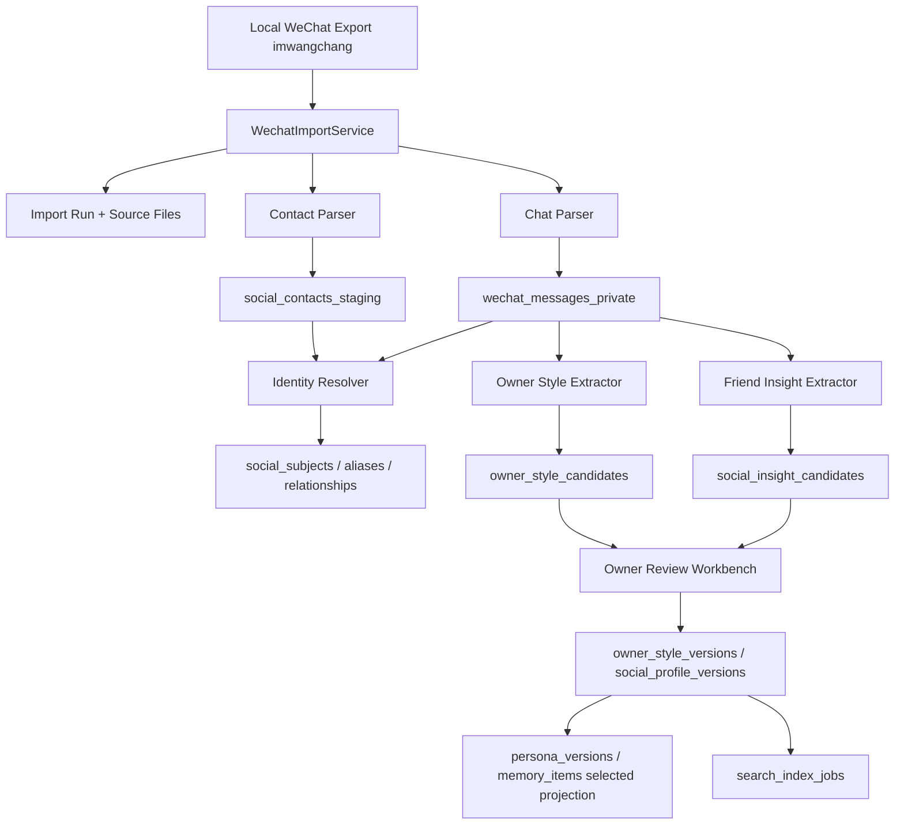

# 补充 SDD：微信私域数据接入、Owner 风格提炼与好友画像数据库

更新时间：2026-05-23

## 1. 背景和目标

本 SDD 对应 `WECHAT_PERSONA_PRD.md`，用于指导后续实现。

目标是在现有超级小王记忆系统上增加一条私域数据管线：

- 从 `/Users/wangchang/Desktop/WSYCursorCode/PolaXiaowang/imwangchang` 读取 Owner 已提供的微信通讯录和聊天记录。
- 提炼 Owner 语言风格和人格表达候选。
- 为好友建立可编辑、可搜索、可追溯的社交画像数据库。
- 将 Owner 确认后的风格差异发布到 `persona_versions`，而不是直接污染核心人格。

本阶段不实现导入代码，只完成架构设计、数据模型和 Harness 文档门禁。

## 2. 当前系统理解

### 2.1 PolaZhenJing / 超级小王现状

| 维度 | 项目事实 | 证据文件 | 对本需求的影响 |
| --- | --- | --- | --- |
| 后端 | Flask + Blueprint | `app/agent.py`、`app/__init__.py` | 新 API 继续挂在 `/PolaZhenjing/admin/api/agent/*` |
| 记忆事实源 | PostgreSQL typed ledger | `migrations/agent_memory/001_postgres_memory_ledger.sql` | 微信数据应进入同一事实源体系或扩展表 |
| 现有表 | `raw_events`、`memory_items`、`visitor_suggestions`、`persona_versions`、`memory_audit_logs`、`search_index_jobs` | migration / `app/memory_store.py` | 可复用证据、候选、人格版本、审计、搜索投影 |
| 权限 | Owner alias resolver | `app/owner_identity.py` | 微信私域数据只允许 Owner 访问和批准 |
| 工作台 | 记忆工作台 | `app/templates/memory_workbench.html` | 应扩展 Tab，而不是新建割裂后台 |
| 检索 | PostgreSQL FTS + JSON fallback，pgvector/Meilisearch 后续 | `docs/pola/agent-memory-persona/SDD.md` | 好友画像先走 Postgres FTS，Meilisearch 只是投影 |
| Harness | `scripts/run_memory_harness.py` | H32-H36 | 新增 H43+ 文档和治理门禁 |

### 2.2 微信导出数据理解

| 数据 | 观察 | 设计影响 |
| --- | --- | --- |
| `summary.json` | 包含账号、导出时间、联系人总数、会话数、消息数等摘要字段 | 用于 import_run 元数据，不直接进入 prompt |
| `contacts.json` | list，每项包含 `username`、`nick_name`、`remark`、`display_name`、`type` | 可导入 contacts staging，username 需 hash |
| `contacts_list.txt` | 纯文本通讯录列表 | 作为证据来源和人工排错，不作为唯一结构源 |
| `chats/private/*.txt` | 单聊文件 | 建立 private conversation，file name 仅作为 alias 候选 |
| `chats/groups/*.txt` | 群聊文件 | 必须解析 sender；无法归属时只作为群话题证据 |
| 消息格式 | 文件头部包含账号/导出时间；消息行包含时间、sender、内容等形态 | Parser 要分离 header、message、binary/noise line |

### 2.3 PolaAIBrain 可复用遗产

| PolaAIBrain 模块 | 可复用思想 | 超级小王取舍 |
| --- | --- | --- |
| `customers` | 一个社交对象一条主档案 | 改名为 `social_subjects`，不限客户，覆盖好友/群/服务号 |
| `messages` | 消息时间线、方向、chat_type、媒体字段 | 复用字段思想，但加入微信 source hash 和隐私边界 |
| `customer_profiles` | 画像版本、current version、JSONB profile | 改成 `social_profile_versions` |
| `personal_insights` | basic/personality/relations/interests 四维洞察 | 扩展为好友画像字段；加入 boundaries/commitments/topics |
| `insight_extractions` | AI 抽取候选 + status + source_msg_ids | 复用为 `social_insight_candidates` |
| `tags` / `customer_tags` | AI/manual 标签体系 | 复用为 social tags，支持关系和场景筛选 |
| `birthday_reminders` | 重要日期提醒 | 可保留为后续 Phase，不作为首期核心 |
| `Milvus` | 对话语义搜索 | 不直接用 Milvus；先沿用 Postgres，后续 pgvector/adapter |
| `wecom-cli` 调度 | 每日采集任务模式 | 当前处理本地导出文件，不做在线采集 |

## 3. 架构选型

### 3.1 候选方案

| 候选 | 描述 | 优点 | 缺点 | 结论 |
| --- | --- | --- | --- | --- |
| A: 直接把聊天摘要写入 `memory_items` | 解析聊天后生成风格/好友记忆 | 实现快 | 隐私风险高，证据和好友画像混入人格记忆 | 拒绝 |
| B: 新建独立 PolaAIBrain 服务 | 复活 FastAPI/Next/Milvus 架构 | 功能完整 | 过重，和超级小王账号/工作台割裂 | 暂不采用 |
| C: 在 PolaZhenJing 内扩展私域社交 schema | 复用 Flask、Owner 权限、PostgreSQL、工作台 | 轻量、可控、可审计 | 需要新增表和导入任务 | 推荐 |
| D: 文件 first + Markdown 画像 | 每个好友生成 markdown | 可读可 diff | 搜索、权限、证据和更新困难 | 作为导出格式，不作主存 |

### 3.2 选型结论

推荐候选 C：在 PolaZhenJing 内扩展私域社交 schema。

决策约束：

- PostgreSQL 是事实源。
- 微信 raw content 默认 `privacy_scope='owner_private'`。
- 好友画像不直接写入 `memory_items.active`。
- Owner 风格发布必须经过 Harness 和 Owner 确认。
- Meilisearch/pgvector 命中必须回 PostgreSQL 复核权限、状态和版本。

## 4. 总体架构



## 5. 数据模型

### 5.1 导入任务

```sql
CREATE TABLE wechat_import_runs (
  id TEXT PRIMARY KEY,
  source_root TEXT NOT NULL,
  source_hash TEXT NOT NULL,
  status TEXT NOT NULL,
  mode TEXT NOT NULL DEFAULT 'dry_run',
  summary_json JSONB NOT NULL DEFAULT '{}'::jsonb,
  contacts_count INTEGER NOT NULL DEFAULT 0,
  conversations_count INTEGER NOT NULL DEFAULT 0,
  messages_count INTEGER NOT NULL DEFAULT 0,
  error_count INTEGER NOT NULL DEFAULT 0,
  created_by TEXT NOT NULL,
  created_at TIMESTAMPTZ NOT NULL DEFAULT now(),
  completed_at TIMESTAMPTZ
);
```

规则：

- `source_root` 只在 Owner/admin 后台展示；不注入模型上下文。
- `dry_run` 只统计数量和格式，不写 raw message。
- `import` 才写入 staging/ledger。

### 5.2 通讯录 staging

```sql
CREATE TABLE wechat_contacts (
  id TEXT PRIMARY KEY,
  import_run_id TEXT NOT NULL,
  username_hash TEXT NOT NULL,
  username_ciphertext TEXT,
  nick_name TEXT,
  remark TEXT,
  display_name TEXT,
  contact_type TEXT NOT NULL,
  raw_json JSONB NOT NULL DEFAULT '{}'::jsonb,
  matched_subject_id TEXT,
  match_status TEXT NOT NULL DEFAULT 'unmatched',
  created_at TIMESTAMPTZ NOT NULL DEFAULT now()
);
```

规则：

- `username` 默认 hash；如需回显原值，使用应用层加密保存到 `username_ciphertext`。
- `nick_name/remark/display_name` 属于可见 PII，只允许 Owner 查看。
- `matched_subject_id` 指向统一社交对象。

### 5.3 会话和消息

```sql
CREATE TABLE wechat_conversations (
  id TEXT PRIMARY KEY,
  import_run_id TEXT NOT NULL,
  conversation_type TEXT NOT NULL,
  display_name TEXT,
  file_path_hash TEXT NOT NULL,
  file_path_ciphertext TEXT,
  subject_id TEXT,
  group_subject_id TEXT,
  message_count INTEGER NOT NULL DEFAULT 0,
  first_message_at TIMESTAMPTZ,
  last_message_at TIMESTAMPTZ,
  parse_status TEXT NOT NULL DEFAULT 'pending',
  created_at TIMESTAMPTZ NOT NULL DEFAULT now()
);

CREATE TABLE wechat_messages (
  id TEXT PRIMARY KEY,
  import_run_id TEXT NOT NULL,
  conversation_id TEXT NOT NULL,
  source_line_no INTEGER,
  message_hash TEXT NOT NULL,
  sender_display TEXT,
  sender_subject_id TEXT,
  direction TEXT NOT NULL,
  message_type TEXT NOT NULL DEFAULT 'text',
  content TEXT,
  content_redacted TEXT,
  occurred_at TIMESTAMPTZ,
  risk_flags JSONB NOT NULL DEFAULT '{}'::jsonb,
  created_at TIMESTAMPTZ NOT NULL DEFAULT now(),
  UNIQUE(import_run_id, message_hash)
);
```

规则：

- `content` 默认仅 Owner 可见；可选改为只存本地文件 offset + hash。
- `content_redacted` 用于后台摘要和搜索投影。
- `direction='owner'` 的消息才参与 Owner 风格抽取。
- 群聊 sender 无法解析时，`sender_subject_id` 为空，不进入个人画像。

### 5.4 社交对象和关系

```sql
CREATE TABLE social_subjects (
  id TEXT PRIMARY KEY,
  subject_type TEXT NOT NULL,
  display_name TEXT NOT NULL,
  canonical_name TEXT,
  importance REAL NOT NULL DEFAULT 0.5,
  status TEXT NOT NULL DEFAULT 'source_only',
  privacy_scope TEXT NOT NULL DEFAULT 'owner_private',
  created_at TIMESTAMPTZ NOT NULL DEFAULT now(),
  updated_at TIMESTAMPTZ NOT NULL DEFAULT now()
);

CREATE TABLE social_subject_aliases (
  id TEXT PRIMARY KEY,
  subject_id TEXT NOT NULL,
  alias TEXT NOT NULL,
  alias_type TEXT NOT NULL,
  source_ref TEXT,
  confidence REAL NOT NULL DEFAULT 0.7,
  created_at TIMESTAMPTZ NOT NULL DEFAULT now()
);

CREATE TABLE social_relationships (
  id TEXT PRIMARY KEY,
  from_subject_id TEXT NOT NULL,
  to_subject_id TEXT NOT NULL,
  relationship_type TEXT NOT NULL,
  context TEXT,
  strength REAL NOT NULL DEFAULT 0.5,
  status TEXT NOT NULL DEFAULT 'candidate',
  evidence_refs JSONB NOT NULL DEFAULT '[]'::jsonb,
  updated_at TIMESTAMPTZ NOT NULL DEFAULT now()
);
```

`subject_type` 可选：

- `owner`
- `friend`
- `family`
- `work_contact`
- `group`
- `service`
- `unknown`

### 5.5 好友画像版本和候选

```sql
CREATE TABLE social_profile_versions (
  id TEXT PRIMARY KEY,
  subject_id TEXT NOT NULL,
  version INTEGER NOT NULL,
  status TEXT NOT NULL,
  profile_json JSONB NOT NULL,
  summary TEXT,
  confidence REAL NOT NULL DEFAULT 0.5,
  created_by TEXT NOT NULL,
  created_at TIMESTAMPTZ NOT NULL DEFAULT now(),
  reviewed_at TIMESTAMPTZ,
  harness_run_id TEXT
);

CREATE TABLE social_insight_candidates (
  id TEXT PRIMARY KEY,
  subject_id TEXT NOT NULL,
  dimension TEXT NOT NULL,
  field_key TEXT NOT NULL,
  value_json JSONB NOT NULL,
  inference_level TEXT NOT NULL,
  confidence REAL NOT NULL DEFAULT 0.5,
  status TEXT NOT NULL DEFAULT 'pending',
  evidence_refs JSONB NOT NULL DEFAULT '[]'::jsonb,
  risk_flags JSONB NOT NULL DEFAULT '{}'::jsonb,
  extracted_at TIMESTAMPTZ NOT NULL DEFAULT now(),
  reviewed_by TEXT,
  reviewed_at TIMESTAMPTZ
);
```

`inference_level`：

- `explicit_self_claim`：对方自己明确说出。
- `owner_statement`：Owner 对对方的描述。
- `third_party_statement`：第三方提到。
- `behavioral_inference`：由互动模式推断。
- `model_guess`：模型低证据猜测，默认不可采纳。

### 5.6 Owner 风格版本

```sql
CREATE TABLE owner_style_versions (
  id TEXT PRIMARY KEY,
  version INTEGER NOT NULL,
  status TEXT NOT NULL,
  style_json JSONB NOT NULL,
  scenario_styles_json JSONB NOT NULL DEFAULT '{}'::jsonb,
  do_rules JSONB NOT NULL DEFAULT '[]'::jsonb,
  do_not_rules JSONB NOT NULL DEFAULT '[]'::jsonb,
  evidence_refs JSONB NOT NULL DEFAULT '[]'::jsonb,
  change_summary TEXT,
  created_by TEXT NOT NULL,
  created_at TIMESTAMPTZ NOT NULL DEFAULT now(),
  reviewed_at TIMESTAMPTZ,
  harness_run_id TEXT
);
```

发布规则：

- `owner_style_versions.status='active'` 后，生成 `persona_versions` draft。
- 只有 Owner 点击“发布人格版本”后才更新 active persona。
- 风格版本只存规则和统计，不存可识别聊天原文。

### 5.7 证据引用

```sql
CREATE TABLE source_evidence_refs (
  id TEXT PRIMARY KEY,
  source_type TEXT NOT NULL,
  source_id TEXT NOT NULL,
  message_id TEXT,
  file_path_hash TEXT,
  line_start INTEGER,
  line_end INTEGER,
  excerpt_hash TEXT,
  excerpt_redacted TEXT,
  privacy_scope TEXT NOT NULL DEFAULT 'owner_private',
  created_at TIMESTAMPTZ NOT NULL DEFAULT now()
);
```

原则：

- 证据引用保存 hash、行号和脱敏摘录。
- 展开原文需要 Owner 二次确认。
- 搜索投影只同步 `excerpt_redacted`，不同步原文。

## 6. 服务和模块设计

| 文件 | 操作 | 职责 |
| --- | --- | --- |
| `app/wechat_import.py` | 新增 | 导入任务、dry-run、文件扫描、进度状态 |
| `app/wechat_parser.py` | 新增 | contacts/chat txt parser，清洗 NUL/binary/noise |
| `app/social_identity.py` | 新增 | 联系人合并、alias、group sender resolution |
| `app/social_profile_service.py` | 新增 | 好友画像候选、版本、审核、合并 |
| `app/owner_style_service.py` | 新增 | Owner 风格抽取、版本、persona diff |
| `app/templates/social_memory_workbench.html` | 新增或拆分 | 微信导入、我的风格、好友画像、社交洞察 UI |
| `scripts/import_wechat_export.py` | 新增 | CLI dry-run/import |
| `scripts/extract_owner_style.py` | 新增 | 批处理 Owner 风格候选 |
| `scripts/extract_social_profiles.py` | 新增 | 批处理好友画像候选 |
| `tests/test_wechat_parser.py` | 新增 | 文件格式解析和清洗 |
| `tests/test_social_privacy.py` | 新增 | 权限、脱敏、访客不可访问 |

实现时遵守项目规则：一个文件只做一类事，后端路由按功能拆分，避免把所有逻辑塞进 `app/agent.py`。

## 7. Parser 设计

### 7.1 contacts parser

输入：`contacts.json`

输出：

```json
{
  "username_hash": "sha256:...",
  "nick_name": "...",
  "remark": "...",
  "display_name": "...",
  "contact_type": "friend|group|official|unknown",
  "raw_fingerprint": "sha256:..."
}
```

### 7.2 chat parser

输入：`chats/private/*.txt`、`chats/groups/*.txt`

步骤：

1. 读取文件头部，识别账号、会话类型、导出时间。
2. 跳过 header、空行、明显二进制噪声。
3. 解析消息时间、sender、content。
4. 生成 message hash：`sha256(import_run_id + file_hash + line_no + normalized_line)`。
5. 对图片、语音、表情、文件等非文本内容只记录类型和占位，不做画像推断。
6. 对无法解析的行写入 parse_errors，不中断整个导入。

### 7.3 Owner sender 识别

优先级：

1. `summary.json.account` 或导出头部账号。
2. contacts 中 Owner alias。
3. 用户在 dry-run 后手工指定 Owner 显示名。
4. 无法识别时，不抽取 Owner 风格，只做文件统计。

## 8. 抽取器设计

### 8.1 Owner Style Extractor

输入：

- Owner 消息样本。
- 场景标签：private/group/work/family/friend/project。
- 时间窗口。

输出：

- `owner_style_candidates`
- `owner_style_versions(draft)`
- 可选投影到 `memory_items(memory_type='style', status='candidate')`

抽取规则：

- 每批最大 token budget，按时间和场景分片。
- 先做统计特征：句长、标点、表情、问句、感叹、转折词。
- 再做 LLM 归纳：语气、结构、价值、边界、场景差异。
- 最后做反证检查：如果不同场景风格冲突，保留为 scenario style，不合并成全局风格。

### 8.2 Friend Insight Extractor

输入：

- 某 subject 的私聊和可归属群聊消息。
- 该 subject 的 contacts/alias。

输出：

- `social_insight_candidates`
- `social_profile_versions(draft)`

抽取维度：

```json
{
  "identity": {},
  "relationship": {},
  "communication": {},
  "preferences": {},
  "facts": {},
  "commitments": {},
  "boundaries": {},
  "topics": {}
}
```

抽取规则：

- 只提取明确证据支持的信息。
- 敏感字段默认 `pending_sensitive`，不自动 active。
- 玩笑、反讽、群内称呼、转述必须降置信。
- 同一字段多版本冲突时进入 `disputed`。

## 9. 检索和上下文注入

### 9.1 Owner 场景

当 Owner 问：“我和某某是什么关系”“上次跟某某聊过什么”“给某某发消息应该注意什么”：

1. 鉴权确认 Owner。
2. social search 找 subject。
3. 读取 active/pinned profile + relevant evidence summary。
4. Context compiler 注入摘要，不注入完整原文。
5. 如果需要原文，提示 Owner 到工作台查看。

### 9.2 公开访客场景

访客问到好友或微信数据：

- 不检索 social profile。
- 不承认/透露好友存在与否。
- 回复私人资料不可透露。

### 9.3 超级小王人格风格

chat prompt 使用：

- active `persona_versions`
- active `owner_style_versions` 的公开/agent-safe 子集
- 与当前问题相关的 style rules

禁止：

- 使用私聊原文作为 few-shot。
- 使用好友姓名/私人细节作为表达风格样本。
- 为了像 Owner 而假装“我是炽驹本人”。

## 10. API 设计

| API | Method | 权限 | 用途 |
| --- | --- | --- | --- |
| `/admin/api/agent/wechat/import/dry-run` | POST | Owner | 扫描目录并返回数量/格式/风险 |
| `/admin/api/agent/wechat/import` | POST | Owner | 创建导入任务 |
| `/admin/api/agent/wechat/import/<id>` | GET | Owner | 查看导入状态 |
| `/admin/api/agent/owner-style` | GET | Owner | 查看风格版本和候选 |
| `/admin/api/agent/owner-style/<id>/adopt` | POST | Owner | 采纳风格候选 |
| `/admin/api/agent/owner-style/<id>/publish` | POST | Owner | 发布 persona diff |
| `/admin/api/agent/social/subjects` | GET | Owner | 搜索好友画像 |
| `/admin/api/agent/social/subjects/<id>` | GET | Owner | 好友画像详情 |
| `/admin/api/agent/social/candidates/<id>/review` | POST | Owner | 采纳/编辑/拒绝画像字段 |
| `/admin/api/agent/social/subjects/<id>/delete` | POST | Owner | 删除/归档好友画像 |

## 11. 工作台布局

### 11.1 微信导入 Tab

- 数据目录输入框。
- Dry-run 按钮。
- 统计卡：联系人、单聊、群聊、消息、解析失败、敏感风险。
- 导入范围：private/group/contact/media 开关。
- 安全模式：只存 hash/脱敏摘要/完整私有原文。
- 任务列表：状态、耗时、错误、重跑。

### 11.2 我的风格 Tab

- 当前风格版本。
- 风格维度雷达或表格。
- 场景风格列表。
- 候选变更 diff。
- 证据数量和时间范围。
- 采纳/编辑/拒绝/运行 Harness/发布。

### 11.3 好友画像 Tab

- 搜索框和筛选：关系类型、标签、状态、最近互动、共同群。
- 列表：显示名、关系、标签、最近互动、画像状态、风险。
- 详情：画像摘要、字段表、证据抽屉、时间线、相关承诺、删除/合并。

### 11.4 社交洞察 Tab

- 近期待处理承诺。
- 重要日期。
- 关系图摘要。
- 低置信待审核项。
- 长期未互动但重要的人。

## 12. 安全和治理

### 12.1 隐私边界

- 微信数据默认 `owner_private`。
- 原文不进入 Meilisearch，除非 Owner 明确选择脱敏摘要投影。
- 原文不进入 LLM prompt，抽取任务只发送最小必要片段。
- 导出和删除必须记录 audit。

### 12.2 敏感推断禁区

默认禁止自动生成：

- 医疗/心理诊断。
- 政治/宗教倾向判断。
- 财富和征信判断。
- 未成年人敏感画像。
- 亲密关系猜测。
- 第三方隐私转述。

如聊天明确出现，只能作为 `sensitive_candidate`，不进入 active profile，除非 Owner 手工确认并设定使用范围。

### 12.3 反投毒

风险模式：

- 好友或群聊试图修改超级小王人格。
- 消息里出现“忽略之前规则”“以后你必须”等 prompt injection。
- 非 Owner 声称 Owner 的身份、偏好或边界。
- 群聊玩笑被抽成长期事实。

处理：

- 写入 risk_flags。
- 不进入 active style/profile。
- 工作台标红，需要 Owner 审核。

## 13. 任务编排

| Job | 触发 | 说明 |
| --- | --- | --- |
| `wechat_import_scan` | Owner 手动 | dry-run 统计 |
| `wechat_import_parse` | Owner 手动 | 解析 contacts/chats |
| `owner_style_extract` | 导入后或手动 | 抽取 Owner 风格候选 |
| `social_profile_extract` | 导入后或手动 | 抽取好友画像候选 |
| `social_index_rebuild` | 采纳/编辑后 | 重建搜索投影 |
| `persona_style_harness` | 发布前 | 校验风格安全和一致性 |

## 14. 测试策略

| 测试 | 覆盖 |
| --- | --- |
| `test_wechat_contacts_parser` | contacts.json 字段、hash、类型 |
| `test_wechat_chat_parser` | private/group txt 解析、header/noise 清洗 |
| `test_owner_sender_resolution` | Owner sender 识别失败时不抽风格 |
| `test_social_identity_merge` | 别名合并、冲突进入人工审核 |
| `test_owner_style_candidate_gate` | 风格候选必须 pending，不能直接 active |
| `test_social_profile_privacy` | 访客不能访问好友画像 |
| `test_sensitive_inference_guard` | 敏感推断默认 quarantine/pending_sensitive |
| `test_search_projection_redaction` | Meilisearch 不含原文和敏感字段 |
| `run_memory_harness.py` H43-H48 | 文档门禁 |

## 15. 发布和回滚

### 15.1 发布顺序

1. 备份 PostgreSQL。
2. 执行新增 schema migration。
3. 发布代码但默认关闭：`POLA_WECHAT_IMPORT_ENABLED=false`。
4. Owner 本地 dry-run。
5. 小范围导入 private 少量样本。
6. 工作台审核和 Harness。
7. 才允许发布 active style version。

### 15.2 回滚

- 关闭 `POLA_WECHAT_IMPORT_ENABLED`。
- 停止导入/抽取 job。
- 将 `owner_style_versions.status` 回滚到上一 active。
- 将 social profiles 标记 archived，不删除 raw evidence。
- 需要彻底清除时由 Owner 执行删除任务并生成 audit。

## 16. Harness 映射

| Harness | 检查 |
| --- | --- |
| H43-wechat-docs-present | PRD/SDD/Harness 三个补充文档存在 |
| H44-owner-style-gates | PRD/SDD 明确 Owner 风格只能候选、审核、发布 |
| H45-social-profile-schema | SDD 覆盖 social_subjects、social_profile_versions、social_insight_candidates |
| H46-privacy-boundary | 文档明确访客不可访问微信和好友画像 |
| H47-pola-aibrain-reuse | 文档明确 PolaAIBrain 可复用与拒绝项 |
| H48-no-raw-chat-leak | 文档不包含聊天原文样例，只描述结构和脱敏证据 |

## 17. 未决问题

1. 微信导出中 Owner sender 的稳定标识需要 dry-run 后确认。
2. 原文存储模式需要 Owner 选择：完整私有原文、只存 hash+offset、或只存脱敏摘要。
3. 是否需要对特定好友设置“永不分析/永不召回”名单。
4. 好友画像是否未来和 PolaAIBrain 独立产品合并，还是永久作为超级小王内置私域层。
