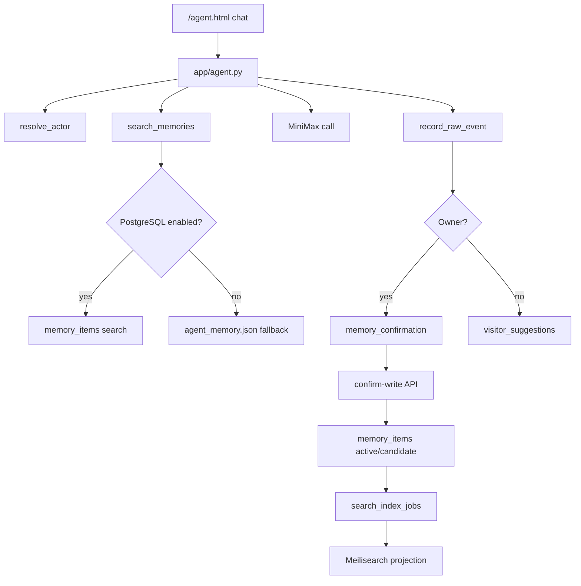

# 架构开发文档：超级小王记忆系统升级

日期：2026-05-22

## 当前架构事实

- Flask app factory：`app/__init__.py`
- Agent API：`app/agent.py`
- 登录与权限：`app/auth.py`
- 公开对话页：`portal/agent.html`、`portal/assets/agent.js`
- 旧记忆：`data/agent_memory.json`
- 线上部署：`/PolaZhenjing`，`polazj.service`，子路径 `/PolaZhenjing/`

## 选型结论

采用：

```text
PostgreSQL typed ledger -> pgvector shadow/active -> Meilisearch projection
JSON fallback 保留
```

拒绝：

- 纯向量库主存。
- 访客建议直接改 active memory。
- Meilisearch document 直接进入 prompt。

## 模块影响

| 模块 | 改动 |
| --- | --- |
| `app/owner_identity.py` | Owner/admin/user/visitor 解析。 |
| `app/memory_guard.py` | 投毒检测、记忆类型分类、Owner 确认判断。 |
| `app/memory_store.py` | PostgreSQL schema、CRUD、audit、search outbox。 |
| `app/memory_service.py` | 记忆服务 facade、fallback、写入分流、采纳/编辑。 |
| `app/search_projection.py` | Meilisearch 安全文档构建。 |
| `app/agent.py` | 接入记忆服务、确认写入、访客建议、后台 API。 |
| `app/templates/memory_workbench.html` | 记忆工作台。 |
| `scripts/import_agent_memory_legacy.py` | JSON 旧记忆导入。 |
| `scripts/import_article_memories.py` | `_posts/*.md` 文章导入。 |
| `scripts/rebuild_meilisearch_index.py` | Meilisearch projection 重建。 |
| `scripts/run_memory_harness.py` | Deterministic Harness。 |
| `migrations/agent_memory/001_postgres_memory_ledger.sql` | PostgreSQL 迁移。 |

## 数据流



## API

- `GET /admin/api/agent/memory/status`
- `GET /admin/api/agent/memory/search`
- `POST /admin/api/agent/memory/init`
- `POST /admin/api/agent/memory/confirm-write`
- `GET /admin/api/agent/memory/items`
- `PATCH /admin/api/agent/memory/items/<memory_id>`
- `GET /admin/api/agent/memory/visitor-suggestions`
- `POST /admin/api/agent/memory/visitor-suggestions/<id>/adopt`
- `POST /admin/api/agent/memory/visitor-suggestions/<id>/discard`
- `GET /admin/agent/memory`

## Feature Flags

| 变量 | 说明 |
| --- | --- |
| `DATABASE_URL` | PostgreSQL DSN。 |
| `POLA_MEMORY_DB_ENABLED` | 是否启用 PostgreSQL 读。 |
| `POLA_MEMORY_WRITE_ENABLED` | 是否启用写入。 |
| `POLA_MEMORY_FALLBACK_JSON` | JSON fallback，默认保留。 |
| `MEILISEARCH_URL` | Meilisearch URL。 |
| `MEILISEARCH_API_KEY` | Meilisearch key。 |

## 回滚

1. 关闭 `POLA_MEMORY_DB_ENABLED`。
2. 关闭 `POLA_MEMORY_WRITE_ENABLED`。
3. 重启 `polazj.service`。
4. `/memory/status` 应继续返回 JSON fallback。
