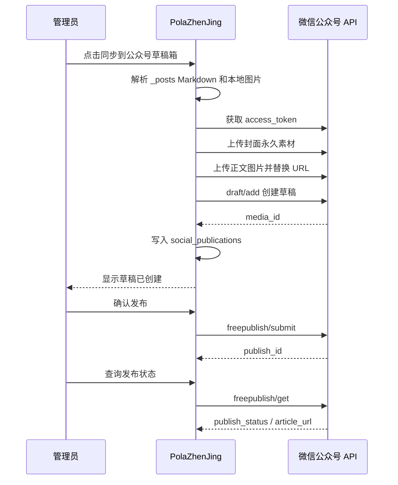

# SDD：文章多平台发布中心

日期：2026-05-30

## 当前系统理解

- Flask app factory 注册后台 blueprint，部署在 `/PolaZhenjing/admin/*`。
- 文章主数据为 `_posts/*.md`，由 `app/uploader.py` 负责生成、解析、编辑和展示。
- 后台异步任务使用 `app/jobs.py` 的 SQLite `jobs` 表和 daemon thread。
- 当前已有微信 JS-SDK 分享配置接口，但它只用于分享卡，不用于公众号发布。

## 架构选型

| 方案 | 一致性 | 复用 | 风险 | 结论 |
| --- | --- | --- | --- | --- |
| 扩展 `app/uploader.py` | 高 | 高 | 文件继续膨胀，平台逻辑污染文章逻辑 | 不选 |
| 新增 `social_publish` blueprint + adapter | 高 | 中高 | 需要少量注册和模板 | 采用 |
| 独立服务 | 低 | 低 | 部署、鉴权、状态同步成本高 | 不选 |

结论：新增 `app/social_publish.py` 作为发布中心，复用 `_posts` 解析能力和 `jobs` 异步任务，平台差异封装在 adapter 函数中。

## 数据模型

新增 SQLite 表：

- `social_publications`
  - `id`
  - `filename`
  - `platform`
  - `status`
  - `mode`
  - `external_id`
  - `external_url`
  - `payload_json`
  - `error`
  - `created_by`
  - `created_at`
  - `updated_at`
- `social_publication_events`
  - `id`
  - `publication_id`
  - `event_type`
  - `message`
  - `created_at`

## 模块影响

| 模块 | 改动 | 原因 | 风险 |
| --- | --- | --- | --- |
| `app/__init__.py` | 注册发布 blueprint 和初始化 schema | 后台入口 | 启动期迁移需幂等 |
| `app/social_publish.py` | 新增发布中心、微信 adapter、发布包生成 | 核心能力 | 第三方 API 失败需清晰落库 |
| `app/templates/*` | 新增发布页/状态页，文章页加入口 | 管理员操作 | 不影响公开文章 |
| `app/templates/base.html` | 导航加“发布” | 后台可发现 | 仅管理员可见 |
| `tests/` | 增加发布包和 schema 测试 | 回归保障 | 不访问真实微信 API |

## 微信数据流

## 安全和配置

- 微信凭据只从环境变量读取：
  - `WECHAT_MP_APP_ID`
  - `WECHAT_MP_APP_SECRET`
- access token 仅进进程缓存，不写数据库。
- payload 中不保存密钥、token、Cookie。
- 小红书/头条只保存发布包内容和人工回填 URL。

## 测试策略

- 纯函数测试：发布包格式、微信 HTML 图片处理、配置状态。
- 语法检查：`python3 -m py_compile app/social_publish.py app/__init__.py`。
- Flask 手动/集成验证：登录后访问发布中心，缺少微信配置时显示未配置；小红书/头条可生成发布包。

## 回滚方案

- 代码回滚后新增表保留但不被读取。
- 若微信 API 出错，不影响文章生成、编辑、公开展示和 GitHub 同步。
