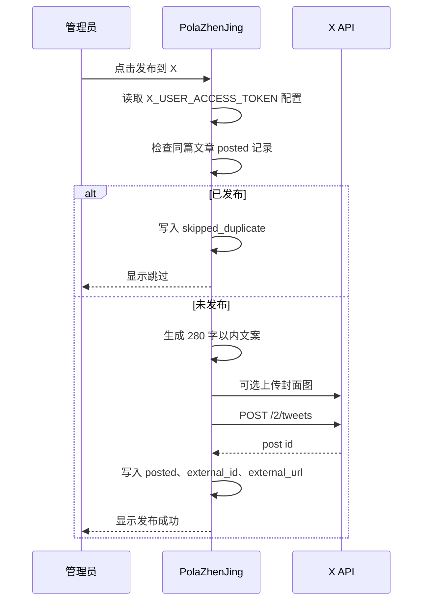

# SDD：X 自动发布

日期：2026-05-31

## 当前系统理解

- 发布中心已由 `app/social_publish.py` 承载，复用 `_posts` 解析、`jobs` 异步任务、`social_publications` 和 `social_publication_events`。
- 微信公众号已作为官方 API adapter 接入，发布包平台通过 `manual_package` 分支处理。
- 后台页面由 Jinja 模板渲染，单篇发布页按平台卡片展示状态和操作。

## 项目 Arch Reference 摘要

- arch-reference 路径：`docs/pola/arch-reference.md`
- 相关事实：
  - Flask app factory 注册后台 blueprint。
  - 管理后台使用 Jinja 模板和 `app/templates/base.html` 样式体系。
  - 长任务使用 `app/jobs.py` SQLite jobs 表和 daemon thread。
  - 生产部署为服务器 `/PolaZhenjing` + `polazj.service`。

## 架构选型

| 方案 | 一致性 | 复用 | 安全 | 验证 | 结论 |
| --- | --- | --- | --- | --- | --- |
| 复用 `social_publish` 新增 X adapter | 高 | 高 | token 仅走环境变量 | 可单测纯逻辑 | 采用 |
| 新增独立 X blueprint | 中 | 中 | 多一套路由和模板 | 验证面增加 | 不选 |
| 先实现 OAuth token 存储 | 中 | 低 | refresh token 落库风险更高 | 需要真实授权回调 | 暂不选 |

结论：沿用现有发布中心架构，在 `app/social_publish.py` 新增 X 配置、文案生成、媒体上传、发帖和异步任务函数。

## 数据流

## 模块影响

| 模块 | 改动 | 原因 | 风险 |
| --- | --- | --- | --- |
| `app/social_publish.py` | 新增 X 平台配置、API adapter、去重和任务路由 | 核心发布能力 | X API 额度/权限失败需清晰落库 |
| `app/templates/social_publish_index.html` | 增加 X 状态列 | 管理员可见平台状态 | 表格列增加 |
| `app/templates/social_publish_article.html` | 增加 X 发布卡片 | 单篇操作入口 | 移动端需自适应 |
| `tests/test_social_publish.py` | 增加 X 文案和配置测试 | 回归保障 | 不访问真实 X API |
| `docs/pola/project-knowledge/*` | 增加需求/PRD/SDD/开发日志 | Pola 交付记录 | 无 |

## 配置和安全

- 新增环境变量：`X_USER_ACCESS_TOKEN`。
- token 只用于服务端请求头，不渲染完整值。
- 数据库只保存 post id、外部 URL、生成文案和媒体 id，不保存 token。
- 发帖错误写入 `error` 字段，不包含请求头。

## 测试策略

- 单测：
  - X 文案长度控制和链接保留。
  - X 配置状态读取。
  - 既有微信/发布包测试不回归。
- 语法检查：`python3 -m py_compile app/social_publish.py`。
- 页面 smoke：未登录访问发布中心应 302 到登录页。
- 真实 X 发帖需配置 `X_USER_ACCESS_TOKEN` 后手动验证。

## 回滚方案

- 代码回滚后，`social_publications` 中 `platform=x` 的记录保留但不被新入口读取。
- 如 X API 出错，不影响微信、小红书/头条发布包、文章生成和公开展示。
