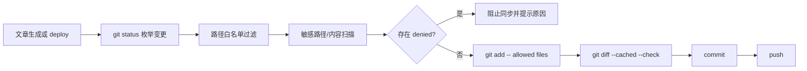

# SDD：文章生成流程 git 安全治理

日期：2026-06-02

## 架构影响

新增根目录轻量模块 `git_safety.py`，避免 CLI 导入 Flask app 时因环境缺少 Flask 而失败。`wiki.py` 和 `app/uploader.py` 共用该模块。

## 模块

| 模块 | 责任 |
| --- | --- |
| `git_safety.changed_files` | 读取 `git status --porcelain --untracked-files=all` |
| `git_safety.split_stage_candidates` | 按路径白名单、拒绝清单和内容扫描拆分 allowed/denied |
| `git_safety.guarded_commit_and_push` | 精确 stage、`git diff --cached --check`、commit、push |
| `wiki.py deploy` | CLI 输出 allowed/denied，支持 `--dry-run` |
| `app/uploader.py` | 生成文章和后台同步时调用同一安全 helper |

## 数据流

## 关键决策

- 不再允许 `git add -A` 出现在文章同步路径。
- 白名单只覆盖文章 Markdown 和图片资产，避免部署按钮提交代码、截图、数据库或备份。
- 密钥扫描只读取 1MB 以下文本文件，大文件以路径白名单为主，避免误读图片二进制。
- dry-run 不绕过拒绝规则；当前工作区有非白名单改动时应直接阻止。

## 测试策略

- 临时 git 仓库验证 `.env` 被拒绝、文章文件允许。
- 临时 git 仓库验证存在备份文件时 commit 被阻止。
- 临时 git 仓库验证只有文章文件时可 commit 且只 stage 白名单文件。
- 当前仓库运行 `wiki.py deploy --dry-run`，确认本轮代码和 `.qa-artifacts` 被拒绝。
