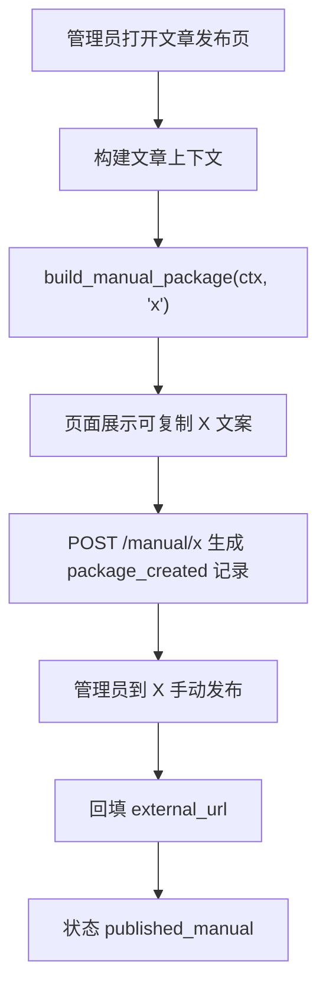

# X 手动发布模式 SDD

- 日期：2026-06-02
- 目标项目：PolaZhenJing

## 架构决策

将 X 从 `official_api` 平台改为 `manual_package` 平台。X 的核心价值从“自动调用 API 发帖”调整为“生成可复制发布内容并沉淀发布记录”。这样不依赖 X Developer Platform、付费 credits 或用户 access token。

## 模块影响

| 模块 | 改动 |
| --- | --- |
| `app/social_publish.py` | X 平台 mode 改为 `manual_package`；`build_manual_package` 增加 X 分支；移除 X API 调用路径和 token 配置状态依赖。 |
| `app/templates/social_publish_article.html` | X 使用通用手动发布包卡片，不再单独展示 token 状态和自动发帖按钮。 |
| `tests/test_social_publish.py` | 增加 X 手动发布包测试，移除 X token 状态测试。 |
| docs | 新增需求、PRD、SDD、测试报告和 devlog。 |

## 数据流

## 接口影响

- 保留现有 `create_package(filename, platform)` 路由，允许 `platform=x`。
- 删除或停用 `x_post` 自动发帖路由对页面的可达入口。
- 不再读取 `X_USER_ACCESS_TOKEN`。

## 测试策略

- 单元测试：X 发布包正文使用 `build_x_post_text` 并保持 280 字限制。
- 路由测试：详情页不出现 `X_USER_ACCESS_TOKEN`、`发布到 X`，出现 X 发布包和 `生成发布包`。
- 回归测试：微信公众号、小红书、头条手动包测试不受影响。
