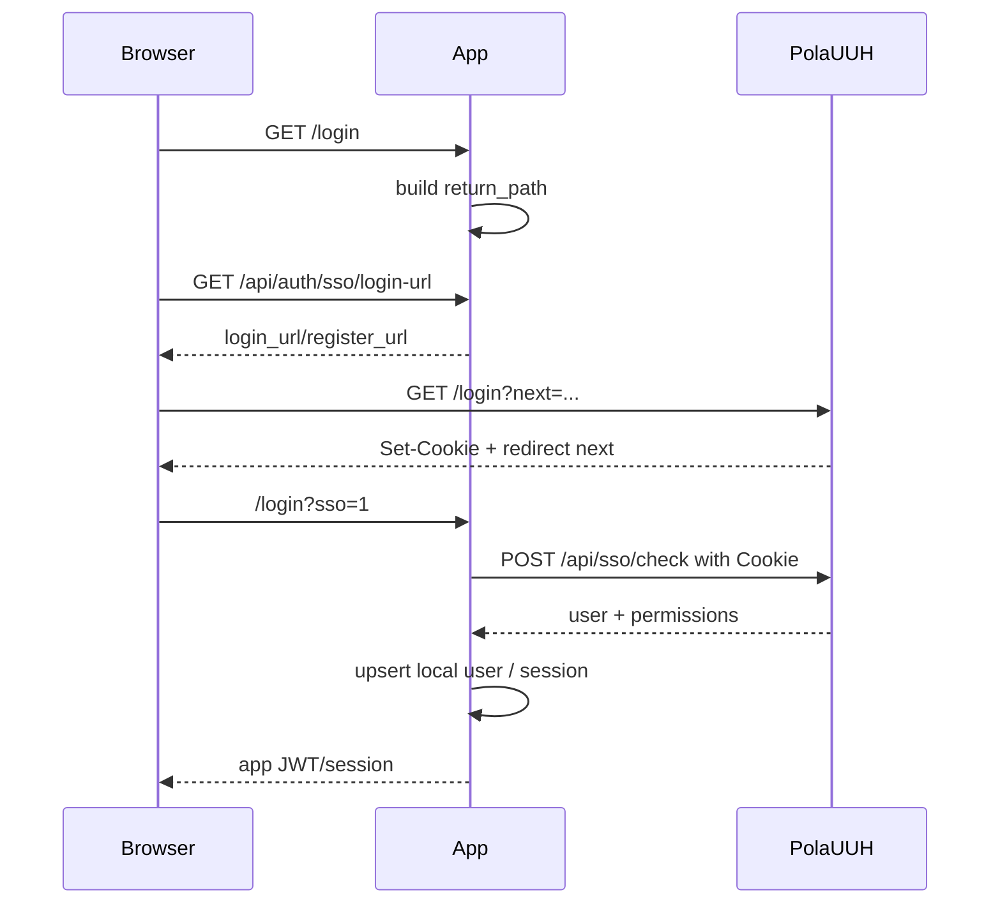

# SDD：PolaUUH 统一身份中心与多应用接入

## 1. 背景和目标

Pola 系列已经出现多个应用级身份实现：

- `PolaZhenJing` 实际承担统一用户、偏好、权限和 SSO check。
- `PolaReference` 已作为 SSO client 接入 `AIPD / PolaZhenjing`。
- `PolaRead` 仍使用本地用户表和本地登录注册。
- `PolaDiting` 当前是 local-first 未鉴权控制台。

本 SDD 的目标是把身份中心从 `PolaZhenjing / AIPD` 产品语义中抽出，形成 canonical `PolaUUH`，并以兼容方式接入首批应用。

## 2. 当前系统理解

| 维度 | 项目事实 | 证据文件 | 影响 |
| --- | --- | --- | --- |
| 身份中心 | PolaZhenJing `auth_bp` url_prefix 为 `/admin`，已有 login/register/account/password/me/preferences/permissions/sso check | `app/auth.py` | 可通过新增 alias/canonical 路由而非重写用户系统实现 PolaUUH |
| 用户数据 | SQLite `users`、`user_preferences`、`user_permissions`、`permission_requests`、`app_user_links` | `app/__init__.py` | 继续作为 PolaUUH 初始数据源 |
| 权限模型 | `PERMISSION_CATALOG` 已包含 `polaread.use`，但缺 `polareference.use`、`poladiting.use` | `app/auth.py` | 需要扩展权限 catalog |
| SSO client | PolaReference 已实现 `sso/login-url` 与 `sso/aipd`，通过 Cookie 调 PolaZhenjing check | `PolaReference/backend/app/api/endpoints/auth.py` | 迁移成本低，可做命名兼容 |
| PolaRead auth | FastAPI `/auth/register`、`/auth/login`、`/auth/me`，JWT `sub=user.id` | `PolaRead/backend/app/api/endpoints/auth.py`, `deps.py` | 需要新增 SSO exchange，保留本地 JWT |
| PolaDiting auth | 文档明确 local-only unauthenticated UI，FastAPI 无 auth middleware | `PolaDiting/docs/...local-job-console-requirements.md`, `pola_diting_service/app.py` | 需要可选中间件，默认关闭 |

## 3. 项目 Arch Reference 摘要

- PolaZhenJing：
  - Flask 蓝图 + Jinja 页面 + SQLite。
  - `session['user_id']` 是登录态核心。
  - `user_payload(user)` 是用户资料输出核心。
  - `PERMISSION_CATALOG` / `_permissions_for` 是权限核心。
- PolaReference：
  - FastAPI 后端 + React/Vite 前端。
  - App 后端调用统一中心 SSO check 后签发本地 JWT。
  - 本地账号仅作为开发入口。
- PolaRead：
  - FastAPI 后端 + React/Vite 前端。
  - 前端 `localStorage.token` + `AuthContext` 管理会话。
  - 后端所有受保护 API 依赖 `get_current_user`。
- PolaDiting：
  - FastAPI 单服务，HTML dashboard 由 Python 字符串生成。
  - 当前无用户表和 token 模型。

## 4. 架构选型分析

| 候选方案 | 一致性 | 复用 | 耦合 | 扩展 | 验证 | 部署风险 | 回滚 | 结论 |
| --- | --- | --- | --- | --- | --- | --- | --- | --- |
| A. 只改文案，不新增 PolaUUH 路径 | 高 | 高 | 低 | 低 | 简单 | 低 | 简单 | 不满足“往上放一层” |
| B. 在 PolaZhenJing 现有 auth 上增加 PolaUUH canonical 路由和配置 alias | 高 | 高 | 中 | 中高 | 中 | 中 | 可保留 legacy | 推荐 |
| C. 新建独立 PolaUUH 服务与数据库 | 中 | 低 | 低 | 高 | 高 | 高 | 复杂 | 本阶段拒绝 |

### 架构选型结论

推荐候选 B：基于现有 PolaZhenJing 用户中心增加 `PolaUUH` canonical 品牌、路径和配置，并保持 legacy 路径兼容。

理由：

- 已有用户、偏好、权限、SSO check 能直接复用。
- PolaReference 已验证这种 SSO client 模式。
- 能分阶段迁移 PolaRead 和 PolaDiting，风险可控。
- 可以用 alias 配置逐步从 `AIPD_*` 迁到 `POLAUUH_*`。

拒绝候选 C：

- 会引入新部署、新数据库迁移、跨服务同步和账号迁移风险。
- 当前目标是统一抽象和接入，不是拆分独立 IAM 平台。

## 5. 方案概览

### 5.1 PolaUUH Provider

在 PolaZhenJing 中：

- 增加 canonical 路由：
  - `/uuh/login`
  - `/uuh/register`
  - `/uuh/verify`
  - `/uuh/account`
  - `/uuh/password`
  - `/uuh/logout`
  - `/uuh/api/me`
  - `/uuh/api/preferences`
  - `/uuh/api/permissions/request`
  - `/uuh/api/sso/check`
- 线上 Nginx 将 `/PolaUUH/*` 转发到这些 canonical 路由，或 Flask 同时接受 `/PolaUUH` 前缀。
- 保持 legacy `/admin/*` 不变。
- UI 文案改为 `PolaUUH`，旧 admin nav 中可显示 `PolaUUH 用户中心`。
- 扩展权限：
  - `polareference.use`
  - `polaread.use`
  - `poladiting.use`

### 5.2 Shared SSO Client Contract

每个应用维护自己的本地 session/JWT，但统一实现以下逻辑：



### 5.3 Config Strategy

Provider:

```text
POLAUUH_PUBLIC_NAME=PolaUUH
POLAUUH_CANONICAL_PREFIX=/uuh
POLAUUH_LEGACY_PREFIX=/admin
```

Client common:

```text
POLAUUH_BASE_URL=https://aipd.me/PolaUUH
POLAUUH_SSO_CHECK_PATH=/api/sso/check
POLAUUH_LOGIN_URL=https://aipd.me/PolaUUH/login
POLAUUH_REGISTER_URL=https://aipd.me/PolaUUH/register
POLAUUH_APP_ID=<AppName>
POLAUUH_PERMISSION=<app>.use
POLAUUH_DEFAULT_RETURN_PATH=/<App>/login?sso=1
LOCAL_AUTH_ENABLED=true
```

Legacy aliases:

```text
AIPD_BASE_URL
AIPD_SSO_CHECK_PATH
AIPD_LOGIN_URL
AIPD_REGISTER_URL
AIPD_APP_ID
AIPD_PERMISSION
AIPD_DEFAULT_RETURN_PATH
```

Clients should prefer `POLAUUH_*` and fall back to `AIPD_*`.

## 6. 模块影响

| 模块 | 改动 | 原因 | 风险 |
| --- | --- | --- | --- |
| PolaZhenJing `app/auth.py` | 权限 catalog、PolaUUH naming/canonical helpers、SSO check alias | Provider 升级 | 文件已有未提交改动，需谨慎 |
| PolaZhenJing templates | 文案从 AIPD/PolaZhenjing 用户中心改为 PolaUUH | 用户感知 | 需不破坏 admin 页面 |
| PolaReference config/auth/frontend | 新增 `POLAUUH_*`，保留 `AIPD_*` | 命名迁移 | 需保留现有测试 |
| PolaRead config/model/auth/frontend | 新增 SSO client、字段迁移、登录页 | 从本地 auth 迁到统一登录 | 用户绑定和旧数据归属 |
| PolaDiting config/app/tests | 新增可选 auth middleware | 支持统一保护 | 本地控制台不能默认被锁死 |

## 7. 数据流和接口

### 7.1 PolaRead 本地用户映射

新增字段建议：

```sql
ALTER TABLE users ADD COLUMN polauuh_user_id VARCHAR(128);
CREATE UNIQUE INDEX IF NOT EXISTS ix_users_polauuh_user_id ON users(polauuh_user_id);
```

兼容策略：

1. 优先按 `polauuh_user_id` 查找。
2. 未找到且 email 存在，按 email 查找旧用户并绑定。
3. 未找到则创建新本地用户。
4. 不覆盖旧用户文档、设置、历史记录。

### 7.2 PolaReference 字段兼容

当前已有 `aipd_user_id`。本阶段不强制迁移 DB 字段：

- 代码配置和文案使用 PolaUUH。
- DB 字段可保留 `aipd_user_id` 作为 legacy external identity id。
- 后续需要时再单独迁移为 `polauuh_user_id`。

### 7.3 PolaDiting 请求保护

中间件逻辑：

```text
if not POLAUUH_AUTH_ENABLED:
  pass
elif path in allowlist:
  pass
elif request has valid PolaUUH cookie and permission:
  pass
else:
  401
```

Allowlist：

- `/health`
- `/docs`、`/openapi.json` 是否放行由环境决定，默认开发放行、生产建议关闭。

## 8. 文件改动计划

| 仓库 | 文件 | 操作 | 对应验收 |
| --- | --- | --- | --- |
| PolaZhenJing | `docs/pola/project-knowledge/requirements/...` | 新增需求 | A1 |
| PolaZhenJing | `docs/pola/project-knowledge/specs/...` | 新增 PRD/SPEC | A1 |
| PolaZhenJing | `docs/pola/project-knowledge/architecture/...` | 新增 SDD | A1 |
| PolaZhenJing | `app/auth.py` | 增加 PolaUUH 权限/路由/命名 | A2/A3/A7/A9 |
| PolaZhenJing | `tests/...` | 增加 SSO/path/next 测试 | A2/A3/A9 |
| PolaReference | `backend/app/core/config.py` | `POLAUUH_*` 配置和 alias | A4 |
| PolaReference | `backend/app/api/endpoints/auth.py` | endpoint 命名兼容 | A4/A9 |
| PolaReference | `frontend/src/pages/LoginPage.jsx` | UI 文案 | A4 |
| PolaReference | `backend/tests/test_auth_sso.py` | 更新/扩展测试 | A4 |
| PolaRead | `backend/app/core/config.py` | PolaUUH client 配置 | A5 |
| PolaRead | `backend/app/models/user.py` | `polauuh_user_id` 字段 | A5/A8 |
| PolaRead | `backend/app/api/endpoints/auth.py` | `sso/login-url`、`sso/polauuh` | A5/A9 |
| PolaRead | `frontend/src/api/auth.js` | SSO API | A5 |
| PolaRead | `frontend/src/pages/auth/LoginPage.jsx` | 统一登录入口 | A5 |
| PolaDiting | `pola_diting_service/config.py` | PolaUUH 配置 | A6 |
| PolaDiting | `pola_diting_service/app.py` | 可选 middleware | A6 |
| PolaDiting | `tests/test_video_processing.py` 或新测试 | auth on/off 测试 | A6 |

## 9. 测试策略

| 类型 | 命令或方式 | 覆盖 |
| --- | --- | --- |
| Skill Harness | `/Users/wangchang/.agents/skills/pola-agent-delivery-framework/scripts/validate_pola_skills.py` | A10 |
| PolaZhenJing unit | `python -m pytest tests/test_polauuh_auth.py` 或相关测试 | A2/A3/A7/A9 |
| PolaReference unit | `PYTHONPATH=. .venv/bin/python -m pytest -q tests/test_auth_sso.py` | A4/A9 |
| PolaRead syntax/unit | `python3 -m py_compile ...` + auth 测试 | A5/A8/A9 |
| PolaDiting unit | `python -m unittest tests.test_video_processing` 或相关测试 | A6 |
| API smoke | curl login-url / sso check mock | A3/A4/A5/A6 |
| Browser smoke | 线上或本地登录页截图 | A2/A4/A5 |

## 10. 部署和回滚

### 部署顺序

1. 发布 PolaUUH provider 兼容变更，旧 `/PolaZhenjing/admin` 不下线。
2. 发布 PolaReference 命名迁移，确认旧 SSO 仍可用。
3. 发布 PolaRead SSO client，线上默认统一登录。
4. 发布 PolaDiting 可选 auth，默认关闭。
5. 配置 Nginx `/PolaUUH` 前缀。
6. 做真实浏览器 SSO 回归。

### 回滚

- Provider：保留 legacy `/admin`，如 `/uuh` 出问题可只撤 Nginx `/PolaUUH` 路由。
- PolaReference：保留 `AIPD_*` alias，回滚 env 即可。
- PolaRead：本地 auth 保留，线上可临时打开 local auth。
- PolaDiting：`POLAUUH_AUTH_ENABLED=false` 直接关闭保护层。

## 11. 验收映射

| 验收项 | 实现点 | 验证方式 |
| --- | --- | --- |
| A1 | 文档三件套 | 文件存在 + 内容审阅 |
| A2 | PolaUUH canonical routes | 单测 + browser/API smoke |
| A3 | SSO check contract | 单测 + curl |
| A4 | PolaReference config/UI | pytest + build/smoke |
| A5 | PolaRead SSO exchange | auth 测试 + browser login |
| A6 | PolaDiting optional auth | auth on/off tests |
| A7 | permission catalog | unit test |
| A8 | local user mapping | unit/integration test |
| A9 | safe next | unit test |
| A10 | Harness | validate_pola_skills.py |
| A11 | integrated smoke | local/online curl and browser |
| A12 | release docs | release runbook |
