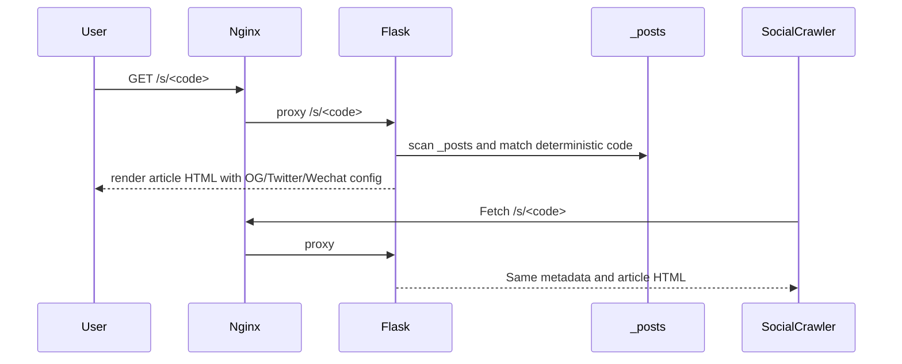

# SDD：文章短链与社交分享卡片

日期：2026-06-11

## 项目 Arch Reference 摘要

项目长期架构记录见 `docs/pola/arch-reference.md`。本次使用到的事实：

- Flask app factory 在 `app/__init__.py:create_app()`，文章能力集中在 `app/uploader.py`。
- 公开文章根路径 `/articles` 已由 nginx 代理到 Flask，文章详情由 `public_articles_bp` 渲染。
- 管理后台在 `/PolaZhenjing/admin/*`，根域公开文章在 `/articles/*`。
- 文章模板 `app/templates/article_view.html` 已输出 OG/Twitter/Schema 元数据，并接入微信 JS-SDK。
- 线上 nginx 当前还没有 `/s/` 代理，需要发布时新增。

## 架构选型

### 候选 A：第三方短链服务

- 优点：可能自带统计。
- 缺点：外部依赖、隐私和稳定性风险、卡片抓取多一层跳转、部署和费用不必要。

### 候选 B：站内确定性短链

- 优点：无外部依赖，短码由文章真实文件名稳定生成，部署简单，可直接渲染卡片元数据。
- 缺点：没有点击统计，若文章文件名变更短码会变化。

### 候选 C：数据库短链表

- 优点：可固定短码、支持统计和人工管理。
- 缺点：需要 schema、迁移和后台管理，本次需求超出最小必要范围。

结论：采用候选 B。后续需要统计时再演进为候选 C。

## 模块影响

| 模块 | 改动 | 风险 | 验证 |
| --- | --- | --- | --- |
| `app/uploader.py` | 新增短码生成、短码解析、`/s/<code>` 路由；文章渲染传入 `share_url`、`canonical_url`、`short_url` | 短码冲突、路径安全 | pytest + harness |
| `app/templates/article_view.html` | canonical 与分享 URL 分离，复制和平台按钮使用短链，补充卡片元数据 | 分享按钮退化或 JS 报错 | HTML 断言 + 浏览器/接口 smoke |
| `scripts/wechat_share_harness.py` | 验证短链、OG/Twitter、微信 JS-SDK 字段 | harness 与模板漂移 | 直接运行 |
| `tests/test_social_publish.py` | 覆盖短链路由和元数据 | 测试依赖本地文章样本 | pytest |
| nginx | 新增 `/s/` 代理到 Flask | 配置错误导致短链 404 | `nginx -t` + curl |

## 数据流

## 接口设计

- `GET /s/<code>`
  - 入参：5-12 位字母数字短码。
  - 成功：200，渲染文章页。
  - 失败：404，渲染公开文章 404。
- 原 `GET /articles/<filename>` 不变。

## 测试策略

- 单测：短链存在、短链 HTML 元数据、旧文章路径兼容。
- Harness：验证 OG/Twitter/itemprop、微信 JS-SDK 调用、公开页不显示后台按钮、短链路由可读。
- 发布验证：线上 `/s/<code>`、长链、nginx、`polazj.service`。

## 回滚

- 回滚代码和模板后重启 `polazj.service`。
- 恢复 nginx 备份，移除 `/s/` 代理并 reload nginx。
- 无数据库迁移，无数据回滚。
