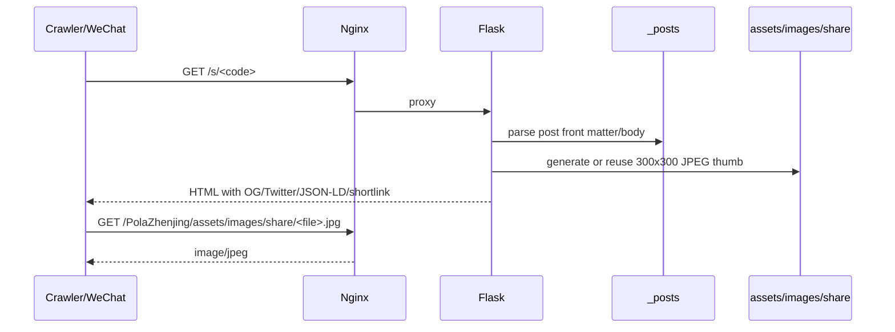

# SDD：分享卡片与 GEO 强化

日期：2026-06-12

## 项目 Arch Reference 摘要

参考 `docs/pola/arch-reference.md`：

- PolaZhenJing 是 Flask app factory + Jinja 模板项目。
- 文章相关路由集中在 `app/uploader.py`，公开文章由 `public_articles_bp` 渲染。
- nginx 已代理 `/articles/`、`/s/` 到 Flask，根域静态 portal 仍由 `/var/www/html` 服务。
- 文章页已有 OG/Twitter/Schema.org 基础，可在现有模板扩展。

## 架构选型

### 候选 A：只继续依赖原始大图

拒绝。线上已发现 `.png` 扩展名但真实 JPEG 内容、Content-Type 不一致和 488KB 大图，微信容易降级。

### 候选 B：渲染时生成 300x300 JPEG 缩略图

采用。利用现有 Pillow 依赖，无数据库迁移，输出可再生缓存 `assets/images/share/`，分享图 URL 稳定且 MIME 正确。

### 候选 C：单独的图片处理服务/CDN

拒绝。当前规模不需要额外服务，增加部署复杂度。

## 模块影响

| 模块 | 改动 | 验证 |
| --- | --- | --- |
| `app/uploader.py` | 生成分享缩略图；新增动态 `/sitemap.xml`、`/llms.txt`；补文章关键词/日期字段 | pytest、harness、curl |
| `app/templates/article_view.html` | 添加 robots、shortlink、OG image width/height/type、Twitter image alt、Article JSON-LD 增强 | HTML harness |
| `scripts/wechat_share_harness.py` | 断言分享图为 `/assets/images/share/*.jpg` | 本地/云端运行 |
| `scripts/seo_geo_harness.py` | 增加 Flask 动态文章、短链、sitemap、llms 验证 | 本地/云端运行 |
| nginx | `/sitemap.xml`、`/llms.txt` 代理到 Flask | `nginx -t`、curl |

## 数据流

## 回滚

- 回滚代码和模板，重启 `polazj.service`。
- 恢复 nginx 备份，让 `/sitemap.xml`、`/llms.txt` 回到静态文件。
- 可删除 `assets/images/share/`，下次发布可再生成。
