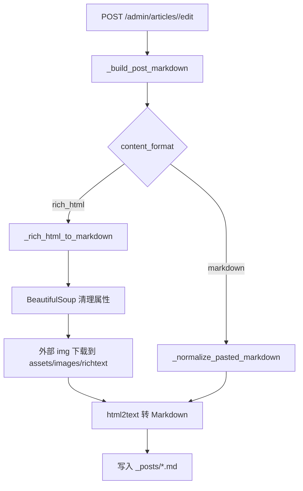

# SDD: 文章编辑图片本地化与富文本保存清洗

日期: 2026-06-14

## 当前系统理解

- 文章文件位于 `_posts/*.md`,由 `app/uploader.py` 的 `edit_article()` 保存。
- 文章编辑页提交隐藏字段 `body` 与 `content_format`。
- 上传页已使用 `_rich_html_to_markdown()` 将富文本转换成 Markdown,但编辑保存路径 `_build_post_markdown()` 之前未使用该转换。
- `upload_richtext_media()` 可以保存浏览器主动上传的图片,但对从第三方富文本复制来的远程图片 URL 没有兜底本地化。
- 故障文章当前正文引用 `https://alidocs.dingtalk.com/...tmpCode=...` 临时图,浏览器 GET 会跳转 noAuth/403。

## 项目 Arch Reference 摘要

- arch-reference 路径: `docs/pola/arch-reference.md`
- 相关事实:
  - Flask app factory 注册 `uploader_bp` 和公开文章 blueprint。
  - 后台静态资源经 `/assets/<path:filename>` 提供,生产子路径为 `/PolaZhenjing/assets/...`。
  - 富文本图片长期存储目录为 `assets/images/richtext/YYYY-MM/`。
  - 文章详情渲染前会把 `{{ site.baseurl }}` 替换为当前 article asset base。

## 架构选型

| 方案 | 一致性 | 风险 | 结论 |
| --- | --- | --- | --- |
| 仅手工修复当前文章 | 高 | 后续编辑仍会复发 | 不选 |
| 前端粘贴时强制上传所有外部图片 | 中 | 依赖浏览器能力,无法覆盖历史和 API 保存 | 不选 |
| 服务端保存时清洗并本地化外部图片 | 高 | 保存时会产生网络请求,需加大小/超时/私网限制 | 采用 |

## 方案概览

### 核心改动

- `_build_post_markdown(form)` 根据 `content_format` 决定 body 标准化方式:
  - `rich_html`: 调用 `_rich_html_to_markdown(..., preserve_media=True)`。
  - `markdown` 或缺省: 调用 `_normalize_pasted_markdown(..., preserve_media=True)`。
- `_rich_html_to_markdown()` 在转 Markdown 前:
  - 移除 `script/style/noscript`。
  - 清理所有标签上的 `data-*`、`style`、事件处理属性和非必要属性。
  - 对外部图片 URL 执行安全下载并替换为本地 `/assets/images/richtext/...`。
- 新增远程图片下载 helper:
  - 只允许 http/https。
  - DNS 解析后拒绝 localhost、私网、link-local、reserved、multicast 地址。
  - 超时、最大字节数和 content type 校验。
  - 拒绝 noAuth/非图片/超大响应。
  - 以内容 hash 命名,避免重复写入。

### 线上文章修复

- 在服务器对故障文章先备份。
- 用原始文章历史中的稳定本地图片路径替换当前外部临时图片。
- 清理 `data-clipboard-cangjie` 等大体积属性。
- 保留当前文章标题、日期、summary 和用户编辑后的正文文本。

## 模块影响

| 模块 | 改动 | 风险 |
| --- | --- | --- |
| `app/uploader.py` | 富文本保存清洗、外部图片本地化、安全下载 | 保存时可能因外部图下载慢而增加数秒延迟,通过超时和失败不中断控制 |
| `tests/test_article_edit_rich_editor.py` | 新增保存路径回归测试 | 需 monkeypatch 图片下载 helper,避免测试访问公网 |
| `_posts/2026-06-07-rolling-ai-fde-ai-20260607.md`(线上) | 替换失效图片并清理 HTML 属性 | 生产内容写入,必须先备份 |
| 文档 | 记录需求、方案、验证、风险 | 无运行风险 |

## 数据流

## 测试策略

- `python3 -m py_compile app/uploader.py`
- `PYTHONPATH=. pytest tests/test_article_edit_rich_editor.py tests/test_article_edit_413_fix.py -q`
- 针对线上文章 curl 检查正文图片 URL 和响应类型。
- 浏览器打开故障文章,确认首屏和正文图片无 broken image。

## 回滚方案

- 代码回滚: 恢复 `app/uploader.py` 到部署前版本并重启 `polazj.service`。
- 内容回滚: 从本次备份恢复 `_posts/2026-06-07-rolling-ai-fde-ai-20260607.md`。
- 图片资源回滚: 本次新增 richtext 图片为增量文件,不影响旧文章,可保留。
