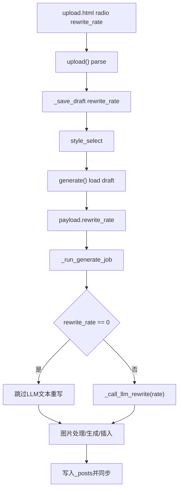

# SDD: 上传文章 AI 改写率控制

日期: 2026-06-17

## 1. 背景和目标

当前上传生成链路中，选择风格后后台任务会直接调用 `_call_llm_rewrite()` 完整重写正文。用户需要在上传阶段控制改写强度，特别是 0% 时完全不改写正文，但仍生成和插入图片。

## 2. 当前系统理解

| 维度 | 项目事实 | 证据文件 | 对本需求的影响 |
| --- | --- | --- | --- |
| 上传入口 | 三个 tab 共用 `POST /admin/upload` | `app/templates/upload.html`, `app/uploader.py:upload()` | 三个入口都必须提交同名 `rewrite_rate` |
| Draft 状态 | 上传后内容写入 `data/drafts/<id>.json`，再跳转风格选择 | `_save_draft()`, `style_select()` | 改写率必须写入 draft，不能只靠 session |
| 后台任务 | `/generate` 读取 draft 后提交 `jobs.submit(_run_generate_job, payload)` | `generate()`, `_run_generate_job()` | 改写率要进入 payload |
| LLM 重写 | `_run_generate_job()` 先调用 `_call_llm_rewrite()`，然后图片生成和文章写入 | `app/uploader.py` | 0% 应跳过该调用，但不跳过图片阶段 |
| 图片生成 | `_generate_illustrations()` / `_inject_illustrations()` 独立于文本重写 | `app/uploader.py` | 0% 仍可生成并插入图片 |

## 3. 项目 Arch Reference 摘要

- arch-reference 路径: `docs/pola/arch-reference.md`
- 本次使用事实:
  - Flask/Jinja 后台页面。
  - 上传页使用本地 TinyMCE vendor。
  - 长任务通过 `app/jobs.py` SQLite + bounded ThreadPoolExecutor。
  - 生产服务为 `/PolaZhenjing` 下 systemd `polazj.service`。
- 约束:
  - 不改变鉴权、数据库 schema、第三方 token。
  - 不破坏旧 draft；缺字段时保持旧行为。
  - 不跳过安全 Git 同步保护。

## 4. 架构选型分析

| 候选方案 | 一致性 | 复用 | 耦合 | 验证 | 部署风险 | 结论 |
| --- | --- | --- | --- | --- | --- | --- |
| A 仅前端加控件 | 低 | 低 | 低 | 弱 | 低 | 拒绝，后端不生效 |
| B 扩展现有 draft + job payload | 高 | 高 | 低 | 强 | 低 | 推荐 |
| C 新增独立改写服务/队列 | 中 | 低 | 高 | 中 | 高 | 拒绝，当前需求不需要独立服务 |

### 架构选型结论

采用候选 B: 扩展现有上传 draft 和后台 job payload。理由:

- 与当前上传流程最一致。
- 不新增数据库迁移。
- 0% 可在 `_run_generate_job()` 中清晰短路。
- 单测和浏览器 harness 都可覆盖。

## 5. 模块影响

| 模块 | 改动 | 原因 | 风险 |
| --- | --- | --- | --- |
| `app/templates/upload.html` | 新增五档改写率 UI | 管理员输入改写强度 | 页面拥挤，需响应式换行 |
| `app/uploader.py` | 新增解析、draft、payload、LLM prompt 强度控制 | 让改写率贯穿生成链路 | LLM 输出不可完全量化 |
| `tests/test_social_publish.py` / 新测试 | 覆盖上传页和生成逻辑 | 防回归 | 需避免真实 API 调用 |
| 文档 | 新增 requirement/spec/sdd/devlog | Pola 交付规则 | 无 |

## 6. 数据流

## 7. 接口和状态

- 表单字段: `rewrite_rate`。
- Draft JSON:
  - `rewrite_rate`: int, 0/25/50/75/100，旧数据缺失时 default 100。
- Job payload:
  - `rewrite_rate`: int。
- 不新增公开 API。

## 8. 测试策略

- 单测:
  - `_parse_rewrite_rate()`。
  - 上传页包含 5 档 UI。
  - POST 上传后 draft 保存 `rewrite_rate`。
  - `_run_generate_job()` 在 0% 不调用 LLM。
  - `_run_generate_job()` 在 50% 调用 LLM 并传递 rate。
  - `_call_llm_rewrite()` 中间档 prompt 包含强度约束。
- 集成/浏览器:
  - Playwright 打开上传页，确认三个 tab 均能看到并选择改写率。
- 部署:
  - 云端 py_compile + pytest。
  - 线上浏览器 harness。

## 9. 发布与回滚

- 发布面: `app/uploader.py`、`app/templates/upload.html`、测试、文档。
- 部署步骤:
  1. 云端备份相关文件。
  2. `rsync -avR` 精确同步。
  3. 云端运行 py_compile + pytest。
  4. 重启 `polazj.service`。
  5. 线上浏览器 harness。
- 回滚:
  - 从备份恢复上述文件并重启 `polazj.service`。
  - 旧 draft 中多出的 `rewrite_rate` 字段可保留，不影响旧代码读取。
