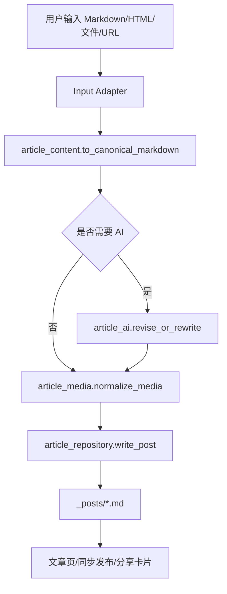

# SDD：上传与编辑模块系统性重构

日期：2026-06-19

## 1. 背景和目标

上传和编辑模块经历多次增量修复后，形成了“模板里复制编辑器逻辑、`app/uploader.py` 承担过多职责、富文本/Markdown 没有统一正文模型”的结构性问题。本次重构以 canonical Markdown 为中心，把正文转换、预览、保存、AI 修订和图片处理拆成可测试服务，同时保留现有路由和用户入口。

## 2. 当前系统理解

| 维度 | 项目事实 | 证据文件 | 对本需求的影响 |
| --- | --- | --- | --- |
| 后台框架 | Flask + Jinja，`uploader_bp` 承载管理后台文章入口 | `app/__init__.py`, `app/uploader.py` | 路由兼容优先，服务层可逐步抽出 |
| 文章存储 | `_posts/*.md`，front matter + Markdown body | `app/uploader.py` `_parse_post` / `_write_post` | Markdown 应作为唯一持久化格式 |
| 上传页 | 文件/粘贴/URL 三入口，TinyMCE 本地资源 | `app/templates/upload.html` | 需要共享编辑器控制器 |
| 编辑页 | `article_edit.html` 双模式，但转换和预览语义不稳定 | `app/templates/article_edit.html` | 需要后端转换 API 和保存等价预览 |
| AI 上传 | `_call_llm_rewrite`、图片生成、draft/job 链路 | `app/uploader.py` | 重构必须保留 rewrite_rate 和图片链路 |
| AI 编辑 | `_apply_revision_instruction` 在保存时调用 | `app/uploader.py` | 应改为 canonical Markdown 后调用 |
| 分享/同步 | 发布中心读取 `_posts` | `app/social_publish.py` | 不改接口，保证 Markdown 输出兼容 |

## 3. 项目 Arch Reference 摘要

- arch-reference 路径：`docs/pola/arch-reference.md`
- 本次选型使用事实：
  - 管理后台使用 Flask blueprint + Jinja 模板。
  - 本地 TinyMCE vendor 位于 `assets/vendor/tinymce/`。
  - 文章公开页、短链、GEO、分享卡片均依赖 `_posts/*.md`。
  - 生产部署为云服务器 systemd `polazj.service`。
- 不可破坏约束：
  - 不破坏 `/PolaZhenjing/admin/*` 登录态和路由。
  - 不破坏 `_posts` 文件格式。
  - 不把第三方 token、cookie、secret 写入日志或文档。
  - 不让 AI 失败阻塞普通保存。

## 4. 架构选型分析

| 候选方案 | 一致性 | 复用 | 耦合 | 扩展 | 验证 | 部署风险 | 回滚 | 结论 |
| --- | --- | --- | --- | --- | --- | --- | --- | --- |
| A 小补丁继续修模板 JS | 高 | 中 | 高 | 低 | 弱 | 低 | 易 | 拒绝，不能解决根因 |
| B 分阶段抽服务，保留路由兼容 | 高 | 高 | 中低 | 高 | 强 | 中低 | 易 | 推荐 |
| C 全量重写文章后台 | 中 | 低 | 低 | 高 | 中 | 高 | 难 | 拒绝，风险过大 |

### 架构选型结论

采用候选 B。保留 `app/uploader.py` 中现有路由对外形态，但把文章正文、仓储、媒体、AI 和工作流逻辑逐步抽到独立模块。这样既能解决当前根因，又能避免影响公开阅读、分享卡片和同步发布。

## 5. 目标模块

| 模块 | 职责 |
| --- | --- |
| `app/article_content.py` | Markdown/HTML 转换、canonical Markdown 规范化、保存等价预览、HTML 清理 |
| `app/article_repository.py` | `_posts` 文件读取、front matter 解析、原子写入、文件名校验 |
| `app/article_media.py` | 富文本图片上传、base64/远程图片本地化、图片 URL 规范化 |
| `app/article_ai.py` | 上传改写率、编辑修改建议、AI prompt 包装和失败降级 |
| `app/upload_workflow.py` | 上传 draft、三入口归一、生成任务 payload 准备 |
| `app/edit_workflow.py` | 编辑加载、模式转换、预览、保存、AI 修订编排 |
| `app/static/js/article-editor.js` 或模板共享 JS | 上传/编辑共用编辑器状态、模式切换、预览、提交同步 |

## 6. 数据流



## 7. 接口设计

### `POST /PolaZhenjing/admin/api/editor/convert`

请求：

```json
{
  "source_format": "markdown",
  "target_format": "rich_html",
  "content": "..."
}
```

响应：

```json
{
  "ok": true,
  "content": "...",
  "warnings": []
}
```

### `POST /PolaZhenjing/admin/api/editor/preview`

请求：

```json
{
  "content_format": "rich_html",
  "content": "...",
  "title": "...",
  "front_matter": {}
}
```

响应：

```json
{
  "ok": true,
  "html": "...",
  "canonical_markdown": "...",
  "warnings": []
}
```

### 兼容接口

- 保留 `/PolaZhenjing/admin/articles/<filename>/preview`，内部改为调用新 preview service。
- 保留 `/PolaZhenjing/admin/upload/media`，后续可由 `article_media.py` 承接。
- 保留编辑页 POST，不改变 URL。

## 8. 实现拆分

| 步骤 | 文件/模块 | 动作 | 验收 |
| --- | --- | --- | --- |
| 1 | 文档 | requirement/PRD/SDD/SPEC/test plan/devlog | A1 |
| 2 | `article_content.py` | 新增转换、规范化、预览纯函数 | A3 A4 |
| 3 | `article_repository.py` | 抽读取/写入/文件名校验 | A2 A5 |
| 4 | `article_ai.py` | 抽 rewrite_rate 和 revision 包装 | A6 A7 |
| 5 | `edit_workflow.py` + routes | 重构编辑加载/预览/保存 | A5 A6 |
| 6 | `upload_workflow.py` + upload route | 统一上传 canonical Markdown 管线 | A7 A8 |
| 7 | templates/shared JS | 共享模式切换、预览、提交逻辑 | A3 A4 |
| 8 | tests/harness | 单测、py_compile、浏览器验证 | A10 |

## 9. 测试策略

- 单测：
  - Markdown -> HTML 转换。
  - HTML -> Markdown 转换。
  - 预览与保存管线一致。
  - 编辑保存无修改建议不调用 AI。
  - 编辑保存有修改建议时先 canonicalize 再调用 AI。
  - rewrite_rate 0% 跳过正文 AI。
  - 富文本图片和 Markdown 图片路径保持。
- 集成：
  - Flask test client 打开 upload/edit 页面。
  - POST preview/convert API。
  - POST edit 保存后读取 `_posts` 验证内容。
- 浏览器 Harness：
  - 本地打开 upload，切换富文本/Markdown，预览。
  - 本地打开 edit，切换富文本/Markdown，预览，保存。
  - 线上部署后重复核心路径。

## 10. 发布与回滚

- 发布面：Python 服务模块、Jinja 模板、静态 JS、测试、文档。
- 无数据库迁移。
- 发布前：
  - `python3 -m py_compile app/uploader.py app/article_content.py app/article_repository.py app/article_ai.py app/edit_workflow.py app/upload_workflow.py`
  - 相关 pytest。
  - 浏览器 Harness。
- 回滚：
  - 回退本次新增服务接入和模板 JS。
  - `_posts` 文件格式仍为 Markdown，回滚应用代码不需要数据迁移。
