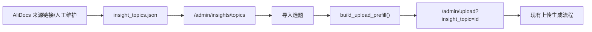

# SDD：Admin 工作台与洞察选题池

## 1. 架构范围

新增后台聚合入口与轻量选题池，不引入数据库迁移。选题状态使用 JSON 文件持久化，避免影响现有文章、用户和发布表。

## 2. 模块设计

### 2.1 `app/insight_topics.py`

责任：

- 定义选题状态、默认种子选题和数据文件路径。
- 提供 `load_topics()` / `save_topics()` / `update_topic_status()`。
- 提供 `build_upload_prefill()`，把选题转成上传页可用的标题、标签、描述、Markdown 正文。

数据文件：

- 默认路径：`data/insight_topics.json`。
- 原子写入：先写临时文件，再 `os.replace()`。

### 2.2 `app/admin_workbench.py`

责任：

- 注册 `/admin/workbench`。
- 注册 `/admin/insights/topics`、状态更新和导入路由。
- 聚合文章数量、Skill 数量、记忆状态和选题状态。

权限：

- 所有路由使用 `login_required`。
- 仅 `session.role == admin` 可访问；非管理员跳转用户中心。

### 2.3 `app/uploader.py` 与 `upload.html`

最小改动：

- `GET /admin/upload?insight_topic=<id>` 时读取预填数据。
- 模板根据 `insight_prefill` 默认切换为 Markdown 模式并填充字段。
- POST 上传逻辑不变。

## 3. 数据流

## 4. 风险与护栏

- 钉钉文档当前服务端未授权，不把空响应误判为真实底料。
- JSON 写入范围小，避免数据库迁移风险。
- 上传页仅接受预填变量，不改变内容解析优先级。
- 不写入 token、cookie、OAuth 信息。

## 5. 测试策略

- Flask test client：
  - `/admin/workbench` 200 并包含模块入口。
  - `/admin/insights/topics` 200 并包含种子选题。
  - POST 状态更新会写入 JSON。
  - POST 导入会跳转上传页并预填 Markdown。
- 静态验证：
  - `python3 -m py_compile app/admin_workbench.py app/insight_topics.py app/__init__.py app/uploader.py`
  - `pytest tests/test_admin_workbench_insight_topics.py -q`
  - `git diff --check`

## 6. 验收映射

- A1：`app/admin_workbench.py` + `app/templates/admin_workbench.html` + `tests/test_admin_workbench_insight_topics.py::test_admin_workbench_shows_core_modules`
- A2：`app/admin_workbench.py` + `app/templates/insight_topics.html` + `tests/test_admin_workbench_insight_topics.py::test_insight_topics_list_and_status_update`
- A3：`app/insight_topics.py` + `app/uploader.py` + `app/templates/upload.html` + `tests/test_admin_workbench_insight_topics.py::test_import_topic_prefills_upload_markdown`
- A4：`app/insight_topics.py` + `data/insight_topics.json` + `tests/test_admin_workbench_insight_topics.py::test_insight_topics_list_and_status_update`
- A5：`app/admin_workbench.py` + `tests/test_admin_workbench_insight_topics.py::test_non_admin_workbench_redirects_to_account`
- A6：`app/templates/admin_workbench.html` + `app/templates/insight_topics.html` + 钉钉 OAuth 限制说明
