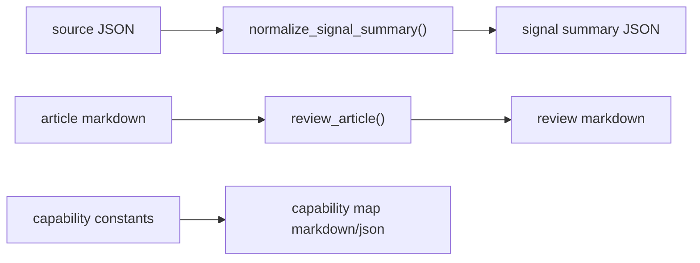

# SDD：PolaZhenJing 内容生产升级 v2

## 范围

本轮是内容生产 v2 的工具底座，不做线上页面和数据库 schema 变更。

## 模块设计

### 1. `content_production_v2.py`

- 责任：
  - 维护参考项目能力地图常量。
  - 维护作者风格 DNA 常量。
  - 将多源 research payload 归一化为信号摘要。
  - 根据启发式规则产出去 AI 味审稿报告。
- 边界：
  - 不调用外部网络。
  - 不读取 token。
  - 不依赖 Flask app context。

### 2. `scripts/content_production_v2.py`

- CLI 入口：
  - `capability-map`
  - `signal-summary`
  - `review`
- I/O：
  - 输入本地 Markdown/JSON。
  - 输出 Markdown/JSON 到 stdout 或目标文件。

### 3. 文档与交付状态

- 新增 Requirement / PRD / SDD / devlog / test-report / analysis。
- 新增 delivery ledger：
  - `docs/pola/project-knowledge/delivery/1oUz720NAS-content-production-v2/delivery_state.json`

## 数据流

## 风险与护栏

- 无 token / 无来源链接时，只能输出 `missing_sources`，不能假设研究已完成。
- 审稿报告为启发式，不代表最终发布门禁。
- 仓库脏工作区范围大，本轮仅新增独立文件与测试，不改已有 `_posts`。

## 测试策略

- 单元测试：
  - signal summary 缺失源检测。
  - 审稿报告对套话/结构套路/证据缺口的识别。
  - CLI 产物生成。
- 静态验证：
  - `python3 -m py_compile`
  - `pytest tests/test_content_production_v2.py -q`
  - `git diff --check`
