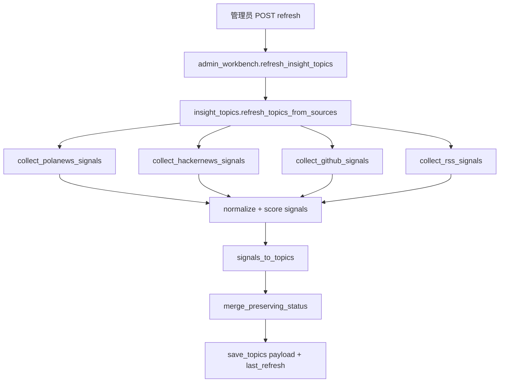

# SDD：每日选题全网抓取

日期：2026-06-20

## 1. 当前系统理解

- `app/insight_topics.py` 当前负责本地 JSON 存储、默认种子、状态更新和上传预填。
- `app/admin_workbench.py` 暴露工作台和选题路由。
- `app/templates/insight_topics.html` 展示选题列表。
- `tests/test_admin_workbench_insight_topics.py` 覆盖工作台、列表、状态打标、一键导入。

## 2. 项目 Arch Reference 摘要

- arch-reference：`docs/pola/arch-reference.md`
- 本次复用 Flask blueprint + Jinja 模板 + JSON 文件存储模式。
- 不能破坏 `/PolaZhenjing/admin/*` 子路径代理和 `url_for()`。
- 外部请求必须有超时、条数限制和失败隔离。

## 3. 架构选型

| 方案 | 一致性 | 复用 | 耦合 | 验证 | 部署风险 | 结论 |
| --- | --- | --- | --- | --- | --- | --- |
| A 静态 JSON 继续人工维护 | 高 | 高 | 低 | 简单 | 低 | 不满足全网抓取 |
| B 在 `insight_topics.py` 内新增采集/归一化服务 | 高 | 高 | 中 | 简单 | 中 | 推荐 |
| C 新建后台队列/定时服务 | 中 | 中 | 高 | 较难 | 高 | 后续再做 |

推荐方案 B：在现有模块内扩展纯函数和手动刷新路由，保持部署简单，并为后续定时任务预留 `refresh_topics_from_sources()`。

## 4. 数据流

## 5. 模块影响

| 模块 | 改动 | 风险 |
| --- | --- | --- |
| `app/insight_topics.py` | 新增采集、归一化、刷新、元数据读写 | 外部源失败、JSON 兼容 |
| `app/admin_workbench.py` | 新增刷新 POST route | admin 权限和 flash |
| `app/templates/insight_topics.html` | 新增刷新 UI 和证据展示 | 移动端布局 |
| `tests/test_admin_workbench_insight_topics.py` | 增加刷新相关测试 | monkeypatch 覆盖 |

## 6. 回滚

- 代码回滚到上一 commit 即恢复静态种子选题。
- JSON 新字段可被旧代码忽略；旧数组格式仍保持兼容。
- 若外部源异常，刷新函数保留旧选题并返回错误摘要。

## 7. 验证策略

- `python3 -m py_compile app/insight_topics.py app/admin_workbench.py app/__init__.py`
- `.venv/bin/python -m pytest tests/test_admin_workbench_insight_topics.py -q`
- function test cases harness 覆盖 A1-A8。
- 本地 Flask test client 验证 `/admin/insights/topics/refresh` 跳转和上传预填。
