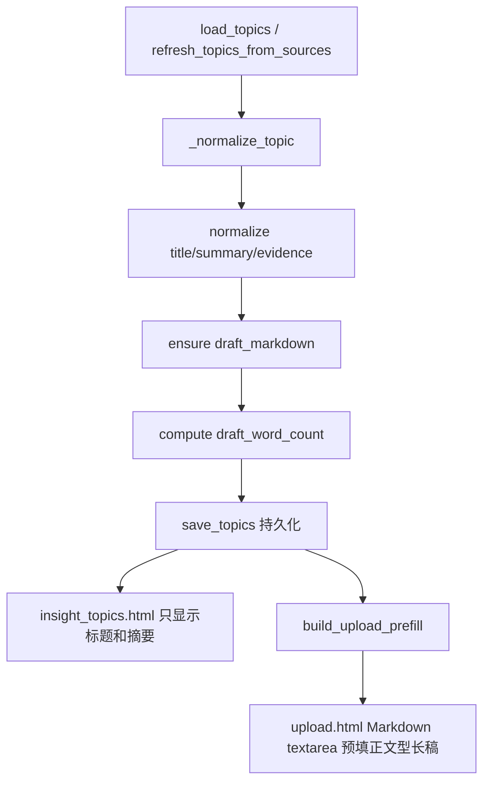
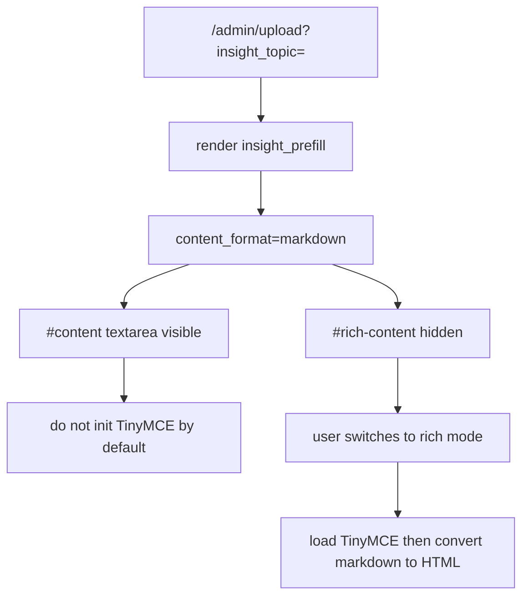

# SDD：每日选题 5000 字底稿

日期：2026-06-20

## 1. 当前系统理解

- `app/insight_topics.py` 已负责选题 JSON 存储、线上信号采集、状态更新和上传预填。
- `app/admin_workbench.py` 只负责路由和权限，不适合承载底稿生成逻辑。
- `app/templates/insight_topics.html` 是选题扫描页，不能直接输出长文。
- `app/templates/upload.html` 已支持 `insight_prefill.content` 写入 Markdown textarea。
- 线上问题显示：导入选题后曾出现两类回归：一是上传页脚本无条件初始化 TinyMCE，空富文本 iframe 抢占可见编辑区；二是 2026-06-21 摘要-only 修正把上传预填也改成摘要，导致 `?insight_topic=724e49daee3e` 只能看到一句摘要而不是长稿。

## 2. 项目 Arch Reference 摘要

- arch-reference：`docs/pola/arch-reference.md`
- 本次沿用 Flask blueprint + Jinja + JSON 存储。
- 外部抓取和内容准备集中在 `app/insight_topics.py`，上传页只消费 prefill payload。
- 不能破坏 `/admin/insights/topics/<id>/import` 和 `?insight_topic=<id>` 的现有导入语义。

## 3. 架构选型

| 方案 | 一致性 | 复用 | 耦合 | 验证 | 部署风险 | 结论 |
| --- | --- | --- | --- | --- | --- | --- |
| A 在上传页临时拼长文 | 中 | 中 | 高 | 较难 | 低 | 拒绝，数据层仍没有底稿 |
| B 在 `insight_topics.py` normalize 阶段补齐底稿 | 高 | 高 | 低 | 简单 | 低 | 推荐 |
| C 引入 LLM 生成底稿 | 中 | 低 | 中 | 较难 | 中 | 后续可选，本次不做 |

推荐方案 B：把底稿视为 topic 的派生字段，在 normalize/save/import 三条路径统一补齐。

## 4. 数据流

## 4.1 导入页编辑器状态

设计约束：

- 导入选题属于 Markdown 长稿预填场景，默认不需要富文本编辑器。
- 上传页正文承载可继续编辑的正文型文章长稿，不承载来源、证据、评分、标签、状态等选题池管理信息。
- `build_upload_prefill()` 必须从 `draft_markdown` 派生 upload 专用正文：保留标题和 `## 导语` 后的正文章节；剔除 `## 洞察选题`、`## 写作角度`、`## 证据链接` 这类管理/准备章节；低于 5000 可见字符时追加正文延展段。
- TinyMCE 仅在用户主动切换富文本时初始化，避免空富文本控件覆盖 Markdown textarea。
- `paste-form` 提交时仍以 `content_format=markdown` 提交，保持上传后端解析路径不变。

## 5. 文件改动计划

| 文件 | 操作 | 内容 | 对应验收 |
| --- | --- | --- | --- |
| `app/insight_topics.py` | 修改 | 新增底稿生成、字段 normalize、导入使用正文型长稿 | A2/A3/A5/A6 |
| `app/templates/insight_topics.html` | 修改 | 卡片正文只展示摘要，不展示来源/证据/评分/底稿字数 | A4 |
| `app/templates/admin_workbench.html` | 修改 | 去除钉钉底料入口和旧说明 | A10 |
| `app/templates/upload.html` | 修改 | 导入模式延迟加载 TinyMCE，保证 Markdown textarea 可见 | A5/A9 |
| `tests/test_admin_workbench_insight_topics.py` | 修改 | 覆盖底稿字段和导入正文 | A5/A7/A8 |
| `docs/pola/arch-reference.md` | 修改 | 记录选题池新增底稿字段 | A1 |

## 6. 测试策略

- 语法检查：`python3 -m py_compile app/insight_topics.py app/admin_workbench.py app/__init__.py`
- 单测：`.venv/bin/python -m pytest tests/test_admin_workbench_insight_topics.py -q`
- 浏览器：Playwright 打开导入后的上传页 HTML，验证 `#content` 可见、`#rich-content` 隐藏、`window.tinymce=false`、textarea 包含 5000-30000 可见字符长稿且不出现钉钉底料、来源/状态/评分等元信息。
- Harness：`validate_function_test_cases.py` 校验 A1-A8 覆盖。

## 7. 部署和回滚

- 本次不主动部署，除非用户后续要求。
- 回滚代码即可恢复轻量提纲导入。
- 已持久化 JSON 中的新增字段对旧代码是附加字段，旧代码可忽略。
