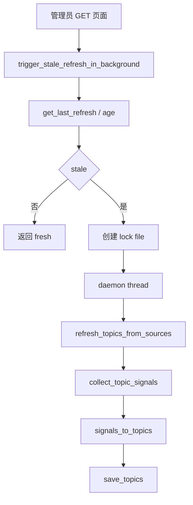

# SDD：洞察选题自动刷新与质量聚焦

## 当前系统理解

- `app/insight_topics.py` 负责选题 JSON 存储、公开源采集、信号转选题、状态保留和上传预填。
- `app/admin_workbench.py` 暴露 `/admin/workbench`、`/admin/insights/topics` 和手动刷新路由。
- `app/templates/insight_topics.html` 展示刷新面板、筛选和选题卡片。
- `tests/test_admin_workbench_insight_topics.py` 覆盖工作台、选题列表、手动刷新、导入上传。

## 架构选型

| 方案 | 一致性 | 复用 | 耦合 | 验证 | 部署风险 | 结论 |
| --- | --- | --- | --- | --- | --- | --- |
| A 继续仅手动刷新 | 高 | 高 | 低 | 简单 | 低 | 拒绝：不能解决每日选题断更 |
| B 页面入口触发后台刷新 + 文件锁 | 高 | 高 | 中 | 可测 | 中 | 推荐 |
| C 新增 systemd timer/cron | 中 | 中 | 中 | 需要运维验证 | 中高 | 暂不采用 |

推荐方案 B：在管理员真实访问入口做新鲜度检查，过期时后台触发刷新。它不引入新部署单元，能立刻解决“进入页面但没有新选题”的问题。

## 数据流

## 模块改动

| 文件 | 改动 | 风险 |
| --- | --- | --- |
| `app/insight_topics.py` | 默认 10 天刷新；新增主题质量评分；新增后台刷新、文件锁、新鲜度判断 | 外部源慢、锁残留 |
| `app/admin_workbench.py` | 工作台和选题页入口触发后台刷新 | 页面访问时产生后台网络任务 |
| `app/templates/insight_topics.html` | 展示后台自动刷新状态 | 低 |
| `tests/test_admin_workbench_insight_topics.py` | 覆盖自动刷新和质量过滤 | 低 |

## 稳定性和安全护栏

- 自动刷新默认后台线程执行，不阻塞页面首屏。
- 文件锁防止 gunicorn 多 worker 并发重复刷新。
- 锁 TTL 1 小时，避免异常退出后永久卡住。
- 外部源已有请求超时；失败源记录在 `last_refresh.errors`，保留旧选题。
- 不新增 secret，不打印 token。

## 回滚

- 代码回滚即可恢复仅手动刷新。
- 如果线上需要临时关闭自动刷新，可设置 `POLAZJ_INSIGHT_AUTO_REFRESH=0` 后重启服务。

## 测试策略

- `py_compile` 覆盖 Python 语法。
- pytest 覆盖选题入口、手动刷新、导入、后台刷新锁、质量过滤。
- 真实网络 smoke 验证近 10 天信号可生成候选选题。
