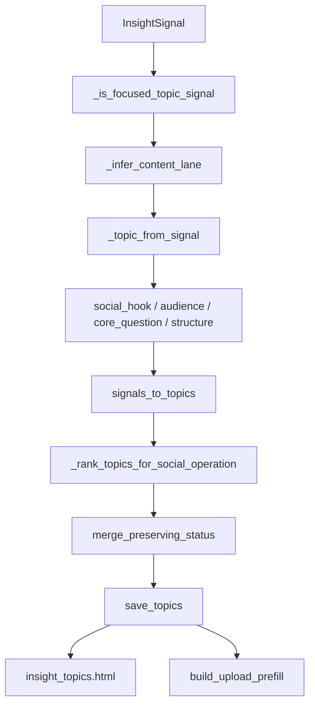

# SDD：洞察选题社媒运营生成机制

## 当前架构

- `app/insight_topics.py`
  - 采集公开信号；
  - 过滤 AI 相关信号；
  - 把信号转换为 topic；
  - 归一化 topic；
  - 生成导入上传页的长稿。
- `app/admin_workbench.py`
  - 管理页路由、刷新路由、状态更新、一键导入。
- `app/templates/insight_topics.html`
  - 后台选题列表和刷新面板。
- `tests/test_admin_workbench_insight_topics.py`
  - 覆盖管理页、刷新、导入、回填、自动刷新、质量过滤。

## 项目 Arch Reference 摘要

- arch-reference 路径：`docs/pola/arch-reference.md`
- 本次使用的项目事实：
  - PolaZhenJing 是 Flask app factory + Blueprint + Jinja 模板的后台项目。
  - 洞察选题池由 `data/insight_topics.json` 持久化，`app/insight_topics.py` 统一处理采集、归一化、合并、底稿和上传预填。
  - 线上信号抓取已有超时、分源失败隔离和自动刷新文件锁，本轮不改变请求频率和进程模型。
  - 旧入口包括 `/admin/insights/topics`、状态更新和一键导入上传，必须继续兼容。
- 必须复用的模式：
  - 继续使用 `_normalize_topic()` 兼容旧 JSON 字段。
  - 继续用 `merge_preserving_status()` 保留 selected/imported/archived 状态。
  - 继续用测试 monkeypatch 外部采集函数，避免单测访问真实网络。
- 不可破坏的约束：
  - 不新增 LLM 调用、密钥、队列或系统服务。
  - 不覆盖生产 `data/insight_topics.json`。
  - 一键导入上传页不得暴露状态、来源类型、评分、证据链接等后台管理元信息。

## 架构选择

| 方案 | 优点 | 风险 | 结论 |
| --- | --- | --- | --- |
| A 继续使用新闻标题，只改页面文案 | 改动小 | 根因不解决 | 拒绝 |
| B 在本地规则层把信号转译为运营蓝图 | 不新增模型，不增加外部依赖，可测 | 规则需要持续迭代 | 采用 |
| C 接入 LLM 实时生成选题 | 表达更灵活 | 成本、延迟、失败率、密钥与质量漂移 | 暂不采用 |

本轮采用方案 B：把公开信号看成 evidence，使用可解释的内容赛道、标题模板、钩子模板和结构模板生成运营蓝图。

## 数据流

## 模块改动

| 文件 | 改动 |
| --- | --- |
| `app/insight_topics.py` | 新增内容赛道常量、赛道识别、社媒标题生成、蓝图字段归一化、排序多样性、草稿策略版本；合并旧 topic 时用 `source_signal_title` 保留历史状态。 |
| `app/templates/insight_topics.html` | 展示社媒运营选题池、内容赛道、钩子、读者、核心问题、建议结构和来源信号。 |
| `tests/test_admin_workbench_insight_topics.py` | 更新旧断言，新增“非新闻标题/蓝图字段/页面展示”测试。 |

## 数据源更新策略

本轮 follow-up 对数据源做结构化补强：

| 来源 | 接入方式 | 主要覆盖 | 采用理由 |
| --- | --- | --- | --- |
| Google DeepMind Blog | RSS | 模型能力、研究产品化 | 补足 Google AI 通用博客之外的一线模型/研究信号。 |
| Microsoft Official Blog | RSS | 企业采用、组织实践、Copilot/平台商业化 | 更容易产出组织采用和商业思考类选题。 |
| AWS Machine Learning Blog | RSS | 云端 AI 架构、Agent/Bedrock 实践、行业场景 | 覆盖可复用的工程实践和真实业务场景。 |
| GitHub AI & ML Blog | RSS | 开发者工具、Copilot、工程实践 | 支撑最佳实践、AI coding、开发者工作流选题。 |
| Sequoia Stories | RSS | 创业、市场、商业模式 | 补足商业模式和创业观察，减少纯发布稿倾向。 |
| Industry Context Sources | 本地元数据 + 稳定公开 URL | Agent 工程、上下文工程、企业采用、用例规模化、商业判断 | 将权威报告和实践指南作为非新闻底层判断源，避免刷新结果完全受近期事件牵引。 |

未接入来源：

- Meta AI：官方博客可读，但未发现稳定官方 RSS，本轮不引入网页解析或第三方 RSSHub。
- LangChain、LlamaIndex：当前官方站点 RSS/Feed 路径验证不稳定或不可用，本轮不引入非官方 feed。
- Vercel Blog：Atom 可解析但全站 feed 体积较大且主题过宽，本轮暂不加入同步刷新链路。

稳定性约束：

- 继续使用既有 `collect_rss_signals()`，不新增抓取进程。
- 单个 RSS 源失败继续被捕获，刷新保留旧选题池。
- 新源只增加 `RSS_SOURCES` 配置、`SOURCE_LABELS` 显示名和测试，不改变生产数据文件。
- PolaNews 查询包只调整查询意图和标签映射，不新增 API、后台任务或抓取频率；宽泛模型/品牌词降级，让候选池更偏场景、商业、实践和工程方法。
- 行业实践源新增 `INDUSTRY_CONTEXT_SOURCES` 与 `collect_industry_context_signals()`，作为静态 curated signals 注入 `collect_topic_signals()`；不下载正文、不解析页面、不写生产数据。

## 兼容策略

- 旧 JSON 缺字段时 `_normalize_topic` 自动补齐。
- 旧 `source_type/status/evidence_links` 继续保留。
- `merge_preserving_status` 保持旧状态优先。
- `build_upload_prefill` 输出仍是上传页可编辑 Markdown。
- 自动刷新锁、请求超时、源错误保留旧数据的策略不变。

## 性能与资源

- 数据源 follow-up 新增 5 个 RSS/Atom 源和一个本地行业实践源收集器，但不新增模型调用、队列或后台进程。
- 查询包 follow-up 不新增外部来源，只改变既有 PolaNews API 的查询词集合；请求次数由查询词数量线性决定，本轮仍保持在轻量级范围。
- 行业实践源 follow-up 是内存静态列表转 `InsightSignal`，只增加几十条字符串处理和排序成本。
- 不新增模型调用。
- 新增逻辑为字符串规则和少量排序，复杂度约为 O(n) 到 O(n log n)，n 为当次采集信号数，上限由既有 `MAX_SIGNALS_PER_SOURCE` 控制。
- 草稿生成仍为本地模板文本，无 CPU/内存风险。

## 安全边界

- 不新增 secret。
- 不打印 token、cookie、私钥。
- 不写 `.env`。
- 不改变认证和权限路径。

## 回滚

- 回滚本次 commit 即可恢复旧标题生成机制。
- 数据中新增字段为向前兼容字段，旧代码忽略不会导致加载失败。
- 如需保留新版数据但恢复旧页面，旧模板仍可读取 `title/summary/status/source_url`。

## 测试策略

- `py_compile`：验证语法。
- `pytest tests/test_admin_workbench_insight_topics.py -q`：覆盖选题生成、页面展示、导入、刷新、回填、自动刷新锁。
- `validate_function_test_cases.py`：验证 PRD/SDD/用例覆盖。
- `validate_pola_skills.py`：验证 Pola skill harness。
- `git diff --check` 和敏感信息扫描。
