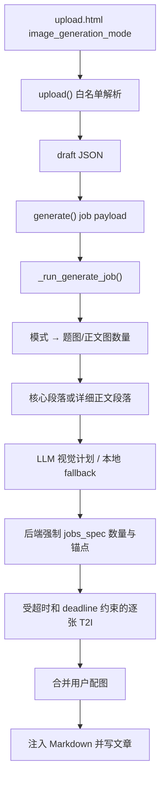

# SDD：上传文章 AI 生图四档模式

日期：2026-08-18

## 1. 背景和目标

现有 `_generate_illustrations()` 固定生成 1 张题图与 3–5 张段落图。目标是在不新增服务、不改变文章生成状态语义的前提下，把插画数量策略显式化为四档，并为详细模式补齐批处理边界。

## 2. 当前系统理解

| 维度 | 项目事实 | 证据 | 对本需求的影响 |
| --- | --- | --- | --- |
| UI | 三个输入 Tab 分别提交同名文章字段 | `app/templates/upload.html` | 三个表单都需要同名模式控件 |
| 中间状态 | 上传后写 draft JSON，再进入风格选择 | `_save_draft()` / `generate()` | 模式必须写入 draft，不能只在前端保存 |
| 异步执行 | SQLite job + 最大 2 worker 的线程池 | `app/jobs.py` | 复用既有有界队列，不开新执行器 |
| 插画规划 | 核心段落抽取 + LLM 视觉计划 + fallback | `_extract_visual_blocks()` / `_call_visual_brief_llm()` | 数量与锚点应由后端强制，不能信任 LLM 返回数量 |
| 图片生成 | MiniMax T2I 顺序调用，单张失败继续 | `_call_minimax_t2i()` / `_generate_illustrations()` | 适合增加批次 deadline 和精确 jobs spec |
| 图片合并 | 用户图优先相邻 AI 图 | `_merge_article_images()` | AI 模式不应改变用户图语义 |

## 3. 项目 Arch Reference 摘要

- 路径：`docs/pola/arch-reference.md`。
- 本次使用的事实：Flask/Jinja 表单、draft JSON、SQLite 有界后台任务、MiniMax 图像 API、Jekyll 文件存储。
- 必须复用：`upload()` → `_save_draft()` → `generate()` → `_run_generate_job()`；现有视觉计划、图片合并与注入函数；现有 pytest 与 Playwright harness。
- 不可破坏：旧 draft、AI 改写率、用户配图/原媒体、风格选择、文章写入与安全 Git 同步。

## 4. 架构选型分析

| 候选方案 | 一致性 | 用户流程 | 复用 | 耦合 | 验证 | 部署风险 | 回滚 | 结论 |
| --- | --- | --- | --- | --- | --- | --- | --- | --- |
| A 仅在前端改变提示词 | 低 | 可见但不可保证数量 | 低 | 低 | 弱 | 低 | 易 | 拒绝 |
| B 扩展现有 draft/job/插画规划器 | 高 | 完整 | 高 | 低 | 强 | 低 | 易 | 推荐 |
| C 新建独立图片任务表和服务 | 中 | 完整 | 低 | 高 | 中 | 高 | 难 | 拒绝 |

### 架构选型结论

推荐候选 B。模式作为小型枚举贯穿现有状态链，图片规划器按后端选出的 `visual_blocks` 构造精确任务列表，LLM 只负责每张图的视觉描述。

拒绝候选 A：LLM 可能返回错误数量或重复锚点，无法验证四档语义。拒绝候选 C：当前任务不需要独立扩缩容、数据库迁移或跨服务重试，新增服务会扩大部署和鉴权面。

决策约束：

- 不新增页面路由、公开 API、数据库 schema 或 provider。
- 后端枚举白名单归一化，兼容缺失/非法值。
- 题图计入 1/3/5 的总数。
- 详细模式只处理可视化正文段落，最多 12 段；超过时均匀抽样。
- 视觉计划返回的 scene 数量和 block index 不作为可信控制数据；最终数量/锚点取后端选择结果。
- 批次到达 deadline 后停止新请求；已生成图片保留并继续文章写入。

## 5. 方案概览



## 6. 接口与数据结构

### 6.1 模式常量

```python
IMAGE_GENERATION_MODE_DEFAULT = "standard"
IMAGE_GENERATION_MODES = {
    "cover": {"label": "只生成题图", "scene_count": 0},
    "summary": {"label": "概括", "scene_count": 2},
    "standard": {"label": "适中", "scene_count": 4},
    "detailed": {"label": "详细", "scene_count": None},
}
DETAILED_IMAGE_MAX_SCENES = 12
IMAGE_GENERATION_BATCH_TIMEOUT_SECONDS = 900
MAX_GENERATED_IMAGE_BYTES = 12 * 1024 * 1024
MAX_GENERATED_IMAGE_BATCH_BYTES = 64 * 1024 * 1024
```

### 6.2 私有函数变更

- `_parse_image_generation_mode(value) -> str`：白名单归一化。
- `_extract_detailed_visual_blocks(content, max_blocks=12) -> list[dict]`：返回正文段落锚点；超限时均匀取样。
- `_call_visual_brief_llm(..., mode)`：提示词按实际段落数量描述，不再写死 3–5。
- `_generate_illustrations(..., image_generation_mode='standard')`：按模式构造 1/3/5/1+N 个任务，受 deadline 约束。
- `_call_minimax_t2i(..., request_timeout=...)`：允许生成器把剩余预算传给单次请求。

### 6.3 Draft / job payload

```json
{
  "image_generation_mode": "standard"
}
```

字段缺失或非法时使用 `standard`。不新增数据库字段。

## 7. 模块与文件计划

| 文件 | 操作 | 内容 | 验收 |
| --- | --- | --- | --- |
| `docs/pola/arch-reference.md` | 更新 | 记录上传、任务、插画架构事实和安全边界 | A8-A9 |
| `app/templates/upload.html` | 修改 | 三个表单加入四档卡片和响应式样式 | A1 |
| `app/uploader.py` | 修改 | 模式解析/传递、段落选择、精确数量、deadline、任务反馈 | A2-A6 |
| `tests/test_upload_image_modes.py` | 新增 | 模式、draft、生成数量、详细上限、失败降级 | A2-A6 |
| `tests/test_upload_rewrite_rate.py` | 修改 | 既有图片生成替身兼容新参数 | A5 |
| `scripts/upload_edit_playwright_harness.py` | 修改 | 上传页四档控件、默认值和截图 | A1/A7 |
| `docs/pola/project-knowledge/**` | 新增 | requirement/PRD/SDD/test/release/devlog/ledger | A7-A9 |

## 8. 性能与安全护栏

- 并发：继续由 `POLAZJ_JOB_MAX_WORKERS` 控制，默认 2。
- 数量：`detailed` 最多 12 张正文图；其它模式固定 0/2/4 张正文图。
- 超时：单次 T2I 不超过既有上限，并压缩到批次剩余时间；整批预算 900 秒。
- 容量：T2I JSON 响应最多读取 18MB，base64/下载图片单张最多 12MB，单篇 AI 图片批次最多 64MB；下载按分块累计字节读取。
- 失败：不做无界重试；单张失败继续，deadline 到期停止后续请求。
- 幂等/文件：同一生成任务在唯一文章 slug 目录内使用确定性文件名；不改变现有任务重复提交语义。
- 日志：异常日志不写 Authorization、API key 或完整文章内容；页面消息只写模式和计数。
- 存储：PNG 仍保存到每篇文章独立目录；本次不引入临时文件、缓存或无界日志。

## 9. 测试策略

| 类型 | 方式 | 覆盖 |
| --- | --- | --- |
| 纯逻辑 | pytest 解析模式、详细段落抽取和上限 | A2-A4 |
| 生成器 | monkeypatch LLM/T2I，断言 1/3/5/1+N 次与锚点 | A3-A4 |
| 路由/状态 | Flask client 检查 UI、draft、payload/job 行为 | A1-A2/A6 |
| 兼容回归 | 既有 upload rewrite/media/article tests | A5 |
| 浏览器 | 本地 Playwright upload/edit harness，桌面+手机截图 | A1/A7 |
| 安全 | `git diff --check` + 本次 diff secret 关键词扫描 | A9 |

## 10. 部署和回滚

- 本轮模式：Ship ready，不部署。
- 发布面：Python 模块、Jinja 模板、测试/脚本和文档；无 schema、secret 或必需环境变量变更。
- 生产发布前：备份目标文件，合并/同步精确文件，运行语法与相关 pytest，检查服务和磁盘/内存基线。
- 发布后：重启 `polazj.service` 后检查 active、日志无 traceback；登录线上上传页检查三 Tab；以 cover/standard 各执行一次可控样例并核对任务消息和文章图片。
- 回滚：恢复 `app/uploader.py`、`app/templates/upload.html` 和 harness/test 版本后重启服务；新 draft 多出的字段可被旧代码忽略。

## 11. 不影响功能使用的验证路径

- 旧入口：`/PolaZhenjing/admin/upload`、风格选择、生成进度、文章查看保持原 URL。
- 旧数据：旧 draft 缺字段时默认适中；历史 `_posts` 和图片目录不迁移。
- 旧 UI：三种内容输入、手动配图、媒体保留、修改建议、AI 改写率保持可操作。
- 旧 API/任务：`/generate`、进度查询和 SQLite jobs 状态不改变响应结构。
- 登录态：继续使用 `@login_required`，不改 session/cookie。
- 上传/下载：文件上传、富文本图片上传、公开文章图片路径保持不变。

## 12. 验收映射

| 验收 | 实现点 | 验证 |
| --- | --- | --- |
| A1 | upload 模板和 CSS | Flask client + Playwright |
| A2 | parser/draft/payload/job | pytest |
| A3 | mode spec + jobs spec | fake T2I 调用计数 |
| A4 | detail extractor/deadline | pytest + review |
| A5 | merge/inject/既有测试 | 关联 pytest |
| A6 | job stage/messages | pytest |
| A7 | function cases/test matrix/regression evidence | validator + harness |
| A8 | release 文档 | 发布门禁审查 |
| A9 | diff/secret scan | shell 检查 |

## 13. 未决问题

无编码阻塞项。生产真实 API 的耗时/费用与审美质量只能在用户授权部署后做小流量验收。

## Artifact

```yaml
artifact: architecture-plan
title: 上传文章 AI 生图四档模式
arch_reference_path: docs/pola/arch-reference.md
decision: 扩展现有 draft/job/插画规划器
blockers: []
```
