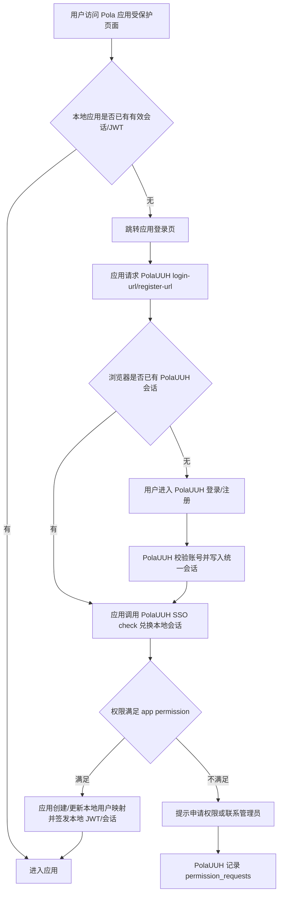

# 2026-06-06 PolaUUH 统一用户中心需求文档

## 需求口径

- 原始需求：
  - 将现有 `PolaZhenjing / AIPD` 统一用户中心再往上抽象一层，改名为 `PolaUUH`。
  - 将 Pola 应用统一升级接入 PolaUUH，首批包括 `PolaReference`、`PolaDiting`、`PolaRead`。
  - 全过程遵循 PRD / SDD / SPEC 先行，并使用 Pola A2A 方法论和 Harness 校验。
- 目标：
  - 形成一个独立、可复用、可审计的 Pola 统一身份与权限中心。
  - 让各 Pola 应用不再各自维护线上用户登录/注册入口，而是通过 PolaUUH 登录、注册、会话校验、权限判断。
  - 兼容已有 `PolaZhenjing/admin` 账号、会话和 SSO client，避免已上线应用中断。
- 目标用户：
  - Pola 系列应用最终用户。
  - Pola 应用开发者和运维者。
  - PolaUUH 管理员。
- 输入：
  - 浏览器中的 PolaUUH 会话 Cookie。
  - client 应用传入的 `app_id`、`permission`、`next` 回跳路径。
  - 用户注册/登录信息、个人资料、权限申请信息。
- 输出：
  - PolaUUH 登录/注册/个人中心页面。
  - SSO 校验响应：用户资料、权限、认证状态、授权状态。
  - 各应用本地 JWT 或本地会话。
  - 权限申请和管理记录。
- 非目标：
  - 本阶段不引入外部 OAuth/OIDC 服务商。
  - 本阶段不重写所有业务应用的数据模型。
  - 本阶段不删除旧 `PolaZhenjing/admin` 路径。
  - 本阶段不把 PolaDiting 改造成完整公网 SaaS；先提供可配置的 PolaUUH 保护层。
- 假设：
  - `PolaZhenJing` 现有用户表、偏好表、权限表和 `/admin/api/sso/check` 是 PolaUUH 的初始数据和实现基础。
  - 线上可通过 Nginx 或同一 Flask 服务暴露 `/PolaUUH/...` canonical 路径。
  - 旧客户端继续访问 `/PolaZhenjing/admin/...` 应保持可用，便于灰度迁移。

## 项目上下文摘要

| 项目 | 当前身份现状 | 主要证据 | 本次关系 |
| --- | --- | --- | --- |
| PolaZhenJing | Flask + SQLite，已有 users / user_preferences / user_permissions / permission_requests / app_user_links；已有 `/admin/api/sso/check` | `app/__init__.py`, `app/auth.py`, `app/templates/account.html` | 升级为 PolaUUH canonical 用户中心 |
| PolaReference | FastAPI + React，已接 AIPD/PolaZhenjing SSO；线上优先统一账号，本地保留 local auth | `backend/app/api/endpoints/auth.py`, `frontend/src/pages/LoginPage.jsx` | 改名接入 PolaUUH，同时保持旧配置兼容 |
| PolaRead | FastAPI + React，仍使用本地 `/auth/login`、`/auth/register`、`users` 表、`/settings` | `backend/app/api/endpoints/auth.py`, `frontend/src/api/auth.js` | 新增 PolaUUH SSO client，线上默认统一账号 |
| PolaDiting | FastAPI 本地控制台，历史文档明确无公网鉴权 | `pola_diting_service/app.py`, `docs/...local-job-console-requirements.md` | 新增可选 PolaUUH 鉴权中间件，默认本地开发可关闭 |

## 完整用户使用流程

## 功能界面布局

- PolaUUH 登录页：
  - 第一屏展示 `PolaUUH` 品牌、统一身份说明、登录表单、注册链接。
  - 保留旧 PolaZhenjing 管理入口风格兼容，但文案统一为 PolaUUH。
  - 支持 `next` 回跳说明，防止用户不知道登录后返回哪里。
- PolaUUH 注册页：
  - 注册账号、邮箱、密码、验证码流程沿用现有实现。
  - 注册成功后回到 `next` 指定应用。
- PolaUUH 个人中心：
  - 展示用户资料、头像、偏好、已授权应用权限、权限申请状态。
  - 管理员可查看用户和权限申请。
- 应用登录页：
  - 线上默认展示“登录 PolaUUH / 注册 PolaUUH”。
  - 本地开发可展开本地账号入口。
  - 未检测到统一会话时给出清晰错误和重试入口。
- PolaDiting：
  - 本地默认不强制鉴权。
  - 如果开启 PolaUUH 保护，未登录时显示最小登录页或跳转 PolaUUH。

## 功能关系和重复性检查

- PolaUUH 与 PolaZhenJing：
  - 关系：PolaUUH 是 PolaZhenJing 现有账号中心的上层品牌和 canonical 路径。
  - 取舍：不复制一套用户数据库；复用现有表结构和会话，新增路径别名与配置命名。
- PolaReference：
  - 关系：已有 SSO client，主要做命名、配置、文案和 endpoint 兼容迁移。
  - 取舍：保留 `AIPD_*` legacy env alias，新增 `POLAUUH_*` canonical env。
- PolaRead：
  - 关系：已有本地 auth 作为开发和数据归属系统，新增统一账号兑换本地 JWT。
  - 取舍：不删除本地用户表；线上入口默认 PolaUUH，本地账号隐藏为开发入口。
- PolaDiting：
  - 关系：已有本地控制台没有用户体系；新增可选保护层，不改变核心任务接口和 DB 模型。
  - 取舍：默认保持 local-first，开启 `POLAUUH_AUTH_ENABLED=true` 后保护 HTML/API。

## 验收标准

- A1 文档：完成 PolaUUH 需求文档、PRD/SPEC、SDD，并记录跨项目现状、用户流程、接口、测试和发布计划。
- A2 PolaUUH 中心：`PolaZhenJing` 提供 canonical `PolaUUH` 登录、注册、个人中心、SSO check 路径；旧 `PolaZhenjing/admin` 路径继续可用。
- A3 SSO 协议：PolaUUH SSO check 支持 `app_id`、`permission`，返回 authenticated / authorized / user / permissions / missing_permission。
- A4 PolaReference：改用 PolaUUH 命名和 canonical 配置，旧 AIPD/PolaZhenjing 配置作为 alias；现有 SSO 测试通过。
- A5 PolaRead：线上登录页默认使用 PolaUUH；用户可通过 PolaUUH 会话兑换 PolaRead JWT；旧本地账号入口保留为开发入口。
- A6 PolaDiting：新增可选 PolaUUH 鉴权；未启用时现有本地控制台和测试不回归；启用时未登录请求被保护。
- A7 权限：三应用分别使用独立权限：`polareference.use`、`polaread.use`、`poladiting.use`。
- A8 迁移兼容：现有用户数据不丢失，旧应用 JWT/session 不被强制清空；旧 AIPD client 可继续完成 SSO。
- A9 安全：`next` 只允许站内绝对路径，禁止外部跳转；不记录 Cookie、token、密码、明文密钥。
- A10 测试：运行相关后端单测、前端构建/静态检查或最小可替代验证；运行 Pola skill Harness。
- A11 集成：至少验证 PolaUUH SSO check、PolaReference login-url、PolaRead login-url、PolaDiting auth-disabled/auth-enabled 两种路径。
- A12 发布：提供发布清单、环境变量、回滚点和发布后验证命令；生产部署需逐步执行。

## 风险和待澄清

- R1 路径风险：线上是否已配置 `/PolaUUH` Nginx 前缀需要发布前确认；本地可先用 Flask/FastAPI 路由兼容验证。
- R2 Cookie 作用域：PolaUUH 与旧 PolaZhenjing 是否共享 Cookie 取决于域名/path/session 配置，需回归真实浏览器。
- R3 数据映射：PolaRead 旧本地用户和 PolaUUH 用户可能 email 相同但 id 不同，需要以 email/link 表做温和合并。
- R4 PolaDiting 定位：它当前是 local-first，直接公网化会扩大风险；本阶段只加可选保护层。
- R5 未提交改动：`PolaZhenJing` 和 `PolaDiting` 当前已有未提交改动，本任务不得覆盖无关文件。

## 任务拆解

- T1 对应 A1：完成 PRD/SPEC/SDD 文档。
- T2 对应 A2/A3/A7/A9：在 PolaZhenJing 增加 PolaUUH 命名、权限、canonical SSO endpoint 和兼容路径。
- T3 对应 A4：迁移 PolaReference 配置和文案到 PolaUUH。
- T4 对应 A5/A8：为 PolaRead 增加 PolaUUH SSO client、前端登录入口和本地用户映射。
- T5 对应 A6：为 PolaDiting 增加可选 PolaUUH auth middleware。
- T6 对应 A10/A11：跑测试门禁和集成回归。
- T7 对应 A12：更新 devlog、release runbook、提交或交付变更清单。
