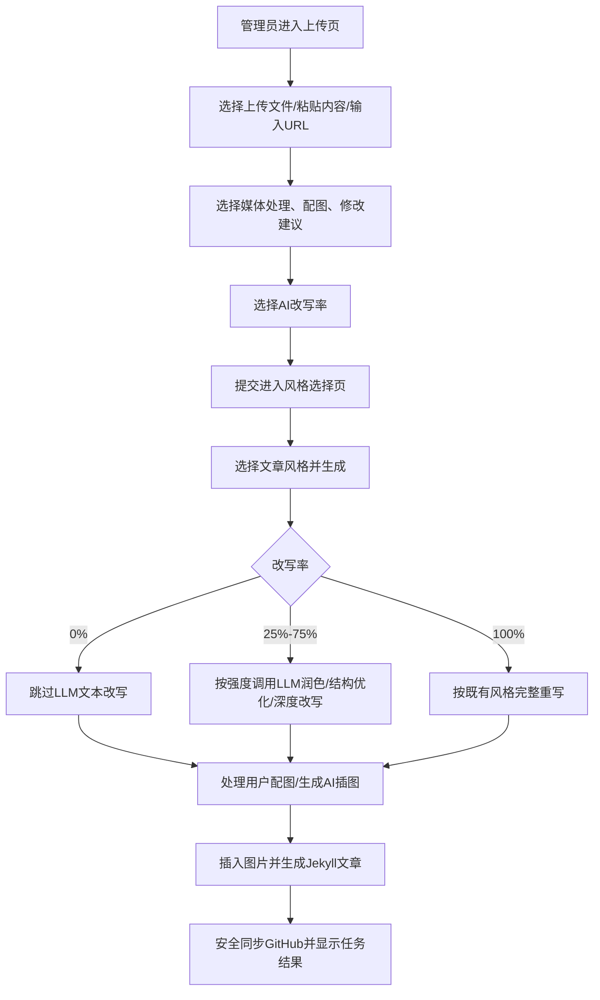

# Requirement: 上传文章 AI 改写率控制

日期: 2026-06-17

## 需求口径

- 目标: 在 `/PolaZhenjing/admin/upload` 上传文章流程中增加 AI 改写率选择，允许管理员在 0%-100% 之间选择不同强度的文本改写。
- 用户: PolaZhenjing 管理员/内容发布者。
- 触发场景: 管理员上传文件、粘贴富文本/Markdown 或输入 URL 后，希望控制 AI 对正文的改写程度。
- 输入: 原文内容、标题、标签、描述、配图、媒体处理策略、修改建议、AI 改写率。
- 输出: 保存到 draft 的改写率、选择风格后的后台生成任务、按改写率处理后的文章正文与插图。
- 非目标:
  - 不新增新的 AI provider 或模型配置。
  - 不改变现有风格选择页的风格卡片含义。
  - 不改变图片生成、图片本地化、GitHub 同步和社媒发布逻辑。
  - 不做语义级段落 diff 预览。
- 假设:
  - 默认改写率保持 100%，兼容现有上传流程的“选择风格后完整改写”体验。
  - 多档先采用 0 / 25 / 50 / 75 / 100 五档；以后可扩展为滑块。

## 完整用户使用流程

## 功能界面布局

- 页面/入口: `/PolaZhenjing/admin/upload` 三个 tab: 上传文件、粘贴内容、输入 URL。
- 区域布局: 每个 tab 的标题/媒体/标签/描述/配图/修改建议附近增加「AI 改写率」控件。
- 关键控件:
  - 五个互斥选项: 0%、25%、50%、75%、100%。
  - 默认选中 100%。
  - 每档带短说明: 不改写、轻润色、结构优化、深度改写、完整改写。
- 状态:
  - 0%: 文案明确“只插图，不改写正文”。
  - 提交后无需新增中间确认页，改写率保存在 draft。
- 错误/空态:
  - 表单传入非法值时后端夹取到最近合法范围，避免 500。
  - 无 API key 或 LLM 失败时保持原有降级: 使用当前内容继续生成。

## 功能关系和重复性检查

- 相似已有功能:
  - `revision_instruction`: 修改建议，只描述方向，不控制强度。
  - `STYLE_SKILL_MAP` / `_call_llm_rewrite`: 当前风格完整改写入口。
  - `_generate_illustrations` / `_inject_illustrations`: 图片生成与插入入口。
- 关系:
  - 改写率与修改建议并列输入，修改建议仍作为补充约束传给 LLM。
  - 改写率存入 draft，并随 payload 传入后台 job。
  - 0% 只跳过 LLM 重写，不跳过图片处理。
- 重复或冲突风险:
  - 若 0% 仍传入修改建议，不应触发 LLM 文本改写。
  - 若 25% 使用完整 writer prompt，可能过度改写，需在 prompt 中明确强度边界。

## 验收标准

- A1 文档: 需求、PRD/SPEC、SDD、devlog 记录本功能范围、数据流、验证和风险。
- A2 UI: 上传文件、粘贴内容、输入 URL 三个 tab 均显示 AI 改写率五档选择，默认 100%。
- A3 Draft: 表单提交后 draft JSON 持久化 `rewrite_rate`，非法/缺省值有安全默认。
- A4 生成任务: `/generate` payload 将 `rewrite_rate` 传入后台任务。
- A5 0% 行为: 后台任务不调用 `_call_llm_rewrite`，仍执行配图/AI 插图和文章写入链路。
- A6 100% 行为: 保持既有完整风格重写语义。
- A7 中间档: 25/50/75 会调用 LLM，并在 prompt 中包含对应强度要求。
- A8 测试: 单测覆盖 UI、draft、0%、中间档和 100% prompt；浏览器 harness 覆盖上传页控件。
- A9 部署: 生产同步前备份相关文件，部署后云端测试和线上 harness 通过。

## 风险

- R1 AI 输出不确定: 中间档不能百分百保证文本相似度，只能通过 prompt 约束强度。
- R2 生产耗时: 0% 可减少 LLM 文本调用；图片生成仍可能耗时。
- R3 兼容旧 draft: 旧 draft 没有 `rewrite_rate` 时应按 100% 处理，保持旧行为。
