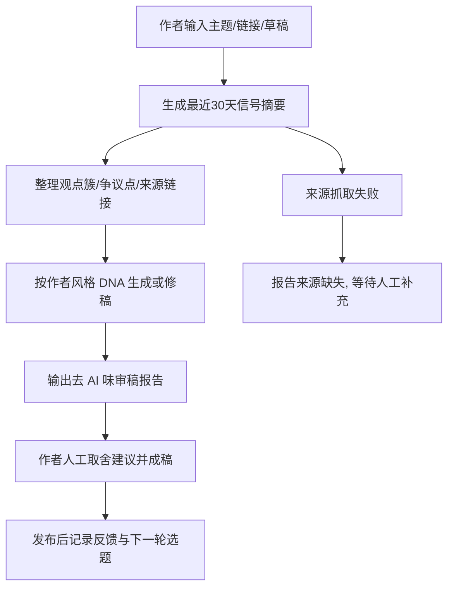

# PolaZhenJing 内容生产升级 v2 需求

## 基本信息

- 日期：2026-06-20
- 需求池记录：`1oUz720NAS`
- 优先级：`P1`
- 状态：`开发中`
- 类型：App 迭代 / Skill / 体验优化

## 需求口径

- 目标：把 PolaZhenJing 的文章生成从单点“去 AI 味改写”升级为“实时信号研究 + 作者风格 DNA + 去 AI 味审稿 + 发布复盘”的内容生产链路。
- 用户：PolaZhenJing 作者/管理员。
- 输入：主题、X/网页链接、手写观点、近 30 天研究素材、既有文章草稿。
- 输出：能力地图、实时信号摘要、去 AI 味审稿报告、作者风格样稿、可持续复盘记录。
- 非目标：
  - 不做绕过 AI 检测器的灰产能力。
  - 不在无授权情况下抓取私有内容。
  - 不一次性做完完整可视化编辑台。

## 用户流程

## 功能关系与重复性检查

- 现有能力：
  - [`app/uploader.py`](/Users/wangchang/Desktop/WSYCursorCode/PolaZhenJing/app/uploader.py) 已有风格改写、插图生成、draft 流程。
  - [`app/article_ai.py`](/Users/wangchang/Desktop/WSYCursorCode/PolaZhenJing/app/article_ai.py) 已有改写率约束。
- 本次扩展：
  - 不替换既有上传/改写入口。
  - 在仓库根新增 [`content_production_v2.py`](/Users/wangchang/Desktop/WSYCursorCode/PolaZhenJing/content_production_v2.py) 作为独立工具层，先把能力地图、信号摘要和审稿报告落成可执行脚本。
- 复用结论：复用既有上传链路，不新增第二套发布入口。

## 验收标准

- A1 文档：补齐本地 Requirement/PRD/SDD/devlog/delivery ledger。
- A2 能力地图：11 个参考项目映射到“实时信号研究/作者 DNA/去 AI 味规则/审稿/发布复盘”阶段。
- A3 实时信号摘要：输入 source JSON 后能归一化出观点簇、争议点、链接和来源缺失。
- A4 审稿报告：对草稿输出中文腔调、结构套路、证据缺口、作者感缺口和可删句子。
- A5 工程验证：脚本 CLI 和单测通过，不触碰现有 `_posts` 脏改动。

## 风险

- R1：没有 token 时，实时信号只能标记来源缺失，不能伪造社区结论。
- R2：启发式审稿只能做第一层过滤，不能替代人工编辑判断。
- R3：目标仓已有 40+ 个脏文件，本轮只能做隔离式增量改动。
