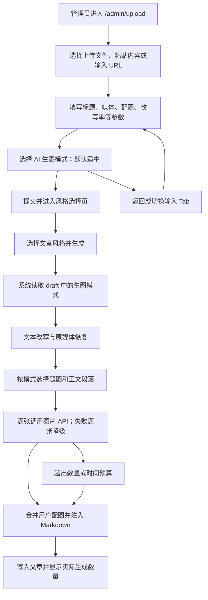

# Requirement：上传文章 AI 生图四档模式

日期：2026-08-18

风险等级：P2（AI 批处理、媒体生成、外部 API 调用）

## 1. 原始需求

在 `https://aipd.me/PolaZhenjing/admin/upload` 的文章生成流程中增加 AI 生图选项，提供四种模式：只生成题图、概括（3 张图）、适中（核心观点的 5 张图）、详细（每段落生成图片）。

## 2. 需求口径

- 目标用户：PolaZhenJing 管理员和内容发布者。
- 触发场景：用户通过上传文件、粘贴内容或输入 URL 生成文章，希望在提交前控制 AI 配图密度、等待时间和调用成本。
- 输入：原文、现有文章参数、`image_generation_mode` 四档选择。
- 输出：带所选密度 AI 插画的 Jekyll Markdown 文章、可见的后台任务进度和实际生成数量提示。
- 非目标：
  - 不新增图片 provider、模型选择器、图片风格选择器或计费系统。
  - 不修改文章编辑页和已生成历史文章。
  - 不改变手动上传配图、保留原文媒体、文章风格、AI 改写率和安全 Git 同步的既有语义。
  - 本次不执行生产部署、服务重启或云端数据写入。
- 假设与模式定义：
  - `cover`（只生成题图）：AI 尝试生成 1 张题图，不生成段落图。
  - `summary`（概括）：AI 尝试生成 3 张图，即 1 张题图 + 2 张分布于全文的概括图。
  - `standard`（适中）：AI 尝试生成 5 张图，即 1 张题图 + 4 张核心观点图；作为新旧 draft 的兼容默认值。
  - `detailed`（详细）：AI 尝试生成 1 张题图，并为改写完成后的每个可配图正文段落生成 1 张图；标题、代码块、纯图片、表格和操作性尾注不属于正文段落。
  - 外部 API 失败时，数量是“尝试数量”而非成功数量；失败图片不阻断文章生成。
  - 详细模式最多处理 12 个正文段落，并受 15 分钟整批预算约束，避免后台任务无界占用。

## 3. 完整用户使用流程



## 4. 功能界面布局

- 页面入口：`/PolaZhenjing/admin/upload`。
- 覆盖范围：上传文件、粘贴内容、输入 URL 三个 Tab 的表单。
- 位置：在手动“插入配图”之后、“修改建议简述/AI 改写率”之前，符合先选媒体再选 AI 处理方式的扫描顺序。
- 控件：四张互斥 radio 卡片，字段名均为 `image_generation_mode`。
- 默认状态：三个表单均默认选中“适中（5 张）”。
- 帮助文案：明确数量包含题图；详细模式最多 12 个正文段落；手动上传图片和原文图片不计入 AI 数量。
- 响应式：桌面四列、窄屏两列、手机单列，不横向溢出。
- 错误/空态：非法或缺失模式由后端归一化为 `standard`；图片 API 缺失/失败时进度页提示降级，文章继续生成。

## 5. 功能关系与重复性检查

- 相似已有能力：
  - `app/uploader.py::_generate_illustrations()` 已固定生成 1 张题图和 3–5 张段落图。
  - `_extract_visual_blocks()` 已能选择核心段落；`_inject_illustrations()` 已能按锚点插图。
  - 手动上传配图通过 `_prepare_uploaded_illustrations()` 与 `_merge_article_images()` 优先覆盖相邻 AI 图。
- 结论：扩展现有生成器的数量策略，不新增新页面、新 API 或新任务类型。
- 兼容关系：
  - AI 生图模式只约束 AI 新生成图片；原文媒体和用户上传配图保持原行为。
  - 旧 draft 缺字段时默认 `standard`，不会因为升级而失败。
  - 三种输入方式复用同一后端字段和解析器，避免形成重复实现。

## 6. 验收标准

- A1（文档/UI）：三个上传表单均展示四档 AI 生图 radio 卡片，默认适中，文案说明数量与详细模式上限；桌面和手机布局无溢出。
- A2（状态传递）：表单字段经 `upload()`、draft JSON、`generate()` payload 传入 `_run_generate_job()`；非法值和旧 draft 默认 `standard`。
- A3（数量策略）：在图片 API 全部成功的测试替身下，`cover` 调用 1 次、`summary` 调用 3 次、`standard` 调用 5 次；详细模式调用 1 + 可配图正文段落数次。
- A4（安全护栏）：详细模式正文图最多 12 张，整批生成预算 900 秒，单图最大 12MB、整批最大 64MB，单请求继续使用受控超时；超限、超时或单张失败不阻断文章写入。
- A5（兼容路径）：AI 改写率 0/25/50/75/100、原文媒体、用户上传配图、风格选择、文章写入和安全 Git 同步路径保持可用。
- A6（任务反馈）：进度阶段展示所选模式，完成消息展示实际成功张数；无图片成功时提示降级且文章仍完成。
- A7（测试/回归）：相关 pytest、语法检查、功能测试用例覆盖校验和本地 Playwright 上传页 harness 通过，并保存截图证据。
- A8（发布）：发布清单包含生产备份、精确文件同步/合并、服务观察、外部 API 失败验证和可执行回滚；没有用户明确确认不执行生产动作。
- A9（安全）：`git diff --check` 和变更范围 secret 关键词扫描通过，不打印或写入 token/cookie/provider key。

## 7. 风险与开放问题

- R1：图片 API 成功率和耗时不可控；以逐张失败降级、请求超时和整批预算控制。
- R2：详细模式可能显著增加调用成本；UI 明示上限，默认保持适中而非详细。
- R3：正文很短时，概括/适中模式会复用全文语义补足规划数量；图片仍可能内容相近，测试只保证调用和锚点数量，不保证审美主观质量。
- R4：生产页面验证需要有效管理员登录态和真实部署，本轮只在本地验证；线上验证留在发布清单。
- 开放问题：无阻塞项。若后续需要超过 12 段，应单独评估计费、任务时长和取消/重试机制。

## 8. 任务拆解

- T1（A1-A2）：增加 UI、模式解析、draft/payload 传递。
- T2（A3-A4）：重构插画规划器为精确数量和详细逐段策略，增加批次护栏。
- T3（A5-A7）：补单测和 Playwright harness，验证旧路径。
- T4（A8-A9）：补发布、测试、开发日志和 A2A 状态账本，执行安全检查。

## Artifact

```yaml
artifact: requirement
status: Done
requirement_scope: 上传文章 AI 生图四档密度控制
users: PolaZhenJing 管理员和内容发布者
blockers: []
```
