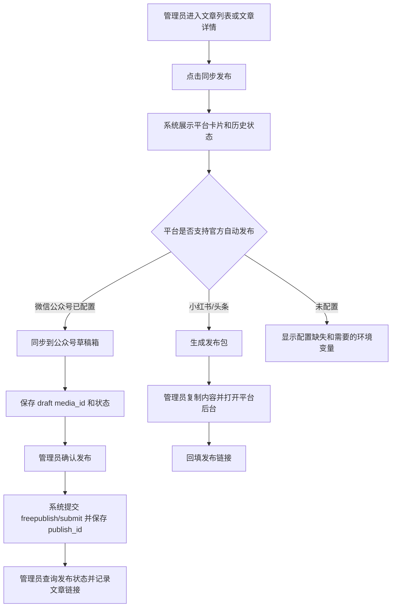

# PRD：文章多平台发布中心

日期：2026-05-30

## 用户和场景

目标用户是 PolaZhenJing 管理员。管理员在后台完成文章生成、编辑和预览后，希望从同一页面把文章分发到微信公众号、小红书和今日头条。

## 用户流程

## 页面布局

- 入口：
  - 文章列表每篇文章增加“发布”操作。
  - 文章详情顶部和底部增加“同步发布”按钮。
- 发布中心：
  - 顶部展示文章标题、日期、摘要、原站链接。
  - 三个平台卡片横向或响应式纵向排列。
  - 微信卡片展示配置状态、最新状态、同步草稿按钮。
  - 小红书/头条卡片展示生成发布包按钮、复制内容、打开后台入口、回填 URL 表单。
  - 底部展示最近发布事件和错误。
- 状态：
  - `not_configured`：缺少凭据或官方接口不可用。
  - `package_ready`：发布包已生成。
  - `draft_created`：微信草稿已创建。
  - `manual_published`：人工回填外部链接。
  - `failed`：接口或转换失败。

## 平台策略

| 平台 | 第一阶段能力 | 自动化等级 | 说明 |
| --- | --- | --- | --- |
| 微信公众号 | 官方 API 创建草稿、提交发布、查询状态 | 自动到草稿箱 + 确认发布 | 发布前保留二次确认 |
| 小红书 | 生成发布包 | 半自动 | 等官方内容发布权限明确后接 adapter |
| 今日头条 | 生成发布包 | 半自动 | 等头条号发布 API 权限明确后接 adapter |

## 非目标

- 不保存平台账号密码。
- 不做浏览器 Cookie 自动发布。
- 不实现小红书/今日头条全自动发布。
- 不替换现有文章生成、编辑和 GitHub Pages 发布流程。

## 验收映射

- A2：微信卡片在配置完整时可创建草稿、提交发布并查询发布状态，未配置时显示缺失项。
- A3：发布包包含标题、摘要、正文、标签、封面和平台提示。
- A4：从文章列表和详情均可进入发布中心。
- A5：每次操作都有 SQLite 记录。
