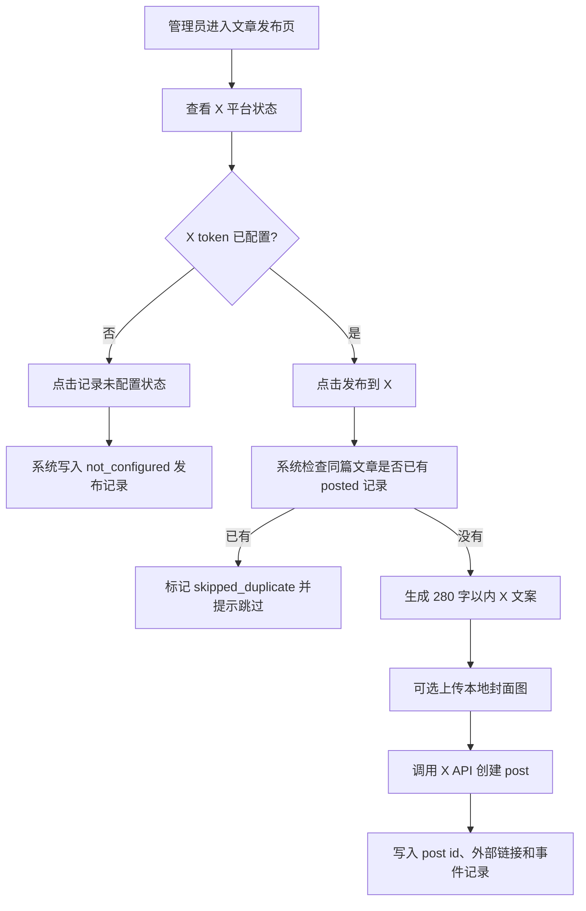

# PRD：X 自动发布

日期：2026-05-31

## 用户和场景

- 用户：PolaZhenJing 管理员。
- 场景：文章生成或编辑完成后，管理员希望从发布中心一键把文章摘要同步到 X，作为公开分发入口。

## 用户流程

## 页面行为

- 发布中心列表新增 `X` 状态列。
- 单篇发布页新增 `X` 卡片：
  - 未处理：显示 `未处理`。
  - 未配置：提示缺失 `X_USER_ACCESS_TOKEN`，提供“记录未配置状态”按钮。
  - 已配置：显示 token 尾号和“发布到 X”按钮。
  - 已发布：显示发布文案预览和 X 外部链接。
  - 跳过重复：显示 `skipped_duplicate` 状态。

## 文案生成

- 文案结构：标题、摘要、公网原文链接。
- 优先使用 `public_url`；若为 `localhost` 或无效链接，则回退 `pages_url`。
- 总长度控制在 280 字符以内，摘要超长时截断并加省略号。

## 非目标

- 不实现小红书。
- 不实现 X OAuth 授权页面。
- 不实现 X thread 拆分。
- 不实现批量发布 UI。

## 验收

- 后台列表和单篇发布页可见 X 状态。
- 未配置 token 时不会调用 X API，且能落库记录。
- 配置 token 后，任务通过 X API 创建 post 并记录 `posted`。
- 重复发布同一篇文章时不会再次发送到 X。
