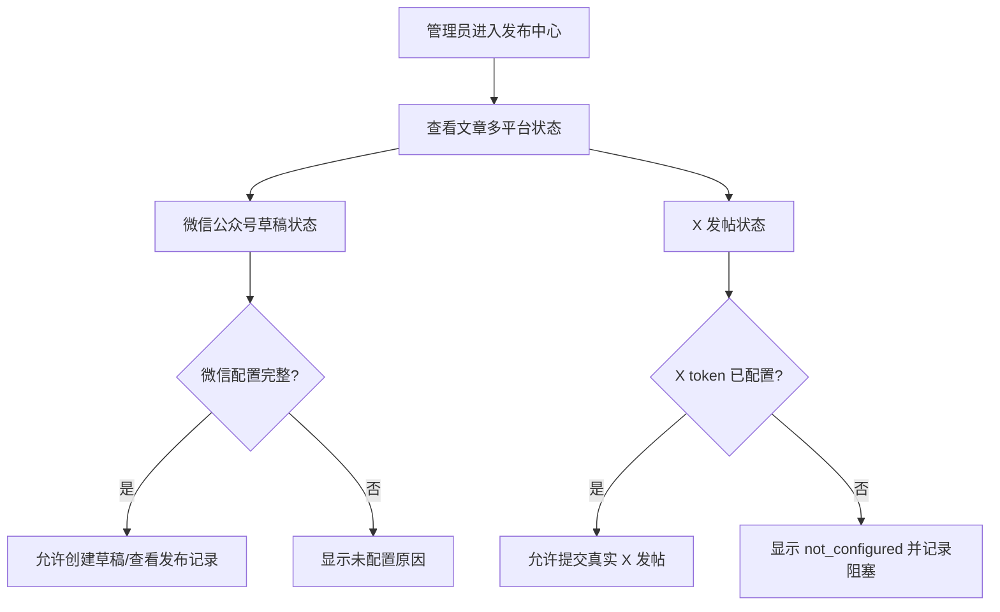

# PRD：发布中心生产收口

## 用户流程

## 页面和行为

- 发布中心继续使用 `/PolaZhenjing/admin/social/`。
- 微信公众号草稿以官方 API 结果和 `social_publications` 状态为准。
- X 未配置时保留功能卡片，但提交后只记录 `not_configured`，不调用外部 API。
- 生产服务器工作树清理只允许在确认不会覆盖文章/auth 改动后执行。

## 异常分支

- 微信凭据缺失或 IP 白名单失败：记录为配置阻塞。
- X token 缺失：记录为配置阻塞，不能宣称真实发帖完成。
- 服务器工作树与 GitHub main 分叉：只做只读核查和备份，不执行 destructive reset。

## 验收映射

- A1：本地 `git status --short --branch`、`pytest`、`py_compile`。
- A2：服务器 `systemctl is-active polazj.service`、配置状态只读脚本、线上路由 smoke。
- A3：`_x_config_status()` 返回未配置时记录 blocker。
- A4：服务器 reset/checkout 前必须保留 backup branch，并在发现差异扩大时回滚 HEAD/索引。
