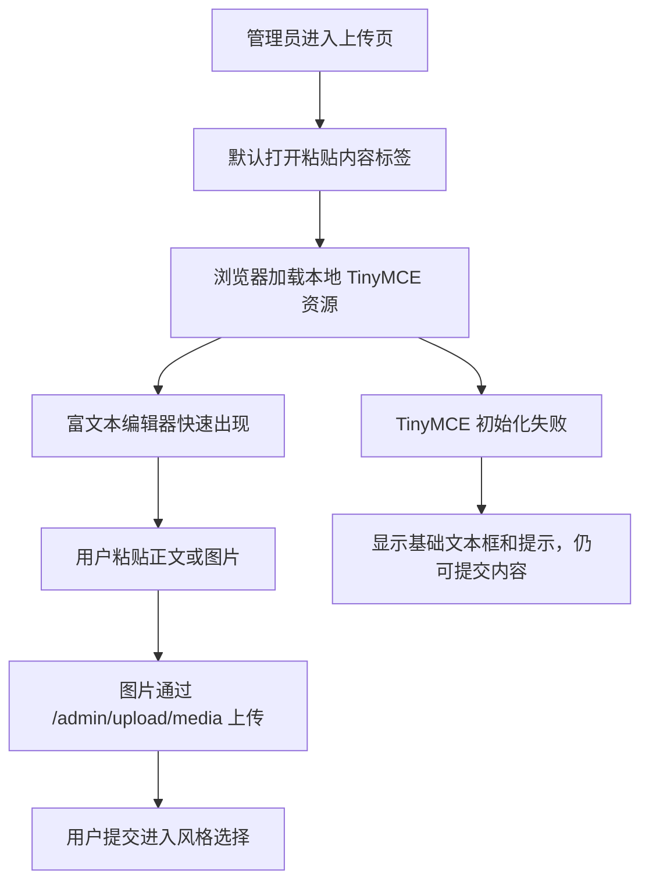

# PRD：上传页富文本编辑器稳定性修复

日期：2026-06-02

## 用户和场景

- 用户：PolaZhenJing 管理员。
- 场景：进入 `/PolaZhenjing/admin/upload` 的“粘贴内容”标签，使用富文本编辑器粘贴网页、公众号、文档或图片内容。

## 问题表现

- 富文本编辑器偶发长时间空白或不出现。
- 空编辑器区域被 `autoresize` 插件撑得过高，影响后续表单填写。

## 根因

- 上传页直接从 jsDelivr 加载 TinyMCE 主脚本、插件、皮肤和图标。实测 `tinymce.min.js` 可达 20 秒，皮肤 CSS 可达 8 秒。
- 后台基础模板同步加载 Google Fonts CSS，浏览器在执行后续脚本前会等待前置样式表，网络卡顿时会拖住 TinyMCE 初始化。
- TinyMCE `autoresize` 插件在当前页面初始空内容下会把编辑器高度扩张到接近 1900px。

## 用户流程

## 页面行为

- 上传页仍默认打开“粘贴内容”标签。
- 富文本模式仍使用 TinyMCE，支持图片、视频、表格、链接、代码和预览。
- Markdown 模式仍切换到源码 textarea。
- TinyMCE 资源从 `/assets/vendor/tinymce/tinymce.min.js` 加载。
- 上传页使用宽屏 `upload-card` 工作区，桌面端卡片最大 1280px，表单区最大 1120px。
- TinyMCE 使用本地 `zh-Hans` 语言包，工具栏和下拉项显示中文。
- 编辑器初始高度为 680px，可手动拖拽调整，最大 900px。
- 初始化失败时展示提示：富文本编辑器资源加载失败，已自动切换为基础文本框；内容仍可正常提交。

## 验收

- 页面 HTML 不包含 `cdn.jsdelivr.net/npm/tinymce`。
- 本地 TinyMCE 主脚本可返回 200。
- 浏览器 smoke 中无 jsDelivr 请求，无失败资源请求。
- 浏览器 smoke 中 `.tox-tinymce` 出现，桌面端宽度约 1120px，高度约 680px，格式下拉显示“段落”。
- 上传页未登录仍跳转登录，不改变权限。
