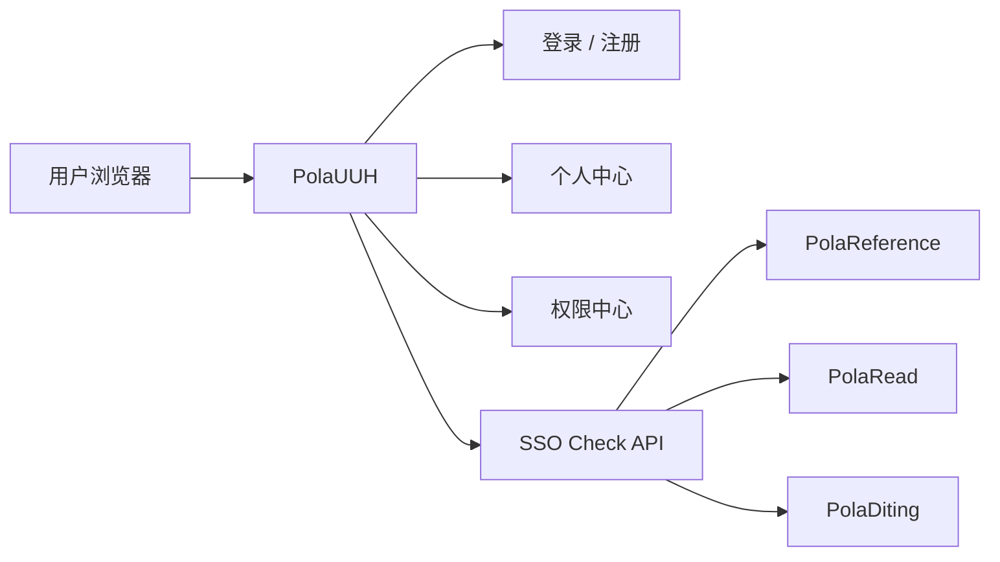

# PRD / SPEC：PolaUUH 统一用户中心与 Pola 应用接入

## 2026-06-11 更新：线上 canonical 路径和应用矩阵

线上 `aipd.me` 当前通过 `/PolaUUH/admin/*` 暴露统一账号中心，因此新增和复核的 Pola 应用默认必须使用：

- 登录：`https://aipd.me/PolaUUH/admin/login`
- 注册：`https://aipd.me/PolaUUH/admin/register`
- SSO 校验：`https://aipd.me/PolaUUH/admin/api/sso/check`

应用矩阵：

| 应用 | 登录/注册处理 | 权限 |
| --- | --- | --- |
| PolaRead | 已默认 PolaUUH，保留开发 fallback | `polaread.use` |
| PolaReference | 已默认 PolaUUH，保留开发 fallback | `polareference.use` |
| PolaDiting | 无独立登录页，开启鉴权时跳 PolaUUH | `poladiting.use` |
| PolaNews | 本次新增 PolaUUH 登录页、注册跳转、SSO 换 JWT，旧本地登录默认关闭 | `polanews.use` |
| PolaLuna | 本次新增 PolaUUH 登录页、注册跳转、SSO 换 JWT，旧本地登录默认关闭 | `polaluna.use` |

## 1. 产品定位

`PolaUUH` 是 Pola Unified User Hub 的统一身份产品名。它从现有 `PolaZhenjing / AIPD` 账号中心上移为 Pola 系列公共能力，负责：

- 统一登录。
- 统一注册。
- 统一用户资料。
- 统一偏好与头像。
- 统一应用权限。
- 统一 SSO 会话校验。

首批接入应用：

- `PolaReference`
- `PolaRead`
- `PolaDiting`

`PolaZhenJing` 保留内容/文章管理产品定位，但其现有账号能力升级为 `PolaUUH` 的初始实现。

## 2. 用户角色

| 角色 | 目标 | 关键权限 |
| --- | --- | --- |
| 普通用户 | 登录 Pola 应用，管理自己的资料和偏好 | app `.use` 权限 |
| 应用用户 | 在单个 Pola 应用内完成业务任务 | 由应用本地 JWT/session 承接 |
| PolaUUH 管理员 | 管理用户、权限、申请、应用授权 | `users.manage` |
| 应用开发者 | 接入 PolaUUH SSO | 配置 `app_id`、`permission`、回跳 |

## 3. 信息架构



## 4. 页面与交互规格

### 4.1 PolaUUH 登录页

- 路径：
  - canonical：`/PolaUUH/login`
  - legacy：`/PolaZhenjing/admin/login`
- 页面内容：
  - 品牌：`PolaUUH`
  - 副标题：`Unified User Hub`
  - 表单：账号/邮箱、密码、提交按钮。
  - 辅助入口：注册统一账号、返回来源应用。
- 状态：
  - loading：提交按钮禁用。
  - error：账号不存在、密码错误、邮箱未验证。
  - success：写入 PolaUUH session，跳转 `next`。
- 安全：
  - `next` 仅接受站内绝对路径，不接受 `http://`、`https://`、`//evil`。

### 4.2 PolaUUH 注册页

- 路径：
  - canonical：`/PolaUUH/register`
  - legacy：`/PolaZhenjing/admin/register`
- 表单：
  - username
  - email
  - password
  - confirm password
  - email verification code
- 状态：
  - 注册成功但未验证：进入验证码页。
  - 验证成功：回到登录页或 `next` 指向应用。

### 4.3 PolaUUH 个人中心

- 路径：
  - canonical：`/PolaUUH/account`
  - legacy：`/PolaZhenjing/admin/account`
- 区域：
  - 基础资料：用户名、邮箱、昵称、头像。
  - 偏好：主题、字体、字号、密度。
  - 应用权限：展示已授权权限。
  - 权限申请：选择应用权限、提交原因。
  - 管理员区：用户列表、权限授予、权限申请审批。

### 4.4 应用登录页统一规格

- 线上：
  - 默认展示 `登录 PolaUUH` 和 `注册 PolaUUH`。
  - 页面加载时尝试 silent SSO。
  - silent SSO 成功后直接进入 `next`。
  - silent SSO 失败时保持按钮可用，不自动暴露本地账号。
- 本地开发：
  - 可展开本地开发账号入口。
  - 本地 auth 只用于开发、迁移救援和无公网环境。

## 5. API 规格

### 5.1 获取登录入口

应用侧接口：

```http
GET /api/auth/sso/login-url?next=/PolaRead/login?sso=1&next=%2F
```

响应：

```json
{
  "code": 0,
  "data": {
    "login_url": "https://aipd.me/PolaUUH/login?next=...",
    "register_url": "https://aipd.me/PolaUUH/register?next=...",
    "return_path": "/PolaRead/login?sso=1&next=%2F",
    "local_auth_enabled": true,
    "provider": "PolaUUH"
  }
}
```

### 5.2 PolaUUH SSO Check

PolaUUH canonical:

```http
POST /PolaUUH/api/sso/check
Cookie: <PolaUUH session>
Content-Type: application/json

{
  "app_id": "PolaRead",
  "permission": "polaread.use"
}
```

Legacy 兼容：

```http
POST /PolaZhenjing/admin/api/sso/check
```

成功响应：

```json
{
  "ok": true,
  "authenticated": true,
  "authorized": true,
  "user": {
    "id": 1,
    "username": "wsyxjer",
    "email": "wsyxjer@gmail.com",
    "nickname": "Polaris",
    "avatar_url": "...",
    "role": "admin",
    "permissions": ["polaread.use"]
  },
  "permissions": ["polaread.use"],
  "missing_permission": ""
}
```

未登录：

```json
{
  "ok": false,
  "authenticated": false,
  "authorized": false
}
```

无权限：

```json
{
  "ok": true,
  "authenticated": true,
  "authorized": false,
  "missing_permission": "poladiting.use"
}
```

### 5.3 应用兑换本地会话

每个应用保留自己的本地 endpoint：

```http
POST /api/auth/sso/polauuh
Cookie: <PolaUUH session>
```

行为：

1. 应用后端读取请求 Cookie。
2. 应用后端调用 PolaUUH SSO Check。
3. 校验 `authenticated=true` 且 `authorized=true`。
4. 按 `PolaUUH user.id` 或 email 查找/创建本地用户。
5. 写入 `polauuh_user_id` 或兼容字段。
6. 签发应用本地 JWT/session。

## 6. 应用接入规格

### 6.1 PolaReference

- 当前状态：已接 SSO。
- 改造内容：
  - 配置名从 `AIPD_*` 迁移到 `POLAUUH_*`，保留 `AIPD_*` alias。
  - 前端文案从 `AIPD SSO` 改为 `PolaUUH`。
  - 默认 URL 指向 `/PolaUUH/login`、`/PolaUUH/register`、`/PolaUUH/api/sso/check`。
- 权限：`polareference.use`。
- 验收：
  - 现有 `test_auth_sso.py` 通过。
  - `GET /api/auth/sso/login-url` 返回 PolaUUH URL。

### 6.2 PolaRead

- 当前状态：本地 auth。
- 改造内容：
  - 新增 PolaUUH 配置。
  - 新增 `/auth/sso/login-url`。
  - 新增 `/auth/sso/polauuh`。
  - `users` 表增加 `polauuh_user_id` 字段或以 email 建立映射。
  - 前端登录页优先展示 PolaUUH。
  - 本地账号入口仅本地开发默认展示，线上折叠。
- 权限：`polaread.use`。
- 验收：
  - `wsyxjer@gmail.com` 这类统一账号可以通过 PolaUUH 进入 PolaRead。
  - 旧 PolaRead 本地用户数据、文档归属不丢失。

### 6.3 PolaDiting

- 当前状态：本地未鉴权。
- 改造内容：
  - 新增配置 `POLAUUH_AUTH_ENABLED`，默认 `false`。
  - 新增 `POLAUUH_BASE_URL`、`POLAUUH_SSO_CHECK_URL`、`POLAUUH_APP_ID`、`POLAUUH_PERMISSION`。
  - 开启时保护 `/` 和 `/api/*`，放行 `/health`。
  - 未登录返回 401 或最小 HTML 登录引导。
  - 本地开发不开启时保持原行为。
- 权限：`poladiting.use`。
- 验收：
  - auth disabled 时现有测试不回归。
  - auth enabled 且无 Cookie 时受保护路径返回 401。
  - auth enabled 且 PolaUUH 授权 mock 成功时请求通过。

## 7. 数据规格

### 7.1 PolaUUH 用户资料字段

| 字段 | 类型 | 说明 |
| --- | --- | --- |
| id | int/string | PolaUUH 用户 ID |
| username | string | 登录用户名 |
| email | string | 邮箱 |
| nickname/display_name | string | 展示名 |
| avatar_url | string | 头像 |
| role | string | user/admin |
| permissions | list[string] | 已授权权限 |

### 7.2 应用本地用户映射

| 应用 | 字段 | 策略 |
| --- | --- | --- |
| PolaReference | `aipd_user_id` legacy, future `polauuh_user_id` | 保留旧字段，新增别名或配置命名 |
| PolaRead | `polauuh_user_id` | 新增字段；email 相同则绑定旧用户 |
| PolaDiting | 暂不落本地用户表 | 可选鉴权仅做请求保护 |

## 8. 异常与空态

- 未登录：跳转 PolaUUH 或返回 401。
- 无权限：显示申请权限入口或联系管理员。
- PolaUUH 不可用：显示“统一用户中心暂不可用”，保留本地开发入口。
- `next` 非法：回到应用默认首页。
- email 冲突：优先绑定同 email 本地用户；冲突写日志，不覆盖业务数据。

## 9. 发布体验

- 第一阶段：
  - PolaUUH canonical 路径和旧路径双写兼容。
  - PolaReference 迁移命名，行为不变。
- 第二阶段：
  - PolaRead 接入 PolaUUH，线上默认统一登录。
- 第三阶段：
  - PolaDiting 增加可选保护层，默认关闭。
- 第四阶段：
  - 线上 Nginx 增加 `/PolaUUH` 入口，做真实浏览器 SSO 回归。

## 10. 验收映射

| 验收项 | 产品验收方式 |
| --- | --- |
| A1 | 文档路径存在，内容覆盖 PRD/SPEC/SDD |
| A2 | 浏览器访问 PolaUUH canonical 页面 |
| A3 | API smoke 返回规范字段 |
| A4 | PolaReference SSO 测试 |
| A5 | PolaRead 统一登录页面 + SSO exchange |
| A6 | PolaDiting auth disabled/enabled 测试 |
| A7 | 权限字段出现在 PolaUUH catalog |
| A8 | 旧路径和旧字段测试 |
| A9 | next 安全单测 |
| A10 | Harness 和项目测试 |
| A11 | 集成 smoke |
| A12 | release runbook |
