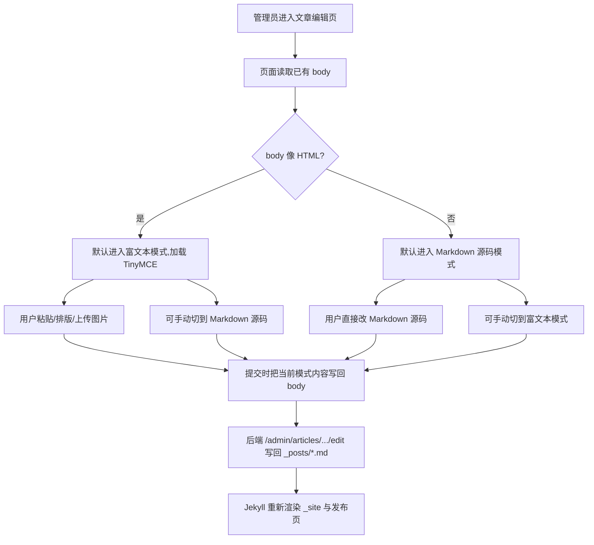

# PRD：文章编辑页支持富文本编辑

日期：2026-06-08

## 用户和场景

- 用户：PolaZhenJing 管理员。
- 场景：进入 `/PolaZhenjing/admin/articles/<filename>/edit`,对 `_posts/*.md` 文章做排版调整:
  - 在浏览器里粘贴已经写好的公众号长文(HTML + 图片)。
  - 选中某些段落,加粗、改字号、插入引用块、加表格。
  - 偶尔从已有 Markdown 源码模式直接改 Jekyll front matter / Markdown 语法。

## 问题表现

- 编辑页工具栏只有 EasyMDE 提供的 B/I/H/quote/list/link/image/table/code/fullscreen/help,粘贴富文本会丢失样式。
- 渲染预览与 Markdown 工具栏深度耦合,粘贴 HTML 后需要手工清掉多余标签。
- 上传页已经在用 TinyMCE 本地富文本编辑器,体验和编辑页不一致。

## 根因

- `app/templates/article_edit.html` 使用 `cdn.jsdelivr.net/npm/easymde` 提供的 EasyMDE。
- EasyMDE 是纯 Markdown 工具栏,不支持粘贴富文本、不支持所见即所得的块级格式化、不支持图片上传。
- 编辑页和上传页历史上是不同入口,各自维护一套编辑器,导致体验分裂。

## 用户流程

## 页面行为

- 编辑页 HTML 移除 `cdn.jsdelivr.net/npm/easymde`,改为本地 TinyMCE vendor,主脚本 URL 带 `?v=6.8.5-pzj-20260602` 版本参数。
- 编辑页与上传页使用同一份 TinyMCE 配置:`base_url`、`cache_suffix`、`skin`、`language: zh-Hans`、`plugins: image link lists table wordcount`、工具栏 `undo redo | blocks bold italic underline blockquote | bullist numlist | link image table | removeformat`。
- 编辑页新增「富文本编辑 / Markdown 源码」单选切换和隐藏字段 `content_format`(`rich_html` / `markdown`)。
- 富文本模式下粘贴/拖入图片走 `/admin/upload/media` 上传,成功后把远端 URL 插入编辑器。
- 编辑页底部渲染预览:在 `rich_html` 模式下把当前 TinyMCE 内容直接渲染;在 `markdown` 模式下调用 `/admin/articles/<filename>/preview` 走 `python-markdown` 渲染。
- 切换模式时,前一个模式的内容会复制到另一个模式的文本区,避免内容丢失。
- 提交时由前端把当前模式的内容写入隐藏 `body` 字段,后端 `_build_post_markdown` 继续按 `.md` 拼装 front matter + body,Jekyll 仍可正常渲染。
- TinyMCE 初始化失败时显示红色提示,自动切换到基础 textarea 兜底,用户仍可保存文章。
- 已有的 EasyMDE 资源(`easymde.min.css`、`easymde.min.js`)在编辑页中不再引用,无需清理 vendor。

## 与上传页的差异

- 编辑页不显示文件上传/拖拽/URL 抓取 tab,只保留「富文本 / Markdown 源码」单选和提交按钮。
- 编辑页是修改已有文章,所以 body 字段直接由 `_parse_post` 提供,首屏就有内容;上传页 body 字段是空,默认从「富文本」起手。
- 编辑页的预览面板放在编辑器下方而不是左右分栏,因为编辑器本身已经较宽。

## 验收

- 编辑页 HTML 包含 `TINYMCE_SCRIPT_URL` 指向 `/assets/vendor/tinymce/tinymce.min.js?v=6.8.5-pzj-20260602`,`cache_suffix: TINYMCE_CACHE_SUFFIX`,`language: 'zh-Hans'`,`tox-tinymce` 高度 680px,iframe flex 撑满。
- 编辑页 HTML 不再包含 `cdn.jsdelivr.net/npm/easymde` 或 `easymde.min.js`。
- 预览接口对 `content_format=rich_html` 直接返回原 HTML,对 `content_format=markdown` 或缺失参数走 `python-markdown` 渲染。
- 已有 Markdown 文章打开时,Markdown 源码模式被默认选中,内容完整显示在 textarea 中。
- 切换到富文本模式后,文本框被 TinyMCE 替换,工具栏中文显示。
- 提交保存时,后端拿到的 `body` 字段是当前模式的内容,文件能正常写回。
- 单测 `tests/test_article_edit_rich_editor.py` 4 个用例通过;`pytest tests` 34 个用例全部通过;`py_compile` 通过;`git diff --check` 通过。
