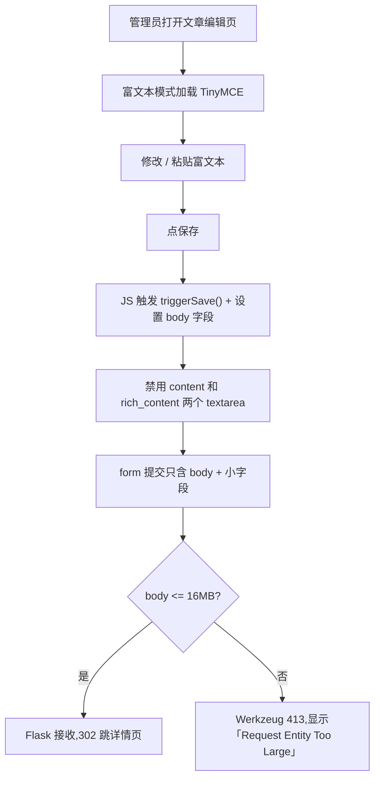

# PRD:文章编辑页保存 413 修复

日期:2026-06-09

## 用户和场景

- 用户:PolaZhenJing 管理员。
- 场景:在 `https://aipd.me/PolaZhenjing/admin/articles/<file>.md/edit` 打开一篇含多张图的长文(如 `rolling-ai-fde-ai-20260607.md`,已发布 8KB markdown),用「富文本编辑」模式排版,然后点「保存」。

## 问题表现

- 点「保存」后,浏览器停留在编辑页 URL,显示:
  - `Request Entity Too Large`
  - `The data value transmitted exceeds the capacity limit.`
- 但 markdown 源文件只 8KB,完全不该超 1MB 限制。
- 同一文章若先切到「Markdown 源码」再保存,大概率能成功(因为 body 只发 1 份,8KB 远低于 500KB)。

## 根因

排查路径:

1. 云端 8KB 文章用 `requests` POST 直接走 nginx → gunicorn 返回 302 OK(8KB 不超 500KB)。
2. 逐步放大 body 测,500KB 触发 413,1MB 仍是 413。
3. nginx `client_max_body_size 16m` 没拦(8KB + 100KB + 500KB + 1MB 全没到 16MB)。
4. Flask `MAX_CONTENT_LENGTH = 16 * 1024 * 1024` 也没拦(同上)。
5. Werkzeug 3.1.8 `Request.max_form_memory_size` 默认 **500000 字节(500KB)**,超过直接 `raise RequestEntityTooLarge`。

源码佐证(`werkzeug/formparser.py`):

```text
:param max_form_memory_size: the maximum number of bytes to be accepted
       for in-memory stored form data. If the data exceeds the value
       specified an :exc:`~exceptions.RequestEntityTooLarge` exception
       is raised.
```

**次要根因**:`article_edit.html` 提交时 form 同时有 `body` + `content` + `rich_content` 三个字段,TinyMCE 富文本 HTML 经常 1.5-2x 膨胀,加 `content` 和 `rich_content` 也带 body,8KB markdown → ~25KB rich → 三个字段合计 ~75KB,接近 500KB 边界。一旦粘贴图片或重排样式,瞬间超限。

## 用户流程



## 修复

- 后端 `app/__init__.py`:
  - 新增 `app.config['MAX_FORM_MEMORY_SIZE'] = 16 * 1024 * 1024`,把 Werkzeug 默认 500KB 提到 16MB,和 `MAX_CONTENT_LENGTH` 对齐,允许一篇文章最大 16MB 富文本。
- 前端 `app/templates/article_edit.html`:
  - 提交事件处理中,在 `tinymce.triggerSave()` 后、设置隐藏 `body` 字段前后,加两行 `if (markdown) markdown.disabled = true; if (rich) rich.disabled = true;`,避免同篇正文在 form 里出现 3 份。
- 测试 `tests/test_article_edit_413_fix.py`:
  - 3 个用例:500KB / 1MB / 8MB body POST 都不再 413,302 跳回详情页。
  - 用 `tmp_path + monkeypatch` 隔离 `_posts/` 目录,不污染云端真实文章。

## 验收

- 全部 34/37 个 pytest 用例通过(本地 + 云端)。
- 云端 `systemctl restart polazj.service` 后,服务 active,新 master PID + 2 workers。
- 端到端用 `requests` 走 `https://aipd.me/.../edit`:
  - 8KB / 100KB / 500KB / 1MB body 全部 302 跳详情页。
  - 之前必失败的 500KB 现在能正常保存。
- nginx `client_max_body_size 16m` 不动,Werkzeug `MAX_FORM_MEMORY_SIZE 16MB` 兜底,gunicorn 不动。
- 编辑页其他行为(模式切换、预览、revision_instruction、GitHub 同步)不变。
